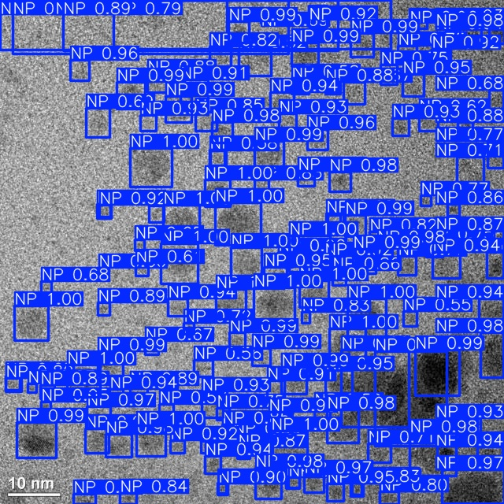
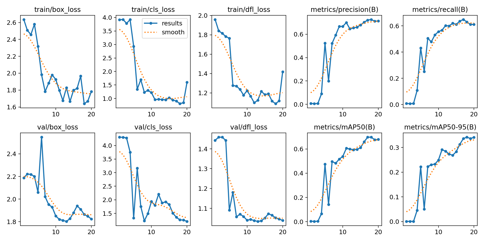
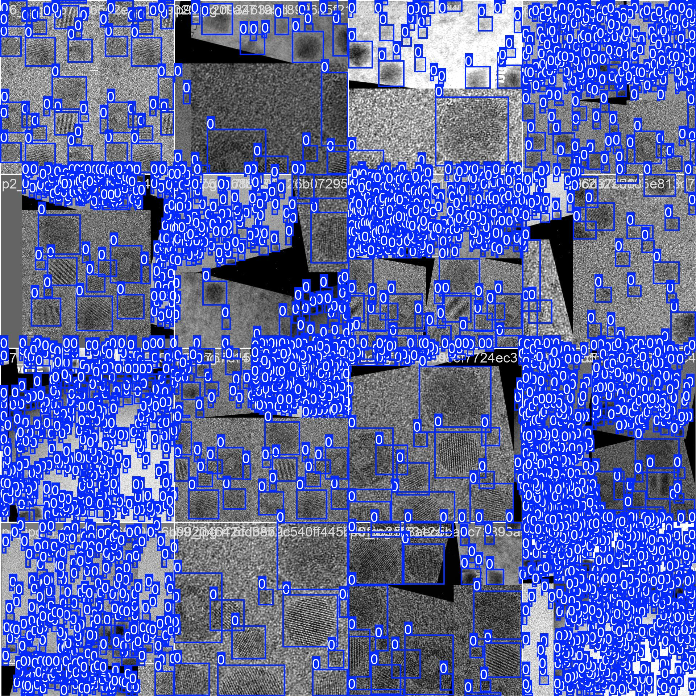

<div align="center">
  <p>
    <a href="https://github.com/ultralytics/assets/releases/tag/v8.2.0" target="_blank">
      </a>
  </p>

[中文](https://docs.ultralytics.com/zh/) | [한국어](https://docs.ultralytics.com/ko/) | [日本語](https://docs.ultralytics.com/ja/) | [Русский](https://docs.ultralytics.com/ru/) | [Deutsch](https://docs.ultralytics.com/de/) | [Français](https://docs.ultralytics.com/fr/) | [Español](https://docs.ultralytics.com/es/) | [Português](https://docs.ultralytics.com/pt/) | [Türkçe](https://docs.ultralytics.com/tr/) | [Tiếng Việt](https://docs.ultralytics.com/vi/) | [हिन्दी](https://docs.ultralytics.com/hi/) | [العربية](https://docs.ultralytics.com/ar/) <br>

<div>
    <a href="https://github.com/ultralytics/ultralytics/actions/workflows/ci.yaml"></a>
    <a href="https://zenodo.org/badge/latestdoi/264818686"></a>
    <a href="https://hub.docker.com/r/ultralytics/ultralytics"></a>
    <a href="https://ultralytics.com/discord"></a>
    <a href="https://community.ultralytics.com"></a>
    <br>
    <a href="https://console.paperspace.com/github/ultralytics/ultralytics"></a>
    <a href="https://colab.research.google.com/github/ultralytics/ultralytics/blob/main/examples/tutorial.ipynb"></a>
    <a href="https://www.kaggle.com/ultralytics/yolov8"></a>
</div>
<br>

[Ultralytics](https://ultralytics.com) [YOLOv8](https://github.com/ultralytics/ultralytics) is a cutting-edge, state-of-the-art (SOTA) model that builds upon the success of previous YOLO versions and introduces new features and improvements to further boost performance and flexibility. YOLOv8 is designed to be fast, accurate, and easy to use, making it an excellent choice for a wide range of object detection and tracking, instance segmentation, image classification and pose estimation tasks.

We hope that the resources here will help you get the most out of YOLOv8. Please browse the YOLOv8 <a href="https://docs.ultralytics.com/">Docs</a> for details, raise an issue on <a href="https://github.com/ultralytics/ultralytics/issues/new/choose">GitHub</a> for support, and join our <a href="https://ultralytics.com/discord">Discord</a> community for questions and discussions!

To request an Enterprise License please complete the form at [Ultralytics Licensing](https://ultralytics.com/license).

</a>

<div align="center">
  <a href="https://github.com/ultralytics"></a>
  
  <a href="https://www.linkedin.com/company/ultralytics/"></a>
  
  <a href="https://twitter.com/ultralytics"></a>
  
  <a href="https://youtube.com/ultralytics?sub_confirmation=1"></a>
  
  <a href="https://www.tiktok.com/@ultralytics"></a>
  
  <a href="https://ultralytics.com/bilibili"></a>
  
  <a href="https://ultralytics.com/discord"></a>
</div>
</div>

## <div align="center">Updatres</div>

YOLOv8-m & YOLOv8-n (nano-particles) trained on our own microscopic images for nao-particles detection of PtPdInGaP HEA compounds.

<details open>
<summary>Install</summary>


```bash
# clone the repository
git clone https://github.com/manaralnaasan/nano-particles_yolov8.git

# pip install the required packages 
pip install ultralytics

# Navigate into the cloned repository directory
cd nano-particles_yolov8
```


## <div align="center">NPs-Yolov8</div>

training:

```bash
# use this command for google colab
!yolo task=detect mode=train model=yolov8m.pt data={dataset.location}/data.yaml epochs=20 imgsz=640
```
predicted image example:
<div align="center">
  <p>
    <a href="./">
      </a>
  </p>
</div>


### Evaluation Metrics Results
Training losses and batch0:
<div align="center">
  <p>
    <a href="./">
      </a>
  </p>
</div>
<div align="center">
  <p>
    <a href="./">
      </a>
  </p>
</div>

### Training preperations
-> download [Dataset] (https://app.roboflow.com/manar-du0ri/nanoparticles-iestz/1)


## <div align="center">License</div>

Ultralytics offers two licensing options to accommodate diverse use cases:

- **AGPL-3.0 License**: This [OSI-approved](https://opensource.org/licenses/) open-source license is ideal for students and enthusiasts, promoting open collaboration and knowledge sharing. See the [LICENSE](https://github.com/ultralytics/ultralytics/blob/main/LICENSE) file for more details.
- **Enterprise License**: Designed for commercial use, this license permits seamless integration of Ultralytics software and AI models into commercial goods and services, bypassing the open-source requirements of AGPL-3.0. If your scenario involves embedding our solutions into a commercial offering, reach out through [Ultralytics Licensing](https://ultralytics.com/license).

## <div align="center">Contact</div>

For Ultralytics bug reports and feature requests please visit [GitHub Issues](https://github.com/ultralytics/ultralytics/issues), and join our [Discord](https://ultralytics.com/discord) community for questions and discussions!

<br>
<div align="center">
  <a href="https://github.com/ultralytics"></a>
  
  <a href="https://www.linkedin.com/company/ultralytics/"></a>
  
  <a href="https://twitter.com/ultralytics"></a>
  
  <a href="https://youtube.com/ultralytics?sub_confirmation=1"></a>
  
  <a href="https://www.tiktok.com/@ultralytics"></a>
  
  <a href="https://ultralytics.com/bilibili"></a>
  
  <a href="https://ultralytics.com/discord"></a>
</div>
