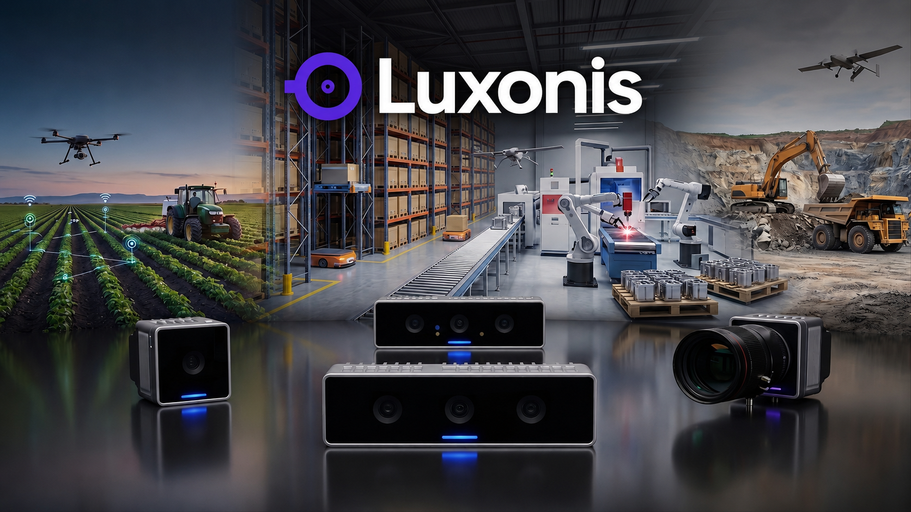
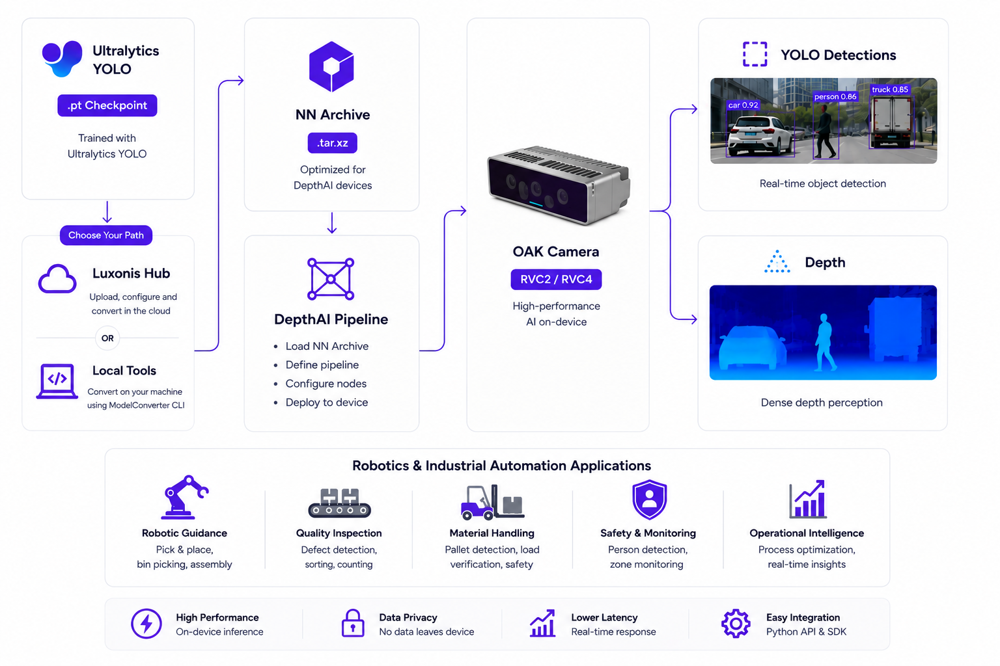

# Bringing Ultralytics YOLO to Luxonis OAK Cameras for Edge AI

Computer vision systems are increasingly expected to make decisions where the camera is, rather than sending every frame to a remote server. That matters in robotics, industrial automation, smart-city infrastructure, and intelligent cameras, where latency, bandwidth, privacy, and reliability all shape what is possible.

Ultralytics YOLO and [Luxonis OAK cameras](https://www.luxonis.com/) make that kind of deployment more accessible. Ultralytics YOLO provides a flexible path from training to production-ready vision models, while Luxonis combines image sensors, on-device AI acceleration, depth, and a programmable vision pipeline in compact hardware. Together, they enable YOLO models to run directly on an OAK device for real-time edge perception.

In this article, we look at what the integration enables, how models move from an Ultralytics checkpoint to an OAK camera, and where on-device YOLO inference can make a difference.

## Why run YOLO on an OAK camera?

Many vision applications benefit from processing frames close to the sensor. Running YOLO directly on an OAK camera can reduce the delay introduced by network round trips, avoid streaming raw video to the cloud, and leave the host system free to focus on application logic.

OAK cameras are particularly useful when an application needs more than 2D object detection. Depending on the device, a single DepthAI pipeline can combine a camera feed, YOLO inference, stereo depth, object tracking, scripting, and video encoding. This makes it possible to turn a 2D detection into a richer perception signal, such as the position of a detected object in 3D space.

For example, a mobile robot can use YOLO detections together with stereo depth to understand where people, pallets, or obstacles are relative to the camera. Similarly, a production-line system can run visual inspection locally and send only results or exceptions upstream instead of every video frame.

## From an Ultralytics model to on-device inference

The integration starts with an Ultralytics YOLO `.pt` checkpoint—either a pretrained model or one trained on a custom dataset. Because OAK hardware uses device-specific runtimes, the checkpoint needs a conversion step before it can run on the camera. This is not currently a native `model.export(format="...")` target in the Ultralytics Python package.

Luxonis provides two supported ways to prepare a model:

- **[Luxonis Hub](https://hub.luxonis.com/):** A hosted conversion path for turning a supported YOLO checkpoint into a model for the target OAK generation. It is a convenient option for quickly producing a device-ready artifact and managing converted models in a registry.
- **Local conversion with Luxonis [Tools](https://github.com/luxonis/tools) and [ModelConverter](https://github.com/luxonis/modelconverter):** An offline workflow with more control over the environment and conversion settings. `tools` prepares the YOLO model as an ONNX NN Archive with outputs set up for Luxonis parsing, and ModelConverter compiles it for the target hardware.

The result is an NN Archive that includes the compiled model and the metadata the runtime needs for inputs, outputs, preprocessing, and postprocessing. After conversion, [DepthAI](https://docs.luxonis.com/software-v3/depthai) can run the model inside a pipeline using `DetectionNetwork` for YOLO detections or `SpatialDetectionNetwork` when stereo depth is also available.

## Choosing between RVC2 and RVC4

Luxonis OAK devices span two primary hardware generations: RVC2 and RVC4. Both can deploy supported Ultralytics YOLO models, but a converted model is tied to its target generation. An artifact built for RVC2 will not run on RVC4, and vice versa.

RVC2 powers established OAK devices and is a practical choice for lightweight, low-power vision pipelines. RVC4, which powers the newer OAK4 family, offers substantially more on-device compute and is a stronger fit for higher-throughput workloads or more demanding pipelines. In either case, model size, input resolution, and task complexity remain important design choices.

Luxonis benchmark results highlight the range of workloads that can run on-device. On RVC4, benchmarked `YOLOv8n` object detection reaches 470.7 FPS at 640×640 with INT8 precision and two inference threads, while `YOLO26n-seg` reaches 357.9 FPS under the same test configuration. The right benchmark for a deployment will depend on the specific model, camera, resolution, precision, and complete pipeline, so testing with representative data is essential.

## A practical walkthrough with OAK4

For a closer look at the on-device experience, Luxonis has published a video walkthrough, [Running YOLO Neural Networks Onboard OAK4](https://www.youtube.com/watch?v=LE_yNvDF4jA). It demonstrates the complete OAK4 workflow—from pipeline setup to running YOLO inference directly on the device—and is a useful companion to the integration documentation.

The typical deployment flow is straightforward:

1. Train or select an Ultralytics YOLO checkpoint for the task.
2. Choose the target OAK generation and convert the model with Luxonis Hub or the local tooling.
3. Build a DepthAI pipeline that connects the camera to the converted model.
4. Stream detections, and optionally depth or other pipeline outputs, to the application that needs them.

Once the model is deployed, the same pipeline can be expanded with OAK capabilities such as tracking, spatial detection, and visualization. That makes it easier to move from a basic detection demo to an application that can act on the scene around it.

## Where the integration fits

The combination of Ultralytics YOLO and Luxonis OAK cameras is well suited to applications that need fast, self-contained visual intelligence:

- **Robotics:** Detect objects and combine detections with depth to support navigation, picking, and obstacle awareness.
- **Industrial automation:** Inspect parts, monitor safety zones, and detect defects without relying on a constant cloud connection.
- **Smart cameras and cities:** Count vehicles or people, monitor traffic, and send events rather than continuous video streams.
- **Retail and logistics:** Track inventory, detect packages, and monitor workflows close to the point of capture.

In each case, deploying at the edge helps make the vision system more responsive and can reduce the amount of data that needs to leave the site.

## Get started with Ultralytics YOLO and Luxonis

The Luxonis integration gives developers a clear path from an Ultralytics YOLO model to an OAK camera pipeline. Start with the [Ultralytics Luxonis OAK deployment guide](../integrations/luxonis.md) for detailed instructions on conversion, DepthAI inference, hardware generations, supported tasks, and performance tuning. Then watch Luxonis’s [OAK4 YOLO tutorial](https://www.youtube.com/watch?v=LE_yNvDF4jA) to see the workflow in action.

Whether you are building a compact smart camera, a depth-aware robot, or an industrial vision system, the integration helps bring real-time YOLO inference closer to the scene where decisions need to happen.
