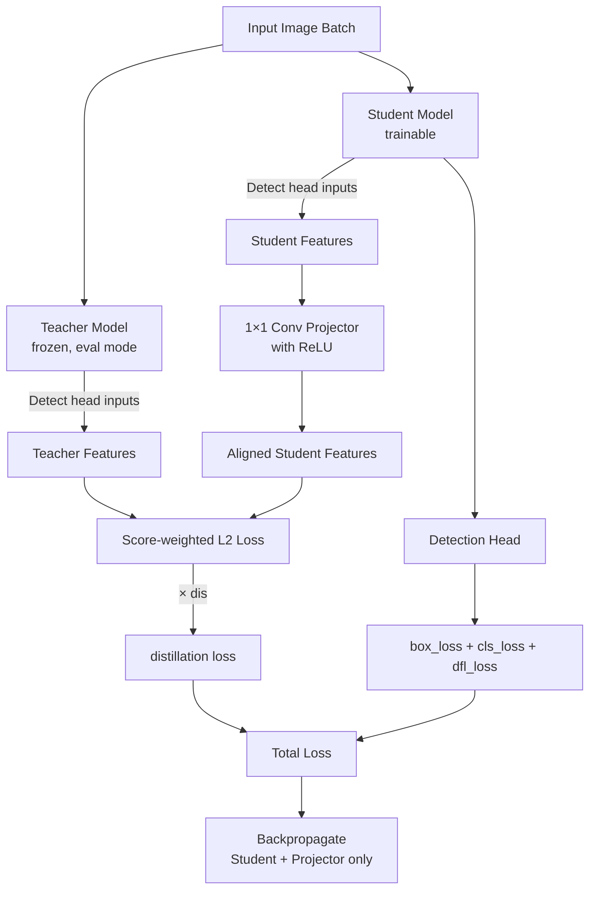

# Knowledge Distillation

## Quickstart

Train a smaller student model with guidance from a larger teacher model by adding the `distill_model` argument:

!!! example

    === "Python"

        ```python
        from ultralytics import YOLO

        model = YOLO("yolo26n.pt")
        model.train(data="coco8.yaml", epochs=100, distill_model="yolo26s.pt")
        ```

    === "CLI"

        ```bash
        yolo train model=yolo26n.pt data=coco8.yaml epochs=100 distill_model=yolo26s.pt
        ```

## What is Knowledge Distillation?

[Knowledge distillation](https://www.ultralytics.com/glossary/knowledge-distillation) transfers knowledge from a large, accurate **teacher model** to a smaller **student model**. The student learns to mimic the teacher's internal feature representations, often achieving better accuracy than training from scratch.

**Use distillation when:**

- You need a smaller, faster model for deployment
- You have a high-accuracy teacher model trained on the same data
- You want better accuracy than standard training provides

!!! note
    Knowledge distillation is implemented for **detect**, **segment**, **pose**, and **obb** tasks. Only **detect** has been experimentally verified for accuracy improvements for now.

## Performance

Knowledge distillation improves student [mAP](yolo-performance-metrics.md) across the entire YOLO26 family on [COCO](https://github.com/ultralytics/ultralytics/blob/main/ultralytics/cfg/datasets/coco.yaml), with no added inference cost. The table below compares the standard YOLO26 models (baseline) against the same models trained with distillation from their recommended teacher.

| Model                                                                                                | size<br><sup>(pixels)</sup> | mAP<sup>val<br>50-95</sup><br>baseline | mAP<sup>val<br>50-95</sup><br>distilled | mAP<sup>val<br>50-95 (e2e)</sup><br>baseline | mAP<sup>val<br>50-95 (e2e)</sup><br>distilled |
| ---------------------------------------------------------------------------------------------------- | --------------------------- | -------------------------------------- | --------------------------------------- | -------------------------------------------- | --------------------------------------------- |
| [YOLO26n-distill](https://github.com/ultralytics/assets/releases/download/v8.4.0/yolo26n-distill.pt) | 640                         | 40.9                                   | **41.5**                                | 40.1                                         | **40.9**                                      |
| [YOLO26s-distill](https://github.com/ultralytics/assets/releases/download/v8.4.0/yolo26s-distill.pt) | 640                         | 48.6                                   | **49.2**                                | 47.8                                         | **48.6**                                      |
| [YOLO26m-distill](https://github.com/ultralytics/assets/releases/download/v8.4.0/yolo26m-distill.pt) | 640                         | 53.1                                   | **53.9**                                | 52.5                                         | **53.3**                                      |
| [YOLO26l-distill](https://github.com/ultralytics/assets/releases/download/v8.4.0/yolo26l-distill.pt) | 640                         | 55.0                                   | **56.0**                                | 54.4                                         | **55.5**                                      |
| [YOLO26x-distill](https://github.com/ultralytics/assets/releases/download/v8.4.0/yolo26x-distill.pt) | 640                         | 57.5                                   | **57.9**                                | 56.9                                         | **57.4**                                      |

- **mAP<sup>val</sup>** values are for single-model single-scale on the [COCO val2017](https://cocodataset.org/) dataset. <br>Reproduce by `yolo val detect data=coco.yaml device=0`
- **e2e** values use the default NMS-free inference path; non-e2e values use traditional NMS post-processing (`end2end=False`). See [End-to-End Detection](end2end-detection.md) for details.

## Prerequisites

Before starting, ensure you have:

1. A **trained teacher model** from the same YOLO family as the student
2. Both models trained on the **same dataset** and task
3. Sufficient GPU memory to run both models simultaneously (see the [FAQ](#does-knowledge-distillation-slow-down-training) for typical overhead)

### Recommended Model Pairs

| Student      | Recommended Teacher |
| ------------ | ------------------- |
| `yolo26n.pt` | `yolo26s.pt`        |
| `yolo26s.pt` | `yolo26m.pt`        |
| `yolo26m.pt` | `yolo26x.pt`        |
| `yolo26l.pt` | `yolo26x.pt`        |

Cross-family distillation (e.g., YOLO11 teacher with YOLO26 student) is **not supported**.

## Key Parameters

| Parameter       | Type    | Default | Description                                                                                               |
| --------------- | ------- | ------- | --------------------------------------------------------------------------------------------------------- |
| `distill_model` | `str`   | `None`  | Path to the teacher model file (e.g., `yolo26x.pt`). Setting this enables knowledge distillation.         |
| `dis`           | `float` | `6.0`   | Distillation loss weight. Controls how much the distillation loss contributes to the total training loss. |

## How It Works

1. The **teacher model** remains frozen in `eval` mode and runs inference on each batch
2. The **student model** trains with standard task losses plus distillation guidance
3. Features are extracted from both models at the three neck layers that feed the Detect-family head
4. A **projector network** (lightweight MLP) aligns student feature dimensions to match the teacher
5. A **score-weighted L2 loss** compares projected student features with teacher features, weighted by the teacher's classification confidence
6. The distillation loss combines with standard losses using the `dis` weight



## Task Support

The distillation implementation extracts features from the three neck layers that feed the model's Detect-family head. Because the **segment**, **pose**, and **obb** heads inherit from the same `Detect` architecture, distillation is technically compatible with those tasks as well.

!!! warning
    Only **detect** has been experimentally benchmarked and verified. You can run distillation for **segment**, **pose**, or **obb**, but accuracy improvements for those tasks are not yet validated.

!!! example "Knowledge Distillation for Other Tasks"

    === "Python"

        ```python
        from ultralytics import YOLO

        # Segment
        model = YOLO("yolo26n-seg.pt")
        model.train(data="coco8-seg.yaml", epochs=100, distill_model="yolo26s-seg.pt")

        # Pose
        model = YOLO("yolo26n-pose.pt")
        model.train(data="coco8-pose.yaml", epochs=100, distill_model="yolo26s-pose.pt")

        # OBB
        model = YOLO("yolo26n-obb.pt")
        model.train(data="dota8.yaml", epochs=100, distill_model="yolo26s-obb.pt")
        ```

    === "CLI"

        ```bash
        # Segment
        yolo segment train model=yolo26n-seg.pt data=coco8-seg.yaml epochs=100 distill_model=yolo26s-seg.pt

        # Pose
        yolo pose train model=yolo26n-pose.pt data=coco8-pose.yaml epochs=100 distill_model=yolo26s-pose.pt

        # OBB
        yolo obb train model=yolo26n-obb.pt data=dota8.yaml epochs=100 distill_model=yolo26s-obb.pt
        ```

## Training

### Basic Training

Training with distillation is identical to standard training. Provide the `distill_model` path to enable it:

!!! example "Knowledge Distillation Training"

    === "Python"

        ```python
        from ultralytics import YOLO

        # Load a student model
        student = YOLO("yolo26m.pt")

        # Train with knowledge distillation from a larger teacher model
        results = student.train(data="coco8.yaml", epochs=100, distill_model="yolo26x.pt")
        ```

    === "CLI"

        ```bash
        yolo detect train model=yolo26m.pt data=coco8.yaml epochs=100 distill_model=yolo26x.pt
        ```

### Adjusting the Distillation Loss Weight

The `dis` parameter (default: `6.0`) controls distillation loss contribution:

!!! example "Custom Distillation Weight"

    === "Python"

        ```python
        from ultralytics import YOLO

        student = YOLO("yolo26n.pt")

        results = student.train(data="coco8.yaml", epochs=100, distill_model="yolo26s.pt", dis=10)
        ```

    === "CLI"

        ```bash
        yolo detect train model=yolo26n.pt data=coco8.yaml epochs=100 distill_model=yolo26s.pt dis=10
        ```

### Resuming Distillation Training

Distillation training supports resuming from checkpoints. The teacher model is rebuilt automatically from the `distill_model` path:

!!! example "Resume Distillation Training"

    === "Python"

        ```python
        from ultralytics import YOLO

        student = YOLO("runs/detect/train/weights/last.pt")
        results = student.train(resume=True)
        ```

    === "CLI"

        ```bash
        yolo detect train resume model=runs/detect/train/weights/last.pt
        ```

## Training Output

When distillation is enabled, an additional `dis_loss` column appears in training logs:

```
      Epoch    GPU_mem   box_loss   cls_loss   dfl_loss   dis_loss  Instances       Size
      1/80      46.2G      1.566      5.404    0.003249      6.658        231        640
```

The exported model contains **only the student weights**—file size and inference speed match a normally trained student model.

## FAQ

### Why is my distillation loss not decreasing?

- Verify teacher and student are from the **same YOLO generation**
- Confirm `distill_model` path is correct and the file loads
- Try increasing `dis` if the loss value is very small
- Ensure the teacher model is trained on the **same dataset**

### How does distillation differ from standard training?

Add the `distill_model` parameter—everything else works identically. An extra distillation loss computes during training, but the saved model is a standard YOLO model with no overhead.

### Does knowledge distillation slow down training?

Yes. Expect 1.2-1.5x slower training and ~1.1x more GPU memory because the teacher model runs inference on each batch. The teacher runs in `eval` mode without gradients, keeping overhead manageable. Use `amp=True` to reduce impact.

### Which tasks and models are supported?

Knowledge distillation works with **detect**, **segment**, **pose**, and **obb** tasks because it distills features from the three neck layers that feed the Detect-family head. **Classify** and **semantic** tasks are not supported.

Only **detect** has been experimentally verified for accuracy improvements. Segment, pose, and obb are technically compatible but not yet benchmarked.

The teacher and student must belong to the **same YOLO family** (e.g., YOLOv8, YOLO11, or YOLO26). Cross-family distillation (e.g., a YOLO11 teacher with a YOLO26 student) is not supported.
