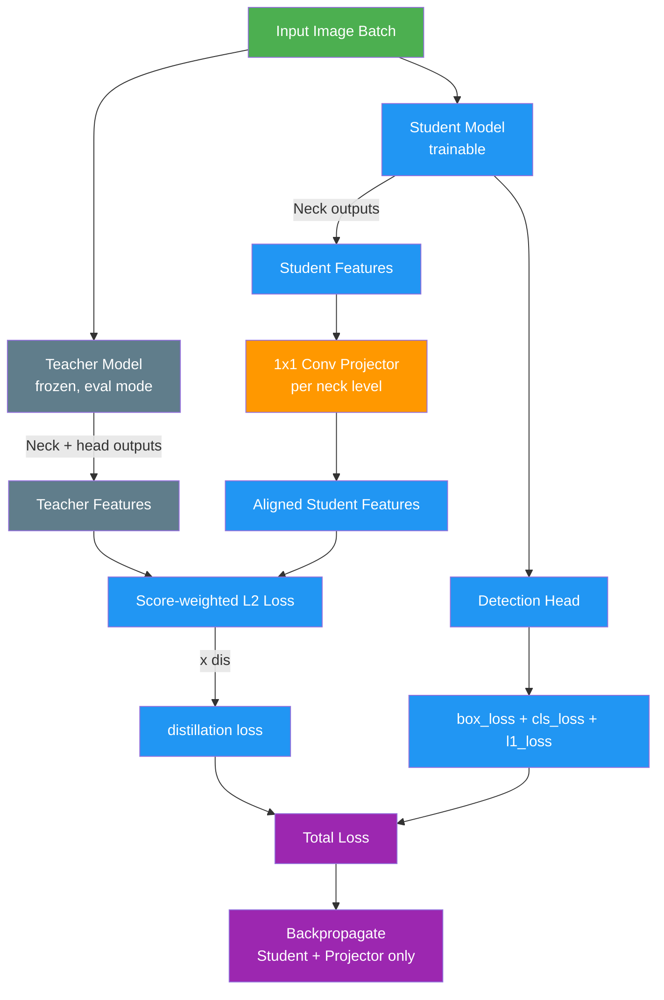

# Knowledge Distillation

Ultralytics YOLO26 supports knowledge distillation directly in `model.train()`: pass a larger teacher checkpoint to the `distill_model` argument and the smaller student learns to match the teacher's neck features alongside its normal detection losses. On COCO this raises student [mAP](yolo-performance-metrics.md) by 0.4 to 1.0 points across the whole family, with no change to model size or inference speed.

This guide covers the supported tasks, the recommended teacher and student pairs, the `dis` loss weight, and how to read the extra `dis_loss` column in the [training](../modes/train.md) log.

## Quick Start

Train a smaller student model with guidance from a larger teacher by adding the `distill_model` argument:

!!! example

    === "Python"

        ```python
        from ultralytics import YOLO

        model = YOLO("yolo26n.pt")
        model.train(data="coco8.yaml", epochs=100, distill_model="yolo26s.pt")
        ```

    === "CLI"

        ```bash
        yolo train model=yolo26n.pt data=coco8.yaml epochs=100 distill_model=yolo26s.pt
        ```

!!! tip "Already-distilled checkpoints"

    Every model in the table below ships as a downloadable checkpoint, so you do not have to run distillation yourself to get the distilled accuracy. Load `yolo26n-distill.pt` the way you would load any other Ultralytics checkpoint — the name is resolved against the Ultralytics release assets on first use, so it downloads even though it is not among the model names bundled with the package:

    === "Python"

        ```python
        from ultralytics import YOLO

        model = YOLO("yolo26n-distill.pt")  # fetched from the Ultralytics release assets on first use
        results = model.predict("https://ultralytics.com/images/bus.jpg")
        ```

    === "CLI"

        ```bash
        yolo predict model=yolo26n-distill.pt source=https://ultralytics.com/images/bus.jpg
        ```

    Distill your own only when you need the gain on **your** dataset rather than on COCO. For everything else that makes a small model train better, see [model training tips](model-training-tips.md).

## What is Knowledge Distillation?

[Knowledge distillation](https://www.ultralytics.com/glossary/knowledge-distillation) transfers knowledge from a large, accurate **teacher model** to a smaller **student model**. The student learns to mimic the teacher's internal feature representations, often achieving better accuracy than training from scratch.


**Reach for distillation when:**

- You need a smaller, faster model for deployment
- You have a high-accuracy teacher model trained on the same data
- You want better accuracy than standard training provides

## Performance

**Ultralytics YOLO26** knowledge distillation raises student [mAP](yolo-performance-metrics.md) by 0.4 to 1.0 points across the entire YOLO26 family on [COCO](https://github.com/ultralytics/ultralytics/blob/main/ultralytics/cfg/datasets/coco.yaml), with no added inference cost. The table compares standard YOLO26 checkpoints (baseline) against the same models trained with distillation from their recommended teacher.

| Model                                                                  | size<br><sup>(pixels)</sup> | mAP<sup>val<br>50-95</sup><br>baseline | mAP<sup>val<br>50-95</sup><br>distilled | mAP<sup>val<br>50-95 (e2e)</sup><br>baseline | mAP<sup>val<br>50-95 (e2e)</sup><br>distilled |
| ---------------------------------------------------------------------- | --------------------------- | -------------------------------------- | --------------------------------------- | -------------------------------------------- | --------------------------------------------- |
| [YOLO26n-distill](https://platform.ultralytics.com/ultralytics/yolo26) | 640                         | 40.9                                   | **41.5**                                | 40.1                                         | **40.9**                                      |
| [YOLO26s-distill](https://platform.ultralytics.com/ultralytics/yolo26) | 640                         | 48.6                                   | **49.2**                                | 47.8                                         | **48.6**                                      |
| [YOLO26m-distill](https://platform.ultralytics.com/ultralytics/yolo26) | 640                         | 53.1                                   | **53.9**                                | 52.5                                         | **53.3**                                      |
| [YOLO26l-distill](https://platform.ultralytics.com/ultralytics/yolo26) | 640                         | 55.0                                   | **56.0**                                | 54.4                                         | **55.5**                                      |
| [YOLO26x-distill](https://platform.ultralytics.com/ultralytics/yolo26) | 640                         | 57.5                                   | **57.9**                                | 56.9                                         | **57.4**                                      |

- **mAP<sup>val</sup>** values are for single-model single-scale on the [COCO val2017](https://cocodataset.org/) dataset. <br>Reproduce by `yolo val detect data=coco.yaml device=0`
- **e2e** values use the default NMS-free inference path; non-e2e values use traditional NMS post-processing (`end2end=False`). See [End-to-End Detection](end2end-detection.md) for details.

## Prerequisites

Before you begin, ensure you meet the following requirements:

- **Trained teacher model**: a `.pt` checkpoint from the same YOLO family as the student. A `.yaml` architecture file is rejected — the teacher must carry trained weights.
- **Matching task**: use a teacher of the same task as the student. Nothing compares the two — a detect teacher trains against a segment student without complaint — but features are read from the student's layer indices and applied to the teacher, so a mismatch distills from layers that were never checked to correspond.
- **GPU memory**: enough VRAM to hold both models. The teacher runs forward-only under `no_grad` and carries no gradients or optimizer state, so the overhead is well below a second full training run.

### Supported Tasks

Ultralytics extracts features from the three neck layers feeding the model's head, so every task whose head inherits from `Detect` is compatible.

| Task       | Supported | Accuracy verified                                           |
| ---------- | --------- | ----------------------------------------------------------- |
| `detect`   | Yes       | Yes — benchmarked on COCO (see [Performance](#performance)) |
| `segment`  | Yes       | Not yet benchmarked                                         |
| `semantic` | No        | —                                                           |
| `depth`    | No        | —                                                           |
| `classify` | No        | —                                                           |
| `pose`     | Yes       | Not yet benchmarked                                         |
| `obb`      | Yes       | Not yet benchmarked                                         |

An unsupported task fails immediately with `ValueError: No Detect head found in model`. [RT-DETR](../models/rtdetr.md) is unsupported for the same reason.

!!! example "Knowledge Distillation for Other Tasks"

    === "Python"

        ```python
        from ultralytics import YOLO

        # Segment
        model = YOLO("yolo26n-seg.pt")
        model.train(data="coco8-seg.yaml", epochs=100, distill_model="yolo26s-seg.pt")

        # Pose
        model = YOLO("yolo26n-pose.pt")
        model.train(data="coco8-pose.yaml", epochs=100, distill_model="yolo26s-pose.pt")

        # OBB
        model = YOLO("yolo26n-obb.pt")
        model.train(data="dota8.yaml", epochs=100, distill_model="yolo26s-obb.pt")
        ```

    === "CLI"

        ```bash
        # Segment
        yolo segment train model=yolo26n-seg.pt data=coco8-seg.yaml epochs=100 distill_model=yolo26s-seg.pt

        # Pose
        yolo pose train model=yolo26n-pose.pt data=coco8-pose.yaml epochs=100 distill_model=yolo26s-pose.pt

        # OBB
        yolo obb train model=yolo26n-obb.pt data=dota8.yaml epochs=100 distill_model=yolo26s-obb.pt
        ```

### Recommended Model Pairs

| Student      | Recommended Teacher |
| ------------ | ------------------- |
| `yolo26n.pt` | `yolo26s.pt`        |
| `yolo26s.pt` | `yolo26m.pt`        |
| `yolo26m.pt` | `yolo26x.pt`        |
| `yolo26l.pt` | `yolo26x.pt`        |

!!! warning "Teacher and student must share a YOLO generation"

    Feature layer indices are read from the **student** and then applied to the teacher, so a cross-family pair is not validated and not supported. What happens depends on the pair. A teacher whose layer count differs from the student's fails outright — a YOLOv8 teacher with a YOLO26 student raises `IndexError: index 23 is out of range`, because the index comes from the student and YOLOv8 has fewer modules. A teacher of the same depth fails silently instead: a YOLO11 teacher with a YOLO26 student trains with no warning at all, distilling from layer indices that were never checked to correspond. Keep both models in the same family (for example, both YOLO26).

## Key Parameters

| Parameter       | Type    | Default | Description                                                                                               |
| --------------- | ------- | ------- | --------------------------------------------------------------------------------------------------------- |
| `distill_model` | `str`   | `None`  | Path to the teacher model file (e.g., `yolo26x.pt`). Setting this enables knowledge distillation.         |
| `dis`           | `float` | `6.0`   | Distillation loss weight. Controls how much the distillation loss contributes to the total training loss. |

Both are [training arguments](../usage/cfg.md#train-settings) and are set on `model.train()`, not in the dataset YAML.

!!! note "`compile` is disabled during distillation"

    Setting `compile=True` alongside `distill_model` logs `'compile' is not supported with knowledge distillation and will be disabled.` and training proceeds uncompiled. Budget for that when estimating run time.

## Training

### Basic Training

Training with distillation is identical to standard training. Provide the `distill_model` path to enable it:

!!! example "Knowledge Distillation Training"

    === "Python"

        ```python
        from ultralytics import YOLO

        # Load a student model
        student = YOLO("yolo26m.pt")

        # Train with knowledge distillation from a larger teacher model
        results = student.train(data="coco8.yaml", epochs=100, distill_model="yolo26x.pt")
        ```

    === "CLI"

        ```bash
        yolo detect train model=yolo26m.pt data=coco8.yaml epochs=100 distill_model=yolo26x.pt
        ```

### Adjusting the Distillation Loss Weight

The `dis` parameter (default: `6.0`) controls distillation loss contribution:

!!! example "Custom Distillation Weight"

    === "Python"

        ```python
        from ultralytics import YOLO

        student = YOLO("yolo26n.pt")
        results = student.train(data="coco8.yaml", epochs=100, distill_model="yolo26s.pt", dis=10.0)
        ```

    === "CLI"

        ```bash
        yolo detect train model=yolo26n.pt data=coco8.yaml epochs=100 distill_model=yolo26s.pt dis=10.0
        ```

### Resuming Distillation Training

Distillation training supports resuming from checkpoints. The teacher model is rebuilt automatically from the `distill_model` path recorded in the checkpoint:

!!! example "Resume Distillation Training"

    === "Python"

        ```python
        from ultralytics import YOLO

        student = YOLO("runs/detect/train/weights/last.pt")
        results = student.train(resume=True)
        ```

    === "CLI"

        ```bash
        yolo detect train resume model=runs/detect/train/weights/last.pt
        ```

## Training Output

When distillation is enabled, an additional `dis_loss` column appears in training logs. The sample below is a detection run; segment, pose and OBB carry their own task losses in the same table, with `dis_loss` appended to whichever set applies:

```text
      Epoch    GPU_mem   box_loss   cls_loss    l1_loss   dis_loss  Instances       Size
        1/2         0G     0.9632      2.291    0.01334      9.831         30        640
        2/2         0G      1.503      3.237    0.02867      9.346         27        640
```

!!! note "`dis_loss` is a training-only metric"

    The distillation loss is computed during training and is fixed at `0` during validation, so `val/dis_loss` in `results.csv` and the corresponding panel in `results.png` are a flat zero line by design. Read `train/dis_loss` to judge whether distillation is converging.

A checkpoint saved during training — `last.pt` mid-run, or any file written by `save_period` — carries the optimizer state and the EMA copy of the `DistillationModel` wrapper, including its projector, so it is several times larger than the final file (25.4 MB against 5.5 MB on a `yolo26n` run here). The teacher is not among them: it is stripped before saving and rebuilt from `distill_model` on resume. `best.pt` and `last.pt` from a **completed** run contain only the student weights, so file size and inference speed match a normally trained student model.

## How It Works

1. The **teacher model** stays frozen in `eval` mode and runs inference on each batch under `no_grad`
2. The **student model** trains with standard task losses plus distillation guidance
3. Features are captured from the three neck layers that feed the student's Detect-family head, and from the head output itself
4. One **1×1 convolutional projector** per neck level (`Conv2d → ReLU → Conv2d`) maps each student feature map to the teacher's channel count
5. A **score-weighted L2 loss** compares projected student features with teacher features, weighted per anchor by the teacher's confidence. That weight comes from the head output captured in step 3: the one-to-many and one-to-one class **logits** are averaged first, and `sigmoid` and the per-anchor maximum are taken afterwards — averaging the two branches' confidences instead would give different weights
6. The distillation loss combines with standard losses using the `dis` weight

For the implementation, see [`ultralytics.nn.distill_model`](../reference/nn/distill_model.md).


```mermaid
flowchart TD
    A[Input Image Batch]:::start --> T[Teacher Model<br/>frozen, eval mode]:::extern
    A --> S[Student Model<br/>trainable]:::proc

    T --> |Neck + head outputs| TF[Teacher Features]:::extern
    S --> |Neck outputs| SF[Student Features]:::proc

    SF --> P[1x1 Conv Projector<br/>per neck level]:::decide
    P --> AF[Aligned Student Features]:::proc

    TF --> SW[Score-weighted L2 Loss]:::proc
    AF --> SW

    S --> D[Detection Head]:::proc
    D --> DL[box_loss + cls_loss + l1_loss]:::proc

    SW --> |x dis| DIS[distillation loss]:::proc
    DL --> TOTAL[Total Loss]:::out
    DIS --> TOTAL

    TOTAL --> BP[Backpropagate<br/>Student + Projector only]:::out

    classDef start fill:#4CAF50,color:#fff
    classDef proc fill:#2196F3,color:#fff
    classDef decide fill:#FF9800,color:#fff
    classDef out fill:#9C27B0,color:#fff
    classDef extern fill:#607D8B,color:#fff
```

## FAQ

### Do I need the teacher model to run inference?

No. A completed distillation run saves only the student weights, so `best.pt` loads, exports and runs exactly like a normally trained YOLO26 model. The teacher checkpoint is needed only while training.

### Which tasks and models are supported?

Ultralytics knowledge distillation supports the **detect**, **segment**, **pose** and **obb** tasks; **semantic**, **depth** and **classify** are not, and neither is RT-DETR. Only **detect** has been benchmarked for accuracy gains. The teacher and student must come from the same YOLO family — see [Supported Tasks](#supported-tasks) for the rule and the exact failure.

### Why is my distillation loss not decreasing?

- Read `train/dis_loss`, not `val/dis_loss` — the latter is always `0`
- Verify teacher and student are from the **same YOLO generation**
- Confirm `distill_model` points at a trained `.pt` file that loads
- Try increasing `dis` if the loss value is very small
- Ensure the teacher model is trained on the **same dataset**

### How does distillation differ from standard training?

Add the `distill_model` parameter — everything else works identically. An extra distillation loss is computed during training, but the saved model is a standard YOLO model with no inference overhead.

### Does knowledge distillation slow down training?

Yes, and the overhead scales with how much larger the teacher is than the student rather than being a fixed factor. The teacher runs a forward pass on every batch, so a `yolo26n` student learning from `yolo26s` pays far less than a `yolo26m` student learning from `yolo26x`. The teacher carries no gradients and no optimizer state, which keeps the memory cost well below a second training run. Note that `compile=True` is disabled while distilling.

### Can I use my own custom-trained model as the teacher?

Yes. Any Ultralytics `.pt` checkpoint works as a teacher as long as it is from the same YOLO family and the same task as the student — nothing compares the two datasets, so a mismatch is not rejected. It does need to have learned the data you are distilling on for its guidance to be worth anything, which is why a `yolo26x.pt` fine-tuned on your own data is the strongest teacher for a `yolo26n.pt` student on that same data.

### Does knowledge distillation work with YOLO11 and YOLOv8?

Yes. Distillation reads features by layer index rather than by architecture, so a YOLO11 teacher distills into a YOLO11 student and a YOLOv8 teacher into a YOLOv8 student, both verified to train. What is not supported is crossing families, such as a YOLO11 teacher with a YOLO26 student.
