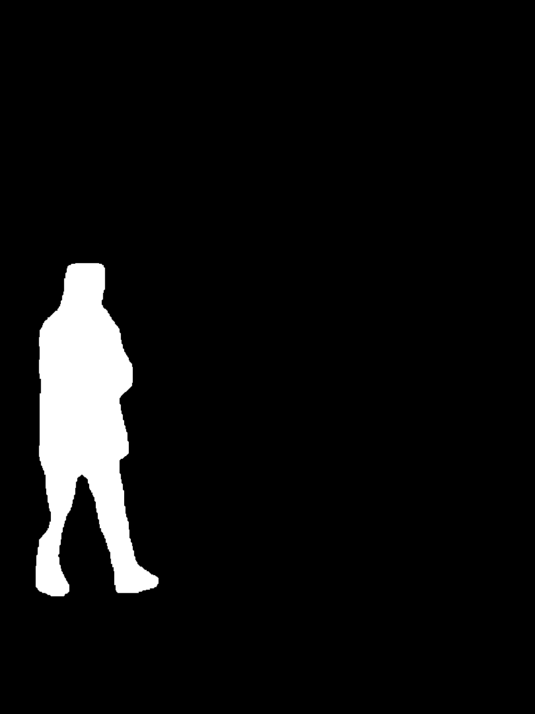
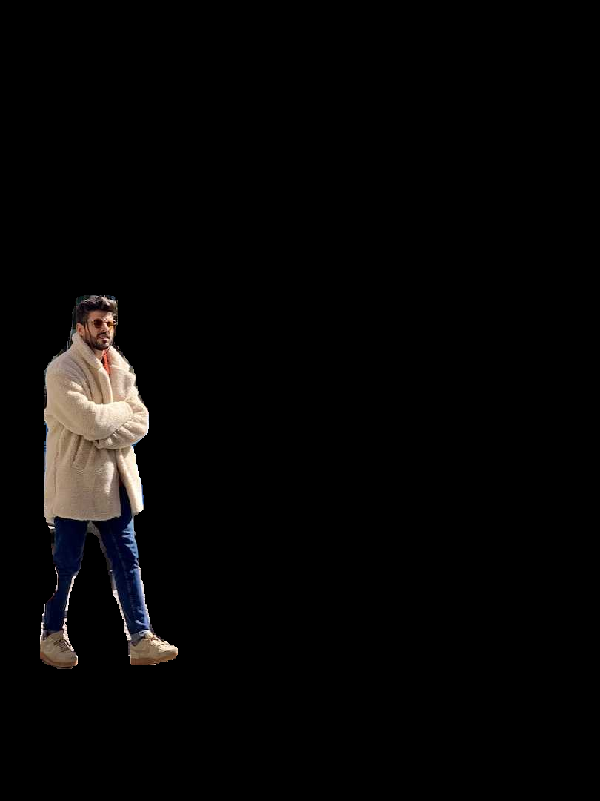
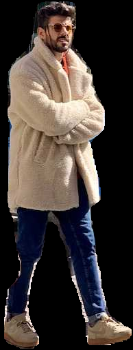
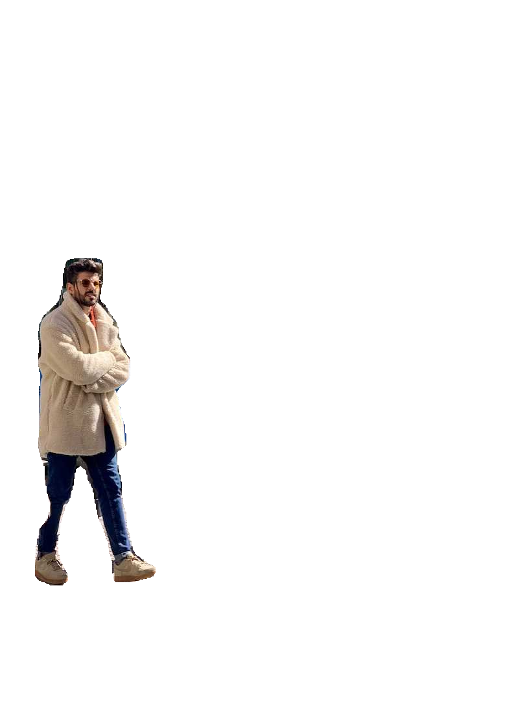
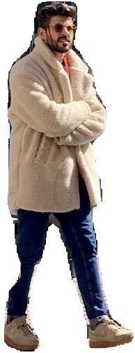

# Segmented Objects Isolation

When working with the results from the [Segment Task](../tasks/segment.md), it's sometimes desirable to extract the isolated objects from the inference results. This guide provides a generic recipe on how to accomplish this using the Ultralytics [Predict Mode](../modes/predict.md).

<p align="center">
  
</p>

## Recipe Walk Through

1. Begin with the necessary imports

    ```py
    from pathlib import Path

    import cv2 as cv
    import numpy as np
    from ultralytics import YOLO
    ```

    ???+ tip "Ultralytics Install"

        See the Ultralytics [Quickstart](../quickstart.md/#install-ultralytics) Installation section for a quick walkthough on installing the required libraries.

    ---

1. Load a model and run `predict()` method on a source.

    ```py
    m = YOLO('yolov8n-seg.pt')
    res = m.predict()
    ```

    ??? question "No Prediction Arguments?"

        Without specifying a source, the example images from the library will be used:

        ```
        'ultralytics/assets/bus.jpg'
        'ultra.ytics/assets/zidane.jpg'
        ```
        
        This is helpful for rapid testing with the `predict()` method. 

    For additional information about Segmentation Models, visit the [Segement Task](../tasks/segment.md/#models) page. To learn more about `predict()` method, see [Predict Mode](../modes/predict.md) section of the Documentation.

    ---

1. Now iterate over the results and the contours. For workflows that want to save an image to file, the source image `base-name` and the detection `class-label` are retrived for later use (optional).

    ``` { .py .annotate }
    # (2) Iterate detection results (helpful for multiple images)
    for r in res:
        img = np.copy(r.orig_img)
        img_name = Path(r.path).stem # source image base-name
        
        # Iterate each object contour (multiple detections)
        for ci,c in enumerate(r):
            # (1) Get detection class name
            label = c.names[c.boxes.cls.tolist().pop()]

    ```

    1.  To learn more about working with detection results, see [Boxes Section for Predict Mode](../modes/predict.md/#boxes).
    2.  To learn more about `predict()` results see [Working with Results for Predict Mode](../modes/predict.md/#working-with-results)

    ??? info "For-Loop"
    
        A single image will only iterate the first loop once. A single image with only a single detection will iterate each loop _only_ once.

    ---

1. Start with generating a binary mask from the source image and then draw a filled contour onto the mask. This will allow the object to be isolated from the other parts of the image. An example from `bus.jpg` for one of the detected `person` class objects is shown on the right.

    { width="240", align="right" }
    ``` { .py .annotate }
    # Create binary mask
    b_mask = np.zeros(img.shape[:2], np.uint8)

    # (1) Extract contour result
    contour = c.masks.xy.pop()
    # (2) Changing the type
    contour = contour.astype(np.int32)
    # (3) Reshaping
    contour = contour.reshape(-1, 1, 2)
    

    # Draw contour onto mask
    _ = cv.drawContours(b_mask,
                        [contour],
                        -1,
                        (255, 255, 255),
                        cv.FILLED)

    ```

    1.  For more info on `c.masks.xy` see [Masks Section from Predict Mode](../modes/predict.md/#masks).
    
    2.  Here, the values are cast into `np.int32` for compatibility with `drawContours()` function from OpenCV.

    3.  The OpenCV `drawContours()` function expects contours to have a shape of `[N, 1, 2]` expand section below for more details.

    <details>
    <summary> Expand to understand what is happening when defining the <code>contour</code> variable.</summary>
    <p>

    - `c.masks.xy` :: returns the mask contour points with `(x, y)` coordinates, see [Masks Section from Predict Mode](../modes/predict.md/#masks) for additional information.

    - `.pop()` :: since `masks.xy` is a list and there will only be a single value, this single entry is 'popped' from the list.

    - `.astype(np.int32)` :: the output of `masks.xy` will have a data type of `float32`, but this won't be compatible with the OpenCV `drawContours()` function, so this will change the data type to `int32` for compatibility.

    - `.reshape(-1, 1, 2)` :: the OpenCV `drawContours()` function expects contours to have a shape of `[N, 1, 2]` where `N` is the number of contour points, with each point represented by a single entry `1`, and the entry is composed of `2` values. The `-1` denotes that the number of values along this dimension is flexible.

    </details>
    <p></p>
    <details>
    <summary> Expand for an explaination of the <code>drawContours()</code> configuration.</summary>
    <p>

    - During testing it was found that wrapping the variable `contour` in brackets to form a list, `[contour]` would correctly generate the contour mask desired.

    - The `-1` indicates that all contours should be drawn.

    - The `tuple` value `(255, 255, 255)` indicates that the contour will be drawn using white pixels, which is what we desire for this binary mask.

    - The addition of `cv.FILLED` will color all pixels enclosed by the contour boundary the same, in this case, all enclosed pixels will be white.

    - See [OpenCV Documentation on `drawContours()`](https://docs.opencv.org/4.8.0/d6/d6e/group__imgproc__draw.html#ga746c0625f1781f1ffc9056259103edbc) for more infromation.

    </details>
    <p></p>

    ---

1. Next the there are 2 options for how to move forward with the image from this point and a subsequent option for each.

    ### Object Isolation Options

    !!! example ""

        === "Black Background Pixels"

            ```py
            # Create 3-channel mask
            mask3ch = cv.cvtColor(b_mask, cv.COLOR_GRAY2BGR)
            
            # Isolate object with binary mask
            isolated = cv.bitwise_and(mask3ch, img)

            ```

            ??? question "How does this work?"

                - First, the binary mask is converted from a single channel image to a 3-channel image. This is required for the next step where the mask and source image are combined, since they will need to have the same dimensions.

                - The original image and 3-channel binary mask are combined using the OpenCV function `bitwise_and()` which keeps only pixel values `> 0` from <u>both images</u>. Since the mask pixels are `> 0` <u>only</u> inside the contour, the only pixels from the original image that remain are the ones overlapping the contour.
        
            ### Isolate with Black Pixels: Sub-options

            ??? info "Full-size Image"

                There are no additional steps required if keeping full size image.

                <figure markdown>
                    { width=240 }
                    <figcaption>Example full-size output</figcaption>
                </figure>

            ??? info "Cropped object Image"

                Additional steps required to crop image to only include object region.

                { align="right" }
                ``` { .py .annotate }
                # (1) Bounding box coordinates
                x1, y1, x2, y2 = c.boxes.xyxy.cpu().numpy().squeeze().astype(np.int32)
                # Crop image to object region
                iso_crop = isolated[y1:y2, x1:x2]

                ```

                1.  For more information on bounding box results, see [Boxes Section from Predict Mode](../modes/predict.md/#boxes)

                ??? question "What does this code do?"

                    - When using `c.boxes.xyxy.cpu().numpy()`, the bounding boxes are returned as a Numpy array, using the `xyxy` box cooridates format, which correspond to the points `xmin, ymin, xmax, ymax` for the bounding box (rectangle), see [Boxes Section from Predict Mode](../modes/predict.md/#boxes) for more information.

                    - Adding `squeeze()` ensures that any extraneous dimensions are removed from the Numpy array.

                    - Converting the coordinate values using `.astype(np.int32)` changes the box coordinates data type from `float32` to `int32` which will be compatible when cropping the image using index slices.

                    - Finally the image region for the bounding box is cropped using index slicing, where the bounds are set using the `[ymin:ymax, xmin:xmax]` coordinates of the detection bounding box.

        === "Tranparent Background Pixels"

            ```py
            # Isolate object with transparent backgroud (when saved as PNG)
            isolated = np.dstack([img, b_mask])

            ```

            ??? question "How does this work?"

                - Using the Numpy `dstack()` function (array stacking along depth-axis) in conjunction with the binary mask generated, will create an image with four channels. This allows for all pixels outside of the object contour to be transparent when saving as a `PNG` file.
        
            ### Isolate with Transparent Pixels: Sub-options

            ??? info "Full-size Image"

                There are no additional steps required if keeping full size image.

                <figure markdown>
                    { width=240 }
                    <figcaption>Example full-size output + transparent bacground</figcaption>
                </figure>

            ??? info "Cropped object Image"

                Additional steps required to crop image to only include object region.

                { align="right" }
                ``` { .py .annotate }
                # (1) Bounding box coordinates
                x1, y1, x2, y2 = c.boxes.xyxy.cpu().numpy().squeeze().astype(np.int32)
                # Crop image to object region
                iso_crop = isolated[y1:y2, x1:x2]

                ```

                1.  For more information on bounding box results, see [Boxes Section from Predict Mode](../modes/predict.md/#boxes)

                ??? question "What does this code do?"

                    - When using `c.boxes.xyxy.cpu().numpy()`, the bounding boxes are returned as a Numpy array, using the `xyxy` box cooridates format, which correspond to the points `xmin, ymin, xmax, ymax` for the bounding box (rectangle), see [Boxes Section from Predict Mode](../modes/predict.md/#boxes) for more information.

                    - Adding `squeeze()` ensures that any extraneous dimensions are removed from the Numpy array.

                    - Converting the coordinate values using `.astype(np.int32)` changes the box coordinates data type from `float32` to `int32` which will be compatible when cropping the image using index slices.

                    - Finally the image region for the bounding box is cropped using index slicing, where the bounds are set using the `[ymin:ymax, xmin:xmax]` coordinates of the detection bounding box.

    ??? question "What if I want the cropped object **including** the background?"

        This is a built in feature for the Ultralytics library. See the `save_crop` argument for  [Predict Mode Inference Arguments](../modes/predict.md/#inference-arguments) for details.

    ---

1. <u>What to do next is entirely left to the you as the developer.</u> A basic example of one possible next step (saving the image to file for future use) is shown. 

    - **NOTE:** this step is optional and can be skipped if not required for your specific use case.

    ??? example "Example Final Step"
    
        ```py
        # Save isolated object to file
        _ = cv.imwrite(f'{img_name}_{label}-{ci}.png', iso_crop)
        ```

        - In this example, the `img_name` is the base-name of the source image file, `label` is the detected class-name, and `ci` is the index of the object detection (in case of multiple instances with the same class name).

## Full Example code

Here, all steps from the previous section are combined into a single block of code. For repeated use, it would be optimal to define a function to do some or all commands contained in the `for`-loops, but that is an exercise left to the reader.

``` { .py .annotate }
from pathlib import Path

import cv2 as cv
import numpy as np
from ultralytics import YOLO

m = YOLO('yolov8n-seg.pt')#(4)!
res = m.predict()#(3)!

# iterate detection results (5)
for r in res:
    img = np.copy(r.orig_img)
    img_name = Path(r.path).stem
    
    # iterate each object contour (6)
    for ci,c in enumerate(r):
        label = c.names[c.boxes.cls.tolist().pop()]

        b_mask = np.zeros(img.shape[:2], np.uint8)

        # Create contour mask (1)
        contour = c.masks.xy.pop().astype(np.int32).reshape(-1, 1, 2)
        _ = cv.drawContours(b_mask, [contour], -1, (255, 255, 255), cv.FILLED)
        
        # Choose one:

        # OPTION-1: Isolate object with black background
        mask3ch = cv.cvtColor(b_mask, cv.COLOR_GRAY2BGR)
        isolated = cv.bitwise_and(mask3ch, img)

        # OPTION-2: Isolate object with transparent backgroud (when saved as PNG)
        isolated = np.dstack([img, b_mask])

        # OPTIONAL: detection crop (from either OPT1 or OPT2)
        x1, y1, x2, y2 = c.boxes.xyxy.cpu().numpy().squeeze().astype(np.int32)
        iso_crop = isolated[y1:y2, x1:x2]

        # TODO your actions go here (2)

```

1.  The line populating `contour` is combined into a single line here, where it was split to multiple above.
2.  {==What goes here is up to you!==}
3.  See [Predict Mode](../modes/predict.md) for additional information.
4.  See [Segement Task](../tasks/segment.md/#models) for more information.
5.  Learn more about [Working with Results](../modes/predict.md/#working-with-results)
6.  Learn more about [Segmentation Mask Results](../modes/predict.md/#masks)