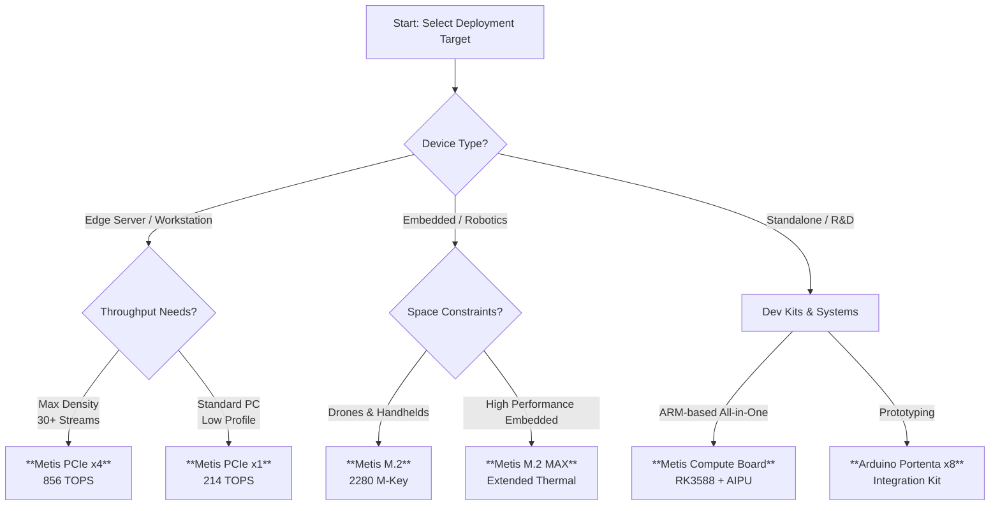

# Axelera AI Export and Deployment

!!! tip "Experimental Release"

    This is an experimental integration demonstrating deployment on Axelera Metis hardware. Full integration anticipated by **February 2026** with model export without requiring Axelera hardware and standard pip installation.

Ultralytics partners with [Axelera AI](https://www.axelera.ai/) to enable high-performance, energy-efficient inference on [Edge AI](https://www.ultralytics.com/glossary/edge-ai) devices. Export and deploy **Ultralytics YOLO models** directly to the **Metis® AIPU** using the **Voyager SDK**.


Axelera AI provides dedicated hardware acceleration for [computer vision](https://www.ultralytics.com/glossary/computer-vision-cv) at the edge, using a proprietary dataflow architecture and [in-memory computing](https://www.ultralytics.com/glossary/edge-computing) to deliver up to **856 TOPS** with low power consumption.

## Selecting the Right Hardware

Axelera AI offers various form factors to suit different deployment constraints. The chart below helps identify the optimal hardware for your Ultralytics YOLO deployment.



## Hardware Portfolio

The Axelera hardware lineup is optimized to run [Ultralytics YOLO26](https://docs.ultralytics.com/models/yolo26/) and legacy versions with high FPS-per-watt efficiency.

### Accelerator Cards

These cards enable AI acceleration in existing host devices, facilitating [brownfield deployments](https://www.ultralytics.com/glossary/edge-computing).

| Product           | Form Factor    | Compute            | Performance (INT8) | Target Application                                                                                                                         |
| :---------------- | :------------- | :----------------- | :----------------- | :----------------------------------------------------------------------------------------------------------------------------------------- |
| **Metis PCIe x4** | PCIe Gen3 x16  | **4x** Metis AIPUs | **856 TOPS**       | High-density [video analytics](https://docs.ultralytics.com/guides/analytics/), smart cities                                               |
| **Metis PCIe x1** | PCIe Gen3 x1   | **1x** Metis AIPU  | **214 TOPS**       | Industrial PCs, retail [queue management](https://docs.ultralytics.com/guides/queue-management/)                                           |
| **Metis M.2**     | M.2 2280 M-Key | **1x** Metis AIPU  | **214 TOPS**       | [Drones](https://www.ultralytics.com/blog/build-ai-powered-drone-applications-with-ultralytics-yolo11), robotics, portable medical devices |
| **Metis M.2 MAX** | M.2 2280       | **1x** Metis AIPU  | **214 TOPS**       | Environments requiring advanced thermal management                                                                                         |

### Integrated Systems

For turnkey solutions, Axelera partners with manufacturers to provide systems pre-validated for the Metis AIPU.

- **Metis Compute Board**: A standalone edge device pairing the Metis AIPU with a Rockchip RK3588 ARM CPU.
- **Workstations**: Enterprise towers from **Dell** (Precision 3460XE) and **Lenovo** (ThinkStation P360 Ultra).
- **Industrial PCs**: Ruggedized systems from **Advantech** and **Aetina** designed for [manufacturing automation](https://www.ultralytics.com/solutions/ai-in-manufacturing).

## Supported Tasks

Currently, Object Detection models can be exported to the Axelera format. Additional tasks are being integrated:

| Task                                                               | Status       |
| :----------------------------------------------------------------- | :----------- |
| [Object Detection](https://docs.ultralytics.com/tasks/detect/)     | ✅ Supported |
| [Pose Estimation](https://docs.ultralytics.com/tasks/pose/)        | Coming soon  |
| [Segmentation](https://docs.ultralytics.com/tasks/segment/)        | Coming soon  |
| [Oriented Bounding Boxes](https://docs.ultralytics.com/tasks/obb/) | Coming soon  |

## Installation

!!! warning "Platform Requirements"

    Exporting to Axelera format requires:

    - **Operating System**: Linux only (Ubuntu 22.04/24.04 recommended)
    - **Hardware**: Axelera AI accelerator ([Metis devices](https://store.axelera.ai/))
    - **Python**: Version 3.10 (3.11 and 3.12 coming soon)

### Ultralytics Installation

```bash
pip install ultralytics
```

For detailed instructions, see our [Ultralytics Installation guide](../quickstart.md). If you encounter difficulties, consult our [Common Issues guide](../guides/yolo-common-issues.md).

### Axelera Driver Installation

1. Add the Axelera repository key:

    ```bash
    sudo sh -c "curl -fsSL https://software.axelera.ai/artifactory/api/security/keypair/axelera/public | gpg --dearmor -o /etc/apt/keyrings/axelera.gpg"
    ```

2. Add the repository to apt:

    ```bash
    sudo sh -c "echo 'deb [signed-by=/etc/apt/keyrings/axelera.gpg] https://software.axelera.ai/artifactory/axelera-apt-source/ ubuntu22 main' > /etc/apt/sources.list.d/axelera.list"
    ```

3. Install the SDK and load the driver:

    ```bash
    sudo apt update
    sudo apt install -y axelera-voyager-sdk-base
    sudo modprobe metis
    yes | sudo /opt/axelera/sdk/latest/axelera_fix_groups.sh $USER
    ```

## Exporting YOLO Models to Axelera

Export your trained YOLO models using the standard Ultralytics export command.

!!! example "Export to Axelera Format"

    === "Python"

        ```python
        from ultralytics import YOLO

        # Load a YOLO26 model
        model = YOLO("yolo26n.pt")

        # Export to Axelera format
        model.export(format="axelera")  # creates 'yolo26n_axelera_model' directory
        ```

    === "CLI"

        ```bash
        yolo export model=yolo26n.pt format=axelera
        ```

### Export Arguments

| Argument   | Type             | Default          | Description                                                                                  |
| :--------- | :--------------- | :--------------- | :------------------------------------------------------------------------------------------- |
| `format`   | `str`            | `'axelera'`      | Target format for Axelera Metis AIPU hardware                                                |
| `imgsz`    | `int` or `tuple` | `640`            | Image size for model input                                                                   |
| `int8`     | `bool`           | `True`           | Enable [INT8 quantization](https://www.ultralytics.com/glossary/model-quantization) for AIPU |
| `data`     | `str`            | `'coco128.yaml'` | [Dataset](https://docs.ultralytics.com/datasets/) config for quantization calibration        |
| `fraction` | `float`          | `1.0`            | Fraction of dataset for calibration (100-400 images recommended)                             |
| `device`   | `str`            | `None`           | Export device: GPU (`device=0`) or CPU (`device=cpu`)                                        |

For all export options, see the [Export Mode documentation](https://docs.ultralytics.com/modes/export/).

### Output Structure

```text
yolo26n_axelera_model/
├── yolo26n.axm              # Axelera model file
└── metadata.yaml            # Model metadata (classes, image size, etc.)
```

## Running Inference

Load the exported model with the Ultralytics API and run inference, similar to loading [ONNX](https://docs.ultralytics.com/integrations/onnx/) models.

!!! example "Inference with Axelera Model"

    === "Python"

        ```python
        from ultralytics import YOLO

        # Load the exported Axelera model
        model = YOLO("yolo26n_axelera_model")

        # Run inference
        results = model("https://ultralytics.com/images/bus.jpg")

        # Process results
        for r in results:
            print(f"Detected {len(r.boxes)} objects")
            r.show()  # Display results
        ```

    === "CLI"

        ```bash
        yolo predict model='yolo26n_axelera_model' source='https://ultralytics.com/images/bus.jpg'
        ```

!!! warning "Known Issue"

    The first inference run may throw an `ImportError`. Subsequent runs will work correctly. This will be addressed in a future release.

## Inference Performance

The Metis AIPU maximizes throughput while minimizing energy consumption.

| Metric              | Metis PCIe x4 | Metis M.2    | Note                    |
| :------------------ | :------------ | :----------- | :---------------------- |
| **Peak Throughput** | **856 TOPS**  | 214 TOPS     | INT8 Precision          |
| **YOLOv5m FPS**     | **~1539 FPS** | ~326 FPS     | 640x640 Input           |
| **YOLOv5s FPS**     | N/A           | **~827 FPS** | 640x640 Input           |
| **Efficiency**      | High          | Very High    | Ideal for battery power |

_Benchmarks based on Axelera AI data. Actual FPS depends on model size, batching, and input resolution._

## Real-World Applications

Ultralytics YOLO on Axelera hardware enables advanced edge computing solutions:

- **Smart Retail**: Real-time [object counting](https://docs.ultralytics.com/guides/object-counting/) and [heatmap analytics](https://docs.ultralytics.com/guides/heatmaps/) for store optimization.
- **Industrial Safety**: Low-latency [PPE detection](https://docs.ultralytics.com/datasets/detect/construction-ppe/) in manufacturing environments.
- **Drone Analytics**: High-speed [object detection](https://docs.ultralytics.com/tasks/detect/) on UAVs for [agriculture](https://www.ultralytics.com/solutions/ai-in-agriculture) and search-and-rescue.
- **Traffic Systems**: Edge-based [license plate recognition](https://www.ultralytics.com/blog/using-ultralytics-yolo11-for-automatic-number-plate-recognition) and [speed estimation](https://docs.ultralytics.com/guides/speed-estimation/).

## Recommended Workflow

1. **Train** your model using Ultralytics [Train Mode](https://docs.ultralytics.com/modes/train/)
2. **Export** to Axelera format using `model.export(format="axelera")`
3. **Validate** accuracy with `yolo val` to verify minimal quantization loss
4. **Predict** using `yolo predict` for qualitative validation

## Device Health Check

Verify your Axelera device is functioning properly:

```bash
. /opt/axelera/sdk/latest/axelera_activate.sh
axdevice
```

For detailed diagnostics, see the [AxDevice documentation](https://github.com/axelera-ai-hub/voyager-sdk/blob/release/v1.5/docs/reference/axdevice.md).

## Maximum Performance

This integration uses single-core configuration for compatibility. For production requiring maximum throughput, the [Axelera Voyager SDK](https://github.com/axelera-ai-hub/voyager-sdk) offers:

- Multi-core utilization (quad-core Metis AIPU)
- Streaming inference pipelines
- Tiled inferencing for higher-resolution cameras

See the [model-zoo](https://github.com/axelera-ai-hub/voyager-sdk/blob/release/v1.5/docs/reference/model_zoo.md) for FPS benchmarks or [contact Axelera](https://axelera.ai/contact-us) for production support.

## Known Issues

!!! warning "Known Limitations"

    - **PyTorch 2.9 compatibility**: The first `yolo export format=axelera` command may fail due to automatic PyTorch downgrade to 2.8. Run the command a second time to succeed.

    - **M.2 power limitations**: Large or extra-large models may encounter runtime errors on M.2 accelerators due to power supply constraints.

    - **First inference ImportError**: The first inference run may throw an `ImportError`. Subsequent runs work correctly.

For support, visit the [Axelera Community](https://community.axelera.ai/).

## FAQ

### What YOLO versions are supported on Axelera?

The Voyager SDK supports export of [YOLOv8](https://docs.ultralytics.com/models/yolov8/) and [YOLO26](https://docs.ultralytics.com/models/yolo26/) models.

### Can I deploy custom-trained models?

Yes. Any model trained using [Ultralytics Train Mode](https://docs.ultralytics.com/modes/train/) can be exported to the Axelera format, provided it uses supported layers and operations.

### How does INT8 quantization affect accuracy?

Axelera's Voyager SDK automatically quantizes models for the mixed-precision AIPU architecture. For most [object detection](https://www.ultralytics.com/glossary/object-detection) tasks, the performance gains (higher FPS, lower power) significantly outweigh the minimal impact on [mAP](https://docs.ultralytics.com/guides/yolo-performance-metrics/). Quantization takes seconds to several hours depending on model size. Run `yolo val` after export to verify accuracy.

### How many calibration images should I use?

We recommend 100 to 400 images. More than 400 provides no additional benefit and increases quantization time. Experiment with 100, 200, and 400 images to find the optimal balance.

### Where can I find the Voyager SDK?

The SDK, drivers, and compiler tools are available via the [Axelera Developer Portal](https://www.axelera.ai/).
