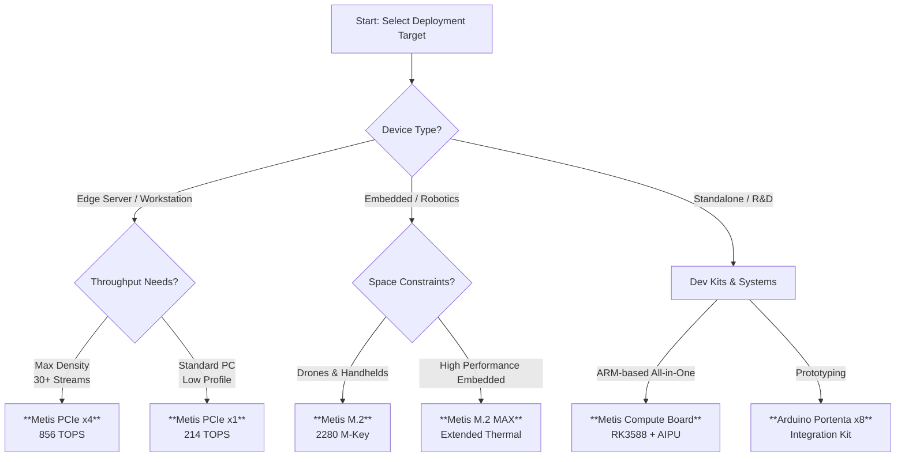

# Axelera AI Acceleration

!!! note "Partner Integration"

    Ultralytics partners with **Axelera AI** to bring high-performance, energy-efficient inference to [Edge AI](https://docs.ultralytics.com/glossary/edge-ai). The integration seamlessly connects Ultralytics [YOLO models](https://docs.ultralytics.com/models/) with the **Metis® AIPU** and **Europa®** platforms via the **Voyager SDK**, enabling advanced [computer vision](https://docs.ultralytics.com/glossary/computer-vision-cv) and Generative AI applications.


**Axelera AI** delivers the world's most powerful solutions for AI at the edge. Their technology moves beyond standard processing, bringing **Large Language Models (LLMs)** and **Vision Language Models (VLMs)** out of the cloud and onto on-premise devices.

At the core is the **Metis® AI Processing Unit (AIPU)**, which utilizes a novel dataflow architecture and [in-memory computing](https://docs.ultralytics.com/glossary/edge-computing) to deliver massive throughput (up to **856 TOPS**) with exceptional power efficiency. Whether you are deploying [object detection](https://docs.ultralytics.com/tasks/detect/) in drones or video analytics in servers, Axelera offers a scalable hardware portfolio.

## Selecting the Right Hardware

Axelera AI offers a diverse range of form factors. Use the chart below to identify the best solution for your [deployment strategy](https://docs.ultralytics.com/guides/model-deployment-practices/).



## Hardware Portfolio

Axelera AI's hardware is designed to accelerate [Ultralytics YOLO11](https://docs.ultralytics.com/models/yolo11/) and other architectures with industry-leading FPS-per-watt performance.

### Accelerator Cards

These add-in cards integrate into existing hardware, ideal for [brownfield deployments](https://docs.ultralytics.com/glossary/edge-computing).

| Product           | Form Factor    | Compute            | Performance (INT8) | Ideal Application                                                                                                                           |
| :---------------- | :------------- | :----------------- | :----------------- | :------------------------------------------------------------------------------------------------------------------------------------------ |
| **Metis PCIe x4** | PCIe Gen3 x16  | **4x** Metis AIPUs | **856 TOPS**       | High-density [video analytics](https://docs.ultralytics.com/guides/analytics/), smart cities                                                |
| **Metis PCIe x1** | PCIe Gen3 x1   | **1x** Metis AIPU  | **214 TOPS**       | Industrial PCs, retail [queue management](https://docs.ultralytics.com/guides/queue-management/)                                            |
| **Metis M.2**     | M.2 2280 M-Key | **1x** Metis AIPU  | **214 TOPS**       | [Drones](https://docs.ultralytics.com/blog/build-ai-powered-drone-applications-with-ultralytics-yolo11), robotics, portable medical devices |
| **Metis M.2 MAX** | M.2 2280       | **1x** Metis AIPU  | **214 TOPS**       | Harsh environments requiring advanced thermal management                                                                                    |

### Integrated Systems

For a complete out-of-the-box experience, Axelera partners with leading manufacturers.

- **Metis Compute Board**: A powerful standalone unit pairing the Metis AIPU with a Rockchip RK3588 ARM CPU.
- **Workstations**: Enterprise-grade towers from **Dell** (Precision 3460XE) and **Lenovo** (ThinkStation P360 Ultra) pre-installed with Metis accelerators.
- **Industrial PCs**: Ruggedized systems from **Advantech** (MIC-770v3) and **Aetina** designed for [manufacturing automation](https://docs.ultralytics.com/solutions/ai-in-manufacturing).

For availability, visit the [Axelera AI Store](https://store.axelera.ai/).

## Voyager SDK

The **Voyager SDK** is the comprehensive software stack enabling the Metis AIPU. It abstracts the complexity of NPU programming, allowing developers to go from [PyTorch](https://pytorch.org/) to the edge in minutes.

Key capabilities include:

1. **Model Zoo**: Access to 100+ pre-optimized models, including the full [YOLOv8](https://docs.ultralytics.com/models/yolov8/) and [YOLO11](https://docs.ultralytics.com/models/yolo11/) families.
2. **Quantization Engine**: Automatically converts models to [INT8 precision](https://docs.ultralytics.com/glossary/model-quantization) with calibration to maintain high [accuracy](https://docs.ultralytics.com/glossary/accuracy).
3. **Pipeline Builder**: A zero-code YAML framework to chain models (e.g., detection followed by [pose estimation](https://docs.ultralytics.com/tasks/pose/)).
4. **Generative AI**: Support for running LLMs and VLMs locally.

## Installation & Setup

To deploy on Axelera hardware, you will need the `ultralytics` package for model training and export, alongside the system-level Voyager SDK.

```bash
# Install Ultralytics
pip install ultralytics

# The Axelera Voyager SDK must be installed separately on your host/target device.
# Visit the Axelera Developer Portal for the latest drivers.
```

## How to Export to Axelera

Ultralytics provides a direct export path to the Axelera format. This process generates an intermediate file (typically ONNX) optimized for the Voyager compiler.

!!! warning "Export Prerequisites"

    Running the export requires the `axelera` libraries to be present in your environment if you wish to compile immediately. However, you can export to [ONNX](https://docs.ultralytics.com/integrations/onnx/) first and then use the Voyager compiler toolchain.

### Export Examples

Convert a trained model for deployment. This is a crucial step in [model deployment practices](https://docs.ultralytics.com/guides/model-deployment-practices/).

!!! example "Export YOLO11 to Axelera Format"

    === "Python"

        ```python
        from ultralytics import YOLO

        # Load a standard or custom trained YOLO11 model
        model = YOLO("yolo11n.pt")

        # Export to Axelera format
        # Arguments can be adjusted for specific image sizes and batching
        model.export(format="axelera", int8=True, imgsz=640)
        ```

    === "CLI"

        ```bash
        # Export a model via CLI
        yolo export model=yolo11n.pt format=axelera int8=True imgsz=640
        ```

For more details on configuration, see the [Export Mode documentation](https://docs.ultralytics.com/modes/export/).

## Inference Performance

Axelera AI delivers "unmatched performance" for edge applications. By leveraging [dataflow architecture](https://www.axelera.ai/technology), the Metis AIPU avoids the memory bottlenecks of traditional [GPUs](https://docs.ultralytics.com/glossary/gpu-graphics-processing-unit).

### Benchmark Highlights

| Metric              | Metis PCIe x4 | Metis M.2    | Note                    |
| :------------------ | :------------ | :----------- | :---------------------- |
| **Peak Throughput** | **856 TOPS**  | 214 TOPS     | INT8 Precision          |
| **YOLOv5m FPS**     | **~1539 FPS** | ~326 FPS     | 640x640 Input           |
| **YOLOv5s FPS**     | N/A           | **~827 FPS** | 640x640 Input           |
| **Efficiency**      | High          | Very High    | Ideal for battery power |

_Benchmarks sourced from Axelera AI public materials (Sept 2025). Actual performance varies by model complexity and input resolution._

## Real-World Applications

The combination of Ultralytics YOLO and Axelera hardware enables robust solutions across various industries.

- **Smart Retail**: Utilize [object counting](https://docs.ultralytics.com/guides/object-counting/) and [heatmap analytics](https://docs.ultralytics.com/guides/heatmaps/) to optimize store layouts and checkout flows.
- **Industrial Safety**: Deploy [PPE detection](https://docs.ultralytics.com/datasets/detect/construction-ppe/) in factories using the ruggedized PCIe cards.
- **Agriculture**: Run [crop monitoring](https://docs.ultralytics.com/solutions/ai-in-agriculture) and [precision farming](https://docs.ultralytics.com/blog/computer-vision-in-agriculture-transforming-fruit-detection-and-precision-farming) on drones equipped with the Metis M.2 module.
- **Traffic Management**: Implement [speed estimation](https://docs.ultralytics.com/guides/speed-estimation/) and [license plate recognition](https://docs.ultralytics.com/blog/using-ultralytics-yolo11-for-automatic-number-plate-recognition) at the edge without cloud latency.

## FAQ

### What is the difference between Metis and Europa?

**Metis** is the current generation AIPU delivering cost-effective high performance (214-856 TOPS). **Europa** is the next-generation platform targeting **629 TOPS per chip**, designed for the most demanding Generative AI and [computer vision](https://docs.ultralytics.com/glossary/computer-vision-cv) workloads.

### Does the Voyager SDK support custom trained models?

Yes. If you train a model using [Ultralytics Train Mode](https://docs.ultralytics.com/modes/train/) on your own [datasets](https://docs.ultralytics.com/datasets/), you can export it to Axelera format just like the pre-trained models.

### Can I run YOLO11 on the M.2 card?

Absolutely. The M.2 card provides 214 TOPS, which is more than sufficient to run [YOLO11](https://docs.ultralytics.com/models/yolo11/) models at high frame rates, making it perfect for compact edge devices.

### How does Axelera compare to a GPU?

Axelera's Metis AIPU is an [ASIC](https://docs.ultralytics.com/glossary/tpu-tensor-processing-unit) (Application Specific Integrated Circuit) designed specifically for AI inference. It generally offers better price-performance and significantly higher energy efficiency (FPS/Watt) than a general-purpose GPU for these specific tasks.

### Where can I get support?

For issues related to the YOLO model training and export syntax, check the [Ultralytics Help](https://docs.ultralytics.com/help/). For hardware-specific issues, drivers, or the Voyager SDK, visit the [Axelera Support Portal](https://www.axelera.ai/).
