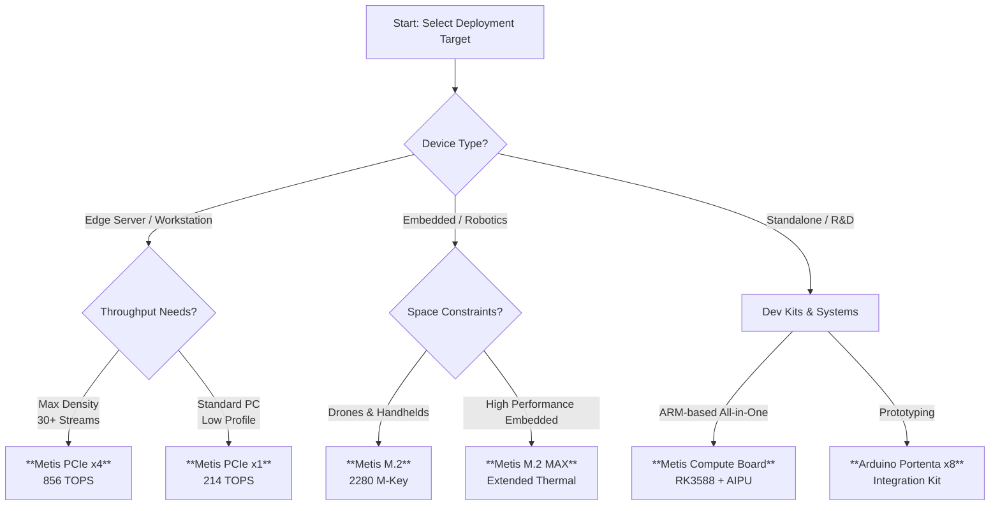

# Axelera AI Acceleration

!!! note "Coming soon — Q1 2026"

    Axelera support in `ultralytics` is **in progress**. The examples here show the planned UI/UX and will become runnable once the Axelera runtime package is released.

Ultralytics partners with **Axelera AI** to streamline high-performance, energy-efficient inference on [Edge AI](https://www.ultralytics.com/glossary/edge-ai) devices. This integration allows users to export and deploy **Ultralytics YOLO models** directly to the **Metis® AIPU** and **Europa®** platforms using the **Voyager SDK**.


**Axelera AI** provides dedicated hardware acceleration for computer vision and Generative AI at the edge. Their technology leverages a proprietary dataflow architecture and [in-memory computing](https://www.ultralytics.com/glossary/edge-computing) to deliver high throughput (up to **856 TOPS**) within a low power envelope.

For Ultralytics users, this offers a scalable path to deploy [object detection](https://docs.ultralytics.com/tasks/detect/), [pose estimation](https://docs.ultralytics.com/tasks/pose/), and other YOLO tasks on devices ranging from embedded drones to edge servers.

## Selecting the Right Hardware

Axelera AI offers various form factors to suit different deployment constraints. The chart below helps identify the optimal hardware for your Ultralytics YOLO deployment.



## Hardware Portfolio

The Axelera hardware lineup is optimized to run [Ultralytics YOLO11](https://docs.ultralytics.com/models/yolo11/) and legacy versions with high FPS-per-watt efficiency.

### Accelerator Cards

These cards enable AI acceleration in existing host devices, facilitating [brownfield deployments](https://www.ultralytics.com/glossary/edge-computing).

| Product           | Form Factor    | Compute            | Performance (INT8) | Target Application                                                                                                                          |
| :---------------- | :------------- | :----------------- | :----------------- | :------------------------------------------------------------------------------------------------------------------------------------------ |
| **Metis PCIe x4** | PCIe Gen3 x16  | **4x** Metis AIPUs | **856 TOPS**       | High-density [video analytics](https://docs.ultralytics.com/guides/analytics/), smart cities                                                |
| **Metis PCIe x1** | PCIe Gen3 x1   | **1x** Metis AIPU  | **214 TOPS**       | Industrial PCs, retail [queue management](https://docs.ultralytics.com/guides/queue-management/)                                            |
| **Metis M.2**     | M.2 2280 M-Key | **1x** Metis AIPU  | **214 TOPS**       | [Drones](https://docs.ultralytics.com/blog/build-ai-powered-drone-applications-with-ultralytics-yolo11), robotics, portable medical devices |
| **Metis M.2 MAX** | M.2 2280       | **1x** Metis AIPU  | **214 TOPS**       | Environments requiring advanced thermal management                                                                                          |

### Integrated Systems

For turnkey solutions, Axelera partners with manufacturers to provide systems pre-validated for the Metis AIPU.

- **Metis Compute Board**: A standalone edge device pairing the Metis AIPU with a Rockchip RK3588 ARM CPU.
- **Workstations**: Enterprise towers from **Dell** (Precision 3460XE) and **Lenovo** (ThinkStation P360 Ultra).
- **Industrial PCs**: Ruggedized systems from **Advantech** and **Aetina** designed for [manufacturing automation](https://www.ultralytics.com/solutions/ai-in-manufacturing).

## Voyager SDK Integration

The **Voyager SDK** serves as the bridge between Ultralytics models and Axelera hardware. It handles the compilation, quantization, and runtime execution of neural networks.

Key features for Ultralytics users:

1. **Seamless Export**: The SDK's compiler optimizes YOLO models for the Metis dataflow architecture.
2. **Quantization Engine**: Automatically converts FP32 models to [INT8 precision](https://www.ultralytics.com/glossary/model-quantization) with minimal accuracy loss.
3. **Pipeline Builder**: A YAML-based framework to chain multiple models (e.g., detection + [pose estimation](https://docs.ultralytics.com/tasks/pose/)) without writing complex C++ code.

## Installation & Setup

To use Axelera acceleration, you need the `ultralytics` package installed. Note that the Voyager SDK is a separate system-level installation required to interface with the hardware. Runtime wheels are expected in **Q1 2026**; the commands below reflect the intended setup flow.

```bash
# Install Ultralytics
pip install ultralytics

# Note: Download and install the Axelera Voyager SDK from the Axelera Developer Portal
# to enable the 'axelera' export format and runtime.
```

## Exporting YOLO Models to Axelera

When the Axelera runtime package ships (target Q1 2026), you will export your trained YOLO models to the Axelera format using the standard Ultralytics export command. This process generates the artifacts required by the Voyager compiler.

!!! warning "Voyager SDK Required"

    The `format='axelera'` export requires the Axelera libraries to be available in your environment. Alternatively, you can export to [ONNX](https://docs.ultralytics.com/integrations/onnx/) and manually compile using the Voyager toolchain.

### Export Examples

Convert a YOLO11 model for Metis deployment.

!!! example "Export to Axelera Format"

    !!! note "Future example — will work when runtime is released"

        This code block demonstrates the planned flow. It will require the upcoming Axelera runtime package (ETA Q1 2026) to execute successfully.

    === "Python"

        ```python
        from ultralytics import YOLO

        # Load a standard or custom trained YOLO11 model
        model = YOLO("yolo11n.pt")

        # Export to Axelera format
        # int8=True enables quantization for the NPU
        model.export(format="axelera", int8=True, imgsz=640)
        ```

    === "CLI"

        ```bash
        # Export a model via CLI
        yolo export model=yolo11n.pt format=axelera int8=True imgsz=640
        ```

For available arguments, refer to the [Export Mode documentation](https://docs.ultralytics.com/modes/export/).

## Running Inference

Once exported, you will be able to load the Axelera-compiled model directly with the `ultralytics` API (similar to loading [ONNX](https://docs.ultralytics.com/integrations/onnx/) models). The example below shows the expected usage pattern for running inference and saving results after the runtime package ships.

!!! example "Inference with Axelera Format"

    !!! note "Future example — will work when runtime is released"

        This code block demonstrates the planned flow. It will require the upcoming Axelera runtime package (ETA Q1 2026) to execute successfully.

    === "Python"

        ```python
        from ultralytics import YOLO

        # Load the Axelera-compiled model (example path; same flow as ONNX)
        model = YOLO("yolo11n_axelera.axmodel")  # will work once Axelera runtime is released

        # Run inference; you can pass a file, folder, glob, or list of sources
        results = model("path/to/images", imgsz=640, save=True)

        # Iterate over result objects to inspect or render detections
        for r in results:
            boxes = r.boxes  # bounding boxes tensor + metadata
            print(f"Detected {len(boxes)} objects")

            # Save visuals per result (files saved alongside inputs)
            r.save()  # saves annotated image(s) to disk
            # Or display interactively (desktop environments)
            # r.show()
        ```

## Inference Performance

The Metis AIPU is designed to maximize throughput while minimizing energy consumption. The benchmarks below illustrate the performance achievable with standard Ultralytics models.

| Metric              | Metis PCIe x4 | Metis M.2    | Note                    |
| :------------------ | :------------ | :----------- | :---------------------- |
| **Peak Throughput** | **856 TOPS**  | 214 TOPS     | INT8 Precision          |
| **YOLOv5m FPS**     | **~1539 FPS** | ~326 FPS     | 640x640 Input           |
| **YOLOv5s FPS**     | N/A           | **~827 FPS** | 640x640 Input           |
| **Efficiency**      | High          | Very High    | Ideal for battery power |

_Benchmarks based on Axelera AI data (Sept 2025). Actual FPS depends on model size, batching, and input resolution._

## Real-World Applications

Ultralytics YOLO on Axelera hardware enables advanced edge computing solutions:

- **Smart Retail**: Real-time [object counting](https://docs.ultralytics.com/guides/object-counting/) and [heatmap analytics](https://docs.ultralytics.com/guides/heatmaps/) for store optimization.
- **Industrial Safety**: Low-latency [PPE detection](https://docs.ultralytics.com/datasets/detect/construction-ppe/) in manufacturing environments.
- **Drone Analytics**: High-speed [object detection](https://docs.ultralytics.com/tasks/detect/) on UAVs for [agriculture](https://www.ultralytics.com/solutions/ai-in-agriculture) and search-and-rescue.
- **Traffic Systems**: Edge-based [license plate recognition](https://docs.ultralytics.com/blog/using-ultralytics-yolo11-for-automatic-number-plate-recognition) and [speed estimation](https://docs.ultralytics.com/guides/speed-estimation/).

## FAQ

### What YOLO versions are supported on Axelera?

The Voyager SDK and Ultralytics integration support the export of [YOLOv8](https://docs.ultralytics.com/models/yolov8/) and [YOLO11](https://docs.ultralytics.com/models/yolo11/) models.

### Can I deploy custom trained models?

Yes. Any model trained using [Ultralytics Train Mode](https://docs.ultralytics.com/modes/train/) can be exported to the Axelera format, provided it uses supported layers and operations.

### How does INT8 quantization affect accuracy?

Axelera's quantization engine uses advanced calibration techniques to minimize accuracy drop. For most detection tasks, the performance gain significantly outweighs the negligible impact on [mAP](https://docs.ultralytics.com/guides/yolo-performance-metrics/).

### Where can I find the Voyager SDK?

The SDK, drivers, and compiler tools are available via the [Axelera Developer Portal](https://www.axelera.ai/).
