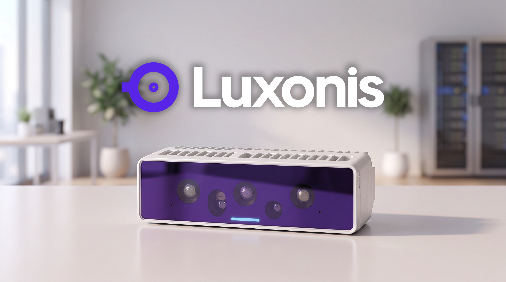
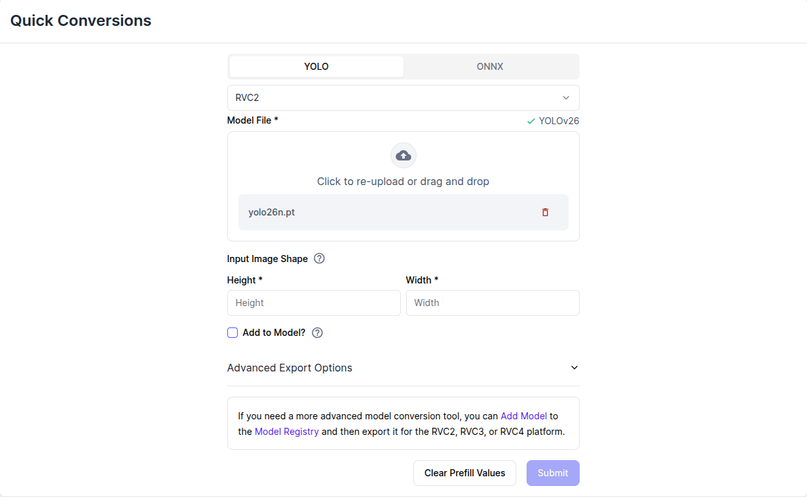
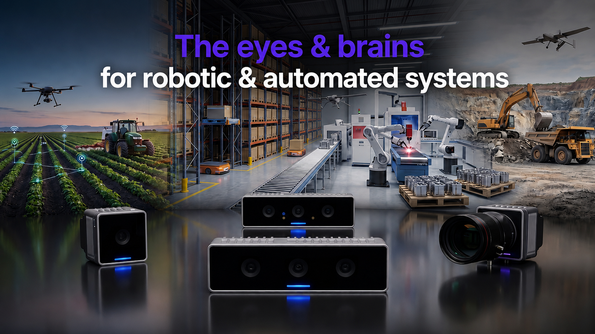
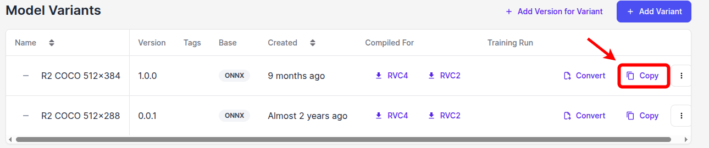

# Luxonis OAK Deployment for Ultralytics YOLO

!!! warning "Not a direct Ultralytics export format"

    Luxonis deployment is **not currently supported** as a native Ultralytics `model.export(format="...")` target. This guide documents a manual workflow that converts Ultralytics YOLO models with Luxonis tooling for deployment on Luxonis OAK cameras.

Luxonis [OAK cameras](https://www.luxonis.com/) are [edge AI](https://www.ultralytics.com/glossary/edge-ai) vision devices that combine image sensors with on-device compute for real-time perception tasks such as [object detection](../tasks/detect.md), [instance segmentation](../tasks/segment.md), [pose estimation](../tasks/pose.md) and others. They are designed for embedded and robotic vision workloads where running inference directly on the camera reduces latency, bandwidth usage, and dependence on cloud processing.



This guide focuses on deploying Ultralytics YOLO models on OAK cameras using the Luxonis software stack. It covers the relevant OAK hardware generations, explains why YOLO models must be converted into Luxonis device-specific artifacts, and walks through both cloud conversion with [Luxonis Hub](https://hub.luxonis.com/) and local conversion with Luxonis tooling before running inference on-device.

## Why Run YOLO on Luxonis OAK Cameras?

OAK cameras are a strong deployment target for YOLO when you want vision processing to happen close to the sensor instead of on a remote server or a large host GPU system. Luxonis combines camera inputs, on-device AI acceleration, and the surrounding vision pipeline in one platform, which makes it practical to build low-latency edge applications for robotics, automation, smart cameras, and embedded perception systems.

They are also a good fit when your application needs more than 2D inference alone. In addition to running YOLO models on-device, OAK cameras can be part of pipelines that use stereo depth, tracking, scripting, and video encoding on the same hardware stack. That can reduce host-side complexity and bandwidth requirements while keeping deployment compact and power-efficient.

## Luxonis Hardware Generations

Luxonis OAK cameras used with YOLO today fall into two main hardware generations: [`RVC2`](https://docs.luxonis.com/hardware/platform/rvc/rvc2) and [`RVC4`](https://docs.luxonis.com/hardware/platform/rvc/rvc4). Both are valid deployment targets for Ultralytics YOLO models, but they differ in performance, software environment, and the exact model artifact that must be produced during conversion.

In practice, the main decision for this guide is not which tasks are supported, but which camera generation you are deploying to. If you are choosing hardware, the [Luxonis OAK camera catalog](https://shop.luxonis.com/collections/oak-cameras-1) is a useful starting point because it lets you filter devices by generation, connectivity, and camera features.

### RVC2

`RVC2` is the established OAK generation built around the [Movidius Myriad X](https://www.intel.com/content/dam/www/public/us/en/documents/product-briefs/myriad-x-product-brief.pdf) platform. It powers many of the classic OAK camera families, including devices such as [OAK-D](https://docs.luxonis.com/hardware/products/OAK-D), [OAK-1](https://docs.luxonis.com/hardware/products/OAK-1), and other [RVC2-based cameras](https://shop.luxonis.com/collections/oak-cameras-col?tags=rvc2). It is a proven target for embedded vision pipelines that combine camera input, depth processing, and on-device neural inference in a relatively low-power form factor.

For YOLO deployment, `RVC2` supports the same broad task coverage described in this guide, but it offers lower throughput than `RVC4`, so model size, input resolution, and pipeline complexity matter more when tuning for performance.

### RVC4

`RVC4` is the newer OAK generation and provides substantially more on-device compute for AI and vision workloads. Luxonis builds `RVC4` around the [Qualcomm Dragonwing QCS8550](https://www.qualcomm.com/internet-of-things/products/q8-series/qcs8550), an ARM-based SoC running Linux that integrates a multi-core CPU, Hexagon AI accelerator, GPU, ISP, and dedicated vision processing hardware. Compared to previous generations, RVC4 delivers significantly higher AI throughput and forms the foundation of the [OAK4 camera family](https://www.luxonis.com/oak4), including devices such as [OAK 4 D](https://docs.luxonis.com/hardware/products/OAK%204%20D), [OAK 4 S](https://shop.luxonis.com/collections/oak-cameras-1), and related modules.

For YOLO deployment, `RVC4` is the higher-performance option and is generally the better fit when you need more throughput or more ambitious on-device pipelines. It also has a different software environment from `RVC2`, so converted models are generation-specific: a model converted for `RVC2` will not run on `RVC4`, and a model converted for `RVC4` will not run on `RVC2`.

!!! note "Compatibility at a glance"

    - Supports Ultralytics YOLO models from `YOLOv5` through `YOLO26`
    - Supports all main YOLO tasks on both `RVC2` and `RVC4`
    - `RVC4` delivers higher throughput than `RVC2` for the same class of YOLO workloads
    - Converted models are generation-specific, so an export for `RVC2` cannot run on `RVC4`, and an export for `RVC4` cannot run on `RVC2`

## Why YOLO Models Need Conversion for Luxonis

Ultralytics YOLO checkpoints, such as `.pt` models, are not directly executable on Luxonis OAK cameras. Before [deployment](https://www.ultralytics.com/glossary/model-deployment), they need to be converted into Luxonis-compatible artifacts that match the target hardware generation and runtime. In the Luxonis ecosystem, this typically means packaging the model and its metadata in an [NN Archive](https://docs.luxonis.com/software-v3/ai-inference/nn-archive) and converting it into an `RVC`-compiled model for the intended device.

This conversion step is important because deployment on OAK cameras is more than copying weights to a device. The model must be prepared for the target accelerator, with the expected input shape, preprocessing, output handling, and hardware-specific compilation settings. Since `RVC2` and `RVC4` use different execution targets, the final converted model is generation-specific. In practice, `RVC2` deployments use compiled `.superblob` artifacts with an [OpenVINO](https://docs.openvino.ai/)-based inference path, while `RVC4` deployments use `.dlc` artifacts with a [SNPE](https://www.qualcomm.com/developer/software/neural-processing-sdk-for-ai)-based path.

This guide covers two supported conversion workflows. The first is cloud conversion with [Luxonis Hub](https://hub.luxonis.com/), which provides a hosted path to generate device-ready artifacts. The second is local conversion with Luxonis [Tools](https://github.com/luxonis/tools) and [ModelConverter](https://github.com/luxonis/modelconverter), which is useful when you want more control over the environment or need an offline workflow.

!!! note "YOLO source models"

    For YOLO workflows in this guide, the expected starting point is a `.pt` checkpoint, whether you convert through Luxonis Hub or with local Luxonis tooling. You can use your own trained checkpoint or start from an official Ultralytics pretrained model such as those listed on the [YOLO26 models page](../models/yolo26.md#performance-metrics).

## Conversion Path 1: Cloud Conversion with Luxonis Hub

[Luxonis Hub](https://hub.luxonis.com/) provides a hosted conversion workflow for turning supported YOLO source models into deployable artifacts for `RVC2` or `RVC4`. For most users, the recommended starting point is [Quick Conversion](https://docs.luxonis.com/cloud/hubai/quick-conversion), which is the fastest path from a raw model file to a compiled Luxonis output without managing full model history in the registry.

For cases where you need model versioning, reusable variants, team sharing, or tighter integration with later deployment workflows, Luxonis Hub also provides a [Model Registry](https://docs.luxonis.com/cloud/hubai/model-registry/concepts) with [Detailed Conversion](https://docs.luxonis.com/cloud/hubai/model-registry/detailed-conversion). This guide focuses on the Quick Conversion path and links to the registry workflow where it becomes relevant.

### When to Use Luxonis Hub

Use Luxonis Hub when you want the simplest supported conversion path and do not need to maintain the full conversion environment locally. It is a good default for trying a model on OAK hardware, comparing `RVC2` and `RVC4` outputs, or generating a device-ready artifact quickly from a supported YOLO model or prepared source model file.

### Prerequisites

Before starting a cloud conversion, make sure you have:

- access to [Luxonis Hub](https://docs.luxonis.com/cloud/hubai/)
- a YOLO `.pt` source model, either custom-trained with [Train mode](../modes/train.md) or an official Ultralytics checkpoint
- the target hardware generation chosen in advance: `RVC2` or `RVC4`

If you plan to use the programmatic path later, you will also need a [Hub API](https://docs.luxonis.com/cloud/api/api-keys/) key for `hubai-sdk`, but that is not required for the browser-based Quick Conversion flow.

### Conversion Steps

For most YOLO deployments, start with the [Quick Conversion page](https://docs.luxonis.com/cloud/hubai/quick-conversion):

1. Choose `YOLO` as the source model type.
2. Select the target platform: `RVC2` or `RVC4`.
3. Upload the source model file.
4. Fill in the required conversion parameters, such as input shape and any relevant advanced options.
5. Submit the conversion and wait for the cloud job to complete.
6. Refer to [Running Inference on OAK Cameras](#running-inference-on-oak-cameras) for deployment instructions.



If you need model history, reusable variants, more control over metadata and conversion settings, or custom [quantization](https://www.ultralytics.com/glossary/model-quantization) data for `RVC4` conversion, continue with the [Detailed Conversion](https://docs.luxonis.com/cloud/hubai/model-registry/detailed-conversion) workflow or the [HubAI SDK](https://docs.luxonis.com/cloud/hubai/model-registry/hubai-sdk/).

### Using `hubai-sdk`

[`hubai-sdk`](https://docs.luxonis.com/cloud/hubai/model-registry/hubai-sdk/) is the programmatic Python and CLI interface to Luxonis Hub AI. This is a good fit when you want to automate conversions, integrate them into a larger workflow, or avoid manual use of the Hub UI.

!!! example "Example of `YOLO26` conversion from a `.pt` checkpoint with `hubai-sdk` to `RVC4`"

    === "Python"

        ```python
        import os

        from hubai_sdk import HubAIClient

        client = HubAIClient(api_key=os.getenv("HUBAI_API_KEY"))

        response = client.convert.RVC4(
            path="yolo26n.pt",
            name="yolo26n-rvc4",
            quantization_mode="INT8_STANDARD",
            quantization_data="GENERAL",
            yolo_input_shape=[640, 640],
        )

        print(f"Converted model downloaded to: {response.downloaded_path}")
        ```

Create your API key in Luxonis Hub and expose it as `HUBAI_API_KEY` before running the script. For more advanced usage, including registry management, CLI workflows, and additional conversion options, refer to the official [HubAI SDK documentation](https://docs.luxonis.com/cloud/hubai/model-registry/hubai-sdk/).

### Output Artifact

The output of a Luxonis Hub conversion is a converted model hosted in Hub. In practice, this is packaged as an [NN Archive](https://docs.luxonis.com/software-v3/ai-inference/nn-archive), which bundles the target-specific compiled model together with the metadata needed for deployment.

That package includes the underlying platform-specific artifact, such as an `RVC2` `.superblob` or an `RVC4` `.dlc`, along with configuration that describes the model, its inputs, its outputs, and how raw outputs should be interpreted by the runtime. This is important because deployment on OAK cameras depends not only on the compiled model itself, but also on the surrounding metadata that tells the Luxonis stack how to prepare inputs and parse results into usable detections, masks, keypoints, or other task outputs.

## Conversion Path 2: Local Conversion with Tools + ModelConverter

Local conversion is the fully offline alternative to Luxonis Hub. For YOLO models, it is best understood as a two-stage workflow:

1. **Convert** the YOLO `.pt` checkpoint into a valid `ONNX` NN Archive with Luxonis [Tools](https://github.com/luxonis/tools).
2. **Compile** that `ONNX` NN Archive into an `RVC2` or `RVC4` deployment artifact with [ModelConverter](https://docs.luxonis.com/software-v3/ai-inference/conversion/rvc-conversion/offline/modelconverter/).

This split is important for YOLO specifically. Luxonis requires using `tools` for the first stage because it adjusts the exported YOLO model so that outputs are standardized for native Luxonis parsing and on-device post-processing. The second stage then compiles that prepared archive into the target-specific format needed by the chosen OAK hardware generation.

### When to Use Local Conversion

Use local conversion when you need an offline workflow, want tighter control over the exact conversion environment, or want to work more explicitly with conversion parameters and calibration data.

### Prerequisites

Before starting a local conversion, make sure you have:

- a YOLO `.pt` source model
- Luxonis [Tools](https://github.com/luxonis/tools) for the `.pt -> ONNX` NN Archive step
- [ModelConverter](https://github.com/luxonis/modelconverter) for the `ONNX` NN Archive -> `RVC` step
- [Docker](https://docs.docker.com/get-docker/), which ModelConverter uses for target-specific conversion toolchains

Luxonis recommends Ubuntu for best compatibility with local conversion, though Docker-based workflows can also be used on other platforms. If you plan to [quantize](https://www.ultralytics.com/glossary/model-quantization) during conversion, you should also prepare representative calibration data for the second stage.

### Conversion Steps

The local workflow has two stages.

#### Stage 1: Convert `.pt` to an `ONNX` NN Archive with Tools

As described in the Luxonis [Conversion to ONNX](https://docs.luxonis.com/software-v3/ai-inference/conversion/onnx-conversion/) guide, YOLO models should first be converted with `tools` instead of a generic PyTorch-to-ONNX export. This is the recommended path because it modifies the exported model structure so Luxonis can parse YOLO outputs natively and perform post-processing on-device.

!!! tip "Installation of `tools`"

    === "CLI"

        ```bash
        git clone --recursive https://github.com/luxonis/tools.git
        cd tools
        pip install .
        ```

!!! example "Convert a YOLO model to an `ONNX` NN Archive:"

    === "CLI"

        ```bash
        tools yolo26n.pt --imgsz "640 640"
        ```

#### Stage 2: Convert the `ONNX` NN Archive to `RVC2` or `RVC4` with ModelConverter

Once you have a valid `ONNX` NN Archive, use ModelConverter to compile it for the target device generation. ModelConverter accepts a model source as an NN Archive and uses the appropriate target-specific toolchain inside Docker.

!!! tip "Installation of ModelConverter"

    === "CLI"

        ```bash
        pip install modelconv
        ```

And create a shared folder as specified [here](https://docs.luxonis.com/software-v3/ai-inference/conversion/rvc-conversion/offline/modelconverter/#ModelConverter-Preparation-Shared%20Folder).

!!! example "Example conversion to `RVC4`"

    === "CLI"

        ```bash
        modelconverter convert rvc4 --path archives/ < nn_archive > .tar.xz
        ```

If you plan to [quantize](https://www.ultralytics.com/glossary/model-quantization) the model, provide calibration data as part of the ModelConverter invocation.

!!! example "Example conversion to `RVC4` with custom calibration data"

    === "CLI"

        ```bash
        modelconverter convert rvc4 --path archives/<nn_archive>.tar.xz \
        calibration.path calibration_data/<calibration_data_dir>
        ```

Refer to [Running Inference on OAK Cameras](#running-inference-on-oak-cameras) for deployment instructions after conversion.

### Output Artifact

The final output of the local workflow is a device-specific NN Archive ready for inference on the selected OAK hardware generation. Like the Hub conversion path, it packages the target-specific compiled model together with the metadata needed by the Luxonis runtime.

### Notes and Limitations

- For YOLO models, do not treat generic PyTorch-to-ONNX export as equivalent to the `tools` workflow. Luxonis recommends `tools` because it prepares outputs for native Luxonis parsing.
- **ModelConverter requires Docker.**
- If you need to override low-level conversion parameters, use ModelConverter configuration files or CLI overrides rather than editing the compiled output manually.

## Running Inference on OAK Cameras

Once you have a converted model, inference on OAK cameras is done with [DepthAI v3](https://docs.luxonis.com/software-v3/depthai). For YOLO models specifically, the most important detail is that they are supported directly by [`dai.node.DetectionNetwork`](https://docs.luxonis.com/software-v3/depthai/depthai-components/nodes/detection_network), which performs both inference and on-device decoding of YOLO outputs into [ImgDetections](https://docs.luxonis.com/software-v3/depthai/depthai-components/messages/img_detections/).

For the broader pipeline concepts, examples, and advanced patterns, see the Luxonis [AI Inference documentation](https://docs.luxonis.com/software-v3/ai-inference/inference/).



### Prerequisites

Before running inference, make sure you have:

- a converted Luxonis model, either as a local NN Archive or as a model hosted on Luxonis Hub
- the [DepthAI](https://docs.luxonis.com/software-v3/depthai) Python package installed

!!! tip "Installation of DepthAI"

    === "CLI"

        ```bash
        pip install depthai
        ```

For the models hosted on Luxonis Hub, you can reference them directly using their model identifier, which you can find next to their conversions. If the model is private, then you also need to configure your Luxonis Hub API key first so DepthAI can authenticate when resolving the model identifier. This means setting the `DEPTHAI_HUB_API_KEY` environment variable to the value of the key from [here](https://docs.luxonis.com/cloud/api/api-keys/).


### Python Example

For a model hosted on Luxonis Hub, build a `DetectionNetwork` pipeline directly from its model identifier.

!!! example "Simple DetectionNetwork example"

    === "Python"

        ```python
        import depthai as dai

        model = "your-model-identifier"
        # Or load a local NN Archive:
        # nn_archive = dai.NNArchive("path/to/model.tar.xz")

        visualizer = dai.RemoteConnection()

        with dai.Pipeline() as pipeline:
            camera = pipeline.create(dai.node.Camera).build()

            detection = pipeline.create(dai.node.DetectionNetwork).build(camera, model)
            # Or for a local NN Archive:
            # detection = pipeline.create(dai.node.DetectionNetwork).build(camera, nn_archive)

            visualizer.addTopic("rgb", detection.passthrough, group="RGB")
            visualizer.addTopic("detections", detection.out, group="RGB")

            pipeline.start()
            visualizer.registerPipeline(pipeline)

            while pipeline.isRunning():
                if visualizer.waitKey(1) == ord("q"):
                    pipeline.stop()
        ```

Open `http://localhost:8080` in your browser to view the RGB stream and YOLO detections in the OAK Visualizer. If you use a private Hub model, configure your Luxonis Hub API key first (ie. set `DEPTHAI_HUB_API_KEY` env variable) so DepthAI can authenticate when resolving the model identifier. For broader pipeline patterns and a more generic inference example, see the [generic OAK example](https://github.com/luxonis/oak-examples/tree/main/neural-networks/generic-example).

### Spatial Inference Example

If your OAK camera supports stereo depth, you can use [`dai.node.SpatialDetectionNetwork`](https://docs.luxonis.com/software-v3/depthai/depthai-components/nodes/spatial_detection_network) to get 3D spatial coordinates together with the 2D YOLO detections. This is the easiest way to combine YOLO detections with depth-derived spatial coordinates when the camera has a stereo pair.

!!! example "Simple SpatialDetectionNetwork example"

    === "Python"

        ```python
        import depthai as dai

        model = "your-model-identifier"
        visualizer = dai.RemoteConnection()

        with dai.Pipeline() as pipeline:
            camera = pipeline.create(dai.node.Camera).build(dai.CameraBoardSocket.CAM_A)
            left = pipeline.create(dai.node.Camera).build(dai.CameraBoardSocket.CAM_B)
            right = pipeline.create(dai.node.Camera).build(dai.CameraBoardSocket.CAM_C)

            stereo = pipeline.create(dai.node.StereoDepth)
            left.requestOutput(size=(640, 400)).link(stereo.left)
            right.requestOutput(size=(640, 400)).link(stereo.right)

            spatial_nn = pipeline.create(dai.node.SpatialDetectionNetwork).build(camera, stereo, model)

            visualizer.addTopic("rgb", spatial_nn.passthrough, group="RGB")
            visualizer.addTopic("detections", spatial_nn.out, group="RGB")
            visualizer.addTopic("depth", stereo.depth, group="Depth")

            pipeline.start()
            visualizer.registerPipeline(pipeline)

            while pipeline.isRunning():
                if visualizer.waitKey(1) == ord("q"):
                    pipeline.stop()
        ```

## Benchmarks

The tables below compare some YOLO models on `RVC2` and `RVC4` OAK platforms.

### RVC2

Benchmarks below use `FP16` precision with 2 inference threads at `320x320` input size.

| Model        | Variant | Task                  | FPS  |
| :----------- | :------ | :-------------------- | :--- |
| YOLOv8n      | Nano    | Object Detection      | 40.9 |
| YOLO11s      | Small   | Object Detection      | 16.5 |
| YOLO26n-seg  | Nano    | Instance Segmentation | 29.6 |
| YOLOv8s-seg  | Small   | Instance Segmentation | 17.3 |
| YOLO11n-pose | Nano    | Pose Estimation       | 36.9 |

### RVC4

Benchmarks below use `INT8` precision with 2 inference threads at `640x640` input size with balanced inference mode.

| Model        | Variant | Task                  | FPS   |
| :----------- | :------ | :-------------------- | :---- |
| YOLOv8n      | Nano    | Object Detection      | 470.7 |
| YOLO26s      | Small   | Object Detection      | 276.4 |
| YOLO26n-seg  | Nano    | Instance Segmentation | 357.9 |
| YOLO11l-seg  | Large   | Instance Segmentation | 106.4 |
| YOLO26m-pose | Medium  | Pose Estimation       | 151   |

If you want to reproduce these results or benchmark your specific YOLO model, refer to the Luxonis [benchmarking documentation](https://docs.luxonis.com/software-v3/ai-inference/benchmarking/).

## Examples and Apps

If you want ready-to-run examples beyond the minimal inference snippets above, the best starting point is the Luxonis [Model Zoo](https://docs.luxonis.com/software-v3/ai-inference/model-source/zoo/). It provides a collection of pre-exported models that work out of the box with DepthAI, including many Ultralytics YOLO models (e.g. [YOLO26 Nano](https://models.luxonis.com/luxonis/yolo26-nano/aim_UEZn9v3zZYNaZ3ww6RLu5m?backTo=%2F%3Fsearch%3DYOLO), [YOLOv8 Nano Pose](https://models.luxonis.com/luxonis/yolov8-nano-pose-estimation/aim_TeupBot2UVrhK7H8yh9Coz?backTo=%2F), [YOLOv8 Large Seg](https://models.luxonis.com/luxonis/yolov8-instance-segmentation-large/aim_4eXCPEpsNbjPd3RYXP6j3N?backTo=%2F) and [many more](https://models.luxonis.com/?search=YOLO)).

For application and pipeline examples, the [oak-examples](https://github.com/luxonis/oak-examples) repository contains many reference projects that build on OAK cameras and Luxonis AI inference workflows. Useful YOLO-related starting points include:

- [Default App](https://github.com/luxonis/oak-examples/tree/main/apps/default-app): A general-purpose OAK application that shows the standard camera, inference of YOLOv6, and visualization flow.
- [Data Collection](https://github.com/luxonis/oak-examples/tree/main/apps/data-collection): A data capture workflow useful for collecting and curating images for training YOLO models. It uses YOLO-E for open-vocabulary detections.
- [Human-Machine Safety](https://github.com/luxonis/oak-examples/tree/main/neural-networks/object-detection/human-machine-safety): An object detection example focused on safety-oriented spatial awareness and alerting scenarios.
- [Spatial Detections](https://github.com/luxonis/oak-examples/tree/main/neural-networks/object-detection/spatial-detections): A reference pipeline for combining object detections with stereo-derived 3D spatial information.

The `oak-examples` repository contains many more examples beyond these, so it is worth browsing when you need a task-specific or application-specific starting point.

## FAQ

### Which Ultralytics YOLO models are supported on Luxonis OAK cameras?

Support is broad, and the most accurate source for current conversion support is the Luxonis [tools supported models list](https://github.com/luxonis/tools#-supported-models). But generally, these are YOLO families ranging from `YOLOv5` through `YOLO12` and also the latest [YOLO26](../models/yolo26.md).
Task coverage is also broad: [object detection](../tasks/detect.md), [pose estimation](../tasks/pose.md), [instance segmentation](../tasks/segment.md), [oriented bounding boxes](../tasks/obb.md), [classification](../tasks/classify.md), and [semantic segmentation](../tasks/semantic.md) are supported depending on the model family. But note that native on-device parsing is limited to object detection, pose estimation, and instance segmentation models.

### Can I run the same exported model on both `RVC2` and `RVC4` devices?

No. A model converted for `RVC2` cannot run on `RVC4`, and a model converted for `RVC4` cannot run on `RVC2`.

This is not just a packaging difference. The two generations use different target runtimes and different compiled model formats, so the conversion step must be done specifically for the hardware generation you plan to deploy to. If you want to support both `RVC2` and `RVC4`, you should produce and manage two separate converted artifacts.

### What is the difference between `RVC2` and `RVC4` for YOLO deployment?

From a YOLO workflow perspective, `RVC2` and `RVC4` support the same broad set of tasks, but they differ in performance and deployment target. `RVC4` provides more on-device compute and therefore higher throughput, while `RVC2` is the lower-compute generation and is better matched with smaller YOLO variants and lighter pipelines.

They also use different deployment artifacts and runtime backends. `RVC2` uses `.superblob` artifacts in an OpenVINO-based path, while `RVC4` uses `.dlc` artifacts in an SNPE-based path. Because of that, converted models are generation-specific.

### What input size should I use when converting or exporting a YOLO model for Luxonis?

The exported model uses a fixed input size, so this choice affects both throughput and [accuracy](https://www.ultralytics.com/glossary/accuracy). Larger input sizes usually preserve more detail and can improve accuracy on smaller objects, but they also increase compute cost and reduce FPS. Smaller input sizes usually improve throughput at the cost of spatial detail.

During export, you can choose the input size when converting from PyTorch to `ONNX`, but in most cases, you should keep the same aspect ratio the model was trained on. For example, if the model was trained on square inputs, a square export such as `640x640` is usually the safest choice. When tuning for [real-time inference](https://www.ultralytics.com/glossary/real-time-inference), especially on `RVC2`, lowering the input size is one of the most effective levers.

### Should I use quantization for `RVC4` exports?

[Quantization](https://www.ultralytics.com/glossary/model-quantization) is an `RVC4` export option and is mainly a performance-versus-precision tradeoff. In general, more aggressive quantization improves throughput and reduces compute cost, but it can also reduce [accuracy](https://www.ultralytics.com/glossary/accuracy) if the model or calibration data are not a good fit.

There are multiple quantization modes exposed, with `INT8_STANDARD` and `FP16_STANDARD` being the most used. `INT8_STANDARD` is the usual choice when you want the highest throughput on `RVC4`, while `FP16_STANDARD` is the safer option when you want to preserve more of the original model accuracy.

The most important practical requirement is calibration data. If you use an `INT8`-style path, the calibration dataset should be representative of the images your deployed model will actually see. Poor calibration data can hurt accuracy much more than quantization itself.

### How do I get the best inference performance on OAK cameras?

The biggest difference between `RVC2` and `RVC4` is available compute, so model size and input resolution should be chosen accordingly. On `RVC2`, you should generally prefer `Nano` or `Small` YOLO variants and use lower input resolutions when you need real-time performance. On `RVC4`, the available compute is much higher, so even `Medium` or `Large` variants can often run in real time at reasonable input sizes.

In practice, the best performance usually comes from balancing three factors together: model variant, input size, and task complexity. Detection pipelines are typically the easiest to run at high FPS, while pose or segmentation models are heavier and may require either a smaller variant or a lower input resolution to stay in the `20-30 FPS` real-time range.

### Do I need to care about `OpenVINO` or `SNPE` compatibility?

Usually not. In most cases, you should use the **default** OpenVINO or SNPE version selected by the Luxonis conversion tools.

`RVC2` uses an OpenVINO-based path and `RVC4` uses an SNPE-based path, but this is mostly an under-the-hood deployment detail rather than something you need to tune manually. The main exception is `RVC4` troubleshooting, where SNPE version compatibility can matter. If you need to investigate that, refer to the Luxonis [SNPE compatibility troubleshooting table](https://docs.luxonis.com/software-v3/ai-inference/conversion/troubleshooting/#Troubleshooting-SNPE%20Compatibility).
