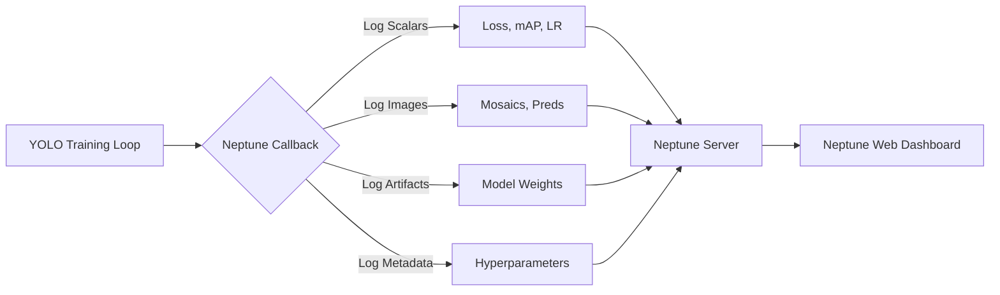

!!! warning "Neptune acquisition and SaaS deprecation"

    Neptune has entered into an agreement to be acquired by OpenAI and will wind down its hosted (SaaS) service after a transition period ending March 4, 2026. Review the [official announcement](https://neptune.ai/blog/we-are-joining-openai) and plan migrations or exports accordingly.

# Experiment Tracking with Neptune

[Neptune](https://neptune.ai/) is a metadata store for MLOps, built for teams that run a lot of experiments. It gives you a single place to log, store, display, organize, compare, and query all your model building metadata.

Ultralytics YOLO26 integrates with Neptune to streamline [experiment tracking](https://www.ultralytics.com/glossary/experiment-tracking). This integration allows you to automatically log training metrics, visualize model predictions, and store model artifacts without writing custom logging code.

<p align="center">
  
</p>

## Key Features

- **Automated Logging**: Automatically log key training metrics such as box loss, classification loss, and [mAP](https://www.ultralytics.com/glossary/mean-average-precision-map).
- **Image Visualization**: View training mosaics and validation predictions directly in the Neptune dashboard.
- **Model Checkpointing**: Upload and version control your trained model weights (`best.pt`) automatically at the end of training.
- **Hyperparameter Tracking**: Log all configuration parameters to ensure full reproducibility of your experiments.
- **Interactive Plots**: Visualize confusion matrices and precision-recall curves to analyze model performance.

## Installation

To use Neptune with Ultralytics, you will need to install the `neptune` client package along with `ultralytics`.

!!! tip "Installation"

    === "CLI"

        ```bash
        # Install the required packages
        pip install ultralytics neptune

        # Enable Neptune integration in Ultralytics settings
        yolo settings neptune=True
        ```

## Configuration

Before you start training, you need to connect your local environment to your Neptune project. You will need your **API Token** and **Project Name** from your Neptune dashboard.

### 1. Get Your Credentials

1. Log in to [Neptune.ai](https://neptune.ai/).
2. Create a new project (or select an existing one).
3. Go to your user menu and get your **API Token**.

### 2. Set Environment Variables

The securest way to handle credentials is via environment variables. Note that the Ultralytics Neptune callback reads the YOLO `project` argument and does not use `NEPTUNE_PROJECT`. Pass the full Neptune slug (e.g., `workspace/name`) via `project=` in your training command; otherwise Neptune will try to use the literal default `"Ultralytics"` and the run will fail.

=== "Bash (Linux/Mac)"

    ```bash
    export NEPTUNE_API_TOKEN="your_long_api_token_here" # required
    ```

=== "PowerShell (Windows)"

    ```powershell
    $Env:NEPTUNE_API_TOKEN = "your_long_api_token_here"  # required
    ```

=== "Python"

    ```python
    import os

    os.environ["NEPTUNE_API_TOKEN"] = "your_long_api_token_here"
    os.environ["NEPTUNE_PROJECT"] = "your_workspace/your_project"
    ```

## Usage

Once configured, you can start training your YOLO26 models. The Neptune integration works automatically when the `neptune` package is installed and the integration is enabled in settings.

### Training Example

!!! example "Train YOLO26 with Neptune Logging"

    === "Python"

        ```python
        from ultralytics import YOLO

        # Load a model
        model = YOLO("yolo26n.pt")

        # Train the model
        # Pass the Neptune project slug as the 'project' argument (workspace/name)
        results = model.train(data="coco8.yaml", epochs=10, project="my-workspace/my-project", name="experiment-1")
        ```

    === "CLI"

        ```bash
        # Train via CLI
        # project must be the Neptune slug (workspace/name); otherwise run creation will fail
        yolo train data=coco8.yaml epochs=10 project=my-workspace/my-project name=experiment-1
        ```

## Understanding the Integration

The following diagram illustrates how the Ultralytics Training pipeline interacts with Neptune to log various artifacts and metrics.



### What is Logged?

When you run the training command, the Neptune integration automatically captures the following data structure in your run:

1. **Configuration/Hyperparameters**: All training arguments (epochs, lr0, optimizer, etc.) are logged under the Configuration section.
2. **Configuration/Model**: The model architecture and definition.
3. **Metrics**:
    - **Train**: `box_loss`, `cls_loss`, `dfl_loss`, `lr` (learning rate).
    - **Metrics**: `precision`, `recall`, `mAP50`, `mAP50-95`.
4. **Images**:
    - `Mosaic`: Training batches showing data augmentation.
    - `Validation`: Ground truth labels and model predictions on validation data.
    - `Plots`: Confusion matrices, Precision-Recall curves.
5. **Weights**: The final trained model (`best.pt`) is uploaded to the `weights` folder in the Neptune run.

## Advanced Usage

### Organizing Runs

You can use the standard Ultralytics `project` and `name` arguments to organize your runs in Neptune.

- `project`: Must be the Neptune project slug `workspace/name`; this is what the callback passes to `neptune.init_run`.
- `name`: Acts as the identifier for the specific run.

### Custom Logging

If you need to log additional custom metrics alongside the automatic logging, you can access the Neptune run instance. Note that you will need to modify the trainer logic or create a custom callback to access the specific run object, as the Ultralytics integration handles the run lifecycle internally.

## FAQ

### How do I disable Neptune logging?

If you have installed `neptune` but wish to disable logging for a specific session or globally, you can modify the YOLO settings.

```bash
# Disable Neptune integration
yolo settings neptune=False
```

### My images are not uploading. What's wrong?

Ensure that your network allows connections to Neptune's servers. Additionally, image logging usually occurs at specific intervals (e.g., end of epochs or end of training). If you interrupt training early using `Ctrl+C`, some final artifacts like confusion matrices or the best model weights might not be uploaded.

### Can I log to a specific Neptune run ID?

The current integration automatically creates a new run for each training session. To resume logging to an existing run, you would typically need to handle the Neptune initialization manually in Python code, which falls outside the scope of the automatic integration. However, Ultralytics supports resuming training locally, which will create a new run in Neptune to track the resumed epochs.

### Where can I find the model weights in Neptune?

In your Neptune dashboard, navigate to the **Artifacts** or **All Metadata** section. You will find a `weights` folder containing your `best.pt` file, which you can download for deployment.
