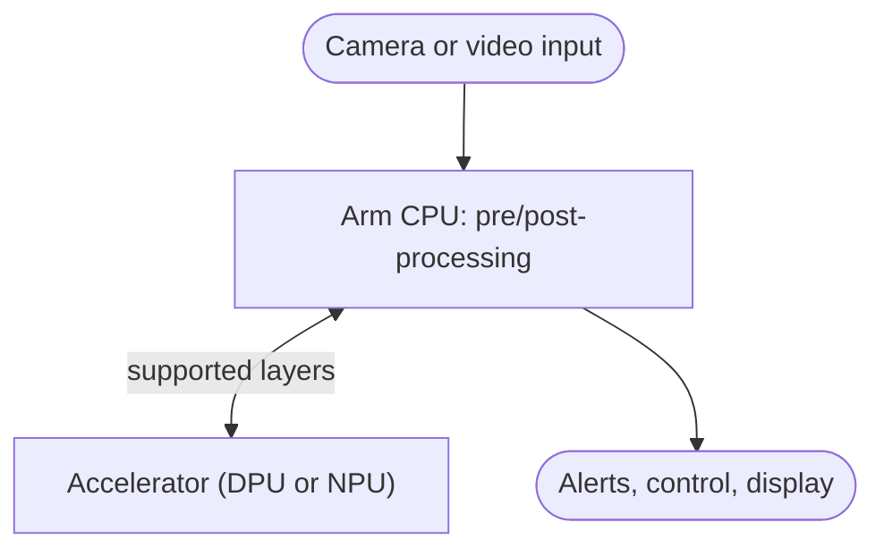
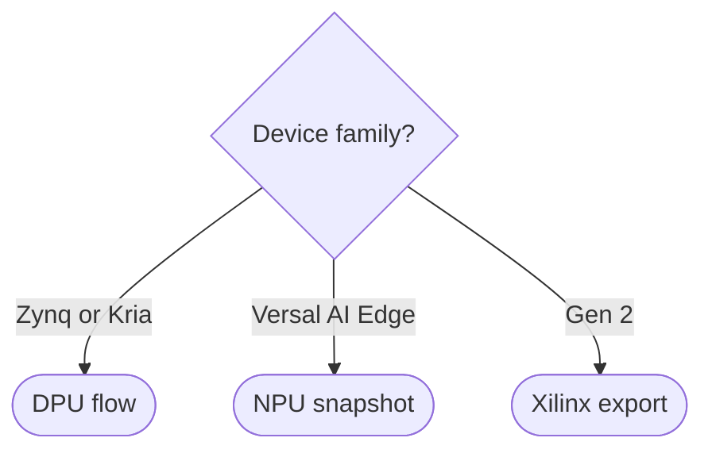
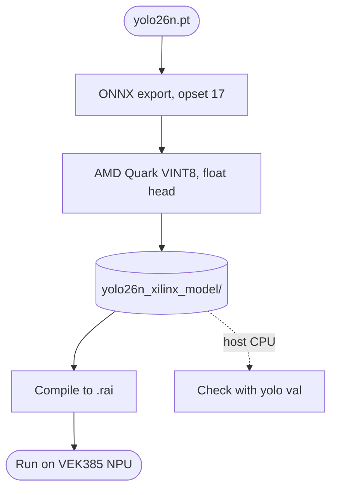
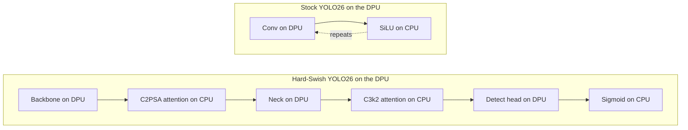

# AMD Xilinx Export for Ultralytics YOLO with Vitis AI

Exporting [Ultralytics YOLO26](../models/yolo26.md) models with `format="xilinx"` quantizes them with [AMD Quark](https://quark.docs.amd.com/latest/) for the NPU in AMD Versal AI Edge Series Gen 2 adaptive SoCs, ready for AMD's [Vitis AI](https://www.amd.com/en/products/software/vitis-ai.html) compiler to build a `.rai` model. The same export validates INT8 accuracy on any host before you deploy.

!!! note "Supported AMD devices"

    The export targets the actively maintained Vitis AI NPU flow for Versal AI Edge Series Gen 2 devices such as the VEK385 evaluation kit. Zynq UltraScale+ and Kria DPUs and the first-generation Versal AI Edge NPU (VEK280) use other Vitis AI flows, described in [Deploying on Other AMD Xilinx Targets](#deploying-on-other-amd-xilinx-targets).

AMD Xilinx devices power many of the world's industrial cameras, automotive vision systems, robots, drones and medical imaging products. They combine Arm processors with programmable logic and, on newer devices, dedicated AI Engines, so a single chip can capture video, preprocess it, run [object detection](https://www.ultralytics.com/glossary/object-detection) and act on the result with low, predictable [inference latency](https://www.ultralytics.com/glossary/inference-latency).

This guide covers the AMD Xilinx export, how to compile and run it on a Versal board, what each AMD Xilinx device family is, how AI runs on them, and which [Ultralytics YOLO](../models/index.md) operators each accelerator supports.

## What is AMD Xilinx?

Xilinx invented the field-programmable gate array (FPGA) in the 1980s and became a leading supplier of [adaptive SoCs and FPGAs](https://www.amd.com/en/products/adaptive-socs-and-fpgas.html). [AMD completed its acquisition of Xilinx in February 2022](https://www.amd.com/en/newsroom/press-releases/2022-2-14-amd-completes-acquisition-of-xilinx.html), and the product lines are now sold under the AMD brand as AMD Zynq, AMD Kria, AMD Versal and AMD Vitis.

!!! tip "Xilinx or AMD?"

    Both names refer to the same products. AMD markets them as "adaptive SoCs and FPGAs", but engineers still widely say "Xilinx". Part numbers keep the `XC` prefix (for example `xczu7ev`), and the older Vitis AI repository and Docker images still live under the `Xilinx` name on GitHub and Docker Hub. This guide uses "AMD Xilinx" so you can find it with either name.

## Key Terms and Concepts

AMD Xilinx deployment uses its own vocabulary. The table below explains every term used in this guide.

| Term                                  | What it means                                                                                                                                                                                                                                                                                                                                                            |
| :------------------------------------ | :----------------------------------------------------------------------------------------------------------------------------------------------------------------------------------------------------------------------------------------------------------------------------------------------------------------------------------------------------------------------- |
| **FPGA**                              | Field-programmable gate array: a chip whose digital logic is configured after manufacturing by loading a design, called a bitstream. It can implement custom hardware such as video pipelines or neural network accelerators.                                                                                                                                            |
| **Programmable logic (PL)**           | The FPGA fabric inside an AMD Xilinx SoC. On Zynq and Kria devices, the AI accelerator is built in the PL.                                                                                                                                                                                                                                                               |
| **Processing system (PS)**            | The hard Arm CPU cores, memory controllers and peripherals of the SoC. It runs Linux, your application, and any model layers the accelerator cannot execute.                                                                                                                                                                                                             |
| **Adaptive SoC / MPSoC**              | A system-on-chip that combines a processing system with programmable logic, plus AI Engines on many Versal devices. MPSoC stands for multiprocessor system-on-chip.                                                                                                                                                                                                      |
| **AI Engine (AIE, AIE-ML, AIE-MLv2)** | Arrays of hardened vector processors on many Versal devices, including the Versal AI Edge series covered here, designed for machine learning and signal processing.                                                                                                                                                                                                      |
| **DPU**                               | Deep Learning Processing Unit: AMD's INT8 neural network accelerator, delivered as IP that is built into the PL (for example `DPUCZDX8G` on Zynq UltraScale+ and Kria). Sizes such as B512 to B4096 give the peak operations per clock cycle.                                                                                                                            |
| **NPU / NPU IP**                      | Neural Processing Unit: AMD's current-generation inference accelerator, which replaces the DPU in recent Vitis AI releases. AMD describes its NPU IP as a soft accelerator that combines AI Engines with programmable logic, so it also needs a matching hardware design. See the [NPU glossary entry](https://www.ultralytics.com/glossary/neural-processing-unit-npu). |
| **Vitis AI**                          | AMD's toolchain for deploying neural networks on AMD Xilinx devices. It covers quantization, compilation, runtimes, examples and Docker environments.                                                                                                                                                                                                                    |
| **AMD Quark**                         | AMD's current [model quantization](https://www.ultralytics.com/glossary/model-quantization) library, used by the Versal AI Edge Gen 2 flow to turn an FP32 ONNX model into an INT8 model.                                                                                                                                                                                |
| **Quantization, PTQ and QAT**         | Converting FP32 weights and activations to INT8. Post-training quantization (PTQ) uses calibration images. [Quantization-aware training (QAT)](https://www.ultralytics.com/glossary/quantization-aware-training-qat) fine-tunes the model to recover accuracy.                                                                                                           |
| **Calibration images**                | A small, representative set of images run through the model during PTQ to choose the INT8 scale for each tensor.                                                                                                                                                                                                                                                         |
| **BF16 and mixed precision**          | BFloat16 is a 16-bit floating-point format that keeps FP32's range. [Mixed precision](https://www.ultralytics.com/glossary/mixed-precision) runs most of the network in INT8 and sensitive layers in BF16.                                                                                                                                                               |
| **XIR**                               | Xilinx Intermediate Representation: the graph format the DPU compiler produces and the runtime reads.                                                                                                                                                                                                                                                                    |
| **`.xmodel`**                         | A serialized XIR graph. The quantizer writes a quantized `.xmodel`, and the DPU compiler turns it into a compiled `.xmodel` with DPU instructions, quantized weights and any CPU subgraphs. The compiled model requires the matching DPU configuration.                                                                                                                  |
| **`arch.json` / DPU fingerprint**     | The file that describes a specific DPU configuration. The DPU compiler needs it, and an `.xmodel` compiled for one fingerprint will not run on another.                                                                                                                                                                                                                  |
| **Snapshot**                          | The compiled model directory produced by the Versal AI Edge (VEK280) NPU flow. It is tied to one NPU IP variant.                                                                                                                                                                                                                                                         |
| **`.rai`**                            | The compiled model file produced by the Versal AI Edge Gen 2 NPU flow.                                                                                                                                                                                                                                                                                                   |
| **VART / VART-ML**                    | The Vitis AI Runtime libraries that load compiled models and run them on the board, with C++ and Python APIs.                                                                                                                                                                                                                                                            |
| **ONNX Runtime Vitis AI EP**          | The `VitisAIExecutionProvider` for [ONNX Runtime](https://onnxruntime.ai/), which compiles and runs ONNX models on AMD NPUs.                                                                                                                                                                                                                                             |
| **CPU fallback / graph partitioning** | When the accelerator cannot run an operator, the compiler usually splits the model into accelerator and CPU subgraphs, and every split adds a data transfer that can dominate latency. Some operators instead force the entire model onto the CPU or fail compilation.                                                                                                   |

## AMD Xilinx Device Families for Edge AI

AMD Xilinx devices for edge AI fall into three families. Zynq and Kria use the DPU in programmable logic, while the Versal AI Edge devices covered here use the NPU on their AI Engines.

| Family                                                                                                                 | What it is                                                        | Application CPU                   | AI accelerator                      | Example boards                                                                                                                                                                                                                                    |
| :--------------------------------------------------------------------------------------------------------------------- | :---------------------------------------------------------------- | :-------------------------------- | :---------------------------------- | :------------------------------------------------------------------------------------------------------------------------------------------------------------------------------------------------------------------------------------------------ |
| [Zynq UltraScale+ MPSoC](https://www.amd.com/en/products/adaptive-socs-and-fpgas/soc/zynq-ultrascale-plus-mpsoc.html)  | Arm CPUs and FPGA logic on one chip, in sizes from ZU1 to ZU19    | Dual- or quad-core Arm Cortex-A53 | DPU built in the programmable logic | [ZCU104](https://www.amd.com/en/products/adaptive-socs-and-fpgas/evaluation-boards/zcu104.html), ZCU102, custom boards                                                                                                                            |
| [Kria K26 system-on-module](https://www.amd.com/en/products/system-on-modules/kria.html)                               | Production-ready module built around a Zynq UltraScale+ MPSoC     | Quad-core Arm Cortex-A53          | DPU built in the programmable logic | [KV260 Vision AI Starter Kit](https://www.amd.com/en/products/system-on-modules/kria/k26/kv260-vision-starter-kit.html), [KR260 Robotics Starter Kit](https://www.amd.com/en/products/system-on-modules/kria/k26/kr260-robotics-starter-kit.html) |
| [Versal AI Edge Series](https://www.amd.com/en/products/adaptive-socs-and-fpgas/versal/ai-edge-series.html)            | Adaptive SoCs; AIE-ML parts such as VE2302 and VE2802 run the NPU | Dual-core Arm Cortex-A72          | NPU on AIE-ML AI Engines and PL     | [VEK280](https://www.amd.com/en/products/adaptive-socs-and-fpgas/evaluation-boards/vek280.html)                                                                                                                                                   |
| [Versal AI Edge Series Gen 2](https://www.amd.com/en/products/adaptive-socs-and-fpgas/versal/gen2/ai-edge-series.html) | Next-generation adaptive SoC with AIE-MLv2 AI Engines             | Up to eight Arm Cortex-A78AE      | NPU on AIE-MLv2 AI Engines and PL   | [VEK385](https://www.amd.com/en/products/adaptive-socs-and-fpgas/evaluation-boards/vek385.html)                                                                                                                                                   |

### Zynq UltraScale+ MPSoC

Each Zynq UltraScale+ chip pairs an Arm processing system, with dual-core (CG) or quad-core (EG and EV) Cortex-A53 cores and real-time Cortex-R5F cores, with FPGA logic. EV devices add a hardened H.264/H.265 video codec. To run neural networks, designers build a DPU into the logic next to their camera and video pipelines. On small devices the DPU competes for space with the rest of the design.

### Kria System-on-Modules

The Kria K26 module packages a Zynq UltraScale+ MPSoC, memory and power on a production-ready module, so you avoid designing the processor, memory and power subsystem yourself. The module plugs into a carrier card, either a starter-kit board or your own design. It powers the [KV260 Vision AI Starter Kit](https://www.amd.com/en/products/system-on-modules/kria/k26/kv260-vision-starter-kit.html) for smart cameras and the [KR260 Robotics Starter Kit](https://www.amd.com/en/products/system-on-modules/kria/k26/kr260-robotics-starter-kit.html) for [robotics](https://www.ultralytics.com/glossary/robotics). Because the K26 is built on Zynq UltraScale+, it uses the same DPU flow. The Kria portfolio also includes other modules, so check which processor your module uses before choosing a flow.

### Versal Adaptive SoCs

[Versal](https://www.amd.com/en/products/adaptive-socs-and-fpgas/versal.html) is AMD's adaptive SoC family. Its AI Edge and AI Core series add hardened AI Engines next to the Arm cores and programmable logic, while some other Versal series have no AI Engines. AMD's NPU IP runs on AI Engines and programmable logic together, and Vitis AI targets the AIE-ML parts of the AI Edge series, such as the VE2302 and VE2802. The **Versal AI Edge Series** (VEK280 evaluation kit) and the **Versal AI Edge Series Gen 2** (VEK385 evaluation kit) are AMD's current targets for edge AI and the focus of current Vitis AI releases.

## How AI Runs on AMD Xilinx Devices: DPU vs NPU

Most AMD Xilinx AI deployments follow the same pattern. The accelerator runs the layers it supports, the Arm CPU runs preprocessing, post-processing and any layers the accelerator cannot execute, and a runtime on the board coordinates the two.



AMD has shipped two generations of accelerator, each with its own toolchain and compiled model file. This guide follows Vitis AI 3.5 for the DPU and Vitis AI 6.3 for the NPU; check AMD's current documentation for later releases.

| Flow                           | Hardware                              | Toolchain                                                                      | Quantizer                                       | Compiled artifact | Board runtime                       | Status                                |
| :----------------------------- | :------------------------------------ | :----------------------------------------------------------------------------- | :---------------------------------------------- | :---------------- | :---------------------------------- | :------------------------------------ |
| **DPU**                        | Zynq UltraScale+, Kria                | [Vitis AI 3.5](https://xilinx.github.io/Vitis-AI/3.5/html/index.html) (Docker) | `vai_q_pytorch`                                 | `.xmodel`         | VART                                | Frozen compiler, model zoo and DPU IP |
| **NPU (Versal AI Edge)**       | VEK280 and other Versal AI Edge parts | [Vitis AI 6.3](https://vitisai.docs.amd.com/en/latest/index.html) (Docker)     | Built into the snapshot flow                    | Snapshot          | VART-ML                             | Active                                |
| **NPU (Versal AI Edge Gen 2)** | VEK385 and other Gen 2 parts          | [Vitis AI 6.3](https://vitisai.docs.amd.com/en/latest/index.html) (Docker)     | [AMD Quark](https://quark.docs.amd.com/latest/) | `.rai`            | ONNX Runtime Vitis AI EP or VART-ML | Active                                |

!!! warning "The DPU flow is frozen"

    Vitis AI 3.5 is the last release with DPU compiler and model zoo updates. Later releases in the [Xilinx/Vitis-AI](https://github.com/Xilinx/Vitis-AI) repository keep the compiler, model zoo and Zynq UltraScale+ DPU IP unchanged while updating the runtime and compatibility with newer AMD tool versions (see the [Vitis AI 5.0 release notes](https://github.com/Xilinx/Vitis-AI/releases/tag/v5.0)), and AMD's current Vitis AI documentation describes the NPU as the replacement for the deprecated DPU architecture. Existing Zynq UltraScale+ and Kria products can keep shipping on the DPU, but its operator support will not grow, so newer model architectures need the adaptations described in [YOLO Model Compatibility](#yolo-model-compatibility-and-supported-operators).

!!! info "Ryzen AI laptops use a different stack"

    AMD Ryzen AI processors in PCs also contain an NPU, but they use the separate [Ryzen AI Software](https://ryzenai.docs.amd.com/en/latest/) stack rather than the embedded Vitis AI flows in this guide. For AMD Instinct and Radeon GPUs, see the [AMD GPU integration](amd.md).

## Which Vitis AI Flow Do I Need?

Pick your flow from the device on your board:



## Export to AMD Xilinx: Converting Your YOLO Model

### Supported Tasks

AMD Xilinx export supports all seven Ultralytics tasks. Semantic segmentation and depth estimation are available only with YOLO26, the only family that ships those heads.



### Installation

AMD Xilinx export runs on Linux (x86-64 or ARM64) with Python 3.11 to 3.13, the versions [AMD Quark](https://quark.docs.amd.com/latest/install.html) supports. The first export also compiles Quark's custom operators, which needs a C++ compiler such as `g++`.

!!! tip "Installation"

    === "CLI"

        ```bash
        # Install the required package for YOLO
        pip install ultralytics
        ```

AMD Quark is installed automatically from [PyPI](https://pypi.org/project/amd-quark/) on the first export. To preinstall the export dependencies:

```bash
pip install "ultralytics[export-xilinx]"
```

For an editable repository install, replace `"ultralytics[export-xilinx]"` with `-e ".[export-base,export-xilinx]"`. To reproduce the Python 3.12 environment and smoke export used by CI, run the existing environment builder from the repository root:

```bash
ULTRALYTICS_ISOLATED_VENVS="$PWD/.venvs" python .github/scripts/create-export-env.py --env isolated-xilinx
```

### Usage

The AMD Xilinx format supports the [Export](../modes/export.md), [Predict](../modes/predict.md), and [Validate](../modes/val.md) modes. Without AMD's Vitis AI Execution Provider, predict and validate run the quantized model with ONNX Runtime on the CPU, which measures its INT8 accuracy on any host. When ONNX Runtime provides the `VitisAIExecutionProvider`, as on a Versal AI Edge Series Gen 2 board, Ultralytics selects it automatically.

!!! example "Export"

    === "Python"

        ```python
        from ultralytics import YOLO

        # Load a YOLO26 model
        model = YOLO("yolo26n.pt")

        # Export to AMD Xilinx format for the VEK385 (quantize=8 is enforced automatically)
        model.export(format="xilinx")  # creates 'yolo26n_xilinx_model/'
        ```

    === "CLI"

        ```bash
        # Export a YOLO26n PyTorch model to AMD Xilinx format
        yolo export model=yolo26n.pt format=xilinx # creates 'yolo26n_xilinx_model/'
        ```

!!! example "Predict"

    === "Python"

        ```python
        from ultralytics import YOLO

        # Load the exported AMD Xilinx model
        model = YOLO("yolo26n_xilinx_model")

        # Run inference
        results = model("https://ultralytics.com/images/bus.jpg")
        ```

    === "CLI"

        ```bash
        # Run inference with the exported AMD Xilinx model
        yolo predict model=yolo26n_xilinx_model source='https://ultralytics.com/images/bus.jpg'
        ```

!!! example "Validate"

    === "Python"

        ```python
        from ultralytics import YOLO

        # Load the exported AMD Xilinx model
        model = YOLO("yolo26n_xilinx_model")

        # Validate INT8 accuracy on the COCO8 dataset
        metrics = model.val(data="coco8.yaml")
        ```

    === "CLI"

        ```bash
        # Validate the exported AMD Xilinx model
        yolo val model=yolo26n_xilinx_model data=coco8.yaml
        ```

The `vitis`, `vitisai` and `versal` format names are aliases for `xilinx`.

### Export Arguments

| Argument   | Type             | Default           | Description                                                                                                                                                                                                             |
| :--------- | :--------------- | :---------------- | :---------------------------------------------------------------------------------------------------------------------------------------------------------------------------------------------------------------------- |
| `format`   | `str`            | `'xilinx'`        | Target format for the exported model, defining compatibility with AMD Versal AI Edge Series Gen 2 NPUs.                                                                                                                 |
| `imgsz`    | `int` or `tuple` | `640`             | Desired image size for the model input, as an integer for square images or a `(height, width)` tuple. The exported model has a fixed batch size of 1.                                                                   |
| `quantize` | `int` or `str`   | `8`/auto          | Quantization precision. `8` (Vitis AI INT8) is required and auto-enabled if not specified.                                                                                                                              |
| `data`     | `str`            | `None`            | Dataset YAML used for INT8 calibration; classification instead takes a dataset directory or a built-in dataset name. If omitted, Ultralytics uses the task's calibration dataset, such as `coco128.yaml` for detection. |
| `fraction` | `float`          | `1.0`             | Fraction of the calibration dataset to use.                                                                                                                                                                             |
| `name`     | `str`            | `'ve2-xc2ve3858'` | Vitis AI compiler device: `'ve2-xc2ve3858'` (VEK385 evaluation kit), `'ve2-xc2ve3804'`, `'ve2-xc2ve3558'`, `'ve2-xc2ve3504'`, `'ve2-xc2ve3358'` or `'ve2-xc2ve3304'`.                                                   |
| `opset`    | `int`            | `None`            | ONNX opset for the intermediate graph. Defaults to `17`, the opset AMD validates for YOLO on Vitis AI.                                                                                                                  |
| `simplify` | `bool`           | `True`            | Simplifies the intermediate ONNX graph with `onnxslim`.                                                                                                                                                                 |
| `device`   | `str`            | `None`            | Specifies the device for exporting: GPU (`device=0`) or CPU (`device=cpu`).                                                                                                                                             |

Set `nms=False` to export the [YOLO26 NMS-free head](../guides/yolo-architecture.md#yolo26-nms-free-dfl-free). Embedded NMS (`nms=True`) is not supported, because AMD lists NonMaxSuppression among the operators that can force the entire model onto the CPU.

!!! tip "Calibrate on your own data"

    INT8 accuracy depends on how well the calibration images represent the deployment scene. Pass `data=` a dataset YAML with at least 300 representative images from your own cameras; the default calibration datasets are small public samples.

For more details about the export process, visit the [Ultralytics documentation page on exporting](../modes/export.md).

### Output Structure

After a successful export, a model directory is created with the following layout:

```text
yolo26n_xilinx_model/
├── yolo26n.onnx          # AMD Quark VINT8 model with the Ultralytics metadata
└── vitisai_config.json   # Vitis AI compiler configuration for the target device
```

Compiling the model, as described below, adds a `yolo26n/` compiler cache to the same directory, containing the `yolo26n.rai` NPU model and AMD's compile reports such as `final-vaiml-pass-summary.txt`.

### How the Export Works

The export follows AMD's documented Vitis AI flow for Versal AI Edge Series Gen 2:



1. **ONNX export** at opset 17 with a static batch size of 1.
2. **AMD Quark quantization** with the `VINT8` configuration (symmetric INT8 with power-of-two scales) and the options AMD requires for NPU compilation: `Int32Bias=False`, `enable_npu_cnn=True`, `DedicatedQDQPair=True` and `QuantizeAllOpTypes=True`. Calibration uses the standard Ultralytics INT8 calibration loader, with the same letterbox, RGB and 0–1 preprocessing as inference.
3. **Mixed precision**: the model head stays in floating point, and the Vitis AI compiler runs it in BF16 on the NPU. Quantizing the head to INT8 causes most of the accuracy loss, and AMD's [YOLOv8m tutorial](https://github.com/amd/Vitis-AI/tree/release/6.3/versal_2ve/examples/tutorials/yolov8m) keeps its post-processing tail out of INT8 for the same reason.
4. **Compiler configuration**: `vitisai_config.json` selects the `VAIML` target and the device from `name`.

### Accuracy

The table compares the exported INT8 model with the FP32 ONNX model on [COCO](../datasets/detect/coco.md) val2017 (5,000 images) at 640, both run with ONNX Runtime on the host CPU. The INT8 models were calibrated on the default `coco128.yaml` dataset; calibrating on your own deployment images usually narrows the gap.

| Model                          | FP32 mAP50-95 | AMD Xilinx INT8 mAP50-95 |
| :----------------------------- | :------------ | :----------------------- |
| [YOLO26n](../models/yolo26.md) | 40.3          | 36.7                     |
| [YOLO26s](../models/yolo26.md) | 47.9          | 42.5                     |
| [YOLO11n](../models/yolo11.md) | 38.8          | 35.5                     |

These host results run the quantized model with ONNX Runtime on the CPU, the baseline AMD's [accuracy methodology](https://vitisai.docs.amd.com/projects/gen2/en/latest/docs/model_compilation/accuracy_methodology.html) compares NPU results against. AMD's published YOLOv8m results on the VEK385 show the same mixed-precision approach on the NPU:

| YOLOv8m configuration      | Hardware   | mAP50-95 (COCO) |
| :------------------------- | :--------- | :-------------- |
| FP32 ONNX                  | Host CPU   | 49.95           |
| BF16                       | VEK385 NPU | 50.29           |
| VINT8 quantized, FP32 tail | Host CPU   | 48.75           |
| VINT8 with BF16 tail       | VEK385 NPU | 48.38           |

Source: AMD [YOLOv8m tutorial for Versal AI Edge Gen 2](https://github.com/amd/Vitis-AI/tree/release/6.3/versal_2ve/examples/tutorials/yolov8m), which also reports a 10.69 ms average inference time over 100 VART runs at `dp_size=1`.

## Compile and Run on Versal AI Edge Gen 2

The exported directory is ready for AMD's Vitis AI compiler, which builds the `.rai` model that runs on the NPU.

1. **Prepare the host and board.** Compile on an x86-64 Linux host with AMD's [Vitis AI 6.3 Docker image for Versal AI Edge Gen 2](https://vitisai.docs.amd.com/projects/gen2/en/latest/docs/setup_and_installation/docker-setup.html) and an AMD AI Engine compiler license (see [AMD's licensing page](https://vitisai.docs.amd.com/projects/gen2/en/latest/docs/additional_information/license.html)). Set up the VEK385 with AMD's [board setup guide](https://vitisai.docs.amd.com/projects/gen2/en/latest/docs/setup_and_installation/board_setup.html).
2. **Compile.** Inside the container, create an ONNX Runtime session with the Vitis AI Execution Provider, the same call AMD's [compilation guide](https://vitisai.docs.amd.com/projects/gen2/en/latest/docs/model_compilation/compiling.html) uses. It writes the `yolo26n/` cache with `yolo26n.rai` into the export directory:

    ```python
    import onnxruntime as ort

    d = "yolo26n_xilinx_model"
    options = {"config_file": f"{d}/vitisai_config.json", "cache_dir": d, "cache_key": "yolo26n", "target": "VAIML"}
    ort.InferenceSession(f"{d}/yolo26n.onnx", providers=["VitisAIExecutionProvider"], provider_options=[options])
    ```

    Check `yolo26n_xilinx_model/yolo26n/final-vaiml-pass-summary.txt` for how much of the model runs on the NPU. For YOLO26n at 640, AMD's Vitis AI 6.3 compiler places 99.9% of the operators and of the compute on the VEK385 NPU in a single partition.

3. **Run on the board.** Copy the export directory to the VEK385. ONNX Runtime with the Vitis AI Execution Provider loads the compiled `yolo26n.rai` and runs it on the NPU, and `YOLO("yolo26n_xilinx_model")` selects this provider automatically when it is available.

Compilation needs only AMD's ONNX Runtime, so export on any Linux machine and copy the directory into the container rather than installing Ultralytics there, which can change the container's pinned packages. Where Ultralytics is installed alongside AMD's `onnxruntime-vitisai` build, as on the board, it keeps that build instead of replacing it with stock `onnxruntime`.

!!! note "ONNX Runtime and VART-ML"

    The export configures standard compilation for ONNX Runtime, which runs any NPU-incompatible operators, such as YOLO26's top-k selection with `nms=False`, on the Arm CPU itself. AMD's VART-ML runtime runs a model only when every operator is on the NPU, unless you add AMD's [CPU partition passes](https://vitisai.docs.amd.com/projects/gen2/en/latest/docs/model_compilation/cpu_partition.html) to `vitisai_config.json`; those artifacts cannot run through ONNX Runtime.

## YOLO Model Compatibility and Supported Operators

An accelerator only speeds up the operators it implements in hardware. When a model contains an unsupported operator, the compiler usually sends that part of the network to the Arm CPU, and each round trip between the accelerator and the CPU adds latency. Some operators cannot be partitioned: on the Versal AI Edge Gen 2 NPU, AMD lists operators such as NonZero and NonMaxSuppression that can force the entire model onto the CPU. Operator support is the most important factor in how well a YOLO model performs on AMD Xilinx hardware.



The table shows where each operator in a YOLO26 model runs. A stock YOLO26n ONNX export contains 87 [SiLU](https://www.ultralytics.com/glossary/silu-sigmoid-linear-unit) activations, each exported as a Sigmoid and a Mul, plus 4 MatMul and 2 [Softmax](https://www.ultralytics.com/glossary/softmax) operators from its two attention blocks: the [C2PSA](../guides/yolo-architecture.md#spatial-attention-c2psa-yolo11) block at the end of the backbone (layer 10) and the attention-enabled `C3k2` block that produces the P5 output (layer 22).

| Operator                           | Where it appears in YOLO                   | DPU (Zynq UltraScale+, Kria)                     | NPU (Versal AI Edge Gen 2)       |
| :--------------------------------- | :----------------------------------------- | :----------------------------------------------- | :------------------------------- |
| Convolution + batch normalization  | Every `Conv` block                         | ✅                                               | ✅                               |
| SiLU activation                    | Every `Conv` block (default activation)    | ❌ Runs on CPU; replace with Hard-Swish          | ✅                               |
| Hard-Swish, ReLU, ReLU6, LeakyReLU | Optional activations set in the model YAML | ✅ Fused into the convolution                    | ✅                               |
| Sigmoid                            | Class scores in the detection head         | ❌ Runs on CPU (usually part of post-processing) | ✅                               |
| MatMul between two activations     | Attention blocks (C2PSA; YOLO26 `C3k2`)    | ❌ Runs on CPU                                   | ✅                               |
| Softmax                            | Attention blocks; DFL in YOLOv8 and YOLO11 | ❌ Runs on CPU                                   | ✅                               |
| Reshape, Transpose                 | Attention blocks                           | ⚠️ Fused when possible, otherwise CPU            | ✅                               |
| Split, Slice                       | `C3k2` and `C2f` blocks                    | ⚠️ Converted to slices; check compiler report    | ✅                               |
| Resize (nearest upsample)          | Neck upsampling                            | ✅                                               | ✅                               |
| MaxPool, Concat, Add               | `SPPF` block and feature fusion            | ✅                                               | ✅                               |
| TopK, GatherElements               | YOLO26 NMS-free head (`nms=False`)         | ❌ Runs on CPU                                   | ⚠️ CPU partition on the Arm host |
| NonMaxSuppression                  | Only when exported with `nms=True`         | ❌ Runs on CPU                                   | ❌ Can force the model onto CPU  |

Sources: AMD [UG1414 supported operators](https://docs.amd.com/r/en-US/ug1414-vitis-ai/Currently-Supported-Operators), [PyTorch operator support](https://docs.amd.com/r/en-US/ug1414-vitis-ai/Operators-Supported-by-PyTorch), and the Versal AI Edge Gen 2 [supported](https://vitisai.docs.amd.com/projects/gen2/en/latest/docs/additional_information/ops_support.html), [CPU partition](https://vitisai.docs.amd.com/projects/gen2/en/latest/docs/additional_information/ops_flexml.html) and [unsupported](https://vitisai.docs.amd.com/projects/gen2/en/latest/docs/additional_information/ops_unsupported.html) operator lists. Support also depends on your DPU configuration and graph patterns, so always check the compiler's partition report.

!!! tip "YOLO26 head: no DFL and an optional NMS-free output"

    [YOLO26](../models/yolo26.md) removes Distribution Focal Loss (DFL), so unlike [YOLO11](../models/yolo11.md) and [YOLOv8](../models/yolov8.md) its box outputs need no softmax decoding. It also adds a second attention block compared with YOLO11, so compare target-specific compiler reports and on-device benchmarks before choosing a model. Exports with `nms` unset keep the one-to-many head and need NMS on the CPU like other YOLO models. Export with `nms=False` to use YOLO26's [NMS-free one-to-one head](../guides/yolo-architecture.md#yolo26-nms-free-dfl-free) instead, which replaces NMS with a lightweight top-k selection that runs on the CPU.

### Make YOLO26 DPU-Ready with Hard-Swish

The DPU fuses only ReLU, ReLU6, LeakyReLU, Hard-Swish and Hard-Sigmoid into its convolutions. Hard-Swish is a hardware-friendly approximation of SiLU, which makes it the natural replacement. Ultralytics model YAML files accept an `activation` key that changes the default activation of `Conv` blocks ([Model YAML Configuration Guide](../guides/model-yaml-config.md)).

Copy [`yolo26.yaml`](https://github.com/ultralytics/ultralytics/blob/main/ultralytics/cfg/models/26/yolo26.yaml) to `yolo26-hswish.yaml` and add one line under the parameters:

```yaml
# Parameters
nc: 80 # number of classes
activation: nn.Hardswish() # default Conv activation, DPU-native
end2end: True # whether to use end-to-end mode
```

Then build the model, transfer the pretrained YOLO26 weights and [fine-tune](../guides/finetuning-guide.md) on your dataset:

!!! example "Fine-tune a Hard-Swish YOLO26 model"

    === "Python"

        ```python
        from ultralytics import YOLO

        # Build YOLO26n with Hard-Swish activations; the 'n' in the name selects the nano scale
        model = YOLO("yolo26n-hswish.yaml").load("yolo26n.pt")  # transfer pretrained weights

        # Fine-tune so the network adapts to Hard-Swish
        model.train(data="coco8.yaml", epochs=100, imgsz=640)
        ```

    === "CLI"

        ```bash
        # Build from the Hard-Swish YAML, load pretrained weights and fine-tune
        yolo train model=yolo26n-hswish.yaml pretrained=yolo26n.pt data=coco8.yaml epochs=100 imgsz=640
        ```

Activations have no weights, so all of the pretrained weights transfer. The exported ONNX graph then contains 87 HardSwish operators and no SiLU. Replace `coco8.yaml` with your own [dataset](../datasets/index.md), and compare accuracy against the SiLU model with [Val mode](../modes/val.md) before deployment.

!!! note "Alternatives to retraining"

    - **Swap at quantization time**: set `"convert_silu_to_hswish": true` in the Vitis AI 3.5 PyTorch quantizer's JSON configuration to replace SiLU during quantization. It saves a training run but usually costs more accuracy, which AMD's fast fine-tuning or QAT can partly recover. See the [vai_q_pytorch configuration guide](https://github.com/Xilinx/Vitis-AI/blob/v3.5/src/vai_quantizer/vai_q_pytorch/doc/Quant_Config.md).
    - **LeakyReLU**: the DPU implements LeakyReLU with a fixed negative slope of 26/256 (about 0.1). If you use LeakyReLU, train with `activation: nn.LeakyReLU(0.1015625)` so the trained and deployed slopes match.

### Handling Attention Blocks on the DPU

YOLO26 applies [attention](https://www.ultralytics.com/glossary/attention-mechanism) at the lowest resolution (a 20×20 grid at 640 input) in two places: the [C2PSA](../guides/yolo-architecture.md#spatial-attention-c2psa-yolo11) block at layer 10 and the attention-enabled `C3k2` block at layer 22. YOLO11 has one C2PSA block. On a DPU their MatMul and Softmax operators run on the CPU, which splits the model into alternating DPU and CPU subgraphs. You have three options:

1. **Accept the CPU blocks.** The compiled `.xmodel` then contains CPU subgraphs, so run it with AMD's [Graph Runner](https://docs.amd.com/r/en-US/ug1354-xilinx-ai-sdk/Developing-with-Vitis-AI-API_3-Graph-Runner), which executes DPU and CPU subgraphs together when a CPU implementation exists for every operator; otherwise you must implement and register the missing operators. At 20×20 the attention computation is small, but each extra transfer between the DPU and the CPU adds latency, so measure it on your board.
2. **Use an attention-free YAML.** In your Hard-Swish YAML, replace the C2PSA layer with `nn.Identity` so the layer indices used by `Concat` and `Detect` stay valid, and disable attention in layer 22:

    ```yaml
    backbone:
        # ... layers 0-9 unchanged
        - [-1, 1, nn.Identity, []] # 10 C2PSA removed; keeps later layer indices valid

    head:
        # ... layers 11-21 unchanged
        - [-1, 1, C3k2, [1024, True, 0.5, False]] # 22 (P5/32-large), attention disabled
        - [[16, 19, 22], 1, Detect, [nc]] # Detect(P3, P4, P5)
    ```

    The exported ONNX graph then contains no MatMul or Softmax operators. The attention weights no longer apply (624 of 666 YOLO26n weights transfer), so fine-tune longer and compare accuracy with [Val mode](../modes/val.md).

3. **Use an attention-free model** such as [YOLOv8](../models/yolov8.md), which AMD has used in its own DPU examples.

On Versal AI Edge Gen 2, attention operators are listed as NPU-supported, so these changes are usually unnecessary. Confirm placement in the compiler report, because AMD notes that supported operators can still fall back to the CPU because of configuration or memory constraints.

### Model Compatibility at a Glance

| Model                         | DPU (Zynq UltraScale+, Kria)                                             | NPU (Versal AI Edge Gen 2)                                                                                                                                                                            |
| :---------------------------- | :----------------------------------------------------------------------- | :---------------------------------------------------------------------------------------------------------------------------------------------------------------------------------------------------- |
| [YOLO26](../models/yolo26.md) | Train with Hard-Swish; two attention blocks become CPU subgraphs; no DFL | Native `format="xilinx"` export; head runs in BF16                                                                                                                                                    |
| [YOLO11](../models/yolo11.md) | Train with Hard-Swish; C2PSA and DFL softmax run on CPU                  | Native `format="xilinx"` export; head runs in BF16                                                                                                                                                    |
| [YOLOv8](../models/yolov8.md) | Train with Hard-Swish; DFL softmax runs on CPU                           | Native `format="xilinx"` export. AMD's YOLOv8m tutorial (Vitis AI 6.3, VEK385, INT8 with BF16 tail): compiler report shows 1,181 operators (99.915%) and 99.994% of GOPs on the NPU, no model changes |

## Deploying on Other AMD Xilinx Targets

Zynq UltraScale+ and Kria DPUs and the first-generation Versal AI Edge NPU use Vitis AI flows that `format="xilinx"` does not produce. Train with Ultralytics, then build the target's artifact with AMD's tools in their x86-64 Linux Docker images. Choose the tab for your device:

=== "Versal AI Edge (VEK280)"

    1. Start AMD's Vitis AI 6.3 Docker image for Versal AI Edge.
    2. **Activate the NPU environment** for the NPU IP on your board by sourcing `settings.sh`. Pass your board's NPU IP name as an argument, or `LIST` to see the available IPs.
    3. **Capture a snapshot** by running an ordinary inference script on representative images with the `VAISW_SNAPSHOT_DIRECTORY` environment variable set. No code changes are needed:

        ```bash
        # Activate the NPU environment inside the Vitis AI Docker container
        source $VITIS_AI_REPO/npu_ip/settings.sh

        # Capture a mixed INT8/BF16 snapshot, calibrating on 100 images from your inference script
        VAISW_SNAPSHOT_DIRECTORY=snapshot.yolo26n VAISW_FE_PRECISION=MIXED VAISW_QUANTIZATION_NBIMAGES=100 python3 my_inference.py
        ```

    `VAISW_FE_PRECISION` accepts `INT8` (default), `BF16` or `MIXED`, and `VAISW_QUANTIZATION_NBIMAGES` defaults to 4 images, so set a larger, representative number for detection models. The snapshot is tied to the NPU IP variant on your board. YOLO post-processing tails run on the AI Engines only in BF16 or MIXED precision. AMD's documentation differs on Softmax: its samples page says Softmax is not accelerated and maps YOLOv8's Softmax tail to the CPU, while the Vitis AI 6.1 [release notes](https://vitisai.docs.amd.com/projects/gen1/en/latest/docs/release_notes/release_notes.html) report full YOLOv8 acceleration with mixed precision. Inspect the `wrp_network_iriz.onnx` file inside the snapshot to confirm which parts of your model, including YOLO11 and YOLO26 attention, run on the NPU. See [bring your own model](https://vitisai.docs.amd.com/projects/gen1/en/latest/docs/customization_opportunities/byom.html).

=== "Zynq UltraScale+ and Kria (DPU)"

    1. Start the [Vitis AI 3.5](https://xilinx.github.io/Vitis-AI/3.5/html/index.html) Docker image. Its PyTorch environment uses Python 3.8, which Ultralytics supports.
    2. **Train with DPU-native activations** as described in [Make YOLO26 DPU-Ready with Hard-Swish](#make-yolo26-dpu-ready-with-hard-swish).
    3. **Quantize** the PyTorch model with [vai_q_pytorch](https://github.com/Xilinx/Vitis-AI/blob/v3.5/src/vai_quantizer/vai_q_pytorch/README.md): calibrate on representative images, test the quantized accuracy on the host, then export a quantized `.xmodel` with batch size 1.
    4. **Compile** for your DPU with `vai_c_xir` and the `arch.json` that matches your board's DPU configuration:

        ```bash
        vai_c_xir -x quantized/Model_int.xmodel -a arch.json -o compiled -n yolo26n
        ```

    The compiled `.xmodel` lists which subgraphs run on the DPU and which run on the CPU. See AMD's [model development workflow](https://xilinx.github.io/Vitis-AI/3.5/html/docs/workflow-model-development.html).

Prepare the board with a hardware design and Linux image that contain the accelerator configuration you compiled for, plus the matching Vitis AI runtime. See AMD's setup guides for [Zynq UltraScale+ and Kria DPU targets](https://xilinx.github.io/Vitis-AI/3.5/html/docs/workflow-model-deployment.html) and [Versal AI Edge (VEK280)](https://vitisai.docs.amd.com/projects/gen1/en/latest/docs/quickstart/hardware.html), then copy the artifacts your runtime needs:

| Flow                         | Artifacts to copy to the board | Board runtime                        |
| :--------------------------- | :----------------------------- | :----------------------------------- |
| DPU (Zynq UltraScale+, Kria) | Compiled `.xmodel`             | VART; Graph Runner for CPU subgraphs |
| NPU (Versal AI Edge, VEK280) | Snapshot directory             | VART-ML                              |

On the DPU, VART buffers hold fixed-point INT8 values: query each tensor's shape and `fix_point` scale, quantize inputs and dequantize outputs before post-processing. The Graph Runner returns the full graph's outputs, while a DPU-only runner returns intermediate DPU subgraph outputs that your code must finish computing. VART-ML on the VEK280 defaults to hardware tensor views whose shape, data type and memory layout can differ from the ONNX layouts, so configure the runner's input and output tensor types as CPU views or convert the hardware format yourself (see AMD's [VART-ML architecture overview](https://vitisai.docs.amd.com/projects/gen2/en/latest/docs/appendix/ml-architecture-overview.html)).

!!! question "Licensing for commercial products"

    Shipping Ultralytics YOLO inside a commercial AMD Xilinx product requires either compliance with the [AGPL-3.0 license](https://www.ultralytics.com/legal/agpl-3-0-software-license) or an [Ultralytics Enterprise License](https://www.ultralytics.com/license).

## Real-World Applications

AMD Xilinx devices are common wherever vision AI must run in real time, at low power, close to the sensor:

- **Industrial and construction safety**: Detect people and machines around heavy equipment, and monitor work zones with [object detection](../tasks/detect.md) and [object counting](../guides/object-counting.md).
- **Automotive and off-highway vision**: Run camera-based perception on qualified automotive-grade parts, supporting [autonomous vehicles](https://www.ultralytics.com/glossary/autonomous-vehicles) and driver assistance.
- **Smart cameras and video analytics**: Combine video capture, encoding and YOLO inference on one chip for [security systems](../guides/security-alarm-system.md) and [video analytics](../guides/analytics.md).
- **Machine vision and quality inspection**: Pair FPGA-based high-speed image capture with YOLO [instance segmentation](../tasks/segment.md) or [classification](../tasks/classify.md) for inline defect detection.
- **Robotics and drones**: Use Kria KR260 or Versal modules for [pose estimation](../tasks/pose.md), [oriented object detection](../tasks/obb.md) and navigation with deterministic latency.

## Summary

Exporting with `format="xilinx"` quantizes Ultralytics YOLO models with AMD Quark for Versal AI Edge Series Gen 2 NPUs, keeps the head in BF16, and writes the Vitis AI compiler configuration beside the model. Validate the INT8 accuracy on any host, compile the `.rai` model in AMD's Vitis AI Docker image, and run it on the board with ONNX Runtime and the Vitis AI Execution Provider.

Older AMD Xilinx devices use other flows. The DPU on Zynq UltraScale+ and Kria uses the frozen Vitis AI 3.5 toolchain and `.xmodel` files, needs DPU-native activations such as Hard-Swish, and runs attention on the CPU. The first-generation Versal AI Edge NPU uses the snapshot flow, with operator coverage that depends on the Vitis AI version and precision.

For other deployment targets, see the [model deployment options guide](../guides/model-deployment-options.md), [deployment best practices](../guides/model-deployment-practices.md), and accelerator integrations such as [Hailo](hailo.md), [Rockchip RKNN](rockchip-rknn.md) and [Axelera](axelera.md).

## FAQ

### Is Xilinx part of AMD?

Yes. AMD completed its acquisition of Xilinx in February 2022, and Xilinx products are now sold as AMD adaptive SoCs and FPGAs: AMD Zynq, AMD Kria, AMD Versal and AMD Vitis. Engineers still widely use the Xilinx name, and part numbers keep the `XC` prefix.

### Can I export a YOLO model directly to AMD Xilinx with `model.export()`?

Yes. `model.export(format="xilinx")` quantizes the model with AMD Quark for Versal AI Edge Series Gen 2 NPUs and writes a directory with the quantized ONNX model and its Vitis AI compiler configuration. Compile it to `.rai` with AMD's Vitis AI tools as shown in [Compile and Run on Versal AI Edge Gen 2](#compile-and-run-on-versal-ai-edge-gen-2). Zynq UltraScale+, Kria and VEK280 targets use the flows in [Deploying on Other AMD Xilinx Targets](#deploying-on-other-amd-xilinx-targets).

### What is the difference between a DPU and an NPU on AMD devices?

The DPU (Deep Learning Processing Unit) is AMD's earlier INT8 accelerator. It is built in the programmable logic of Zynq UltraScale+ and Kria devices, compiled with Vitis AI 3.5, and produces `.xmodel` files. The NPU is its replacement in current Vitis AI releases. On Versal AI Edge devices it combines hardened AI Engines with programmable logic, supports INT8, BF16 and mixed precision, and supports more operators, including SiLU and, on Versal AI Edge Gen 2, attention.

### What is an `.xmodel` file?

An `.xmodel` is a serialized XIR graph used by the AMD DPU toolchain. The quantizer writes a quantized `.xmodel`, and the `vai_c_xir` compiler turns it into a compiled `.xmodel` that contains the DPU instruction stream, quantized INT8 weights and any subgraphs that must run on the CPU. The compiled file targets one specific DPU configuration, described by an `arch.json` fingerprint, and runs on the board through the Vitis AI Runtime (VART), or through the [Graph Runner](https://docs.amd.com/r/en-US/ug1354-xilinx-ai-sdk/Developing-with-Vitis-AI-API_3-Graph-Runner) when it contains CPU subgraphs.

### Does the Zynq UltraScale+ DPU support SiLU and attention?

No. The DPU accelerates only ReLU, ReLU6, LeakyReLU, Hard-Swish and Hard-Sigmoid activations, and it runs Sigmoid, Softmax and MatMul between two activations on the CPU. Train YOLO with `activation: nn.Hardswish()` in the model YAML to keep convolutions on the DPU, and see [Handling Attention Blocks on the DPU](#handling-attention-blocks-on-the-dpu) for attention options. Versal AI Edge Gen 2 NPUs support SiLU, Softmax and MatMul natively.

### How do I run YOLO on a Kria KV260?

The KV260 uses a Zynq UltraScale+ MPSoC with a DPU, so follow the DPU flow. Train a Hard-Swish YOLO26 model, quantize it with `vai_q_pytorch` in the Vitis AI 3.5 Docker image, compile it with `vai_c_xir` using the KV260's `arch.json`, and run the resulting `.xmodel` on the board with VART, or with the Graph Runner if it contains CPU subgraphs.

### Do I need an AMD board or license to export a model?

No. The export runs on any Linux host with Python 3.11 to 3.13 and needs no AMD account, and the exported model runs on the CPU for accuracy checks on any host. Compiling the `.rai` model requires AMD's Vitis AI Docker image and AI Engine compiler license, and running it on the NPU requires a Versal AI Edge Series Gen 2 board.

### Why does my exported AMD Xilinx model run on the CPU?

Ultralytics uses the Vitis AI Execution Provider only when ONNX Runtime provides it, as with AMD's `onnxruntime-vitisai` build on a Versal board or in AMD's Docker image. Elsewhere it runs the quantized model with stock ONNX Runtime on the CPU, which is how you measure INT8 accuracy before deployment.

### Which YOLO tasks can run on AMD Xilinx devices?

Any task can run if its operators compile for your accelerator. Unsupported operators usually run on the CPU, but some can force the entire model onto the CPU or fail compilation. [Object detection](../tasks/detect.md) is the most common workload and the one AMD's own examples use. For [segmentation](../tasks/segment.md), [pose](../tasks/pose.md) and other tasks, check the compiler's partition report to confirm that the heavy layers run on the accelerator.
