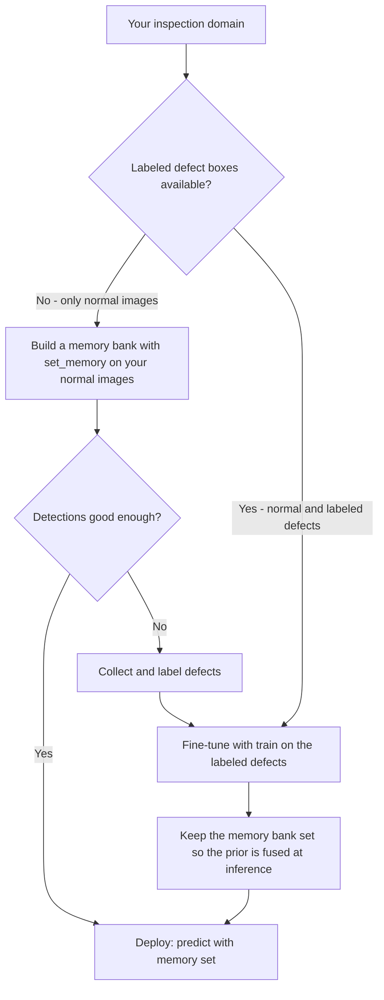

# YOLOA: YOLO Anomaly Detection

<!-- BLOCKED: hero image pending an assets AVIF once the feature is public -->

[YOLOA](https://www.ultralytics.com/glossary/anomaly-detection) is a YOLO model group (like [YOLOE](yoloe.md) and [YOLO-World](yolo-world.md)) that adds training-free anomaly detection to the standard YOLO detection architecture. After setting a memory bank on normal images alone, YOLOA fuses a heatmap prior into the detector at inference to find visual defects — scratches, dents, cracks, contamination — without labeled anomalies. Built on [YOLO26](yolo26.md), it outputs standard detection [bounding boxes](https://www.ultralytics.com/glossary/bounding-box) around anomalous regions, so the results plug into any pipeline that already consumes YOLO detections.

Unlike a regular [object detection](../tasks/detect.md) model, which requires labeled examples of every class it should find, YOLOA targets defect types you cannot enumerate in advance: it learns what _normal_ looks like and flags anything that deviates. This one-class approach fits industrial visual inspection, where normal samples are plentiful and defects are rare, diverse, and expensive to label.

!!! tip

    Import the model class with `from ultralytics import YOLOA`. YOLOA uses the standard `detect` task under the hood; model configurations use the `-anomaly` suffix, such as `yolo26n-anomaly.yaml`. The `set_memory()` step is Python-only and is not a CLI mode.

## Available Models, Supported Tasks, and Operating Modes

| Model Type | Model YAML            | Task Supported               | Inference | Validation | Training | Export |
| ---------- | --------------------- | ---------------------------- | --------- | ---------- | -------- | ------ |
| YOLOA-N    | `yolo26n-anomaly.yaml`  | [Detection](../tasks/detect.md) | ✅        | ✅         | ✅       | ✅     |
| YOLOA-S    | `yolo26s-anomaly.yaml`  | [Detection](../tasks/detect.md) | ✅        | ✅         | ✅       | ✅     |
| YOLOA-M    | `yolo26m-anomaly.yaml`  | [Detection](../tasks/detect.md) | ✅        | ✅         | ✅       | ✅     |
| YOLOA-L    | `yolo26l-anomaly.yaml`  | [Detection](../tasks/detect.md) | ✅        | ✅         | ✅       | ✅     |
| YOLOA-X    | `yolo26x-anomaly.yaml`  | [Detection](../tasks/detect.md) | ✅        | ✅         | ✅       | ✅     |

Pretrained YOLOA checkpoints and benchmark numbers have not been published yet. Build a model from the `yolo26-anomaly.yaml` configuration, which supports the standard n/s/m/l/x scales via the scale letter in the filename, for example `yolo26n-anomaly.yaml`.

<!-- BLOCKED: uncomment once published, measured numbers exist -->
<!--  -->
<!-- Params and FLOPs values are for the fused model after `model.fuse()`, which merges Conv and BatchNorm layers. -->

## Training data

The pretrained YOLOA detector is trained on an internal binary-anomaly mixture (the "v8" mixture) that merges **65 public defect sources** into a single `anomaly` class — every defect type is treated as one class, so the model learns to localize "something wrong" rather than to name a specific defect. The base mixture contains **206,014 training images and 10,846 validation images (216,860 total, ~180k annotated defect instances)**; an augmented build with zoom crops and synthetic defects (v8.2) expands the training pool to **405,851 images**.

The sources span several industrial domains, so the detector sees a wide variety of surfaces and defect appearances before any memory bank is set:

- **Electronic and industrial components** — [RealIAD](https://realiad4ad.github.io/Real-IAD/) parts (PCBs, connectors, USBs, switches, terminal blocks, buttons, plastic nuts, toys, zippers) and [VisA](https://github.com/amazon-science/spot-diff) objects (PCBs, cashews, chewing gum, candles, pipe fryum, and more).
- **Metal and steel surfaces** — [NEU-DET](http://faculty.neu.edu.cn/yunhyan/NEU_surface_defect_database.html), several metal-surface defect sets, magnetic-tile defects, and cast/case defects (scratches, pits, rolled-in scale, crazing).
- **Textures and materials** — [DAGM](https://hci.iwr.uni-heidelberg.de/content/weakly-supervised-learning-industrial-optical-inspection) synthetic textures, woven fabrics, Tianchi fabric, wall-surface defects, and crack sets.
- **Consumer goods and packaging** — GoodsAD (drink bottles and cans, food boxes and packages, cigarette boxes) and food-bottle defects.
- **Automotive** — car-scratch and car-case defects.

This breadth is what lets YOLOA act as a strong general-purpose localizer once a memory bank supplies the "normal" reference for a new part — even for categories it never saw during training (see the MVTec-AD evaluation below).

## Evaluation on MVTec-AD

We evaluate YOLOA zero-shot on [MVTec-AD](https://www.mvtec.com/research-teaching/datasets/mvtec-ad), the standard industrial anomaly-detection benchmark of **15 categories** (5 textures and 10 objects). **None of these categories appear in the training mixture above**, so this measures out-of-distribution transfer: for each category we build a memory bank from that category's own defect-free (`good`) training images with `set_memory()`, then run detection on the held-out test split and score the predicted boxes against the ground-truth defect boxes. Reported numbers are from the current YOLOA-M checkpoint.

mAP is reported at IoU 0.10, 0.25, and 0.50 (coarse defect localization matters more than tight boxes here), plus the standard COCO mAP@[.50:.95].

| Category    | mAP10  | mAP25  | mAP50  | mAP10-50 |
| ----------- | ------ | ------ | ------ | -------- |
| bottle      | 0.8295 | 0.7074 | 0.4487 | 0.6436   |
| cable       | 0.1346 | 0.0996 | 0.0877 | 0.1005   |
| capsule     | 0.4830 | 0.3964 | 0.2235 | 0.3538   |
| carpet      | 0.6820 | 0.6690 | 0.5446 | 0.6320   |
| grid        | 0.1251 | 0.0625 | 0.0195 | 0.0588   |
| hazelnut    | 0.3564 | 0.2926 | 0.2128 | 0.2772   |
| leather     | 0.5834 | 0.5631 | 0.4844 | 0.5427   |
| metal_nut   | 0.2678 | 0.2579 | 0.2443 | 0.2582   |
| pill        | 0.3451 | 0.3150 | 0.2732 | 0.3113   |
| screw       | 0.1498 | 0.1367 | 0.1270 | 0.1352   |
| tile        | 0.8326 | 0.8053 | 0.6886 | 0.7711   |
| toothbrush  | 0.1926 | 0.1100 | 0.0312 | 0.0911   |
| transistor  | 0.0657 | 0.0406 | 0.0109 | 0.0387   |
| wood        | 0.8320 | 0.7840 | 0.7005 | 0.7786   |
| zipper      | 0.1485 | 0.1300 | 0.0351 | 0.1013   |
| **AVERAGE** | **0.4019** | **0.3580** | **0.2755** | **0.3396** |

### Where YOLOA works well

YOLOA is strongest on **random-grain textures and simple rigid objects whose defects are medium-to-large and high-contrast** — stains, holes, cracks, cuts, breakage, and contamination that clearly change local appearance. The normal surface is easy for the memory bank to model, so a genuine defect stands out.

| Category | Domain | Typical defects | Fit |
| -------- | ------ | --------------- | --- |
| wood     | Texture — wood-grain panels | color stain, hole, liquid soak, scratch | Strong |
| tile     | Texture — stone / ceramic | crack, glue strip, gray stroke, oil, rough | Strong |
| carpet   | Texture — woven fabric | color, cut, hole, metal contamination, thread | Strong |
| leather  | Texture — leather grain | color, cut, fold, glue, poke | Strong |
| bottle   | Object — bottle mouth (top-down) | broken large / small, contamination | Strong |

### Where YOLOA struggles (and why)

The weaker categories share four repeatable patterns. They are not random failures — each reflects a known limit of one-class, feature-based scoring, and each is a candidate for fine-tuning on labeled defects.

| Category | Domain | Typical defects | Fit | Main difficulty |
| -------- | ------ | --------------- | --- | --------------- |
| capsule    | Object — two-tone capsule | crack, faulty imprint, poke, scratch, squeeze | Moderate | Small object; tiny pokes and thin cracks |
| pill       | Object — tablet | color, contamination, crack, faulty imprint, scratch | Moderate | Normal speckled surface masks small defects |
| metal_nut  | Object — flanged metal nut | bent, color, flip, scratch | Moderate | Reflective metal; `flip` is a pose change, not a local defect |
| hazelnut   | Object — nut (organic) | crack, cut, hole, print | Moderate | Naturally ridged/pitted shell looks like defects |
| screw      | Object — metal screw | manipulated front, scratch head/neck, thread side/top | Limited | Reflective threads; fine thread damage blends with the ridges |
| cable      | Object — cable cross-section | bent / missing wire, cable swap, cut / poke insulation | Limited | Busy normal structure; semantic swaps and missing cores |
| zipper     | Object / texture — zipper | broken / split / squeezed teeth, fabric border/interior, rough | Limited | Periodic teeth; tiny tooth defects; fabric-tape defects |
| toothbrush | Object — brush head | defective (bent / missing bristles) | Limited | Dense bristle texture; very small test set |
| grid       | Texture — wire mesh | bent, broken, glue, metal contamination, thread | Limited | Strongly periodic mesh drowns out small wire defects |
| transistor | Object — transistor on a perforated PCB | bent / cut lead, damaged case, misplaced | Limited | Tiny leads on a board busier than the defect; `cut_lead` is an absence |

The recurring failure modes:

- **Periodic or high-frequency structure** (`grid` wire mesh, `zipper` teeth, `toothbrush` bristles). The normal pattern is itself high-frequency, so a small defect no longer stands out against it.
- **Tiny sub-component defects on busy assemblies** (`transistor` leads on a perforated PCB, `cable` cores, `screw` threads). The surrounding normal structure scores higher than the defect, and the smallest targets fall below what the stride-16/32 features resolve cleanly.
- **Reflective metals and naturally noisy surfaces** (`screw`, `metal_nut`, `hazelnut`, `pill` speckle). View-dependent highlights and organic texture inflate the normal model and hide small defects.
- **Semantic, absence, or pose defects** (`cable_swap`, `missing_wire`, `cut_lead`, `flip`, `misplaced`). One-class feature scoring detects *appearance* deviation, not "a part moved, swapped, or is missing."

!!! tip "Rules of thumb for scoping a deployment"

    When a sales or CS engineer qualifies a new inspection task, three questions predict whether the memory bank alone will be enough:

    - **How big is the defect relative to the part, and how much does it change local appearance?** Larger stains, holes, cracks, cuts, and contamination on calm surfaces are the sweet spot. Sub-millimeter scratches, faint imprints, and fine thread damage are not.
    - **Is the normal surface calm, periodic, reflective, or organic?** Calm random grain (wood, tile, leather, carpet) is ideal. Periodic mesh/teeth/bristles, shiny metal, and naturally speckled or ridged surfaces need a labeled-defect fine-tune.
    - **Is the defect a local appearance change or a semantic change?** "A scratch on the surface" localizes well; "a wire is missing, swapped, or the part is flipped" does not, and needs labeled examples.

## Two datasets, two "trainings"

YOLOA separates what most anomaly-detection newcomers conflate: the **normal-image set** consumed by `set_memory()` and the optional **labeled-defect set** consumed by `train()`.

|             | Dataset A: normal images                       | Dataset B: labeled defects                    |
| ----------- | ---------------------------------------------- | --------------------------------------------- |
| Contents    | Only good images, no labels                    | Defect bounding boxes in standard YOLO format |
| Consumed by | `set_memory()` → memory bank                   | `train()` → gradient fine-tuning              |
| "Training"  | No gradients, a single feature-extraction pass | Real backpropagation                          |
| Required?   | Required                                       | Optional                                      |

- **set_memory()**: Extracts backbone features from normal images, compresses them into a memory bank, and calibrates an anomaly threshold without gradients or epochs.
- **train()**: An optional gradient fine-tune on a standard YOLO detection dataset of labeled defects to teach the detector to convert anomaly evidence into localized boxes.

## Using YOLOA on your own domain

Start from what data you have, not from the model. The decision is whether to fine-tune or to rely on the memory bank alone.



- **Only normal images, no abnormal images or labels.** Build the memory bank first (`set_memory()`) and evaluate on a held-out set — this is the cheapest way to learn whether YOLOA fits your part. If the memory-bank results do not meet your bar (common for the periodic, reflective, tiny-defect, or semantic-defect cases in the MVTec-AD evaluation above), collect and label defects and fine-tune.
- **A decent dataset of both normal and labeled abnormal images.** Fine-tune directly with `train()` on your labeled defects. Keep the memory bank set from your normal images — the fused prior improves over a regular detection model, because the detector gets both the learned defect evidence and the "deviation from normal" signal.

In both paths the deliverable is the same — a checkpoint with the memory bank embedded that you `predict()`, `val()`, or `export()` like any YOLO model.

## Set memory

- **Set the memory bank**: Use a directory of normal (defect-free) images or a list of image paths.
- **Image Processing**: Images are read with the same loader as prediction and resized to 640 pixels internally.
- **Speed**: Training completes in seconds for a few dozen images, even on CPU.
- **Efficiency**: There are no gradients and no epochs required.

!!! example

    === "Python"

        ```python
        from ultralytics import YOLOA

        # Build a model from a pt weight
        model = YOLOA("yolo26n-anomaly.pt")

        # Set the memory bank on normal images and cache it for reuse
        model.set_memory("path/to/normal/images")

        # Save the model with memory set; the memory bank is stored inside the checkpoint
        model.save("yolo26n-anomaly-bottle.pt")

        # Export the model with memory set to ONNX with the memory bank embedded
        model.export(format="onnx")
        ```

A checkpoint with memory set reloads with its memory bank intact, so `YOLOA("yolo26n-anomaly-bottle.pt")` predicts immediately without re-setting memory.

### Key set_memory arguments

| Argument | Default | Description                                                                                                 |
| -------- | ------- | ----------------------------------------------------------------------------------------------------------- |
| `source` | —       | Directory of normal images or a list of image paths. Required.                                              |
| `batch`  | `8`     | Mini-batch size for feature extraction.                                                                     |
| `imgsz`  | `640`   | Resize images to this size (pixels) before feature extraction.                                              |

Bank-building hyperparameters (bank size 10,000 vectors, 5 nearest neighbors per query, sigmoid temperature 5.0) are baked into the model and are not configurable per call.

### Set memory dataset format

The memory set is a plain folder of good images — no labels and no dataset YAML, similar to how [classification](../tasks/classify.md) trains from a folder. Supported extensions: `avif`, `bmp`, `dng`, `heic`, `heif`, `jp2`, `jpeg`, `jpeg2000`, `jpg`, `mpo`, `png`, `tif`, `tiff`, `webp`. See the [Anomaly Detection Dataset Guide](../datasets/anomaly/index.md) for details.

## Train (optional)

Fine-tune the detector on a standard YOLO detection dataset of labeled defects. During training the anomaly prior is rendered automatically from the ground-truth boxes (or polygon masks), augmented, and randomly dropped per sample so the model also performs without a prior.

!!! example

    === "Python"

        ```python
        from ultralytics import YOLOA

        model = YOLOA("yolo26n-anomaly.pt")

        # Train on a standard YOLO detection dataset of labeled defects
        results = model.train(data="defects.yaml", epochs=100, imgsz=640)
        ```

    === "CLI"

        ```bash
        yolo train model=yolo26n-anomaly.yaml data=defects.yaml epochs=100 imgsz=640
        ```

The `data` argument takes a standard [detection dataset YAML](../datasets/detect/index.md) with `train`, `val`, `nc`, and `names` fields. See full `train` mode details in the [Train](../modes/train.md) page.

## Predict

Predict with a model that has memory set. When the memory bank is non-empty, each image is scored against the bank to produce an anomaly heatmap that is fused into the detector automatically — there is no prior argument to pass. Without a set memory bank, the model runs as a vanilla YOLO26 detector.

!!! note

    Scoring each image against the memory bank and fusing the heatmap prior adds work on top of the detector. With the memory bank set, inference runs roughly **20–25% slower** than the equivalent regular YOLO26 detection model, measured on NVIDIA T4 with TensorRT. Exporting before setting memory removes this overhead and yields a plain detector graph.

!!! example

    === "Python"

        ```python
        from ultralytics import YOLOA

        # Load a checkpoint with memory set (bank included, no re-set needed)
        model = YOLOA("yolo26n-anomaly-bottle.pt")

        # Predict on a test image
        results = model.predict("path/to/test/image.jpg")
        for r in results:
            print(r.boxes)  # standard detection boxes around anomalous regions
        ```

    === "CLI"

        ```bash
        yolo predict model=yolo26n-anomaly-bottle.pt source=path/to/test/image.jpg
        ```

Results are standard detection [Results](../reference/engine/results.md) objects with `boxes` populated. See full `predict` mode details in the [Predict](../modes/predict.md) page.

### Results Output

YOLOA returns one `Results` object per image with the same fields as [object detection](../tasks/detect.md) — downstream code written for YOLO detections works unchanged.

| Attribute           | Type            | Shape   | Description                                       |
| ------------------- | --------------- | ------- | ------------------------------------------------- |
| `result.boxes`      | `Boxes`         | `(N,6)` | Bounding boxes around anomalous regions.          |
| `result.boxes.data` | `torch.float32` | `(N,6)` | `x1, y1, x2, y2, confidence, class` for each box. |
| `result.boxes.xyxy` | `torch.float32` | `(N,4)` | Box coordinates in pixels.                        |
| `result.boxes.conf` | `torch.float32` | `(N,)`  | Confidence scores.                                |
| `result.masks`      | -               | -       | No masks.                                         |
| `result.probs`      | -               | -       | No classification probabilities.                  |
| `result.heatmap`    | `torch.Tensor`  | `(H,W)` | Anomaly heatmap scaled to the original image size. `None` when no memory bank is set. |

### YOLOA vs regular YOLO detection

| Aspect            | Object detection (`YOLO`)              | Anomaly detection (`YOLOA`)                                           |
| ----------------- | -------------------------------------- | --------------------------------------------------------------------- |
| Learns from       | Labeled boxes for every class          | Normal images alone via `set_memory()`; labeled defects optional (`train()`) |
| Detects           | Only classes seen during training      | Deviations from normal, including unseen defect types                 |
| Gradient training | Required                               | Optional fine-tune                                                    |
| Output field      | `result.boxes`                         | `result.boxes` (same format)                                          |
| Typical use       | General objects: people, cars, animals | Industrial inspection, quality control, defect screening              |

## Val

Validate on a dataset YAML whose `val` split contains labeled defect images. The validator reports two extra columns alongside the standard detection metrics — mAP10 and mAP25, computed at IoU 0.10 and 0.25 for coarse defect localization — populated when a memory bank supplies the heatmap prior.

!!! example

    === "Python"

        ```python
        from ultralytics import YOLOA

        model = YOLOA("yolo26n-anomaly.yaml")
        model.set_memory("path/to/normal/images")

        # Validate with the heatmap prior
        metrics = model.val(data="defects.yaml")
        ```

    === "CLI"

        ```bash
        yolo val model=yolo26n-anomaly-bottle.pt data=defects.yaml
        ```

!!! warning

    `val()` resets the memory bank after it completes. Call `set_memory()` again (a cached bank reloads instantly) before running `predict()` on the same model instance, or reload the checkpoint with memory set.

## Export

Export the model to a format like ONNX. The exported graph is built entirely from ONNX-native operators — no custom ops — with a `(1, 300, 6)` end-to-end output. Exporting a model with memory set embeds the memory bank in the graph, so the exported model applies the anomaly prior standalone; exporting before setting memory produces a plain detector graph.

!!! example

    === "Python"

        ```python
        from ultralytics import YOLOA

        # Load a checkpoint with memory set and export with the memory bank embedded
        model = YOLOA("yolo26n-anomaly-bottle.pt")
        model.export(format="onnx")
        ```

    === "CLI"

        ```bash
        yolo export model=yolo26n-anomaly-bottle.pt format=onnx
        ```

See full `export` details in the [Export](../modes/export.md) page.

## FAQ

### Can YOLOA detect defects without any labeled defect images?

Yes — YOLOA builds a memory bank on normal images alone — `model.set_memory("path/to/normal/images")` extracts backbone features, compresses them into up to 10,000 reference vectors, and calibrates an anomaly threshold without gradients or labels. At prediction time, regions whose features deviate from the bank are flagged as anomalies. Labeled defects are only needed for the optional `train()` fine-tune that sharpens box quality.

### What is the difference between set_memory() and train() in YOLOA?

`set_memory()` builds the memory bank from normal images in a single feature-extraction pass — no gradients, no epochs, and no labels. `train()` runs standard gradient fine-tuning on a YOLO detection dataset of labeled defect boxes. `set_memory()` is required for anomaly-aware inference; `train()` is optional and improves localization when labeled defects are available.

### How does anomaly detection differ from object detection?

[Object detection](../tasks/detect.md) learns to find classes it saw labeled during training, so it misses defect types absent from the training set. Anomaly detection inverts the problem: YOLOA models what normal looks like and flags deviations, so it can detect defect types never seen before. The output format is the same — bounding boxes with confidence scores.

### How do I control the anomaly prior at inference?

The prior is selected automatically: when the model has a non-empty memory bank, every `predict()` and `val()` call scores the image against the bank and fuses the resulting heatmap into the detector. Without a memory bank, the model behaves like a vanilla YOLO26 detector. The prior is enabled automatically whenever the bank is set — there is no argument to turn it on.

### Can I export a YOLOA model to ONNX?

Yes — `model.export(format="onnx")` produces a graph with only ONNX-native operators and a `(1, 300, 6)` output. Exporting a model with memory set embeds the memory bank, so the ONNX model scores images against the stored normal features and applies the anomaly prior on its own — no Python-side memory building at deployment. Exporting a model without a memory bank yields a plain YOLO26 detector graph.
