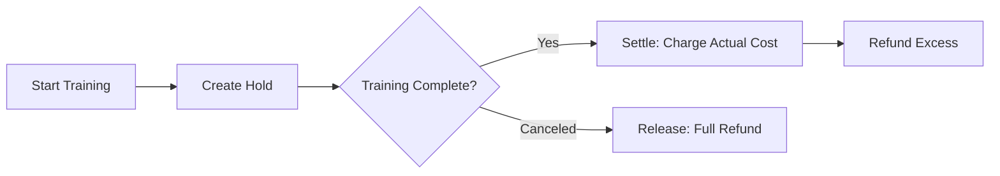

# Billing

[Ultralytics Platform](https://platform.ultralytics.com) uses a credit-based billing system for cloud training and dedicated endpoints. Add credits, track usage, and manage your subscription.

<!-- Screenshot: platform-billing-overview.avif -->

## Plans

Choose the plan that fits your needs:

<!-- Screenshot: platform-billing-plans.avif -->

| Feature                 | Free                   | Pro ($29/mo) | Enterprise |
| ----------------------- | ---------------------- | ------------ | ---------- |
| **Signup Credit**       | $5 ($25 company email) | $25/month    | Custom     |
| **Credit Expiry**       | 30 days                | 30 days      | Custom     |
| **Storage**             | 100 GB                 | 500 GB       | Unlimited  |
| **Private Projects**    | Unlimited              | Unlimited    | Unlimited  |
| **Deployments**         | 3 (cold-start)         | 3            | Unlimited  |
| **Teams**               | -                      | Yes          | Yes        |
| **Dedicated Endpoints** | -                      | Yes          | Yes        |
| **Priority Training**   | -                      | Yes          | Yes        |
| **SSO/Audit Logs**      | -                      | -            | Yes        |
| **License**             | AGPL                   | AGPL         | Enterprise |

### Free Plan

Get started at no cost:

- $5 signup credit ($25 for company/work emails)
- Credits expire in 30 days
- 100 GB storage
- Unlimited private projects
- 3 deployments (cold-start, scale to zero when idle)
- Community support

!!! tip "Company Email Bonus"

    Sign up with a company email address (not gmail.com, outlook.com, etc.) to receive $25 in signup credits instead of $5.

### Pro Plan

For serious users and small teams ($29/month):

- $25 monthly credit (recurring, expires in 30 days)
- 500 GB storage
- Unlimited private projects
- 3 deployments with dedicated endpoints
- Priority training queue
- Email support

### Enterprise

For organizations with advanced needs:

- Custom credit allocation and expiry
- Unlimited storage
- Unlimited deployments
- SSO/SAML integration
- Audit logging
- Dedicated support
- Enterprise license (non-AGPL)

Contact [sales@ultralytics.com](mailto:sales@ultralytics.com) for Enterprise pricing.

## Credits

Credits are the currency for Platform compute services. All amounts are stored internally in **micro-USD** (1 dollar = 1,000,000 micro-USD) for precise accounting.

### Credit Balance

View your balance in Settings > Billing:

<!-- Screenshot: platform-billing-credits.avif -->

| Balance Type       | Description                                   |
| ------------------ | --------------------------------------------- |
| **Cash Balance**   | Purchased credits (from Stripe top-ups)       |
| **Credit Balance** | Promotional credits (signup, monthly rewards) |
| **Reserved**       | Held for active training jobs                 |
| **Available**      | Total balance minus reserved amount           |

Your actual available balance for starting new training is calculated as:

```
Available = (Cash Balance + Credit Balance) - Reserved Amount
```

### Credit Uses

Credits are consumed by:

| Service                 | Rate                 |
| ----------------------- | -------------------- |
| **Cloud Training**      | GPU rate × hours     |
| **Dedicated Endpoints** | Compute rate × hours |
| **Model Export**        | Fixed per export     |

### Credit Expiration

Credits have expiration dates:

- **Signup credits**: 30 days from account creation
- **Monthly credits**: 30 days from issue date
- **Purchased credits**: Never expire

!!! tip "FIFO Credit Consumption"

    Credits are consumed in FIFO (First In, First Out) order - oldest expiring credits are used first. This ensures promotional credits are used before they expire, while your purchased credits remain available longer.

## Add Credits

Top up your balance:

1. Go to **Settings > Billing**
2. Click **Add Credits**
3. Select amount ($5 - $1000)
4. Complete payment

<!-- Screenshot: platform-billing-topup.avif -->

### Payment Methods

- Credit/debit cards
- Major payment providers

### Purchase Options

| Amount | Bonus | Total |
| ------ | ----- | ----- |
| $5     | -     | $5    |
| $25    | -     | $25   |
| $50    | -     | $50   |
| $100   | -     | $100  |
| $500   | -     | $500  |
| $1000  | -     | $1000 |

## Training Cost Flow

Cloud training uses a **hold/settle/release** system to ensure you're never charged more than the estimated cost shown before training starts.



### How It Works

1. **Estimate**: Platform calculates estimated cost based on model size, dataset size, epochs, and GPU
2. **Hold**: Estimated cost (plus 20% safety margin) is reserved from your balance
3. **Train**: Reserved amount shows as "Reserved" in your balance during training
4. **Settle**: After completion, you're charged only for actual GPU time used
5. **Refund**: Any excess is returned proportionally (credits first, then cash)

!!! success "Consumer Protection"

    You're **never charged more than the estimate** shown before training. If training completes early or is canceled, you only pay for actual compute time used.

## Training Costs

Cloud training costs depend on GPU selection:

| Tier       | GPU          | VRAM   | Rate/Hour | Typical Job (1h) |
| ---------- | ------------ | ------ | --------- | ---------------- |
| Budget     | RTX A2000    | 6 GB   | $0.12     | $0.12            |
| Budget     | RTX 3080     | 10 GB  | $0.25     | $0.25            |
| Budget     | RTX 3080 Ti  | 12 GB  | $0.30     | $0.30            |
| Budget     | A30          | 24 GB  | $0.44     | $0.44            |
| Mid        | L4           | 24 GB  | $0.54     | $0.54            |
| Mid        | RTX 4090     | 24 GB  | $0.60     | $0.60            |
| Mid        | A6000        | 48 GB  | $0.90     | $0.90            |
| Mid        | L40S         | 48 GB  | $1.72     | $1.72            |
| Pro        | A100 40GB    | 40 GB  | $2.78     | $2.78            |
| Pro        | A100 80GB    | 80 GB  | $3.44     | $3.44            |
| Pro        | RTX PRO 6000 | 48 GB  | $3.68     | $3.68            |
| Pro        | H100         | 80 GB  | $5.38     | $5.38            |
| Enterprise | H200         | 141 GB | $5.38     | $5.38            |
| Enterprise | B200         | 192 GB | $10.38    | $10.38           |

See [Cloud Training](../train/cloud-training.md) for complete GPU options and pricing.

### Cost Calculation

```
Total Cost = GPU Rate × Training Time (hours)
```

Example: Training for 2.5 hours on RTX 4090

```
$1.18 × 2.5 = $2.95
```

### Billing Timing

- **Epochs mode**: Charged after each epoch
- **Timed mode**: Charged at completion
- **Canceled**: Charged for completed time only

## Upgrade to Pro

Upgrade for more features and monthly credits:

1. Go to **Settings > Billing**
2. Click **Upgrade to Pro**
3. Complete checkout

<!-- Screenshot: platform-billing-upgrade.avif -->

### Pro Benefits

After upgrading:

- $25 credit added immediately
- $25 credit added each month (recurring)
- Storage increased to 500 GB
- Unlimited private projects
- 3 dedicated deployments
- Priority training queue

### Cancel Pro

Cancel anytime from the billing portal:

1. Click **Manage Subscription**
2. Select **Cancel**
3. Confirm cancellation

!!! note "Cancellation Timing"

    Pro features remain active until the end of your billing period. Monthly credits stop at cancellation.

## Payment History

View all transactions:

<!-- Screenshot: platform-billing-history.avif -->

| Column          | Description                     |
| --------------- | ------------------------------- |
| **Date**        | Transaction date                |
| **Description** | Credit purchase, training, etc. |
| **Amount**      | Transaction value               |
| **Balance**     | Resulting balance               |

### Download Invoice

1. Click transaction in history
2. Select **Download Invoice**
3. PDF invoice downloads

## Billing Portal

Access the billing portal for:

- Update payment method
- Download invoices
- Manage subscription
- View billing history

## FAQ

### What happens when I run out of credits?

- **Active training**: Pauses at epoch end
- **Deployments**: Continue running
- **New training**: Cannot start

Add credits to continue training.

### Are unused credits refundable?

- **Purchased credits**: No refunds
- **Signup/monthly credits**: No refunds (use it or lose it)

### Can I transfer credits?

Credits are not transferable between accounts.

### How do I get an invoice?

1. Go to **Settings > Billing**
2. Click **Billing Portal**
3. Download invoices

### What if training fails?

You're only charged for completed compute time. Failed jobs don't charge for unused time.

### Is there a free trial?

The Free plan includes $5 signup credit - essentially a free trial. No credit card required to start.
