# Annotation Editor

[Ultralytics Platform](https://platform.ultralytics.com) includes a powerful annotation editor for labeling images with bounding boxes, polygons, keypoints, oriented boxes, and classifications. The editor supports manual annotation, SAM-powered smart annotation, and YOLO auto-labeling.

```mermaid
graph TB
    subgraph Manual["✏️ Manual Tools"]
        A[Box] & B[Polygon] & C[Keypoint] & D[OBB] & E[Classify]
    end
    subgraph AI["🤖 AI-Assisted"]
        F[SAM Smart] & G[Auto-Annotate]
    end
    Manual --> H[📁 Save Labels]
    AI --> H
```

<!-- Screenshot: platform-annotate-toolbar.avif -->

## Supported Task Types

The annotation editor supports all 5 YOLO task types:

| Task         | Tool           | Annotation Format                      |
| ------------ | -------------- | -------------------------------------- |
| **Detect**   | Rectangle      | Bounding boxes (x, y, width, height)   |
| **Segment**  | Polygon        | Pixel-precise masks (polygon vertices) |
| **Pose**     | Keypoint       | 17-point COCO skeleton                 |
| **OBB**      | Oriented Box   | Rotated bounding boxes (4 corners)     |
| **Classify** | Class Selector | Image-level labels                     |

### Task Details

??? info "Object Detection"

    **What it does:** Identifies objects and their locations with axis-aligned bounding boxes.

    **Label format:** `class_id center_x center_y width height` (all normalized 0-1)

    **Example:** `0 0.5 0.5 0.2 0.3` — Class 0 centered at (50%, 50%) with 20% width and 30% height

    **Use cases:** Inventory counting, traffic monitoring, wildlife detection, security systems

??? info "Instance Segmentation"

    **What it does:** Creates pixel-precise masks for each object instance.

    **Label format:** `class_id x1 y1 x2 y2 x3 y3 ...` (polygon vertices, normalized 0-1)

    **Example:** `0 0.1 0.1 0.9 0.1 0.9 0.9 0.1 0.9` — Quadrilateral mask

    **Use cases:** Medical imaging, autonomous vehicles, photo editing, agricultural analysis

??? info "Pose Estimation"

    **What it does:** Detects body keypoints for skeleton tracking.

    **Label format:** `class_id cx cy w h kx1 ky1 v1 kx2 ky2 v2 ...`

    - Visibility flags: `0`=not labeled, `1`=labeled but occluded, `2`=labeled and visible

    **Example:** `0 0.5 0.5 0.2 0.3 0.6 0.7 2 0.4 0.8 1` — Person with 2 keypoints

    **Use cases:** Sports analysis, physical therapy, animation, gesture recognition

??? info "Oriented Bounding Box (OBB)"

    **What it does:** Detects rotated objects with angle-aware bounding boxes.

    **Label format:** `class_id x1 y1 x2 y2 x3 y3 x4 y4` (four corner points, normalized)

    **Example:** `0 0.1 0.1 0.9 0.1 0.9 0.9 0.1 0.9` — Rotated rectangle

    **Use cases:** Aerial imagery, document analysis, manufacturing inspection, ship detection

??? info "Image Classification"

    **What it does:** Assigns a single label to the entire image.

    **Label format:** Folder-based — images organized by class name (`train/cats/`, `train/dogs/`)

    **Use cases:** Content moderation, quality control, medical diagnosis, scene recognition

## Getting Started

To annotate images:

1. Navigate to your dataset
2. Click on an image to open the fullscreen viewer
3. Click **Edit** to enter annotation mode
4. Select your annotation tool
5. Draw annotations on the image
6. Click **Save** when finished

<!-- Screenshot: platform-annotate-detect.avif -->

## Manual Annotation Tools

### Bounding Box (Detect)

Draw rectangular boxes around objects:

1. Select the **Box** tool or press `B`
2. Click and drag to draw a rectangle
3. Release to complete the box
4. Select a class from the dropdown

<!-- Screenshot: platform-annotate-detect.avif -->

!!! tip "Resize and Move"

    - Drag corners or edges to resize
    - Drag the center to move
    - Press `Delete` to remove selected annotation

### Polygon (Segment)

Draw precise polygon masks:

1. Select the **Polygon** tool or press `P`
2. Click to add vertices
3. Double-click or press `Enter` to close the polygon
4. Select a class from the dropdown

<!-- Screenshot: platform-annotate-segment.avif -->

!!! tip "Edit Vertices"

    - Drag individual vertices to adjust
    - Drag the entire polygon to move
    - Click on a vertex and press `Delete` to remove it

### Keypoint (Pose)

Place 17 COCO keypoints for human pose:

1. Select the **Keypoint** tool or press `K`
2. Click to place keypoints in sequence
3. Follow the COCO skeleton order

The 17 COCO keypoints are:

| #   | Keypoint       | #   | Keypoint    |
| --- | -------------- | --- | ----------- |
| 1   | Nose           | 10  | Right wrist |
| 2   | Left eye       | 11  | Left hip    |
| 3   | Right eye      | 12  | Right hip   |
| 4   | Left ear       | 13  | Left knee   |
| 5   | Right ear      | 14  | Right knee  |
| 6   | Left shoulder  | 15  | Left ankle  |
| 7   | Right shoulder | 16  | Right ankle |
| 8   | Left elbow     | 17  | (reserved)  |
| 9   | Right elbow    |     |             |

<!-- Screenshot: platform-annotate-pose.avif -->

### Oriented Bounding Box (OBB)

Draw rotated boxes for angled objects:

1. Select the **OBB** tool or press `O`
2. Click and drag to draw an initial box
3. Use the rotation handle to adjust angle
4. Select a class from the dropdown

<!-- Screenshot: platform-annotate-obb.avif -->

### Classification (Classify)

Assign image-level class labels:

1. Select the **Classify** mode
2. Click on class buttons or press number keys `1-9`
3. Multiple classes can be assigned per image

<!-- Screenshot: platform-annotate-classify.avif -->

## SAM Smart Annotation

[Segment Anything Model (SAM)](https://docs.ultralytics.com/models/sam/) enables intelligent annotation with just a few clicks:

1. Select **SAM** mode or press `S`
2. **Left-click** to add positive points (include this area)
3. **Right-click** to add negative points (exclude this area)
4. SAM generates a precise mask in real-time
5. Click **Accept** to convert to annotation

<!-- Screenshot: platform-annotate-sam.avif -->

!!! tip "SAM Tips"

    - Start with a positive click on the object center
    - Add negative clicks to exclude background
    - Works best for distinct objects with clear edges

<!-- Screenshot: platform-annotate-sam-mask.avif -->

SAM smart annotation can generate:

- **Polygons** for segmentation tasks
- **Bounding boxes** for detection tasks
- **Oriented boxes** for OBB tasks

## YOLO Auto-Annotation

Use trained YOLO models to automatically label images:

1. Select **Auto-Annotate** mode or press `A`
2. Choose a model (official or your trained models)
3. Set confidence threshold
4. Click **Run** to generate predictions
5. Review and edit results as needed

<!-- Screenshot: platform-annotate-auto.avif -->

!!! note "Auto-Annotation Models"

    You can use:

    - Official Ultralytics models (YOLO26n, YOLO26s, etc.)
    - Your own trained models from the Platform

## Class Management

### Creating Classes

Define annotation classes for your dataset:

1. Click **Add Class** in the class panel
2. Enter the class name
3. A color is assigned automatically

<!-- Screenshot: platform-annotate-classes.avif -->

### Add New Class During Annotation

You can create new classes directly while annotating without leaving the editor:

1. Draw an annotation on the image
2. In the class dropdown, click **Add New Class**
3. Enter the class name
4. Press Enter to create and assign

This allows for a seamless workflow where you can define classes as you encounter new object types in your data.

!!! tip "Unified Classes Table"

    All classes across your dataset are managed in a unified table. Changes to class names or colors apply throughout the entire dataset automatically.

### Editing Classes

- Click on a class to select it for new annotations
- Double-click to rename
- Drag to reorder
- Right-click for more options

### Class Colors

Each class is assigned a color from the Ultralytics palette. Colors are consistent across the Platform for easy recognition.

## Keyboard Shortcuts

Efficient annotation with keyboard shortcuts:

| Shortcut | Action                     |
| -------- | -------------------------- |
| `B`      | Box tool (detect)          |
| `P`      | Polygon tool (segment)     |
| `K`      | Keypoint tool (pose)       |
| `O`      | OBB tool                   |
| `S`      | SAM smart annotation       |
| `A`      | Auto-annotate              |
| `V`      | Select/move mode           |
| `1-9`    | Select class 1-9           |
| `Delete` | Delete selected annotation |
| `Ctrl+Z` | Undo                       |
| `Ctrl+Y` | Redo                       |
| `Escape` | Cancel current operation   |
| `Enter`  | Complete polygon           |
| `←/→`    | Previous/next image        |

<!-- Screenshot: platform-annotate-shortcuts.avif -->

??? tip "View All Shortcuts"

    Press `?` to open the keyboard shortcuts dialog.

## Undo/Redo

The annotation editor maintains a full history:

- **Undo**: `Ctrl+Z` (Cmd+Z on Mac)
- **Redo**: `Ctrl+Y` (Cmd+Y on Mac)

History includes:

- Adding annotations
- Editing annotations
- Deleting annotations
- Changing classes

## Saving Annotations

Annotations are saved when you click **Save** or navigate away:

- **Save**: Click the save button or press `Ctrl+S`
- **Cancel**: Click cancel to discard changes
- **Auto-save warning**: Unsaved changes prompt before leaving

!!! warning "Save Your Work"

    Always save before navigating to another image. Unsaved changes will be lost.

## FAQ

### How accurate is SAM annotation?

SAM provides high-quality masks for most objects. Accuracy depends on:

- Object distinctiveness from background
- Image quality and resolution
- Number of positive/negative points provided

For best results, start with a positive point on the object center and add negative points to exclude nearby objects.

### Can I import existing annotations?

Yes, upload your dataset with YOLO-format label files. The Platform automatically parses and displays them in the editor.

### How do I annotate multiple objects of the same class?

After drawing an annotation:

1. Keep the same class selected
2. Draw the next annotation
3. Repeat until all objects are labeled

The keyboard shortcut `1-9` quickly selects classes.

### What's the difference between SAM and auto-annotate?

| Feature       | SAM                           | Auto-Annotate                 |
| ------------- | ----------------------------- | ----------------------------- |
| **Method**    | Interactive point prompts     | Model inference               |
| **Speed**     | One object at a time          | All objects at once           |
| **Precision** | Very high with guidance       | Depends on model              |
| **Best for**  | Complex objects, fine details | Bulk labeling, simple objects |

### Can I train on partially annotated datasets?

Yes, but for best results:

- Label all objects of your target classes in each image
- Use the **unknown** split for unlabeled images
- Exclude unlabeled images from training configuration
