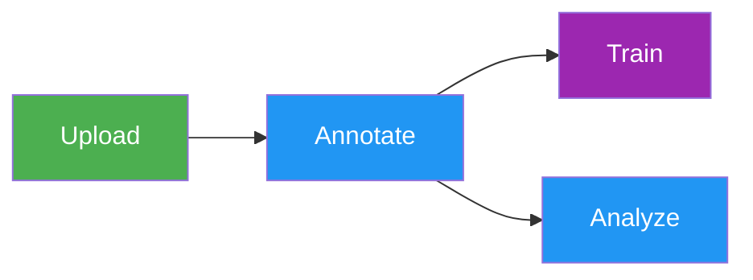

# Data Preparation

Data preparation is the foundation of successful [computer vision](https://www.ultralytics.com/glossary/computer-vision-cv) models. [Ultralytics Platform](https://platform.ultralytics.com) provides comprehensive tools for managing your training data, from upload through annotation to analysis.

<p align="center">
  <br>
  <iframe loading="lazy" width="720" height="405" src="https://www.youtube.com/embed/kA09zsjZGdA"
    title="YouTube video player" frameborder="0"
    allow="accelerometer; autoplay; clipboard-write; encrypted-media; gyroscope; picture-in-picture; web-share"
    allowfullscreen>
  </iframe>
  <br>
  <strong>Watch:</strong> Get Started with Ultralytics Platform - Data
</p>

## Overview

The Data section of Ultralytics Platform helps you:

- **Upload** images, videos, and dataset files (ZIP, TAR including `.tar.gz`/`.tgz`, NDJSON)
- **Import from a URL** by pasting a direct link to an archive or NDJSON export, or from [Roboflow](../integrations/roboflow.md)
- **Connect** [Google Cloud Storage](../integrations/google-cloud-storage.md), [Amazon S3](../integrations/amazon-s3.md), or [Azure Blob Storage](../integrations/azure-blob-storage.md) and use your data in place without uploading a copy
- **Keep pixels on premise** with Enterprise [On Premise](../integrations/on-premise.md) CPU/GPU workers
- **Annotate** with manual drawing tools and SAM-powered smart labeling — choose from [SAM 2.1](../../models/sam-2.md) or the new [SAM 3](../../models/sam-3.md)
- **Manage classes** by renaming, recoloring, merging, and deleting them across the whole dataset
- **Analyze** your data with statistics, visualizations, and embedding-based clustering
- **Export** in [NDJSON format](../../datasets/detect/index.md#ultralytics-ndjson-format) for local training

<!-- screenshot -->

## Workflow


```mermaid
graph LR
    A[Upload]:::start --> B[Annotate]:::proc
    B --> D[Train]:::out
    B --> C[Analyze]:::proc

    classDef start fill:#4CAF50,color:#fff
    classDef proc fill:#2196F3,color:#fff
    classDef out fill:#9C27B0,color:#fff
```

| Stage        | Description                                                                                           |
| ------------ | ----------------------------------------------------------------------------------------------------- |
| **Upload**   | Import images, videos, or archives with automatic processing                                          |
| **Annotate** | Label data with manual tools, or use SAM annotation for detect, segment, semantic, and OBB            |
| **Analyze**  | View class distributions, spatial heatmaps, dimension statistics, and embedding clusters              |
| **Export**   | Download in [NDJSON format](../../datasets/detect/index.md#ultralytics-ndjson-format) for offline use |

## Supported Tasks

Ultralytics Platform datasets support all 7 YOLO task types:

| Task                                             | Description                                                     | Annotation Tool   |
| ------------------------------------------------ | --------------------------------------------------------------- | ----------------- |
| **[Detect](../../datasets/detect/index.md)**     | Object detection with bounding boxes                            | Rectangle tool    |
| **[Segment](../../datasets/segment/index.md)**   | Instance segmentation with pixel masks                          | Polygon tool      |
| **[Semantic](../../datasets/semantic/index.md)** | Semantic segmentation with per-class pixel regions              | Polygon tool      |
| **[Depth](../../datasets/depth/index.md)**       | Per-pixel metric depth maps                                     | Imported targets  |
| **[Classify](../../datasets/classify/index.md)** | Image-level classification                                      | Class selector    |
| **[Pose](../../datasets/pose/index.md)**         | Keypoint estimation with built-in and custom skeleton templates | Keypoint tool     |
| **[OBB](../../datasets/obb/index.md)**           | Oriented bounding boxes for rotated objects                     | Oriented box tool |

!!! info "Task Type Selection"

    The task type is set when creating a dataset and determines which annotation tools are available. You can change it later from the dataset header task selector, but incompatible annotations won't be displayed after switching. Switching to or from depth is only allowed while the dataset is empty — see [Edit Dataset](datasets.md#edit-dataset).

## Key Features

### Smart Storage

Ultralytics Platform manages storage efficiently:

- **Deduplication**: Identical images in the same data region are stored once
- **Integrity**: Uploads are verified for data integrity
- **Efficiency**: Optimized storage and fast processing

### Dataset URIs

Reference datasets using the `ul://` URI format (see [Using Platform Datasets](../api/index.md#using-platform-datasets)):

```bash
yolo train data=ul://username/datasets/my-dataset
```

This allows training on the platform's datasets from any machine with your [API key](../account/api-keys.md) configured.

!!! example "Use Platform Data from Python"

    ```python
    from ultralytics import YOLO

    model = YOLO("yolo26n.pt")
    model.train(data="ul://username/datasets/my-dataset", epochs=100)
    ```

### Dataset Versioning

Create immutable NDJSON snapshots of your dataset for reproducible training. Each version captures image counts, class counts, and annotation counts at the time of creation. See [Versions Tab](datasets.md#versions-tab) for details.

### Dataset Tabs

Dataset pages can show up to six tabs, depending on the dataset state and your permissions:

| Tab          | Description                                                                  |
| ------------ | ---------------------------------------------------------------------------- |
| **Images**   | Browse images in grid, compact, or table view with annotation overlays       |
| **Classes**  | View, rename, recolor, merge, and delete classes with per-class label counts |
| **Charts**   | Automatic statistics: split distribution, class counts, heatmaps             |
| **Models**   | [Models](../train/models.md) trained on this dataset with metrics and status |
| **Versions** | Create, download, and restore immutable NDJSON snapshots for reproducibility |
| **Errors**   | Images that failed processing with error details and fix guidance            |

`Classes` appears when the dataset has images and its task has classes, while `Charts` appears whenever it has images. `Errors` appears only when processing failures exist. `Versions` appears when you have edit access, or in read-only mode when versions already exist.

### Clustering

Explore your dataset as an interactive 2D scatter plot where visually similar images sit close together — useful for surfacing clusters, duplicates, and outliers, and for inspecting how splits or classes are distributed across your data. Lasso a region of the plot to filter the gallery to those images. Analysis needs between 20 and 200,000 non-errored images. See [Clustering](datasets.md#clustering) for details.

### Statistics and Visualization

The `Charts` tab provides automatic analysis including:

- **Split Distribution**: Donut chart of train/val/test image counts
- **Top Classes**: Donut chart of the 10 most frequent annotation classes
- **Image Dimensions**: Histogram of image width and height distribution (in pixels)
- **Image Dimensions 2D**: 2D heatmap of width vs height with aspect ratio guide lines
- **Annotation Locations**: 2D heatmap of bounding box center positions
- **Points per Instance**: Polygon vertex or keypoint count distribution (segment/pose datasets)

See the [Charts tab](datasets.md#charts-tab) for the full list.

## Quick Links

- [**Datasets**](datasets.md): Upload, manage, and export your training data
- [**Annotation**](annotation.md): Label data with manual and AI-assisted tools
- [**Cloud Training**](../train/cloud-training.md): Train models on your annotated datasets
- [**Dataset URI**](datasets.md#dataset-uri): Use `ul://` URIs to train from anywhere

## FAQ

### What file formats are supported for upload?

Ultralytics Platform supports:

**Images:** JPEG, PNG, WebP, BMP, TIFF, HEIC, AVIF, JP2, DNG, MPO (max 50MB each)

**Videos:** MP4, WebM, MOV, MKV, M4V (max 1GB, frames extracted at 1 FPS, max 100 frames)

**Dataset files:** ZIP or TAR archives including `.tar.gz` and `.tgz` (max 10GB on Free, 20GB on Pro, 50GB on Enterprise) containing images with optional [YOLO-format](../../datasets/detect/index.md#ultralytics-yolo-format) or COCO JSON labels, plus [NDJSON](../../datasets/detect/index.md#ultralytics-ndjson-format) exports

Any of these archive or NDJSON formats can also be imported by pasting a direct HTTP(S) link in the `URL` tab of the `New Dataset` dialog. Pascal VOC XML labels are detected but not imported.

### What is the maximum dataset size?

Storage limits depend on your plan:

| Plan       | Storage Limit |
| ---------- | ------------- |
| Free       | 100 GB        |
| Pro        | 500 GB        |
| Enterprise | Unlimited     |

Individual file limits: Images 50MB, Videos 1GB, datasets 10GB on Free / 20GB on Pro / 50GB on Enterprise

### Can I use my Platform datasets for local training?

Yes! Use the dataset URI format to train locally:

=== "CLI"

    ```bash
    export ULTRALYTICS_API_KEY="YOUR_API_KEY"
    yolo train model=yolo26n.pt data=ul://username/datasets/my-dataset epochs=100
    ```

=== "Python"

    ```python
    import os

    os.environ["ULTRALYTICS_API_KEY"] = "YOUR_API_KEY"

    from ultralytics import YOLO

    model = YOLO("yolo26n.pt")
    model.train(data="ul://username/datasets/my-dataset", epochs=100)
    ```

Or export your dataset in [NDJSON format](../../datasets/detect/index.md#ultralytics-ndjson-format) to transfer its metadata, splits, annotations, and signed image URLs.
