# Data Preparation

Data preparation is the foundation of successful [computer vision](https://www.ultralytics.com/glossary/computer-vision-cv) models. [Ultralytics Platform](https://platform.ultralytics.com) provides comprehensive tools for managing your training data, from upload through annotation to analysis.

## Overview

The Data section of Ultralytics Platform helps you:

- **Upload** images, videos, and ZIP archives
- **Annotate** with manual tools and AI-assisted labeling
- **Analyze** your data with statistics and visualizations
- **Export** in standard formats for local training

<!-- Screenshot: platform-data-overview.avif -->

## Workflow

```mermaid
graph LR
    A[📤 Upload] --> B[🏷️ Annotate]
    B --> C[📊 Analyze]
    C --> D[🚀 Train]

    style A fill:#4CAF50,color:#fff
    style B fill:#2196F3,color:#fff
    style C fill:#FF9800,color:#fff
    style D fill:#9C27B0,color:#fff
```



| Stage        | Description                                                             |
| ------------ | ----------------------------------------------------------------------- |
| **Upload**   | Import images, videos, or ZIP archives with automatic processing        |
| **Annotate** | Label data with bounding boxes, polygons, keypoints, or classifications |
| **Analyze**  | View class distributions, spatial heatmaps, and dimension statistics    |
| **Export**   | Download in NDJSON format for offline use                               |

## Supported Tasks

Ultralytics Platform supports all 5 YOLO task types:

| Task         | Description                                 | Annotation Tool   |
| ------------ | ------------------------------------------- | ----------------- |
| **Detect**   | Object detection with bounding boxes        | Rectangle tool    |
| **Segment**  | Instance segmentation with pixel masks      | Polygon tool      |
| **Pose**     | Keypoint estimation (17-point COCO format)  | Keypoint tool     |
| **OBB**      | Oriented bounding boxes for rotated objects | Oriented box tool |
| **Classify** | Image-level classification                  | Class selector    |

## Key Features

### Smart Storage

Ultralytics Platform uses efficient storage technology:

- **Deduplication**: Identical images stored only once
- **Integrity**: Checksums ensure data integrity
- **Efficiency**: Optimized storage and fast processing

### Dataset URIs

Reference datasets using the `ul://` URI format:

```bash
yolo train data=ul://username/datasets/my-dataset
```

This allows training on Platform datasets from any machine with your API key configured.

### Statistics and Visualization

Every dataset includes automatic statistics:

- **Class Distribution**: Bar chart of label counts per class
- **Location Heatmap**: Spatial distribution of annotations
- **Dimension Analysis**: Image width vs height distribution
- **Split Breakdown**: Train/validation/test sample counts

## Quick Links

- [**Datasets**](datasets.md): Upload and manage your training data
- [**Annotation**](annotation.md): Label data with manual and AI-assisted tools

## FAQ

### What file formats are supported for upload?

Ultralytics Platform supports:

**Images:** JPEG, PNG, WebP, BMP, GIF, TIFF, HEIC, AVIF, JP2, DNG (max 50MB each)

**Videos:** MP4, WebM, MOV, AVI, MKV, M4V (max 1GB, frames extracted at 1 FPS, max 100 frames)

**Archives:** ZIP files (max 50GB) containing images with optional YOLO-format labels

### What is the maximum dataset size?

Storage limits depend on your plan:

| Plan       | Storage Limit |
| ---------- | ------------- |
| Free       | 100 GB        |
| Pro        | 500 GB        |
| Enterprise | Custom        |

Individual file limits: Images 50MB, Videos 1GB, ZIP archives 50GB

### Can I use my Platform datasets for local training?

Yes! Use the dataset URI format to train locally:

```bash
export ULTRALYTICS_API_KEY="your_key"
yolo train data=ul://username/datasets/my-dataset epochs=100
```

Or export your dataset in NDJSON format for fully offline training.
