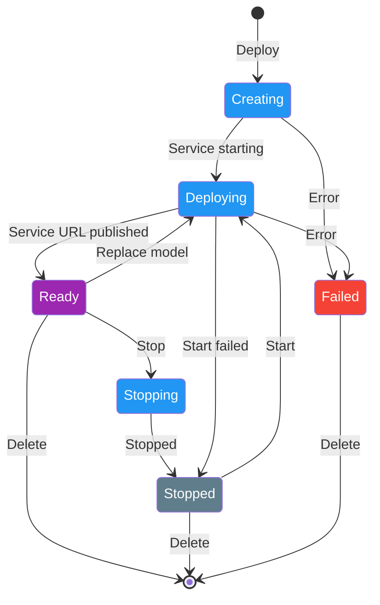
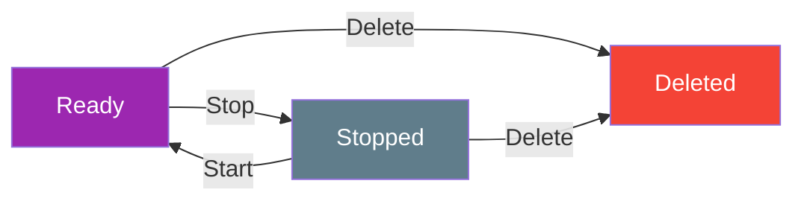

# Dedicated Endpoints

[Ultralytics Platform](https://platform.ultralytics.com) enables deployment of YOLO models to dedicated endpoints in 42 global regions. Each endpoint is a single-tenant service with scale-to-zero behavior, a unique endpoint URL, and independent monitoring.

<!-- screenshot -->

## Create Endpoint

### From the Deploy Tab

Deploy a model from its `Deploy` tab:

1. Navigate to your model
2. Click the **Deploy** tab
3. Review the world map and the region table, which is sorted by measured latency from your location
4. Click **Deploy** in the region row you want to use

Deployment starts immediately with no naming step: the name is generated from the model name and the region city (for
example `yolo26n-iowa`). The model must have weights, or the tab shows an empty state instead of the region table.

### From the Deployments Page

Create a deployment from the global `Deploy` page in the sidebar:

1. Click **New Deployment**
2. Select a model from the model selector, which lists your completed models
3. Select a region from the mini map or the latency table
4. Review the auto-generated deployment name, which you can edit here
5. Click **Deploy Model**

<!-- screenshot -->

### Deployment Lifecycle



Connect [Slack alerts](../integrations/slack.md) to receive a message when a deployment becomes ready or fails to start.

### Region Selection

Choose from 42 regions worldwide. The interactive region map and table show:

- **Region pins**: Color-coded by latency on a green-to-red gradient (faster regions are greener, slower regions are redder)
- **Deployed regions**: Highlighted with a "Deployed" badge in the table
- **Deploying regions**: Animated pulse indicator on the pin and the table row
- **Bidirectional highlighting**: Hover on the map highlights the table row, and vice versa

<!-- screenshot -->
The region table on the model `Deploy` tab includes:

| Column       | Description                                   |
| ------------ | --------------------------------------------- |
| **Location** | City and country with flag icon               |
| **Zone**     | Region identifier                             |
| **Latency**  | Measured ping time from your browser          |
| **Distance** | Distance from your approximate location in km |
| **Actions**  | Deploy button or "Deployed" status badge      |

The table is searchable by city, country, and zone, and is sorted by latency by default.

!!! note "New Deployment Dialog"

    The `New Deployment` dialog (from the global `Deploy` page) shows a simpler region table with only Location, Latency, and Select columns, listing the 20 fastest regions with a note about the remaining ones. Use the mini map to pick any other region.

!!! tip "How Latency Is Measured"

    Your browser measures latency to each of the 42 regions, and results are cached for 30 minutes and shared across the `Deploy` tab and the `New Deployment` dialog. Use the **Rescan** button on the model `Deploy` tab to re-measure from your current network. Distance is computed from the approximate location of your request, so it is a rough guide rather than a precise value.

## Available Regions

=== "Americas (14)"

    | Zone                    | Location               |
    | ----------------------- | ---------------------- |
    | us-central1             | Iowa, USA              |
    | us-east1                | South Carolina, USA    |
    | us-east4                | Northern Virginia, USA |
    | us-east5                | Columbus, USA          |
    | us-south1               | Dallas, USA            |
    | us-west1                | Oregon, USA            |
    | us-west2                | Los Angeles, USA       |
    | us-west3                | Salt Lake City, USA    |
    | us-west4                | Las Vegas, USA         |
    | northamerica-northeast1 | Montreal, Canada       |
    | northamerica-northeast2 | Toronto, Canada        |
    | northamerica-south1     | Queretaro, Mexico      |
    | southamerica-east1      | Sao Paulo, Brazil      |
    | southamerica-west1      | Santiago, Chile        |

=== "Europe (13)"

    | Zone              | Location               |
    | ----------------- | ---------------------- |
    | europe-west1      | St. Ghislain, Belgium  |
    | europe-west2      | London, UK             |
    | europe-west3      | Frankfurt, Germany     |
    | europe-west4      | Eemshaven, Netherlands |
    | europe-west6      | Zurich, Switzerland    |
    | europe-west8      | Milan, Italy           |
    | europe-west9      | Paris, France          |
    | europe-west10     | Berlin, Germany        |
    | europe-west12     | Turin, Italy           |
    | europe-north1     | Hamina, Finland        |
    | europe-north2     | Stockholm, Sweden      |
    | europe-central2   | Warsaw, Poland         |
    | europe-southwest1 | Madrid, Spain          |

=== "Asia-Pacific (12)"

    | Zone                 | Location               |
    | -------------------- | ---------------------- |
    | asia-east1           | Changhua, Taiwan       |
    | asia-east2           | Kowloon, Hong Kong     |
    | asia-northeast1      | Tokyo, Japan           |
    | asia-northeast2      | Osaka, Japan           |
    | asia-northeast3      | Seoul, South Korea     |
    | asia-south1          | Mumbai, India          |
    | asia-south2          | Delhi, India           |
    | asia-southeast1      | Jurong West, Singapore |
    | asia-southeast2      | Jakarta, Indonesia     |
    | asia-southeast3      | Bangkok, Thailand      |
    | australia-southeast1 | Sydney, Australia      |
    | australia-southeast2 | Melbourne, Australia   |

=== "Middle East & Africa (3)"

    | Zone          | Location                   |
    | ------------- | -------------------------- |
    | africa-south1 | Johannesburg, South Africa |
    | me-central1   | Doha, Qatar                |
    | me-west1      | Tel Aviv, Israel           |

## Endpoint Configuration

### New Deployment Dialog

The `New Deployment` dialog collects three inputs:

| Field               | Description                                                       |
| ------------------- | ----------------------------------------------------------------- |
| **Model**           | Any completed model in the workspace, chosen with the selector    |
| **Region**          | Deployment region, chosen on the mini map or in the latency table |
| **Deployment Name** | Auto-generated once model and region are set, and editable        |

<!-- screenshot -->
Below the name, a read-only **Resources** panel carries a `Custom resources coming soon` badge. Resources are not
configurable today: every endpoint runs as a single instance that scales to zero when idle.

!!! note "Auto-Generated Names"

    The deployment name combines the model name with the region city, for example `yolo26n-iowa`. On the model `Deploy` tab, a numeric suffix is added when that model already has a deployment in the region (for example `yolo26n-iowa-2`). Names must be unique within a workspace — deploying a name that already exists returns an error rather than silently renaming.

### Deploy Tab (Quick Deploy)

Deploying from the model's `Deploy` tab uses the same fixed resources and auto-generated name, with no dialog step. The
deployment appears immediately in the **Active Deployments** list below the region table while it is created.

## Manage Endpoints

### View Modes

The deployments list supports three view modes:

| Mode        | Description                                               |
| ----------- | --------------------------------------------------------- |
| **Cards**   | Full detail cards with logs, code examples, predict panel |
| **Compact** | Grid of smaller cards with key metrics                    |
| **Table**   | DataTable with sortable columns and search                |

<!-- screenshot -->

### Deployment Card (Cards View)

Each deployment card in the cards view shows:

- **Header**: Name, region flag, status badge, and the action buttons available for the current status — replace and stop when **Ready**, start when **Stopped**, delete at any time
- **Endpoint URL**: Copyable URL with a link to the endpoint's own API reference
- **Metrics**: Request count (24h), P95 latency, error rate, or "No traffic yet"
- **Health check**: Live health indicator with latency and manual refresh
- **Tabs**: `Logs`, `Code`, and `Predict`
- **Footer**: The API key prefix bound to the deployment and the date it became ready
- **Status message**: The failure reason, when a deployment failed

The URL, metrics, health check, and tabs appear only while the deployment is **Ready**. The `Logs` tab shows recent log
entries with severity filtering (All / Errors). The `Code` tab shows ready-to-use code examples in Python, JavaScript,
and cURL with your endpoint URL, plus the bound API key for workspace owners (see [Monitoring](monitoring.md#code-examples)). The `Predict` tab provides an inline predict panel for testing
directly on the deployment.

!!! note "Compact and Table Views"

    Compact cards show the flag, name, city, status, and the three metrics. The table view is sortable on Name, Region, Status, Requests, P95, and Errors, with search across name, region, and status. Both views keep the delete action; start, stop, and replace are available in the cards view.

### Replace a Model

Replace the model behind a ready endpoint without changing its URL:

1. Open the deployment in **Cards** view
2. Click **Replace model**
3. Select another completed model from the same workspace
4. Optionally edit the deployment name
5. Click **Replace Model**

The current model continues serving while the replacement starts up. Once the replacement is ready, traffic moves to the new model. The deployment ID, URL, region, and API key remain unchanged; its display name changes only when you enter a new one. If replacement fails, the previous model and name remain active.

Replacement requires all of the following, and is rejected otherwise:

- The deployment is **Ready** and has no other lifecycle operation in flight
- The replacement model has weights and belongs to the same workspace as the deployment
- The replacement model is not the one already deployed

!!! note "One Model per Endpoint"

    Replacement removes the previous model from the deployment. Each endpoint serves one model; create another deployment when you need both models available at the same time.

### Deployment Statuses

| Status        | Description                             |
| ------------- | --------------------------------------- |
| **Creating**  | Deployment is being set up              |
| **Deploying** | Container is starting                   |
| **Ready**     | Endpoint is live and accepting requests |
| **Stopping**  | Endpoint is shutting down               |
| **Stopped**   | Endpoint is paused and unavailable      |
| **Failed**    | Deployment failed (see error message)   |

### Endpoint URL

Each endpoint has a unique URL, for example:

```text
https://predict-<deployment-id>-<hash>-<region>.a.run.app
```

<!-- screenshot -->
Click the copy button to copy the URL. Click the docs icon to open the endpoint's own API reference. The endpoint
serves these paths:

| Path       | Method | Description                                                                |
| ---------- | ------ | -------------------------------------------------------------------------- |
| `/predict` | POST   | Run inference; requires the deployment API key                             |
| `/health`  | GET    | Liveness check reporting service status and the number of cached models    |
| `/`        | GET    | Status summary for the deployed service                                    |
| `/docs`    | GET    | Interactive API reference generated for this deployment, model, and region |

## Lifecycle Management

Control your endpoint state:



| Action     | Description                 |
| ---------- | --------------------------- |
| **Start**  | Resume a stopped endpoint   |
| **Stop**   | Pause the endpoint          |
| **Delete** | Permanently remove endpoint |

### Stop Endpoint

Stop an endpoint when you do not want it to accept requests:

1. Click the pause icon on the deployment card
2. Endpoint status changes to "Stopping" then "Stopped"

Stopped endpoints:

- Don't accept requests, and report no metrics or health status
- Keep their URL, region, and bound API key, and can be restarted anytime
- Still count against your plan's deployment quota — delete an endpoint to free its slot

### Delete Endpoint

Permanently remove an endpoint:

1. Click the delete (trash) icon on the deployment card
2. Confirm deletion in the dialog

!!! warning "Permanent Action"

    Deletion is immediate and permanent — deployments do not go to [Trash](../account/trash.md). Deleting the endpoint removes its service and frees a slot in your deployment quota. You can always create a new endpoint, but it receives a new URL.

Deployments are also removed when their model or project is permanently deleted, or when a trashed model or project
reaches the end of its retention window.

## Using Endpoints

### Authentication

Each deployment is bound to a single API key from the workspace that owns the model. Include it in requests:

```bash
Authorization: Bearer YOUR_API_KEY
```

The endpoint accepts only the key bound at creation, so **no other key opens it** — not even another active key in
the same workspace. To control which key gets bound, deploy via the API authenticated with the workspace owner's key:
that exact key is bound, and you already hold it. Deployments created any other way (the Platform UI, or an API call
authenticated as a team member) bind one of the owning workspace's active keys automatically — identify it by the key
prefix shown in the deployment card footer, and ask the workspace owner for its value, since only the owner can view
key values (see [API Keys](../account/api-keys.md)). Team members without the bound key can still run inference
through the Platform predict proxy in the browser.

!!! warning "Deleting the Bound Key Does Not Lock the Endpoint"

    Deleting or deactivating the bound API key does **not** revoke direct access to the endpoint — anyone holding the key string can still call the endpoint URL. What does break is the Platform predict proxy, which checks the key live and reports it as no longer available. To fully revoke access, stop or delete the deployment; after rotating keys, create the endpoint again so it binds the new key.

### Direct Endpoint Requests

Send production requests directly to the URL shown on the deployment card. These requests do not pass through the
Platform API rate limiter, so the 20 requests/minute predict limit does not apply. The endpoint still has its own
capacity ceiling:

- A single instance serves each endpoint, processing a limited number of requests at once
- Requests that cannot be served promptly return `429` with a `Retry-After` header
- A single request may run for up to 1 hour, which allows video inference to complete
- Responses larger than 1 KB are gzip-compressed, and cross-origin browser requests are allowed

### Request Example

=== "Python"

    ```python
    import requests

    # Deployment endpoint
    url = "https://YOUR_DEPLOYMENT_URL.run.app/predict"

    # Headers with your deployment API key
    headers = {"Authorization": "Bearer YOUR_API_KEY"}

    # Inference parameters
    data = {"conf": 0.25, "iou": 0.7, "imgsz": 640}

    # Send image for inference
    with open("image.jpg", "rb") as f:
        response = requests.post(url, headers=headers, data=data, files={"file": f})

    print(response.json())
    ```

=== "JavaScript"

    ```javascript
    // Build form data with image and parameters
    const formData = new FormData();
    formData.append("file", fileInput.files[0]);
    formData.append("conf", "0.25");
    formData.append("iou", "0.7");
    formData.append("imgsz", "640");

    // Send image for inference
    const response = await fetch(
      "https://YOUR_DEPLOYMENT_URL.run.app/predict",
      {
        method: "POST",
        headers: { Authorization: "Bearer YOUR_API_KEY" },
        body: formData,
      }
    );

    const result = await response.json();
    console.log(result);
    ```

=== "cURL"

    ```bash
    curl -X POST \
      "https://YOUR_DEPLOYMENT_URL.run.app/predict" \
      -H "Authorization: Bearer YOUR_API_KEY" \
      -F "file=@image.jpg" \
      -F "conf=0.25" \
      -F "iou=0.7" \
      -F "imgsz=640"
    ```

### Request Parameters



See [Depth responses](inference.md#task-specific-responses) for how `bits` changes the returned depth map and how to
decode it.

!!! tip "Video Inference"

    Dedicated endpoints accept both images and videos via the `file` parameter.

    - **Image formats** (up to 100 MB): AVIF, BMP, DNG, HEIC, JP2, JPEG, JPG, MPO, PNG, TIF, TIFF, WEBP
    - **Video formats** (up to 100 MB): ASF, AVI, GIF, M4V, MKV, MOV, MP4, MPEG, MPG, TS, WEBM, WMV

    Each video frame is processed individually and results are returned per frame. You can also pass a public image URL or a base64-encoded image via the `source` parameter instead of `file`. Oversized uploads are rejected with `413`.

### Response Format

Same as [shared inference](inference.md#response) with task-specific fields.

## FAQ

### How many endpoints can I create?

Endpoint limits depend on plan:

- **Free**: Up to 3 deployments
- **Pro**: Up to 10 deployments
- **Enterprise**: Unlimited deployments

Each model can still be deployed to multiple regions within your plan quota. The quota is counted against the workspace
that owns the model, so team members deploying a shared model consume the owner's allowance. Reaching the limit returns
an error asking you to delete an existing deployment first.

### Can I change the region after deployment?

No, regions are fixed. To change regions:

1. Delete the existing endpoint
2. Create a new endpoint in the desired region

The new endpoint receives a new URL. To change only the model behind an endpoint, use
[model replacement](#replace-a-model), which keeps the URL.

### How do I handle multi-region deployment?

For global coverage:

1. Deploy to multiple regions
2. Use a load balancer or DNS routing
3. Route users to the nearest endpoint

### What's the cold start time?

Cold start time depends on the model and whether the endpoint has scaled to zero; Platform allows an idle endpoint
extra time to start before reporting it unhealthy. Running a health check from the deployment card before a burst of traffic warms the instance.

### Can I use a custom domain?

No. Each deployment serves traffic on the generated endpoint URL shown on its deployment card, which stays stable for
the life of the deployment — including across model replacements.
