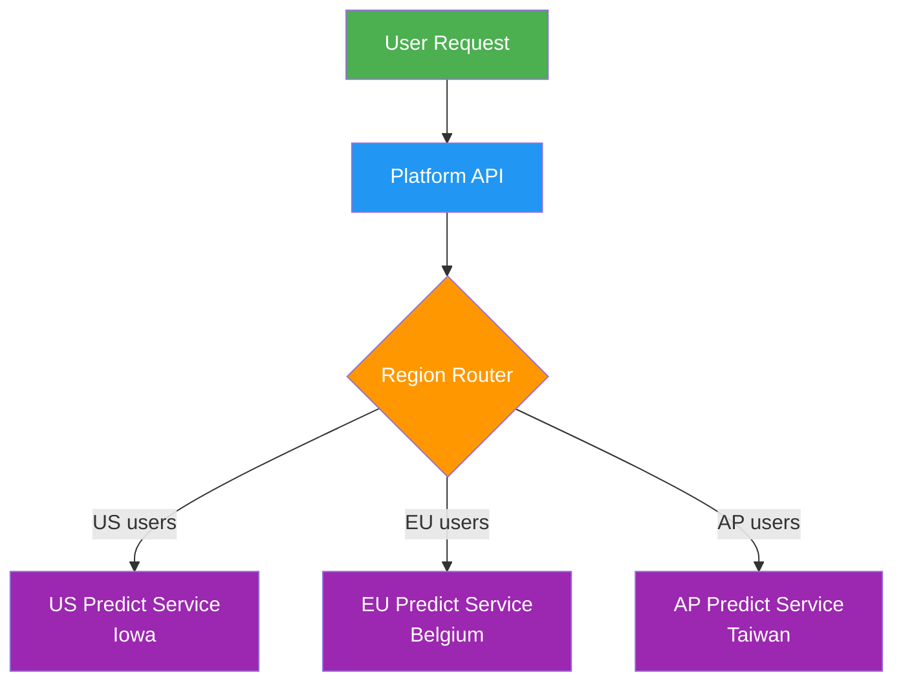

# Deployment

[Ultralytics Platform](https://platform.ultralytics.com) provides comprehensive [model deployment options](../../guides/model-deployment-options.md) for putting your YOLO models into production. Test models with browser-based inference, deploy to dedicated endpoints across 42 global regions, and monitor performance in real-time.

<p align="center">
  <br>
  <iframe loading="lazy" width="720" height="405" src="https://www.youtube.com/embed/JjgQYPetX8w"
    title="YouTube video player" frameborder="0"
    allow="accelerometer; autoplay; clipboard-write; encrypted-media; gyroscope; picture-in-picture; web-share"
    allowfullscreen>
  </iframe>
  <br>
  <strong>Watch:</strong> Get Started with Ultralytics Platform - Deploy
</p>

## Overview

The Deployment section helps you:

- **Test** models directly in the browser with the `Predict` tab
- **Deploy** to dedicated endpoints in 42 global regions
- **Monitor** request metrics, logs, and health checks
- **Scale to zero** when idle (deployments currently run a single active instance)

<!-- screenshot -->

## Deployment Options

Ultralytics Platform offers multiple deployment paths:

| Option                                  | Description                                              | Best For                |
| --------------------------------------- | -------------------------------------------------------- | ----------------------- |
| **[Predict Tab](inference.md)**         | Browser-based inference with image, webcam, and examples | Development, validation |
| **Shared Inference**                    | Multi-tenant service across 3 regions                    | Light usage, testing    |
| **[Dedicated Endpoints](endpoints.md)** | Single-tenant services across 42 regions                 | Production, low latency |

## Workflow


| Stage         | Description                                                              |
| ------------- | ------------------------------------------------------------------------ |
| **Test**      | Validate model with the [`Predict` tab](inference.md)                    |
| **Configure** | Select a region and review the editable, auto-generated deployment name  |
| **Deploy**    | Create a dedicated endpoint from the [`Deploy` tab](endpoints.md)        |
| **Monitor**   | Track requests, latency, errors, and logs in [Monitoring](monitoring.md) |

## Architecture

### Shared Inference

The shared inference service runs in 3 key regions, automatically routing requests based on your data region:



| Region | Location             |
| ------ | -------------------- |
| US     | Iowa, USA            |
| EU     | Belgium, Europe      |
| AP     | Taiwan, Asia-Pacific |

### Dedicated Endpoints

Deploy to 42 regions worldwide on Ultralytics Cloud:

- **Americas**: 14 regions
- **Europe**: 13 regions
- **Asia-Pacific**: 12 regions
- **Middle East & Africa**: 3 regions

Each endpoint is a single-tenant service with:

- Default resources of `1 CPU`, `2 GiB` memory, `minInstances=0`, `maxInstances=1`
- Scale-to-zero when idle
- Unique endpoint URL
- Independent monitoring, logs, and health checks

## Deployments Page

Access the global deployments page from the sidebar under `Deploy`. This page shows:

- **World map** with deployed region pins (interactive map)
- **Overview cards**: Total Requests (24h), Active Deployments, Error Rate (24h), P95 Latency (24h)
- **Deployments list** with three view modes: cards, compact, and table
- **New Deployment** button to create endpoints from any completed model

<!-- screenshot -->
!!! info "Automatic Polling"

    The page polls every 15 seconds normally. When deployments are in a transitional state (`creating`, `deploying`, or `stopping`), polling increases to every 3 seconds for faster feedback.

## Key Features

### Global Coverage

Deploy close to your users with 42 regions covering:

- North America, South America
- Europe, Middle East, Africa
- Asia Pacific, Oceania

### Scaling Behavior

Endpoints currently behave as follows:

- **Scale to zero**: `minInstances` defaults to `0`
- **Single active instance**: `maxInstances` is currently capped at `1` on all plans

### Regional Deployment

Use the measured region latency to place an endpoint near its callers. Actual inference latency depends on the model,
input size, endpoint state, and network path.

### Health Checks

Each running deployment includes an automatic health check with:

- Live status indicator (healthy/unhealthy)
- Response latency display
- Auto-retry when unhealthy (polls every 20 seconds)
- Manual refresh button

## Quick Start

Create a deployment:

1. Train or upload a model to a project
2. Go to the model's **Deploy** tab
3. Select a region from the latency table
4. Click **Deploy** and wait for the deployment status to become **Ready**

!!! example "Quick Deploy"

    ```text
    Model → Deploy tab → Select region → Click Deploy → Endpoint URL ready
    ```

    Once deployed, use the endpoint URL with your API key to send inference requests from any application.

## Quick Links

- [**Inference**](inference.md): Test models in browser
- [**Endpoints**](endpoints.md): Deploy dedicated endpoints
- [**Monitoring**](monitoring.md): Track deployment performance

## FAQ

### What's the difference between shared and dedicated inference?

| Feature     | Shared                       | Dedicated                            |
| ----------- | ---------------------------- | ------------------------------------ |
| **Service** | Shared across Platform users | Dedicated to one deployment          |
| **Scale**   | Managed by Platform          | Scale-to-zero, one instance          |
| **Regions** | 3 data regions               | Choose from 42 deployment regions    |
| **URL**     | Platform model API           | Generated deployment endpoint URL    |
| **Testing** | Model `Predict` tab          | Deployment-card `Predict` tab or API |

### How long does deployment take?

The deployment remains in a creating or deploying state while its service starts. It becomes usable when the status
changes to **Ready**; timing varies by model and region.

### Can I deploy multiple models?

Yes, each model can have multiple endpoints in different regions. Deployment counts are limited by plan: Free `3`, Pro `10`, Enterprise `unlimited`.

### What happens when an endpoint is idle?

With scale-to-zero enabled:

- Endpoint scales down after inactivity
- First request triggers cold start
- Subsequent requests are fast

First requests after an idle period trigger a cold start.
