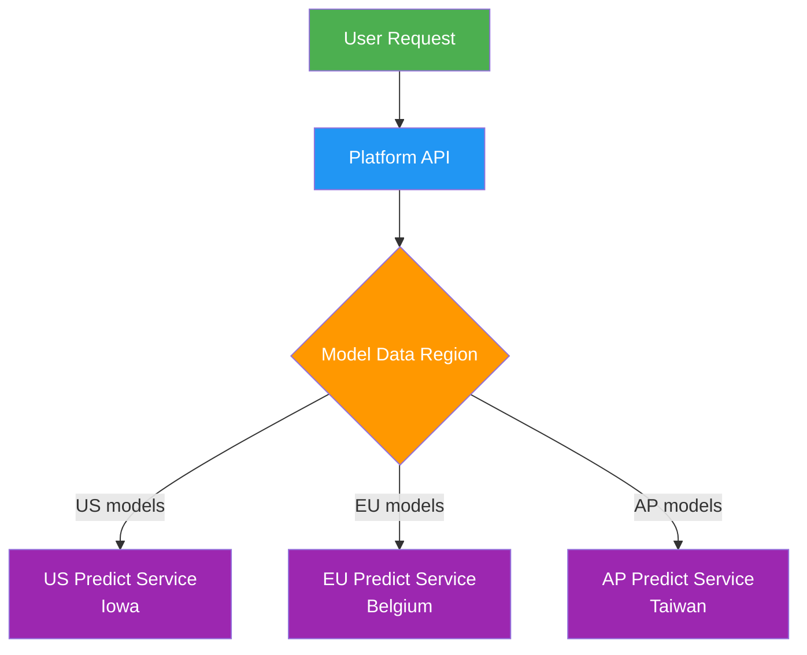

# Deployment

[Ultralytics Platform](https://platform.ultralytics.com) provides comprehensive [model deployment options](../../guides/model-deployment-options.md) for putting your YOLO models into production. Test models with browser-based inference, deploy to dedicated endpoints across 42 global regions, and monitor performance in real-time.

<p align="center">
  <br>
  <iframe loading="lazy" width="720" height="405" src="https://www.youtube.com/embed/JjgQYPetX8w"
    title="YouTube video player" frameborder="0"
    allow="accelerometer; autoplay; clipboard-write; encrypted-media; gyroscope; picture-in-picture; web-share"
    allowfullscreen>
  </iframe>
  <br>
  <strong>Watch:</strong> Get Started with Ultralytics Platform - Deploy
</p>

## Overview

The Deployment section helps you:

- **Test** models directly in the browser with the `Predict` tab
- **Deploy** to dedicated endpoints in 42 global regions
- **Monitor** request metrics, logs, and health checks
- **Scale to zero** when idle (deployments currently run a single active instance)

<!-- screenshot -->

## Deployment Options

Ultralytics Platform offers multiple deployment paths:

| Option                                        | Description                                              | Best For                |
| --------------------------------------------- | -------------------------------------------------------- | ----------------------- |
| **[Predict Tab](inference.md)**               | Browser-based inference with image, webcam, and examples | Development, validation |
| **Shared Inference**                          | Multi-tenant service across 3 data regions               | Light usage, testing    |
| **[Dedicated Endpoints](endpoints.md)**       | Single-tenant services across 42 regions                 | Production, low latency |
| **[Export](../train/models.md#export-model)** | Download weights in 20 formats for local or edge runtime | Offline, on-device      |

## Workflow


```mermaid
graph LR
    A[✅ Test]:::start --> B[⚙️ Configure]:::proc
    B --> C[🌐 Deploy]:::proc
    C --> D[📊 Monitor]:::out

    classDef start fill:#4CAF50,color:#fff
    classDef proc fill:#2196F3,color:#fff
    classDef out fill:#9C27B0,color:#fff
```

| Stage         | Description                                                               |
| ------------- | ------------------------------------------------------------------------- |
| **Test**      | Validate model with the [`Predict` tab](inference.md)                     |
| **Configure** | Select a region; the deployment name is generated from the model and city |
| **Deploy**    | Create a dedicated endpoint from the [`Deploy` tab](endpoints.md)         |
| **Monitor**   | Track requests, latency, errors, and logs in [Monitoring](monitoring.md)  |

## Architecture

### Shared Inference

The shared inference service runs in 3 key regions. Requests to a model are routed to the service in that model's
[data region](../account/settings.md), so results stay inside the region where the model is stored:


```mermaid
graph TB
    User[User Request]:::start --> API[Platform API]:::proc
    API --> Router{Model Data Region}:::decide
    Router -->|US models| US["US Predict Service<br/>Iowa"]:::out
    Router -->|EU models| EU["EU Predict Service<br/>Belgium"]:::out
    Router -->|AP models| AP["AP Predict Service<br/>Taiwan"]:::out

    classDef start fill:#4CAF50,color:#fff
    classDef proc fill:#2196F3,color:#fff
    classDef decide fill:#FF9800,color:#fff
    classDef out fill:#9C27B0,color:#fff
```



### Dedicated Endpoints

Deploy to 42 regions worldwide on Ultralytics Cloud:

- **Americas**: 14 regions
- **Europe**: 13 regions
- **Asia-Pacific**: 12 regions
- **Middle East & Africa**: 3 regions

Each endpoint is a single-tenant service with:

- Platform-managed sizing (not configurable today)
- Scale-to-zero when idle
- Unique endpoint URL with its own interactive API reference at `/docs`
- Its own API key binding, so only that key can call the endpoint
- Independent monitoring, logs, and health checks

## Deployments Page

Access the global deployments page from the sidebar under `Deploy`. This page shows:

- **World map** with deployed region pins; click a region to open the `New Deployment` dialog
- **Overview cards**: Total Requests (24h), Active Deployments, Error Rate (24h), P95 Latency (24h)
- **Deployments list** with three view modes: cards, compact, and table
- **New Deployment** button to create endpoints from any completed model
- **Refresh** button and an `Updated` timestamp in the page header

<!-- screenshot -->
!!! info "Automatic Polling"

    The page refreshes automatically, polling faster while deployments are in a transitional state (`creating`, `deploying`, or `stopping`). See [Monitoring](monitoring.md) for details.

## Key Features

### Global Coverage

Deploy close to your users with 42 regions covering:

- North America, South America
- Europe, Middle East, Africa
- Asia Pacific, Oceania

### Scaling Behavior

Endpoints currently behave as follows:

- **Scale to zero**: idle endpoints scale down to zero and cold-start on the next request
- **Single active instance**: each endpoint currently serves from one instance on all plans
- **Load shedding**: requests receive `429` responses when the endpoint is temporarily at capacity — see [Direct Endpoint Requests](endpoints.md#direct-endpoint-requests)
- **Request timeout**: each request may run for up to 1 hour, which is enough for video inference

### Regional Deployment

Use the measured region latency to place an endpoint near its callers. Actual inference latency depends on the model,
input size, endpoint state, and network path.

### Health Checks

Each running deployment includes an automatic health check with:

- Live status indicator (healthy/unhealthy)
- Response latency display
- Auto-retry when unhealthy, stopping once healthy
- Manual refresh button

## Quick Start

Create a deployment:

1. Train or upload a model to a project
2. Go to the model's **Deploy** tab
3. Select a region from the latency table
4. Click **Deploy** and wait for the deployment status to become **Ready**

!!! example "Quick Deploy"

    ```text
    Model → Deploy tab → Select region → Click Deploy → Endpoint URL ready
    ```

    The deployment name is generated from the model name and the region city, so no naming step is required. Once deployed, use the endpoint URL with your API key to send inference requests from any application.

## Quick Links

- [**Inference**](inference.md): Test models in browser
- [**Endpoints**](endpoints.md): Deploy dedicated endpoints
- [**Monitoring**](monitoring.md): Track deployment performance

## FAQ

### What's the difference between shared and dedicated inference?

| Feature         | Shared                       | Dedicated                                |
| --------------- | ---------------------------- | ---------------------------------------- |
| **Service**     | Shared across Platform users | Dedicated to one deployment              |
| **Scale**       | Managed by Platform          | Scale-to-zero, one instance              |
| **Regions**     | 3 data regions               | Choose from 42 deployment regions        |
| **URL**         | Platform model API           | Generated deployment endpoint URL        |
| **Testing**     | Model `Predict` tab          | Deployment-card `Predict` tab or API     |
| **Rate limits** | 20 requests/minute           | No Platform rate limit on direct calls   |
| **Auth**        | Any workspace API key        | Only the API key bound to the deployment |

### How long does deployment take?

The deployment remains in a creating or deploying state while its service starts. It becomes usable when the status
changes to **Ready**; timing varies by model and region, and typically takes a few minutes.

### Can I deploy multiple models?

Yes, each model can have multiple endpoints in different regions. Deployment counts are limited by plan: Free `3`, Pro
`10`, Enterprise `unlimited`. The quota is charged to the workspace that owns the model, and an endpoint serves exactly
one model at a time — use [model replacement](endpoints.md#replace-a-model) to swap it without changing the URL.

### What happens when an endpoint is idle?

With scale-to-zero enabled:

- Endpoint scales down after inactivity
- First request triggers cold start
- Subsequent requests are fast

First requests after an idle period trigger a cold start. Opening the deployment card runs a health check that warms
the endpoint, so a test prediction right after it responds quickly.
