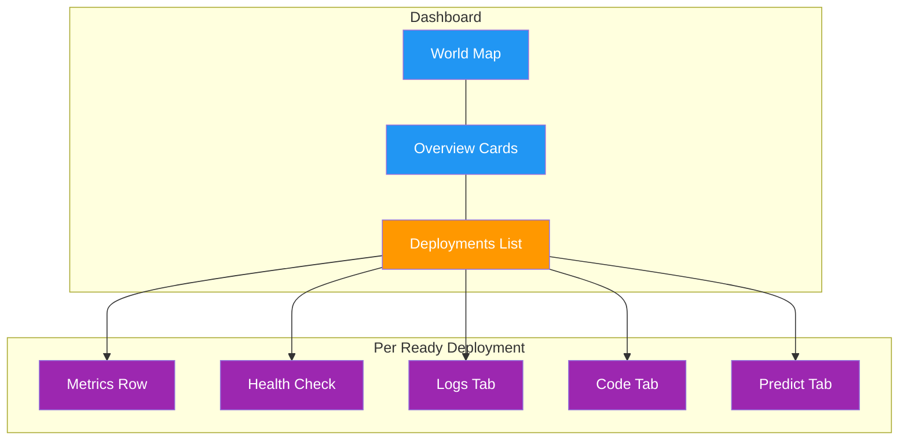

# Monitoring

[Ultralytics Platform](https://platform.ultralytics.com) provides [monitoring for deployed endpoints](../../guides/model-monitoring-and-maintenance.md). Track request metrics, view logs, and check health status with automatic polling.

<!-- screenshot -->

## Deployments Dashboard

The `Deploy` page in the sidebar serves as the monitoring dashboard for all your deployments. It combines the world map, overview metrics, and deployment management in one view. See [Dedicated Endpoints](endpoints.md) for creating and managing deployments.



### Overview Cards

Four summary cards at the top of the page show:

<!-- screenshot -->

| Metric                   | Description                                                             |
| ------------------------ | ----------------------------------------------------------------------- |
| **Total Requests (24h)** | Requests across all endpoints                                           |
| **Active Deployments**   | Endpoints currently in the **Ready** state                              |
| **Error Rate (24h)**     | Share of responses with a 4xx or 5xx status, weighted by request volume |
| **P95 Latency (24h)**    | Average of the hourly 95th-percentile latencies, weighted by volume     |

P95 rather than median latency is reported because health checks return in a couple of milliseconds and would otherwise
dominate the picture of real inference latency.

!!! warning "Error Rate Alert"

    The error rate card highlights in red when the rate exceeds 5%. Check the `Logs` tab on individual deployments to diagnose errors.

### World Map

The interactive world map shows:

- **Region pins** for all 42 available regions
- **Green pins** for regions with a ready deployment
- **Animated blue pins** for regions with active deployments in progress
- **Pin size** varies based on deployment status and latency

Click any region to open the `New Deployment` dialog. The map is hidden on small screens.

<!-- screenshot -->

### Deployments List

Below the overview cards, the deployments list shows all endpoints across your projects. Use the view mode toggle to switch between:

| View        | Description                                                                  |
| ----------- | ---------------------------------------------------------------------------- |
| **Cards**   | Full detail cards with metrics, logs, code, and predict tabs                 |
| **Compact** | Grid of smaller cards (1-4 columns) with key metrics                         |
| **Table**   | DataTable with sortable columns: Name, Region, Status, Requests, P95, Errors |

!!! tip "Real-Time Updates"

    The dashboard refreshes automatically, updating faster while deployments are in a transitional state (`creating`, `deploying`, or `stopping`). Click the refresh button for immediate updates.

## Per-Deployment Metrics

Each deployment card (in cards view) shows real-time metrics. The metrics row, health check, and the `Logs`, `Code`, and `Predict` tabs described below appear only while the deployment is **Ready**:

### Metrics Row

| Metric          | Description                                             |
| --------------- | ------------------------------------------------------- |
| **Requests**    | Request count over the last 24 hours                    |
| **P95 Latency** | Average of hourly 95th-percentile latencies (24h)       |
| **Error Rate**  | Share of 4xx and 5xx responses, shown only when above 0 |

Metrics refresh automatically. Endpoints that have not
served a request show "No traffic yet", and metrics are collected only for deployments in the **Ready** state. On the
deployments dashboard, metrics are fetched for the 20 most recent deployments.

### Health Check

Running deployments show a health check indicator:

| Indicator         | Meaning                          |
| ----------------- | -------------------------------- |
| **Green heart**   | Healthy — shows response latency |
| **Red heart**     | Unhealthy — shows error message  |
| **Spinning icon** | Health check in progress         |

Health checks auto-retry while unhealthy and stop once the endpoint responds. Click the
refresh icon to manually trigger a health check, which doubles as a way to warm a scaled-to-zero endpoint before
sending traffic.

<!-- screenshot -->
!!! info "Cold Start Tolerance"

    Platform gives the health check extra time and retries transient connection failures, so a scale-to-zero endpoint has time to start. If the card reports "Service starting up...", refresh it to pick up an instance that finished booting in the meantime.

## Logs

Each deployment card includes a `Logs` tab for viewing recent log entries:

<!-- screenshot -->

### Log Entries

Each log entry shows:

| Field         | Description                             |
| ------------- | --------------------------------------- |
| **Severity**  | Color-coded bar (see below)             |
| **Timestamp** | Request time (local format)             |
| **Message**   | Log content                             |
| **HTTP info** | Status code and latency (if applicable) |

=== "Severity Levels"

    Each entry carries a color-coded severity bar:

    | Level        | Color  | Description         |
    | ------------ | ------ | ------------------- |
    | **DEBUG**    | Gray   | Debug messages      |
    | **INFO**     | Blue   | Normal requests     |
    | **WARNING**  | Amber  | Non-critical issues |
    | **ERROR**    | Red    | Failed requests     |
    | **CRITICAL** | Red    | Critical failures   |

    The API accepts the full set of log severities as a comma-separated filter: `DEBUG`, `INFO`, `NOTICE`, `WARNING`, `ERROR`, `CRITICAL`, `ALERT`, and `EMERGENCY`.

=== "Log Controls"

    | Control     | Description                         |
    | ----------- | ----------------------------------- |
    | **Errors**  | Filter to ERROR and WARNING entries |
    | **All**     | Show all log entries                |
    | **Copy**    | Copy all visible logs to clipboard  |
    | **Refresh** | Reload log entries                  |

The UI shows the 20 most recent entries and hides empty ones. The API defaults to 50 entries per request (max 200) and
returns a `nextPageToken` for paging further back.

!!! tip "Debugging Workflow"

    When investigating errors: first click **Errors** to filter to ERROR and WARNING entries, then review timestamps and HTTP status codes. Copy logs to clipboard for sharing with your team.

## Code Examples

Each deployment card includes a `Code` tab showing ready-to-use API code with the endpoint URL filled in. For workspace
owners, the deployment's bound API key is inserted, ready to copy and run. Non-owners see a `YOUR_API_KEY`
placeholder:

=== "Python"

    ```python
    import requests

    # Deployment endpoint
    url = "https://YOUR_DEPLOYMENT_URL.run.app/predict"

    # Headers with your deployment API key
    headers = {"Authorization": "Bearer YOUR_API_KEY"}

    # Inference parameters
    data = {"conf": 0.25, "iou": 0.7, "imgsz": 640}

    # Send image for inference
    with open("image.jpg", "rb") as f:
        response = requests.post(url, headers=headers, data=data, files={"file": f})

    print(response.json())
    ```

=== "JavaScript"

    ```javascript
    // Build form data with image and parameters
    const formData = new FormData();
    formData.append("file", fileInput.files[0]);
    formData.append("conf", "0.25");
    formData.append("iou", "0.7");
    formData.append("imgsz", "640");

    // Send image for inference
    const response = await fetch(
      "https://YOUR_DEPLOYMENT_URL.run.app/predict",
      {
        method: "POST",
        headers: { Authorization: "Bearer YOUR_API_KEY" },
        body: formData,
      }
    );

    const result = await response.json();
    console.log(result);
    ```

=== "cURL"

    ```bash
    # Send image for inference
    curl -X POST "https://YOUR_DEPLOYMENT_URL.run.app/predict" \
      -H "Authorization: Bearer YOUR_API_KEY" \
      -F "file=@image.jpg" \
      -F "conf=0.25" \
      -F "iou=0.7" \
      -F "imgsz=640"
    ```

!!! note "Auto-Populated Credentials"

    When viewing the `Code` tab in the platform, the endpoint URL and, for workspace owners, the deployment's [bound API key](endpoints.md#authentication) are filled in for you. See [API Keys](../account/api-keys.md) to generate a key.

## Deployment Predict

The `Predict` tab on each deployment card provides an inline predict panel — the same interface as the model's `Predict` tab, but running inference through the deployment endpoint instead of the shared service. This is useful for testing a deployed endpoint directly from the browser. See [Inference](inference.md) for parameter details and response formats.

## API Endpoints

Every deployment is addressed by its owner and deployment name, and each route requires an API key. See the
[API reference](../api/index.md) for authentication details.

### Deployment Metrics

```http
GET /api/deployments/{owner}/{deployment}/metrics?range=24h
```

**Python SDK:** `client.deployments.metrics(owner, deployment, range="24h")`

Returns the full metrics payload for a deployment: a `summary` block with total requests, error count and rate, and
average, P50, P95, and P99 latency, plus `timeSeries` arrays for requests, errors, P50 and P95 latency, CPU and memory
utilization, and instance count.

| Parameter   | Type   | Description                                                      |
| ----------- | ------ | ---------------------------------------------------------------- |
| `range`     | string | Time range: `1h`, `6h`, `24h`, `7d`, or `30d` (default `24h`)    |
| `sparkline` | bool   | Return the compact dashboard summary instead of the full payload |

With `sparkline=true`, the response is the compact form the deployment cards use — 24 hourly request counts plus total
requests, error rate, and average latency. This is the call that refreshes every 60 seconds.

### Deployment Logs

```http
GET /api/deployments/{owner}/{deployment}/logs?limit=50&severity=ERROR,WARNING
```

**Python SDK:** `client.deployments.logs(owner, deployment, limit=50, severity="ERROR,WARNING")`

Returns recent log entries with optional severity filter and pagination.

| Parameter   | Type   | Description                                   |
| ----------- | ------ | --------------------------------------------- |
| `limit`     | int    | Max entries to return (default: 50, max: 200) |
| `severity`  | string | Comma-separated severity filter               |
| `pageToken` | string | Pagination token from previous response       |

### Deployment Health

```http
GET /api/deployments/{owner}/{deployment}/health
```

**Python SDK:** `client.deployments.health(owner, deployment)`

Pings the deployment and returns its health status with the measured round-trip latency:

```json
{
    "healthy": true,
    "status": 200,
    "latencyMs": 142
}
```

An unhealthy response omits `status` when the endpoint could not be reached at all, and adds an `error` message.

!!! note "Dashboard Overview"

    The aggregated numbers on the `Deploy` page are not available as a single REST endpoint. Reproduce them by calling the metrics route for each deployment returned by `GET /api/deployments/{owner}` (`client.deployments.list(owner)`).

## Performance Optimization

Use monitoring data to optimize your deployments:

=== "High Latency"

    If latency is too high:

    1. Verify the model size is appropriate
    2. Consider a closer region
    3. Check the image size sent with each request

    !!! example "Reducing Latency"

        Try a smaller `imgsz` value and compare the resulting latency and accuracy for your model. Deploy to a region
        closer to callers to reduce network latency.

=== "High Error Rate"

    If errors are occurring:

    1. Review error logs in the `Logs` tab
    2. Check request format (multipart form required)
    3. If calling through the Platform predict proxy, verify the bound API key is still active (revoking the key does not affect direct endpoint calls)
    4. Retry a request and compare its timestamp with the deployment logs

    A burst of `429` responses means the endpoint is temporarily at capacity rather than broken — honor the `Retry-After` header and retry.

=== "Scaling Issues"

    If hitting capacity:

    1. Reduce the inference image size or use a smaller model
    2. Deploy additional endpoints and distribute requests between them
    3. Honor the `Retry-After` header on `429` responses and retry transient failures with backoff

## FAQ

### How long is data retained?

The metrics API supports selectable windows from 1 hour through 30 days, sampled more coarsely as the window grows —
1-minute buckets over 1 hour up to 4-hour buckets over 30 days. The deployment card shows the 20 most recent log
entries; the logs API can return up to 200 entries per request and supports pagination.

Metrics and logs are retained only while the deployment exists, so deleting a deployment also ends access to its history.
Export anything you need to keep before deleting an endpoint.

### Can I monitor multiple endpoints together?

Yes, the deployments page shows all endpoints with aggregated overview cards. Use the table view to compare performance across deployments.

### Do stopped deployments still report metrics?

No. Metrics and health checks are collected only for deployments in the **Ready** state. A stopped endpoint keeps its
card and history window but shows no live numbers until you start it again.
