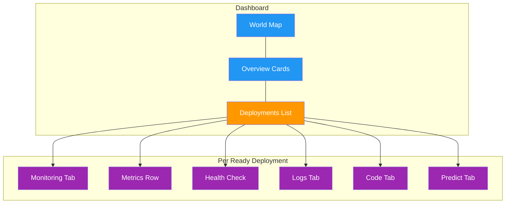

# Monitoring

[Ultralytics Platform](https://platform.ultralytics.com) provides [monitoring for deployed endpoints](../../guides/model-monitoring-and-maintenance.md). Review captured predictions, connect an RTSP camera for live inference, and track prediction quality and endpoint performance alongside logs and health checks.

<!-- screenshot -->

## Deployments Dashboard

The `Deploy` page in the sidebar serves as the monitoring dashboard for all your deployments. It combines the world map, overview metrics, and deployment management in one view. See [Dedicated Endpoints](endpoints.md) for creating and managing deployments.



### Overview Cards

Four summary cards at the top of the page show:

<!-- screenshot -->

| Metric                   | Description                                                             |
| ------------------------ | ----------------------------------------------------------------------- |
| **Total Requests (24h)** | Requests across all endpoints                                           |
| **Active Deployments**   | Endpoints currently in the **Ready** state                              |
| **Error Rate (24h)**     | Share of responses with a 4xx or 5xx status, weighted by request volume |
| **P95 Latency (24h)**    | Average of the hourly 95th-percentile latencies, weighted by volume     |

P95 rather than median latency is reported because health checks return in a couple of milliseconds and would otherwise
dominate the picture of real inference latency.

!!! warning "Error Rate Alert"

    The error rate card highlights in red when the rate exceeds 5%. Check the `Logs` tab on individual deployments to diagnose errors.

### World Map

The interactive world map shows:

- **Region pins** for all 42 available regions
- **Green pins** for regions with a ready deployment
- **Animated blue pins** for regions with active deployments in progress
- **Pin size** varies based on deployment status and latency

Click any region to open the `New Deployment` dialog. The map is hidden on small screens.

<!-- screenshot -->

### Deployments List

Below the overview cards, the deployments list shows all endpoints across your projects. Use the view mode toggle to switch between:

| View        | Description                                                                  |
| ----------- | ---------------------------------------------------------------------------- |
| **Cards**   | Full detail cards with monitoring, logs, code, and predict tabs              |
| **Compact** | Grid of smaller cards (1-4 columns) with key metrics                         |
| **Table**   | DataTable with sortable columns: Name, Region, Status, Requests, P95, Errors |

!!! tip "Real-Time Updates"

    The dashboard refreshes automatically, updating faster while deployments are in a transitional state (`creating`, `deploying`, or `stopping`). Click the refresh button for immediate updates.

## Per-Deployment Metrics

Each deployment card (in cards view) shows real-time metrics. The metrics row, health check, and the `Logs`, `Code`, and `Predict` tabs described below appear only while the deployment is **Ready**:

### Metrics Row

| Metric          | Description                                             |
| --------------- | ------------------------------------------------------- |
| **Requests**    | Request count over the last 24 hours                    |
| **P95 Latency** | Average of hourly 95th-percentile latencies (24h)       |
| **Error Rate**  | Share of 4xx and 5xx responses, shown only when above 0 |

Metrics refresh automatically. Endpoints that have not
served a request show "No traffic yet", and metrics are collected only for deployments in the **Ready** state. On the
deployments dashboard, metrics are fetched for the 20 most recent deployments.

### Health Check

Running deployments show a health check indicator:

| Indicator         | Meaning                          |
| ----------------- | -------------------------------- |
| **Green heart**   | Healthy — shows response latency |
| **Red heart**     | Unhealthy — shows error message  |
| **Spinning icon** | Health check in progress         |

Health checks auto-retry while unhealthy and stop once the endpoint responds. Click the
refresh icon to manually trigger a health check, which doubles as a way to warm a scaled-to-zero endpoint before
sending traffic.

<!-- screenshot -->

!!! info "Cold Start Tolerance"

    Platform gives the health check extra time and retries transient connection failures, so a scale-to-zero endpoint has time to start. If the card reports "Service starting up...", refresh it to pick up an instance that finished booting in the meantime.

## Monitoring Tab

For paid endpoints, **Monitoring** is the first tab on a **Ready** deployment. It contains the camera preview, **Last Predictions**, and prediction and runtime charts, in that order. Free endpoints do not show this tab.

Send an image through the endpoint's `Predict` tab or API to start collecting prediction data. You can also connect an RTSP camera to run continuous inference.

!!! note "Paid Instances Required"

    The Monitoring tab, including camera previews, captured predictions, and charts, is available only on paid instances. A free instance does not show Monitoring, even if your workspace has a paid plan.

### CPU and Memory Configuration

Choose **CPU** and **Memory** when creating an endpoint to provision a more powerful instance for larger models or higher inference throughput. Available options range from **1 to 8 vCPU** and **2 to 32 GiB** of memory; the dialog validates supported combinations and shows the estimated endpoint cost.

To resize an existing endpoint:

1. Find the **Ready** deployment in cards view.
2. Click its **Update configuration** icon.
3. Select the CPU and memory allocation and review the cost estimate.
4. Click **Update Configuration**. The endpoint keeps serving its current configuration until the new one is ready.

Use **CPU & RAM Usage**, **Prediction Latency**, and the camera's **Frame Rate** chart to assess the change. More CPU can improve inference throughput, while more memory provides room for larger workloads; a larger instance does not guarantee that inference FPS will match source FPS.

### Live Camera Preview

Connect a camera from the top of the `Monitoring` tab:

1. Click **Connect** to open the **Connect Camera** dialog.
2. Enter the camera's **RTSP URL**, for example `rtsp://camera.example.com/stream`.
3. Click **Connect**. The dialog closes after the request is accepted; the preview shows the connection status while the camera starts.
4. Once frames arrive, use the **Annotations** toggle to switch between the original image and model predictions.

Hover over the preview to reveal the **Disconnect camera** stop button in the top-right corner. To change the camera URL, disconnect first, then click **Connect** again.

!!! note "Camera Connectivity"

    The camera must be reachable from the deployed endpoint, not just from your browser or local network. Include credentials in the RTSP URL if the camera requires authentication. A connecting state means the request was accepted, not that frames are already arriving.

The preview displays the latest camera frames on the left and session statistics on the right. Statistics appear only after camera data arrives:

| Metric                | Description                                                                                  |
| --------------------- | -------------------------------------------------------------------------------------------- |
| **Session coverage**  | Percentage of received source frames processed by the model during this session              |
| **Uptime / downtime** | Time the camera session has spent receiving frames versus waiting for frames                 |
| **Last frame**        | Time of the most recently received frame                                                     |
| **Frame Rate**        | Source and inference FPS, shown as rolling 5-second averages over the recent session history |

Source FPS measures incoming frames; inference FPS measures frames processed by the model. Inference FPS can be lower when the model cannot process every source frame. Compare them when choosing a model, image size, or endpoint resources.

### Last Predictions

**Last Predictions** shows up to the latest **100 captured images**, retained for up to **30 days**. Use the view toggle to switch between cards, compact, and table views. Cards and compact views initially show three rows; click **Show all** to expand the gallery. Click an image to inspect its predictions in the full-screen viewer, and use the visibility controls to show or hide annotations and labels.

!!! info "Sampled Predictions"

    Captures are best-effort samples, not a recording of every prediction or camera frame. Images count toward workspace storage. Inference continues when capture is busy or storage is full, so gallery counts can differ from request counts and live inference activity.

To reuse predictions for training:

1. Select images in **Last Predictions**.
2. Click **Add to dataset**.
3. Choose a dataset and split, then confirm.

Selected images move into the dataset with their predictions as labels. Duplicate images remain in **Last Predictions**. Review the predicted labels before using them for training.

### Chart Controls

The grouping, interval, and date controls appear **below Last Predictions** and apply to the charts and metrics that follow. They do not filter the image gallery or camera preview.

| Control        | Options                                              |
| -------------- | ---------------------------------------------------- |
| **Group by**   | **No grouping** or **Class**, for tasks with classes |
| **Interval**   | **Hourly**, **Daily**, or **Monthly**                |
| **Date range** | Defaults to today; select a range of up to 366 days  |

Hourly intervals support up to 31 days. Selecting a longer range switches the interval to daily. Class grouping shows the top 20 classes in applicable charts.

### Prediction Charts

Prediction charts describe captured samples. Available charts depend on the model task and collected data:

| Chart                                             | What it shows                                                                     |
| ------------------------------------------------- | --------------------------------------------------------------------------------- |
| **Prediction Volume**                             | Captured images and predictions over time, or counts by class                     |
| **Images by Predicted Class**                     | Percentage of images containing each class; one image can contain several classes |
| **Predictions per Image**                         | Number of predictions per captured image                                          |
| **Confidence over Time**                          | Mean prediction confidence over the selected period                               |
| **Confidence Distribution / Confidence by Class** | Confidence in 5% bands and mean confidence for each top class                     |
| **Prediction locations**                          | Heatmap of where predictions occur within images                                  |
| **Image and bounding box dimensions**             | Width, height, aspect ratio, and bounding box area distributions                  |
| **Prediction Latency**                            | Prediction call duration before capture, with approximate percentiles             |
| **Latency Distribution**                          | Distribution of prediction call durations in milliseconds                         |

!!! tip "Confidence Is Not Accuracy"

    Confidence describes the model's predictions, not their correctness. Use changes in confidence or class distribution to identify samples worth reviewing, then validate accuracy against labeled data.

### Runtime Metrics

Runtime charts describe endpoint activity, including requests other than inference:

| Chart                     | What it shows                                                                         |
| ------------------------- | ------------------------------------------------------------------------------------- |
| **Requests and Errors**   | All endpoint requests, responses with 4xx or 5xx status, and server errors separately |
| **Observed Availability** | Percentage of requests without server errors; periods without requests are unobserved |
| **CPU & RAM Usage**       | Mean resource utilization across serving instances                                    |

Observed availability is request-based, while the camera's uptime and downtime describe its current stream session. Prediction latency measures prediction calls; runtime request metrics also include traffic such as health checks.

!!! info "Automatic Updates"

    Last Predictions and camera connection details refresh every 5 seconds. The live preview streams frames as they arrive. Prediction charts and runtime metrics refresh every 60 seconds while displayed; new data can take additional time to appear after collection.

## Logs

Each deployment card includes a `Logs` tab for viewing recent log entries:

<!-- screenshot -->

### Log Entries

Each log entry shows:

| Field         | Description                             |
| ------------- | --------------------------------------- |
| **Severity**  | Color-coded bar (see below)             |
| **Timestamp** | Request time (local format)             |
| **Message**   | Log content                             |
| **HTTP info** | Status code and latency (if applicable) |

=== "Severity Levels"

    Each entry carries a color-coded severity bar:

    | Level        | Color | Description         |
    | ------------ | ----- | ------------------- |
    | **DEBUG**    | Gray  | Debug messages      |
    | **INFO**     | Blue  | Normal requests     |
    | **WARNING**  | Amber | Non-critical issues |
    | **ERROR**    | Red   | Failed requests     |
    | **CRITICAL** | Red   | Critical failures   |

    The API accepts the full set of log severities as a comma-separated filter: `DEBUG`, `INFO`, `NOTICE`, `WARNING`, `ERROR`, `CRITICAL`, `ALERT`, and `EMERGENCY`.

=== "Log Controls"

    | Control     | Description                         |
    | ----------- | ----------------------------------- |
    | **Errors**  | Filter to ERROR and WARNING entries |
    | **All**     | Show all log entries                |
    | **Copy**    | Copy all visible logs to clipboard  |
    | **Refresh** | Reload log entries                  |

The UI shows the 20 most recent entries and hides empty ones. The API defaults to 50 entries per request (max 200) and
returns a `nextPageToken` for paging further back.

!!! tip "Debugging Workflow"

    When investigating errors: first click **Errors** to filter to ERROR and WARNING entries, then review timestamps and HTTP status codes. Copy logs to clipboard for sharing with your team.

## Code Examples

Each deployment card includes a `Code` tab showing ready-to-use API code with the endpoint URL filled in. For workspace
owners, the deployment's bound API key is inserted, ready to copy and run. Non-owners see a `YOUR_API_KEY`
placeholder:

=== "Python"

    ```python
    import requests

    # Deployment endpoint
    url = "https://YOUR_DEPLOYMENT_URL.run.app/predict"

    # Headers with your deployment API key
    headers = {"Authorization": "Bearer YOUR_API_KEY"}

    # Inference parameters
    data = {"conf": 0.25, "iou": 0.7, "imgsz": 640}

    # Send image for inference
    with open("image.jpg", "rb") as f:
        response = requests.post(url, headers=headers, data=data, files={"file": f})

    print(response.json())
    ```

=== "JavaScript"

    ```javascript
    // Build form data with image and parameters
    const formData = new FormData();
    formData.append("file", fileInput.files[0]);
    formData.append("conf", "0.25");
    formData.append("iou", "0.7");
    formData.append("imgsz", "640");

    // Send image for inference
    const response = await fetch(
      "https://YOUR_DEPLOYMENT_URL.run.app/predict",
      {
        method: "POST",
        headers: { Authorization: "Bearer YOUR_API_KEY" },
        body: formData,
      }
    );

    const result = await response.json();
    console.log(result);
    ```

=== "cURL"

    ```bash
    # Send image for inference
    curl -X POST "https://YOUR_DEPLOYMENT_URL.run.app/predict" \
      -H "Authorization: Bearer YOUR_API_KEY" \
      -F "file=@image.jpg" \
      -F "conf=0.25" \
      -F "iou=0.7" \
      -F "imgsz=640"
    ```

!!! note "Auto-Populated Credentials"

    When viewing the `Code` tab in the platform, the endpoint URL and, for workspace owners, the deployment's [bound API key](endpoints.md#authentication) are filled in for you. See [API Keys](../account/api-keys.md) to generate a key.

## Deployment Predict

The `Predict` tab on each deployment card provides an inline predict panel — the same interface as the model's `Predict` tab, but running inference through the deployment endpoint instead of the shared service. This is useful for testing a deployed endpoint directly from the browser. See [Inference](inference.md) for parameter details and response formats.

## API Endpoints

Every deployment is addressed by its owner and deployment name, and each route requires an API key. See the
[API reference](../api/index.md) for authentication details.

### Deployment Metrics

```http
GET /api/deployments/{owner}/{deployment}/metrics?range=24h
```

**Python SDK:** `client.deployments.metrics(owner, deployment, range="24h")`

Returns the full metrics payload for a deployment: a `summary` block with total requests, error count and rate, and
average, P50, P95, and P99 latency, plus `timeSeries` arrays for requests, errors, P50 and P95 latency, CPU and memory
utilization, and instance count.

| Parameter    | Type   | Description                                                                 |
| ------------ | ------ | --------------------------------------------------------------------------- |
| `range`      | string | Time range: `1h`, `6h`, `24h`, `7d`, or `30d` (default `24h`)               |
| `sparkline`  | bool   | Return the compact dashboard summary instead of the full payload            |
| `from`, `to` | string | Optional ISO 8601 start and end timestamps; supply both to override `range` |
| `interval`   | string | Bucket size for explicit dates: `hour`, `day`, or `month` (default `day`)   |

With `sparkline=true`, the response is the compact form the deployment cards use — 24 hourly request counts plus total
requests, error rate, and average latency. This is the call that refreshes every 60 seconds.

### Prediction Statistics

```http
GET /api/deployments/{owner}/{deployment}/statistics?from=2026-09-01T00:00:00Z&to=2026-09-02T00:00:00Z&interval=hour
```

Returns aggregated statistics for captured predictions, including volume, classes, confidence, dimensions, locations, and prediction latency. Supply `from` and `to` as ISO 8601 timestamps and an `interval` of `hour`, `day`, or `month`. Hourly queries support up to 31 days; daily and monthly queries support up to 366 days. The same limits apply to explicit date ranges on the metrics route.

### Captured Images

```http
GET /api/deployments/{owner}/{deployment}/images
```

Returns the latest captured images and their prediction metadata, newest first. Add `?imageId=IMAGE_ID` to retrieve an individual capture with its labels for detailed inspection.

### Deployment Logs

```http
GET /api/deployments/{owner}/{deployment}/logs?limit=50&severity=ERROR,WARNING
```

**Python SDK:** `client.deployments.logs(owner, deployment, limit=50, severity="ERROR,WARNING")`

Returns recent log entries with optional severity filter and pagination.

| Parameter   | Type   | Description                                   |
| ----------- | ------ | --------------------------------------------- |
| `limit`     | int    | Max entries to return (default: 50, max: 200) |
| `severity`  | string | Comma-separated severity filter               |
| `pageToken` | string | Pagination token from previous response       |

### Deployment Health

```http
GET /api/deployments/{owner}/{deployment}/health
```

**Python SDK:** `client.deployments.health(owner, deployment)`

Pings the deployment and returns its health status with the measured round-trip latency:

```json
{
    "healthy": true,
    "status": 200,
    "latencyMs": 142
}
```

An unhealthy response omits `status` when the endpoint could not be reached at all, and adds an `error` message.

!!! note "Dashboard Overview"

    The aggregated numbers on the `Deploy` page are not available as a single REST endpoint. Reproduce them by calling the metrics route for each deployment returned by `GET /api/deployments/{owner}` (`client.deployments.list(owner)`).

## Performance Optimization

Use monitoring data to optimize your deployments:

=== "High Latency"

    If latency is too high:

    1. Verify the model size is appropriate
    2. Consider a closer region
    3. Check the image size sent with each request

    !!! example "Reducing Latency"

        Try a smaller `imgsz` value and compare the resulting latency and accuracy for your model. Deploy to a region
        closer to callers to reduce network latency.

=== "High Error Rate"

    If errors are occurring:

    1. Review error logs in the `Logs` tab
    2. Check request format (multipart form required)
    3. If calling through the Platform predict proxy, verify the bound API key is still active (revoking the key does not affect direct endpoint calls)
    4. Retry a request and compare its timestamp with the deployment logs

    A burst of `429` responses means the endpoint is temporarily at capacity rather than broken — honor the `Retry-After` header and retry.

=== "Scaling Issues"

    If hitting capacity:

    1. Reduce the inference image size or use a smaller model
    2. Deploy additional endpoints and distribute requests between them
    3. Honor the `Retry-After` header on `429` responses and retry transient failures with backoff

## FAQ

### How long is data retained?

Captured images are retained for up to **30 days**, with the latest **100** available in Last Predictions. Move images you want to keep into a dataset before they expire.

The chart date picker supports queries of up to 366 days, depending on the selected interval and available history. The metrics API also supports preset windows from 1 hour through 30 days. A selectable range does not guarantee data exists for the whole period.

The deployment card shows the 20 most recent log entries; the logs API supports up to 200 entries per request and pagination. Deleting a deployment ends access to its monitoring history through the deployment routes.

### Can I monitor multiple endpoints together?

Yes, the deployments page shows all endpoints with aggregated overview cards. Use the table view to compare performance across deployments.

### Do stopped deployments still report metrics?

No. Metrics and health checks are collected only for deployments in the **Ready** state. A stopped endpoint keeps its
card and history window but shows no live numbers until you start it again.
