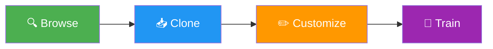

# Explore

[Ultralytics Platform](https://platform.ultralytics.com) Explore page showcases public content from the community. Discover datasets and projects for inspiration and learning.

<!-- Screenshot: platform-explore-page.avif -->

```mermaid
graph LR
    A[🔍 Browse] --> B[📥 Clone]
    B --> C[✏️ Customize]
    C --> D[🚀 Train]

    style A fill:#4CAF50,color:#fff
    style B fill:#2196F3,color:#fff
    style C fill:#FF9800,color:#fff
    style D fill:#9C27B0,color:#fff
```

## Overview

The Explore page features two tabs:

- **Public Datasets**: Community training data with image previews
- **Public Projects**: Complete experiments containing trained models

Official Ultralytics content (e.g., `@ultralytics` projects and datasets) is pinned to the top of results.

## Browse Content

### Tabs

The Explore page uses a tabbed interface with `Datasets` and `Projects` tabs. Each tab has its own search, sort, and view mode controls.

| Tab          | Description                                       |
| ------------ | ------------------------------------------------- |
| **Datasets** | Labeled image collections for training (default)  |
| **Projects** | Organized model collections with training results |

### Search and Sort

Each tab provides a search bar and sort options:

<!-- Screenshot: platform-explore-datasets-tab-with-search.avif -->

| Sort Option      | Description                                         |
| ---------------- | --------------------------------------------------- |
| **Most Starred** | Content with most community stars (default)         |
| **Newest**       | Most recently created                               |
| **Oldest**       | Oldest first                                        |
| **Name A-Z**     | Alphabetical ascending                              |
| **Name Z-A**     | Alphabetical descending                             |
| **Most/Fewest**  | By image count (datasets) or model count (projects) |

### View Modes

Toggle between three view modes for browsing:

| Mode        | Description                           |
| ----------- | ------------------------------------- |
| **Cards**   | Grid of preview cards with thumbnails |
| **Compact** | Smaller cards in a two-column grid    |
| **Table**   | Sortable table with columns           |

Cards and compact views support infinite scroll for loading more results.

## Content Cards

Each item displays:

<!-- Screenshot: platform-explore-dataset-and-project-cards.avif -->

**Project Cards Show:**

| Element          | Description                     |
| ---------------- | ------------------------------- |
| **Icon**         | Project icon with custom colors |
| **Name**         | Project title                   |
| **Creator**      | Author avatar and username      |
| **Description**  | Short project description       |
| **Model Count**  | Number of models in the project |
| **Model Tags**   | Names of models in the project  |
| **Public Badge** | Visibility indicator            |

**Dataset Cards Show:**

| Element         | Description                            |
| --------------- | -------------------------------------- |
| **Thumbnails**  | Preview images from the dataset        |
| **Name**        | Dataset title                          |
| **Creator**     | Author avatar and username             |
| **Task Badge**  | YOLO task type (detect, segment, etc.) |
| **Image Count** | Number of images in the dataset        |

## Use Public Content

### Clone Dataset

Use a public dataset for your training:

1. Click on the dataset
2. Click **Clone**
3. Dataset copies to your account

Cloned datasets:

- Are private by default
- Can be modified
- Don't affect the original

### Download Model

Download a public model:

1. Click on the model
2. Click **Download**
3. Select format (PT, ONNX, etc.)

### Clone Project

Copy a public project to your workspace:

1. Click on the project
2. Click **Clone**
3. Project copies with all models

## Official Ultralytics Content

Official `@ultralytics` content is pinned to the top of the Explore page. This includes:

| Project    | Description                 | Models                       |
| ---------- | --------------------------- | ---------------------------- |
| **YOLO26** | Latest January 2026 release | 27 models (all sizes, tasks) |
| **YOLO11** | Current stable release      | 10+ models                   |
| **YOLOv8** | Previous generation         | Various                      |
| **YOLOv5** | Legacy, widely adopted      | Various                      |

Official datasets include benchmark datasets like COCO, VOC, and other commonly used computer vision datasets.

## User Profiles

Click on a creator's username to view their public profile at `platform.ultralytics.com/{username}`. Public profiles show:

<!-- Screenshot: platform-user-profile-public-content.avif -->

| Section      | Content                      |
| ------------ | ---------------------------- |
| **Bio**      | User description and company |
| **Links**    | Social profiles              |
| **Projects** | Public projects with models  |
| **Datasets** | Public datasets              |

## Make Your Content Public

Make your work available to the community:

### Make Dataset Public

1. Go to your dataset
2. Open actions menu
3. Click **Edit**
4. Set visibility to **Public**
5. Click **Save**

### Make Project Public

1. Go to your project
2. Open actions menu
3. Click **Edit**
4. Set visibility to **Public**
5. Click **Save**

!!! tip "Quality Content"

    Before making content public:

    - Add clear descriptions
    - Include class names
    - Verify data quality
    - Test model performance

## Guidelines

When contributing public content:

### Do

- Provide useful, high-quality content
- Write clear descriptions
- Include relevant metadata
- Respond to questions
- Credit data sources

### Don't

- Upload sensitive/private data
- Violate copyrights
- Upload inappropriate content
- Spam low-quality content
- Misrepresent performance

## FAQ

### Can I use public content commercially?

Check individual content licenses. Most community content is for:

- Research and education
- Personal projects
- Non-commercial use

Contact creators for commercial licensing.

### How do I report inappropriate content?

1. Click the report button on the content
2. Select violation type
3. Add details
4. Submit report

Our team reviews reports within 24-48 hours.

### Can I make public content private again?

Yes, you can change visibility anytime:

1. Open content settings
2. Change visibility to **Private**
3. Save changes

Existing clones are not affected.

### How do I get featured?

Featured content is selected based on:

- Quality and usefulness
- Community engagement
- Novelty and interest
- Clear documentation

There's no application process - just create great content!

### Can I monetize public content?

Currently, the Platform doesn't support monetization. This may be added in future updates.
