# Explore

[Ultralytics Platform](https://platform.ultralytics.com) Explore page showcases public content from the community. Discover datasets, models, and projects for inspiration and learning.

```mermaid
graph LR
    A[🔍 Browse] --> B[📥 Clone/Fork]
    B --> C[✏️ Customize]
    C --> D[🚀 Train]

    style A fill:#4CAF50,color:#fff
    style B fill:#2196F3,color:#fff
    style C fill:#FF9800,color:#fff
    style D fill:#9C27B0,color:#fff
```

<!-- Screenshot: platform-explore-page.avif -->

## Overview

The Explore page features:

- **Public Datasets**: Community training data
- **Public Models**: Trained checkpoints ready to use
- **Public Projects**: Complete experiments and workflows
- **User Profiles**: Creators and their contributions

## Browse Content

### Content Types

| Type         | Description                            |
| ------------ | -------------------------------------- |
| **Datasets** | Labeled image collections for training |
| **Models**   | Trained YOLO checkpoints               |
| **Projects** | Organized model collections            |

### Filtering

Filter content to find what you need:

<!-- Screenshot: platform-explore-search.avif -->

| Filter   | Options                              |
| -------- | ------------------------------------ |
| **Type** | Datasets, Models, Projects           |
| **Task** | Detect, Segment, Pose, OBB, Classify |
| **Sort** | Recent, Popular, Most Downloaded     |

### Search

Search by:

- Content name
- Description keywords
- Creator username
- Class names

## Content Cards

Each item displays:

<!-- Screenshot: platform-explore-cards.avif -->

| Element       | Description             |
| ------------- | ----------------------- |
| **Thumbnail** | Preview image           |
| **Name**      | Content title           |
| **Creator**   | Author with avatar      |
| **Stats**     | Downloads, views, likes |
| **Task**      | YOLO task type badge    |

## Use Public Content

### Clone Dataset

Use a public dataset for your training:

1. Click on the dataset
2. Click **Clone**
3. Dataset copies to your account

Cloned datasets:

- Are private by default
- Can be modified
- Don't affect the original

### Download Model

Download a public model:

1. Click on the model
2. Click **Download**
3. Select format (PT, ONNX, etc.)

### Fork Project

Copy a public project:

1. Click on the project
2. Click **Fork**
3. Project copies with all models

## Official Ultralytics Models

Featured at the top of Explore, you'll find official Ultralytics models:

| Project    | Description                 | Models                       |
| ---------- | --------------------------- | ---------------------------- |
| **YOLO26** | Latest January 2026 release | 27 models (all sizes, tasks) |
| **YOLO11** | Current stable release      | 10+ models                   |
| **YOLOv8** | Previous generation         | Various                      |
| **YOLOv5** | Legacy, widely adopted      | Various                      |

**Project Cards Show:**

- Project icon and name
- Public badge
- Creator avatar and username
- Short description
- Model count and total size
- Last updated
- Model name tags

**Dataset Cards Show:**

- Dataset name
- Task type badge
- Creator info
- Image count
- Preview thumbnails

## User Profiles

View public profiles:

<!-- Screenshot: platform-explore-profile.avif -->

| Section     | Content                           |
| ----------- | --------------------------------- |
| **Bio**     | User description                  |
| **Stats**   | Contributions count               |
| **Content** | Public datasets, models, projects |
| **Links**   | Social profiles                   |

### Follow Users

Follow creators to:

- See their new content
- Get notifications
- Build your network

## Make Your Content Public

Make your work available to the community:

### Make Dataset Public

1. Go to your dataset
2. Open actions menu
3. Click **Edit**
4. Set visibility to **Public**
5. Click **Save**

### Make Model Public

1. Go to your model
2. Open actions menu
3. Click **Edit**
4. Set visibility to **Public**
5. Click **Save**

!!! tip "Quality Content"

    Before making content public:

    - Add clear descriptions
    - Include class names
    - Verify data quality
    - Test model performance

## Guidelines

When contributing public content:

### Do

- Provide useful, high-quality content
- Write clear descriptions
- Include relevant metadata
- Respond to questions
- Credit data sources

### Don't

- Upload sensitive/private data
- Violate copyrights
- Upload inappropriate content
- Spam low-quality content
- Misrepresent performance

## FAQ

### Can I use public content commercially?

Check individual content licenses. Most community content is for:

- Research and education
- Personal projects
- Non-commercial use

Contact creators for commercial licensing.

### How do I report inappropriate content?

1. Click the report button on the content
2. Select violation type
3. Add details
4. Submit report

Our team reviews reports within 24-48 hours.

### Can I make public content private again?

Yes, you can change visibility anytime:

1. Open content settings
2. Change visibility to **Private**
3. Save changes

Existing clones/forks are not affected.

### How do I get featured?

Featured content is selected based on:

- Quality and usefulness
- Community engagement
- Novelty and interest
- Clear documentation

There's no application process - just create great content!

### Can I monetize public content?

Currently, the Platform doesn't support monetization. This may be added in future updates.
