# Ultralytics Platform

<div align="center">
<!-- Screenshot: platform-banner.avif -->
<a href="https://docs.ultralytics.com/zh/platform/">中文</a> |
<a href="https://docs.ultralytics.com/ko/platform/">한국어</a> |
<a href="https://docs.ultralytics.com/ja/platform/">日本語</a> |
<a href="https://docs.ultralytics.com/ru/platform/">Русский</a> |
<a href="https://docs.ultralytics.com/de/platform/">Deutsch</a> |
<a href="https://docs.ultralytics.com/fr/platform/">Français</a> |
<a href="https://docs.ultralytics.com/es/platform/">Español</a> |
<a href="https://docs.ultralytics.com/pt/platform/">Português</a> |
<a href="https://docs.ultralytics.com/tr/platform/">Türkçe</a> |
<a href="https://docs.ultralytics.com/vi/platform/">Tiếng Việt</a> |
<a href="https://docs.ultralytics.com/ar/platform/">العربية</a>
<br>
<br>

<a href="https://discord.com/invite/ultralytics"></a> <a href="https://community.ultralytics.com/"></a> <a href="https://www.reddit.com/r/ultralytics/"></a>

</div>

[Ultralytics Platform](https://platform.ultralytics.com) is a comprehensive end-to-end computer vision platform that streamlines the entire ML workflow from data preparation to model deployment. Built for teams and individuals who need production-ready [computer vision](https://www.ultralytics.com/glossary/computer-vision-cv) solutions without the infrastructure complexity.

<p align="center">
  <iframe loading="lazy" width="720" height="405" src="https://www.youtube.com/embed/qE-dfbB5Sis"
    title="YouTube video player" frameborder="0"
    allow="accelerometer; autoplay; clipboard-write; encrypted-media; gyroscope; picture-in-picture; web-share"
    allowfullscreen>
  </iframe>
  <br>
  <strong>Watch:</strong> Getting Started with Ultralytics Platform
</p>

## What is Ultralytics Platform?

Ultralytics Platform is designed to replace fragmented ML tooling with a unified solution. It combines the capabilities of:

- **Roboflow** - Data management and annotation
- **Weights & Biases** - Experiment tracking
- **SageMaker** - Cloud training
- **HuggingFace** - Model deployment
- **Arize** - Monitoring

All in one platform with native support for YOLO26 and YOLO11 models.

## Workflow: Data → Train → Deploy

The Platform follows a streamlined three-stage workflow:

```mermaid
graph LR
    subgraph Data["📁 Data"]
        A[Upload] --> B[Annotate]
        B --> C[Analyze]
    end
    subgraph Train["🚀 Train"]
        D[Configure] --> E[Train on GPU]
        E --> F[View Metrics]
    end
    subgraph Deploy["🌐 Deploy"]
        G[Test] --> H[Deploy Endpoint]
        H --> I[Monitor]
    end
    Data --> Train --> Deploy
```



| Stage      | Features                                                                                |
| ---------- | --------------------------------------------------------------------------------------- |
| **Data**   | Dataset upload, annotation editor (manual + SAM + auto-label), statistics visualization |
| **Train**  | Project organization, cloud training with GPU instances, real-time metrics streaming    |
| **Deploy** | Inference testing, dedicated endpoints in 43 regions, monitoring dashboards             |

## Multi-Region Infrastructure

Your data stays in your region. Ultralytics Platform operates infrastructure in three global regions:

| Region | Location                 |
| ------ | ------------------------ |
| **US** | US Central (Iowa)        |
| **EU** | EU West (Belgium)        |
| **AP** | Asia Pacific (Hong Kong) |

You select your region during onboarding, and all your data, models, and deployments remain in that region.

## Key Features

### Data Preparation

- **Dataset Management**: Upload images, videos, or ZIP archives with automatic processing
- **Annotation Editor**: Manual annotation for all 5 YOLO task types (detect, segment, pose, OBB, classify)
- **SAM Smart Annotation**: Click-based intelligent annotation using Segment Anything Model
- **Auto-Annotation**: Use trained models to pre-label new data
- **Statistics**: Class distribution, location heatmaps, and dimension analysis

### Model Training

- **Cloud Training**: Train on cloud GPUs (RTX 4090, A100, H100) with real-time metrics
- **Remote Training**: Train anywhere and stream metrics to Platform (W&B-style)
- **Project Organization**: Group related models, compare experiments, track activity
- **17 Export Formats**: ONNX, TensorRT, CoreML, TFLite, and more

### Deployment

- **Inference Testing**: Test models directly in the browser with custom images
- **Dedicated Endpoints**: Deploy to 43 global regions with auto-scaling
- **Monitoring**: Real-time metrics, request logs, and performance dashboards

### Account Management

- **API Keys**: Secure key management for remote training and API access
- **Credits & Billing**: Pay-as-you-go training with transparent pricing
- **Activity Feed**: Track all account events and actions
- **Trash & Restore**: 30-day soft delete with item recovery
- **GDPR Compliance**: Data export and account deletion

## Quick Links

Get started with these resources:

- [**Quickstart**](quickstart.md): Create your first project and train a model in minutes
- [**Datasets**](data/datasets.md): Upload and manage your training data
- [**Annotation**](data/annotation.md): Label your data with manual and AI-assisted tools
- [**Projects**](train/projects.md): Organize your models and experiments
- [**Cloud Training**](train/cloud-training.md): Train on cloud GPUs
- [**Inference**](deploy/inference.md): Test your models
- [**Endpoints**](deploy/endpoints.md): Deploy models to production
- [**Monitoring**](deploy/monitoring.md): Track deployment performance
- [**API Keys**](account/api-keys.md): Manage API access
- [**Billing**](account/billing.md): Credits and payment
- [**Activity**](account/activity.md): Track account events
- [**Trash**](account/trash.md): Recover deleted items
- [**REST API**](api/index.md): API reference

## FAQ

### How do I get started with Ultralytics Platform?

To get started with [Ultralytics Platform](https://platform.ultralytics.com):

1. **Sign Up**: Create an account at [platform.ultralytics.com](https://platform.ultralytics.com)
2. **Select Region**: Choose your data region (US, EU, or AP) during onboarding
3. **Upload Dataset**: Navigate to the [Datasets](data/datasets.md) section to upload your data
4. **Train Model**: Create a project and start training on cloud GPUs
5. **Deploy**: Test your model and deploy to a dedicated endpoint

For a detailed guide, see the [Quickstart](quickstart.md) page.

### What are the benefits of Ultralytics Platform?

[Ultralytics Platform](https://platform.ultralytics.com) offers:

- **Unified Workflow**: Data, training, and deployment in one place
- **Multi-Region**: Data residency in US, EU, or AP regions
- **No-Code Training**: Train advanced YOLO models without writing code
- **Real-Time Metrics**: Stream training progress and monitor deployments
- **43 Deploy Regions**: Deploy models close to your users worldwide
- **5 Task Types**: Support for detection, segmentation, pose, OBB, and classification
- **AI-Assisted Annotation**: SAM and auto-labeling to speed up data preparation

### What GPU options are available for cloud training?

Ultralytics Platform supports multiple GPU types for cloud training:

| GPU       | VRAM  | Cost      | Best For                  |
| --------- | ----- | --------- | ------------------------- |
| RTX 4090  | 24GB  | $1.18/hr  | Fast training, best value |
| L40S      | 48GB  | $1.72/hr  | Balanced performance      |
| A100 80GB | 80GB  | $2.78/hr  | Large models, big batches |
| H100 PCIe | 80GB  | $4.78/hr  | Maximum performance       |
| B200      | 180GB | $10.38/hr | Cutting-edge workloads    |

See [Cloud Training](train/cloud-training.md) for complete pricing and GPU options.

### How does remote training work?

You can train models anywhere and stream metrics to Platform.

!!! warning "Package Version Requirement"

    Platform integration requires **ultralytics>=8.4.0**. Lower versions will NOT work with Platform.

    ```bash
    pip install "ultralytics>=8.4.0"
    ```

```bash
# Set your API key
export ULTRALYTICS_API_KEY="your_api_key"

# Train with project/name to stream metrics
yolo train model=yolo26n.pt data=coco.yaml epochs=100 project=username/my-project name=exp1
```

See [Cloud Training](train/cloud-training.md) for more details on remote training.

### What annotation tools are available?

The Platform includes a full-featured annotation editor supporting:

- **Manual Tools**: Bounding boxes, polygons, keypoints, oriented boxes, classification
- **SAM Smart Annotation**: Click to generate precise masks using Segment Anything Model
- **YOLO Auto-Annotation**: Use trained models to pre-label images
- **Keyboard Shortcuts**: Efficient workflows with hotkeys

See [Annotation](data/annotation.md) for the complete guide.
