# Ultralytics Platform

<div align="center">
<a href="https://docs.ultralytics.com/zh/platform/">中文</a> |
<a href="https://docs.ultralytics.com/ko/platform/">한국어</a> |
<a href="https://docs.ultralytics.com/ja/platform/">日本語</a> |
<a href="https://docs.ultralytics.com/ru/platform/">Русский</a> |
<a href="https://docs.ultralytics.com/de/platform/">Deutsch</a> |
<a href="https://docs.ultralytics.com/fr/platform/">Français</a> |
<a href="https://docs.ultralytics.com/es/platform/">Español</a> |
<a href="https://docs.ultralytics.com/pt/platform/">Português</a> |
<a href="https://docs.ultralytics.com/tr/platform/">Türkçe</a> |
<a href="https://docs.ultralytics.com/vi/platform/">Tiếng Việt</a> |
<a href="https://docs.ultralytics.com/ar/platform/">العربية</a>
<br>
<br>

<a href="https://discord.com/invite/ultralytics"></a> <a href="https://community.ultralytics.com/"></a> <a href="https://www.reddit.com/r/ultralytics/"></a>

</div>

[Ultralytics Platform](https://platform.ultralytics.com) is a comprehensive end-to-end computer vision platform that streamlines the entire ML workflow from data preparation to model deployment. Built for teams and individuals who need production-ready [computer vision](https://www.ultralytics.com/glossary/computer-vision-cv) solutions without the infrastructure complexity.


## What is Ultralytics Platform?

Ultralytics Platform is designed to replace fragmented ML tooling with a unified solution. It combines the capabilities of:

- **Roboflow** - Data management and annotation
- **Weights & Biases** - Experiment tracking
- **SageMaker** - Cloud training
- **HuggingFace** - Model deployment
- **Arize** - Monitoring

All in one platform with native support for YOLO26 and YOLO11 models.

## Workflow: Upload → Annotate → Train → Export → Deploy

The Platform provides an end-to-end workflow:

```mermaid
graph LR
    subgraph Data["📁 Data"]
        A[Upload] --> B[Annotate]
        B --> C[Analyze]
    end
    subgraph Train["🚀 Train"]
        D[Configure] --> E[Train on GPU]
        E --> F[View Metrics]
    end
    subgraph Deploy["🌐 Deploy"]
        G[Export] --> H[Deploy Endpoint]
        H --> I[Monitor]
    end
    Data --> Train --> Deploy
```



| Stage        | Features                                                                    |
| ------------ | --------------------------------------------------------------------------- |
| **Upload**   | Images (50MB), videos (1GB), ZIP archives (50GB) with automatic processing  |
| **Annotate** | Manual tools, SAM smart annotation, YOLO auto-labeling for all 5 task types |
| **Train**    | Cloud GPUs (RTX 4090 to H200), real-time metrics, project organization      |
| **Export**   | 17 deployment formats (ONNX, TensorRT, CoreML, TFLite, etc.)                |
| **Deploy**   | 43 global regions with dedicated endpoints, auto-scaling, monitoring        |

**What you can do:**

- **Upload** images, videos, and ZIP archives to create training datasets
- **Visualize** annotations with interactive overlays for all 5 YOLO task types
- **Train** models on cloud GPUs (RTX 4090 to H200) with real-time metrics
- **Export** to 17 deployment formats (ONNX, TensorRT, CoreML, TFLite, etc.)
- **Deploy** to 43 global regions with one-click dedicated endpoints
- **Monitor** training progress, deployment health, and usage metrics
- **Collaborate** by making projects and datasets public for the community

## Multi-Region Infrastructure

Your data stays in your region. Ultralytics Platform operates infrastructure in three global regions:

| Region | Location             | Best For                                |
| ------ | -------------------- | --------------------------------------- |
| **US** | Iowa, USA            | Americas users, fastest for Americas    |
| **EU** | Belgium, Europe      | European users, GDPR compliance         |
| **AP** | Taiwan, Asia-Pacific | Asia-Pacific users, lowest APAC latency |

You select your region during onboarding, and all your data, models, and deployments remain in that region.

## Key Features

### Data Preparation

- **Dataset Management**: Upload images, videos, or ZIP archives with automatic processing
- **Annotation Editor**: Manual annotation for all 5 YOLO task types (detect, segment, pose, OBB, classify)
- **SAM Smart Annotation**: Click-based intelligent annotation using Segment Anything Model
- **Auto-Annotation**: Use trained models to pre-label new data
- **Statistics**: Class distribution, location heatmaps, and dimension analysis

### Model Training

- **Cloud Training**: Train on cloud GPUs (RTX 4090, A100, H100) with real-time metrics
- **Remote Training**: Train anywhere and stream metrics to Platform (W&B-style)
- **Project Organization**: Group related models, compare experiments, track activity
- **17 Export Formats**: ONNX, TensorRT, CoreML, TFLite, and more


### Deployment

- **Inference Testing**: Test models directly in the browser with custom images
- **Dedicated Endpoints**: Deploy to 43 global regions with auto-scaling
- **Monitoring**: Real-time metrics, request logs, and performance dashboards

### Account Management

- **API Keys**: Secure key management for remote training and API access
- **Credits & Billing**: Pay-as-you-go training with transparent pricing
- **Activity Feed**: Track all account events and actions
- **Trash & Restore**: 30-day soft delete with item recovery
- **GDPR Compliance**: Data export and account deletion

## Quick Links

Get started with these resources:

- [**Quickstart**](quickstart.md): Create your first project and train a model in minutes
- [**Datasets**](data/datasets.md): Upload and manage your training data
- [**Annotation**](data/annotation.md): Label your data with manual and AI-assisted tools
- [**Projects**](train/projects.md): Organize your models and experiments
- [**Cloud Training**](train/cloud-training.md): Train on cloud GPUs
- [**Inference**](deploy/inference.md): Test your models
- [**Endpoints**](deploy/endpoints.md): Deploy models to production
- [**Monitoring**](deploy/monitoring.md): Track deployment performance
- [**API Keys**](account/api-keys.md): Manage API access
- [**Billing**](account/billing.md): Credits and payment
- [**Activity**](account/activity.md): Track account events
- [**Trash**](account/trash.md): Recover deleted items
- [**REST API**](api/index.md): API reference

## FAQ

### How do I get started with Ultralytics Platform?

To get started with [Ultralytics Platform](https://platform.ultralytics.com):

1. **Sign Up**: Create an account at [platform.ultralytics.com](https://platform.ultralytics.com)
2. **Select Region**: Choose your data region (US, EU, or AP) during onboarding
3. **Upload Dataset**: Navigate to the [Datasets](data/datasets.md) section to upload your data
4. **Train Model**: Create a project and start training on cloud GPUs
5. **Deploy**: Test your model and deploy to a dedicated endpoint

For a detailed guide, see the [Quickstart](quickstart.md) page.

### What are the benefits of Ultralytics Platform?

[Ultralytics Platform](https://platform.ultralytics.com) offers:

- **Unified Workflow**: Data, training, and deployment in one place
- **Multi-Region**: Data residency in US, EU, or AP regions
- **No-Code Training**: Train advanced YOLO models without writing code
- **Real-Time Metrics**: Stream training progress and monitor deployments
- **43 Deploy Regions**: Deploy models close to your users worldwide
- **5 Task Types**: Support for detection, segmentation, pose, OBB, and classification
- **AI-Assisted Annotation**: SAM and auto-labeling to speed up data preparation

### What GPU options are available for cloud training?

Ultralytics Platform supports multiple GPU types for cloud training:

| Tier        | GPU          | VRAM   | Cost/Hour | Best For                   |
| ----------- | ------------ | ------ | --------- | -------------------------- |
| Budget      | RTX A2000    | 6 GB   | $0.12     | Small datasets, testing    |
| Budget      | RTX 3080     | 10 GB  | $0.25     | Medium datasets            |
| Budget      | RTX 3080 Ti  | 12 GB  | $0.30     | Medium datasets            |
| Budget      | A30          | 24 GB  | $0.44     | Larger batch sizes         |
| Mid         | RTX 4090     | 24 GB  | $0.60     | Great price/performance    |
| Mid         | A6000        | 48 GB  | $0.90     | Large models               |
| Mid         | L4           | 24 GB  | $0.54     | Inference optimized        |
| Mid         | L40S         | 48 GB  | $1.72     | Large batch training       |
| Pro         | A100 40GB    | 40 GB  | $2.78     | Production training        |
| Pro         | A100 80GB    | 80 GB  | $3.44     | Very large models          |
| Pro         | H100         | 80 GB  | $5.38     | Fastest training           |
| Enterprise  | H200         | 141 GB | $5.38     | Maximum performance        |
| Enterprise  | B200         | 192 GB | $10.38    | Largest models             |
| Ultralytics | RTX PRO 6000 | 48 GB  | $3.68     | Ultralytics infrastructure |

See [Cloud Training](train/cloud-training.md) for complete pricing and GPU options.

### How does remote training work?

You can train models anywhere and stream metrics to Platform.

!!! warning "Package Version Requirement"

    Platform integration requires **ultralytics>=8.4.0**. Lower versions will NOT work with Platform.

    ```bash
    pip install "ultralytics>=8.4.0"
    ```

```bash
# Set your API key
export ULTRALYTICS_API_KEY="your_api_key"

# Train with project/name to stream metrics
yolo train model=yolo26n.pt data=coco.yaml epochs=100 project=username/my-project name=exp1
```

See [Cloud Training](train/cloud-training.md) for more details on remote training.

### What annotation tools are available?

The Platform includes a full-featured annotation editor supporting:

- **Manual Tools**: Bounding boxes, polygons, keypoints, oriented boxes, classification
- **SAM Smart Annotation**: Click to generate precise masks using Segment Anything Model
- **YOLO Auto-Annotation**: Use trained models to pre-label images
- **Keyboard Shortcuts**: Efficient workflows with hotkeys

See [Annotation](data/annotation.md) for the complete guide.

## Troubleshooting

### Dataset Issues

| Problem                | Solution                                                                                                 |
| ---------------------- | -------------------------------------------------------------------------------------------------------- |
| Dataset won't process  | Check file format is supported (JPEG, PNG, WebP, etc.). Max file size: images 50MB, videos 1GB, ZIP 50GB |
| Missing annotations    | Verify labels are in YOLO format with `.txt` files matching image filenames                              |
| "Train split required" | Add `train/` folder to your dataset structure, or create splits in the dataset settings                  |
| Class names undefined  | Add a `data.yaml` file with `names:` list, or define classes in dataset settings                         |

### Training Issues

| Problem              | Solution                                                                            |
| -------------------- | ----------------------------------------------------------------------------------- |
| Training won't start | Check credit balance in Settings > Billing. Minimum $5.00 required                  |
| Out of memory error  | Reduce batch size, use smaller model (n/s), or select GPU with more VRAM            |
| Poor metrics         | Check dataset quality, increase epochs, try data augmentation, verify class balance |
| Training slow        | Select faster GPU, reduce image size, check dataset isn't bottlenecked              |

### Deployment Issues

| Problem                 | Solution                                                                               |
| ----------------------- | -------------------------------------------------------------------------------------- |
| Endpoint not responding | Check endpoint status (Running vs Stopped). Cold start may take 2-5 seconds            |
| 401 Unauthorized        | Verify API key is correct and has required scopes                                      |
| Slow inference          | Check model size, consider TensorRT export, select closer region                       |
| Export failed           | Some formats require specific model architectures. Try ONNX for broadest compatibility |

### Common Questions

??? question "Can I change my username after signup?"

    No, usernames are permanent and cannot be changed. Choose carefully during signup.

??? question "Can I change my data region?"

    No, data region is selected during signup and cannot be changed. To switch regions, create a new account and re-upload your data.

??? question "How do I get more credits?"

    Go to Settings > Billing > Add Credits. Purchase credits from $5 to $1000. Purchased credits never expire.

??? question "What happens if training fails?"

    You're only charged for completed compute time. Checkpoints are saved, and you can resume training.

??? question "Can I download my trained model?"

    Yes, click the download icon on any model page to download the `.pt` file or exported formats.

??? question "How do I share my work publicly?"

    Edit your project or dataset settings and toggle visibility to "Public". Public content appears on the Explore page.

??? question "What are the file size limits?"

    Images: 50MB, Videos: 1GB, ZIP archives: 50GB. For larger files, split into multiple uploads.

??? question "How long are deleted items kept in Trash?"

    30 days. After that, items are permanently deleted and cannot be recovered.

??? question "Can I use Platform models commercially?"

    Free and Pro plans use AGPL license. For commercial use without AGPL requirements, contact sales@ultralytics.com for Enterprise licensing.
