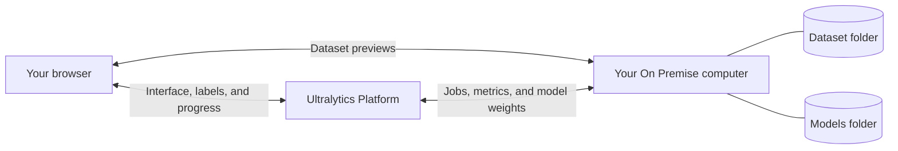

# On Premise

[On Premise](https://platform.ultralytics.com) lets your Enterprise workspace use datasets and compute on a Linux,
macOS, or Windows computer. Source images and videos remain on your computer. Training behaves like any other
[remote training](../train/cloud-training.md#remote-training) location: metrics stream to Platform and completed model
weights upload for download, prediction, export, and deployment.

Setup takes one command. Platform detects your operating system, fills in sensible folder locations, installs Docker if needed, and shows live connection progress.

## How It Works



### Data Boundaries

| Data                              | Your On Premise computer                                                                 | Platform and cloud services                                                                                         |
| --------------------------------- | ---------------------------------------------------------------------------------------- | ------------------------------------------------------------------------------------------------------------------- |
| Source and derived dataset pixels | Stay local for ingest, preview, and training                                             | Never stored, logged, or processed                                                                                  |
| Classes, labels, and annotations  | Source labels are read during ingest                                                     | Stored as the canonical dataset metadata so you can annotate in Platform                                            |
| Training models                   | The run, best checkpoint, and other training artifacts are written to your models folder | The best checkpoint uploads for download, prediction, export, and deployment; other artifacts stay on your computer |

Model weights, labels, annotations, and metrics can encode information learned from your images. Only the
dataset pixels have the strict local-only boundary. Cloud prediction processes only images you separately submit to that
cloud workflow; the worker never forwards an image from your mounted dataset.

## Before You Start

Choose a Linux computer, an Apple silicon Mac, or a 64-bit Windows computer that can access your datasets and remain
powered on while Platform is using them. Allow enough free storage for the datasets, model runs, and Docker images, and
ensure the computer can make outbound HTTPS connections.

A GPU is optional. Every computer can ingest datasets and train models on its CPU. A compatible NVIDIA GPU can accelerate larger training jobs.

!!! note "Corporate networks"

    If your company restricts outbound traffic, allow HTTPS access to Ultralytics Platform, Docker registries, and Python package downloads before setup.

## Connect Your Computer

1. Open [Ultralytics Platform](https://platform.ultralytics.com) on the computer that can access your datasets.
2. Go to `Settings > Integrations` and select **On Premise** from the integration list.
3. Review the prefilled **Dataset folder on this machine** and **Models folder on this machine** paths.
4. Select **Create install command**.
5. Open the terminal named in the dialog, copy the command, paste it, and press Enter.
6. Keep the Integrations page open until the progress indicator shows **Connected**.

<!-- screenshot -->

Platform fills in the folders and one-time connection token before you copy the command. The generated command follows the format below:

=== "Linux"

    Open **Terminal** and paste:

    ```bash
    curl -fsSL 'https://platform.ultralytics.com/api/workers/install?os=linux' \
      | sudo sh -s -- \
        "/datasets" \
        "/models" \
        "YOUR_CONNECTION_TOKEN"
    ```

=== "macOS"

    Open **Terminal** and paste:

    ```bash
    curl -fsSL 'https://platform.ultralytics.com/api/workers/install?os=macos' \
      | sh -s -- \
        "$HOME/Ultralytics/datasets" \
        "$HOME/Ultralytics/models" \
        "YOUR_CONNECTION_TOKEN"
    ```

=== "Windows"

    Open **PowerShell** and paste:

    ```powershell
    $installer = Invoke-RestMethod `
      'https://platform.ultralytics.com/api/workers/install?os=windows'
    & ([scriptblock]::Create($installer)) `
      -DataPath "$HOME\Ultralytics\datasets" `
      -ModelsPath "$HOME\Ultralytics\models" `
      -ConnectionToken "YOUR_CONNECTION_TOKEN"
    ```

!!! warning "Copy your command from Platform"

    Platform includes the connection token automatically. It proves this computer is allowed to connect to your workspace, expires after 10 minutes, and works once. You never enter it separately. Do not share the generated command while it is valid.

The defaults work without editing:

|                | Linux       | macOS and Windows        |
| -------------- | ----------- | ------------------------ |
| Dataset folder | `/datasets` | `~/Ultralytics/datasets` |
| Models folder  | `/models`   | `~/Ultralytics/models`   |

The setup command creates these folders, installs and starts Docker when needed, and configures the connection to restart with your computer. Your operating system may ask you to approve installation or restart before setup can finish.

### Docker Base Images

The installer runs one container and selects the [official Ultralytics base image](../../guides/docker-quickstart.md) for the host:

| Host                               | Base image pattern                        |
| ---------------------------------- | ----------------------------------------- |
| Apple silicon or ARM64 Linux       | `ultralytics/ultralytics:<version>-arm64` |
| x86-64 CPU                         | `ultralytics/ultralytics:<version>-cpu`   |
| x86-64 with a supported NVIDIA GPU | `ultralytics/ultralytics:<version>`       |

The installer selects a version-pinned official image for the host. The worker adds its connectivity dependencies
without reinstalling Ultralytics. It detects CUDA during setup, so an NVIDIA host still runs one container rather than
separate CPU and GPU workers. Platform's cloud services handle model prediction and export after the best checkpoint
uploads.

!!! warning "Use CDI for GPU access"

    CPU setup requires nothing beyond the guided installation. On Linux, NVIDIA GPU acceleration requires Docker >= 28.2 and NVIDIA Container Toolkit >= 1.18. The installer uses CDI `--device` reservations, not legacy `--gpus all`, so GPU access survives host daemon reloads. Docker Desktop on Windows uses its supported NVIDIA device reservation because NVIDIA CDI devices are not available there. Platform detects the supported GPU path automatically; see the [Docker Quickstart Guide](../../guides/docker-quickstart.md#using-gpus) for setup details.

## Add a Dataset

1. Put your dataset inside the configured dataset folder.
2. In Platform, select **New Dataset > On Premise**.
3. Choose the connected computer.
4. Browse to the dataset folder, choose the task, and select **Create**.

Platform indexes the dataset locally and opens it in the same gallery used for uploaded and cloud-storage datasets. You can preview images, inspect labels, filter the dataset, and annotate without uploading the pixels.

### Supported Data

On Premise supports the same ingest formats and computer-vision tasks as uploaded data:

- Images and videos
- ZIP, TAR, TAR.GZ, and TGZ archives
- Ultralytics NDJSON and COCO JSON
- YOLO datasets and classification folders
- Detect, segment, pose, oriented bounding box (OBB), and classify tasks

Platform automatically recognizes common dataset layouts, classes, labels, and train/validation/test splits. Platform treats source files as read-only and never resizes, re-encodes, edits, or deletes them.

## Preview and Annotate

When you open an image, your browser loads it directly from the connected computer. There is no certificate, hostname, VPN, or preview configuration.

Annotations and dataset organization are saved in your Platform workspace, but edits in Platform never change your source image or label files.

## Train a Model

Start training through the normal Platform training dialog:

1. Open a project and select **New Model**.
2. Choose the On Premise dataset.
3. Select a model and training settings.
4. Start training.

Platform runs the job on the connected computer. It uses an available NVIDIA GPU or falls back to CPU automatically, so a Mac can train a small model such as YOLO26n on COCO8 without dedicated GPU hardware.

Training files are written to the configured models folder while the run is active. The Ultralytics package uses the
same remote-training callbacks as any customer-managed machine: progress and metrics stream to Platform, the best
checkpoint uploads to Platform storage, and the completed model works with the existing download, prediction, export,
and deployment paths. Other training artifacts remain in your models folder. On Premise training does not use Platform
compute credits, and Platform never sends the training job to cloud compute.

## Manage the Connection

Open `Settings > Integrations` to see whether the computer and its CPU or GPU are available. You can reconnect to refresh its access or disconnect it when it is no longer needed.

Disconnecting prevents new jobs and previews but does not delete datasets or source files from the computer. Uploaded
models remain available in Platform.

## If Setup Does Not Finish

- **Docker asks for permission:** Approve the prompt and wait for Docker to start. Setup continues automatically.
- **Windows asks for a restart:** Restart the computer, return to `Settings > Integrations`, and create a new install command.
- **The setup command expired:** Create a new install command. Each command is temporary and works once.
- **The connection stays offline:** Open Docker Desktop, rerun a newly generated command, and keep the terminal open until it reports that On Premise is running.
- **Previews do not load:** Open Platform in a browser on the connected computer. Dataset previews come directly from
  that computer.

Also see [Datasets](../data/datasets.md), [Annotation](../data/annotation.md), and [Training](../train/index.md).
