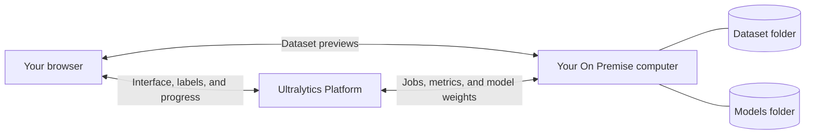

# On Premise

[On Premise](https://platform.ultralytics.com) lets your Enterprise workspace use datasets and compute on a Linux,
macOS, or Windows computer. Source images and videos remain on your computer. Training behaves like any other
[remote training](../train/cloud-training.md#remote-training) location: metrics stream to Platform and completed model
weights upload for download, prediction, export, and deployment.

Setup takes one command. Platform detects your operating system, fills in sensible folder locations, installs Docker if needed, and shows live connection progress.

## How It Works


```mermaid
flowchart LR
    A[Your browser] <-->|Interface, labels, and progress| B[Ultralytics Platform]
    A <-->|Dataset previews| C[Your On Premise computer]
    B <-->|Jobs, metrics, and model weights| C
    C --- D[(Dataset folder)]
    C --- E[(Models folder)]
```

### Data Boundaries

| Data                              | Your On Premise computer                                                                 | Platform and cloud services                                                                                         |
| --------------------------------- | ---------------------------------------------------------------------------------------- | ------------------------------------------------------------------------------------------------------------------- |
| Source and derived dataset pixels | Stay local for ingest, preview, and training                                             | Never stored, logged, or processed                                                                                  |
| Classes, labels, and annotations  | Source labels are read during ingest                                                     | Stored as the canonical dataset metadata so you can annotate in Platform                                            |
| Training models                   | The run, best checkpoint, and other training artifacts are written to your models folder | The best checkpoint uploads for download, prediction, export, and deployment; other artifacts stay on your computer |

Model weights, labels, annotations, and metrics can encode information learned from your images. Only the
dataset pixels have the strict local-only boundary. Cloud prediction processes only images you separately submit to that
cloud workflow; the worker never forwards an image from your mounted dataset.

## Before You Start

Choose a computer that can reach your datasets and stay powered on while Platform is using them:

|                  | Minimum                                                                | Recommended                                               |
| ---------------- | ---------------------------------------------------------------------- | --------------------------------------------------------- |
| Operating system | 64-bit Linux, Apple silicon macOS, or x86-64 Windows with WSL 2        | Current operating system and Docker releases              |
| CPU              | 4 cores                                                                | 8 or more cores for CPU training                          |
| Memory           | 8 GB RAM                                                               | 16 GB or more                                             |
| Storage          | 20 GB free, plus room for your datasets and models                     | SSD with at least twice your working dataset size free    |
| Network          | Outbound HTTPS to Ultralytics Platform and Docker container registries | Stable broadband for the initial container image download |

A GPU is optional. Every computer can ingest datasets and train models on its CPU. A compatible NVIDIA GPU can accelerate larger training jobs.

!!! note "Corporate networks"

    If your company restricts outbound traffic, allow HTTPS access to Ultralytics Platform, Docker registries, and Python package downloads before setup. The worker always dials out to Platform, so no inbound access to your network is required.

## Connect Your Computer

1. Open [Ultralytics Platform](https://platform.ultralytics.com) on the computer that can access your datasets.
2. Go to `Settings > Integrations` and select **On Premise** from the integration list.
3. Review the prefilled **Dataset folder on this machine** and **Models folder on this machine** paths.
4. Select **Create install command**.
5. Open the terminal named in the dialog, copy the command, paste it, and press Enter.
6. Keep the Integrations page open until the progress indicator shows **Connected**.

<!-- screenshot -->

The page tracks the six setup steps live — running the command, downloading the worker files, downloading the Docker
image, building the worker, starting it, and confirming the connection — so you can watch progress without reading the
terminal. Connecting a host requires the workspace editor [role](../account/teams.md#roles-and-permissions) and an
active Enterprise plan; workspaces on another plan see a **Continue** button that requests a guided On Premise
walkthrough instead of an install command.

Platform fills in the folders and one-time connection token before you copy the command. The generated command follows the format below:

=== "Linux"

    Open **Terminal** and paste:

    ```bash
    curl -fsSL 'https://platform.ultralytics.com/api/workers/install?os=linux' \
      | sudo sh -s -- \
        "/datasets" \
        "/models" \
        "YOUR_CONNECTION_TOKEN"
    ```

=== "macOS"

    Open **Terminal** and paste:

    ```bash
    curl -fsSL 'https://platform.ultralytics.com/api/workers/install?os=macos' \
      | sh -s -- \
        "$HOME/Ultralytics/datasets" \
        "$HOME/Ultralytics/models" \
        "YOUR_CONNECTION_TOKEN"
    ```

=== "Windows"

    Open **PowerShell** and paste:

    ```powershell
    $installer = Invoke-RestMethod `
      'https://platform.ultralytics.com/api/workers/install?os=windows'
    & ([scriptblock]::Create($installer)) `
      -DataPath "$HOME\Ultralytics\datasets" `
      -ModelsPath "$HOME\Ultralytics\models" `
      -ConnectionToken "YOUR_CONNECTION_TOKEN"
    ```

!!! warning "Copy your command from Platform"

    Platform includes the connection token automatically. It proves this computer is allowed to connect to your workspace, expires after 10 minutes, and works once. You never enter it separately. Do not share the generated command while it is valid.

The defaults work without editing:

|                | Linux       | macOS and Windows        |
| -------------- | ----------- | ------------------------ |
| Dataset folder | `/datasets` | `~/Ultralytics/datasets` |
| Models folder  | `/models`   | `~/Ultralytics/models`   |

The setup command creates these folders, installs and starts Docker when needed, and configures the connection to restart with your computer. Your operating system may ask you to approve installation or restart before setup can finish.

### Docker Base Images

The installer runs one container and selects the [official Ultralytics base image](../../guides/docker-quickstart.md) for the host:

| Host                               | Base image pattern                        |
| ---------------------------------- | ----------------------------------------- |
| Apple silicon or ARM64 Linux       | `ultralytics/ultralytics:<version>-arm64` |
| x86-64 CPU                         | `ultralytics/ultralytics:<version>-cpu`   |
| x86-64 with a supported NVIDIA GPU | `ultralytics/ultralytics:<version>`       |

The installer selects a version-pinned official image for the host. The worker adds its connectivity dependencies
without reinstalling Ultralytics. It detects CUDA during setup, so an NVIDIA host still runs one container rather than
separate CPU and GPU workers. Platform's cloud services handle model prediction and export after the best checkpoint
uploads.

!!! warning "Use CDI for GPU access"

    CPU setup requires nothing beyond the guided installation. On Linux, NVIDIA GPU acceleration requires Docker >= 28.2 and NVIDIA Container Toolkit >= 1.18. Platform detects the supported GPU path automatically on Linux, macOS, and Windows; see the [Docker Quickstart Guide](../../guides/docker-quickstart.md#using-gpus) for setup details.

## Add a Dataset

1. Put your dataset inside the configured dataset folder.
2. In Platform, select **New Dataset > On Premise**.
3. Choose the connected computer.
4. Browse to the dataset folder, choose the task, and select **Create**.

Platform indexes the dataset locally and opens it in the same gallery used for uploaded and cloud-storage datasets. You can preview images, inspect labels, filter the dataset, and annotate without uploading the pixels.

### Supported Data

On Premise supports the same ingest formats and computer-vision tasks as uploaded data:

- Images and videos
- ZIP, TAR, TAR.GZ, and TGZ archives
- Ultralytics NDJSON and COCO JSON
- YOLO datasets and classification folders
- Detect, segment, semantic, classify, pose, and oriented bounding box (OBB) tasks

Platform automatically recognizes common dataset layouts, classes, labels, and train/validation/test splits. The dataset folder is mounted read-only, so Platform never resizes, re-encodes, edits, or deletes your source files. Anything derived during ingest — extracted archives, downloaded NDJSON assets, and video frames — is written to a private Docker volume on the same computer.

## Preview and Annotate

When you open an image, your browser loads it directly from the connected computer. There is no certificate, hostname, VPN, or preview configuration.

Annotations and dataset organization are saved in your Platform workspace, but edits in Platform never change your source image or label files.

## Train a Model

Start training through the normal Platform training dialog:

1. Open a project and select **New Model**.
2. Choose the On Premise dataset.
3. Select a model and training settings.
4. Start training.

Platform runs the job on the connected computer. It uses an available NVIDIA GPU or falls back to CPU automatically, so a Mac can train a small model such as YOLO26n on COCO8 without dedicated GPU hardware.

Training files are written to the configured models folder while the run is active. The Ultralytics package uses the
same remote-training callbacks as any customer-managed machine: progress and metrics stream to Platform, the best
checkpoint uploads to Platform storage, and the completed model works with the existing download, prediction, export,
and deployment paths. Other training artifacts remain in your models folder. On Premise training does not use Platform
compute credits, and Platform never sends the training job to cloud compute.

## Manage the Connection

Open `Settings > Integrations` to see each connected computer, its hostname and hardware, and whether its CPU and GPU
are currently online. The host reports in continuously, so a computer that is shut down or loses connectivity shows as
offline and its datasets become temporarily unavailable rather than falling back to cloud compute.

**Reconnect** issues a fresh install command for a host you previously disconnected. It reuses the same host record, so
its existing datasets resume working without being re-imported.

**Disconnect** revokes that host's access immediately. Queued, starting, and running jobs bound to it are cancelled,
including training in progress, and a dataset that was still being imported fails with `On Premise host disconnected
during ingest.` Datasets that finished importing keep their classes, labels, and annotations but cannot be previewed or
trained on until you reconnect. Nothing is deleted from the computer, and models already uploaded to Platform remain
available.

## Current Limitations

- **No rescan.** A dataset is indexed once when you create it. If the source files change afterwards, Platform does not
  notice — create a new dataset to pick up the changes.
- **Platform-copy features are unavailable.** On Premise datasets exclude the features that need Platform-owned copies of
  your images: auto-annotation, [clustering analysis](../data/datasets.md#clustering), dataset cloning, and immutable
  [version snapshots](../data/datasets.md#versions-tab).
- **Training does not move.** If the worker process stops mid-run, the run fails rather than restarting elsewhere.
- **Model files stay on the host.** Deleting or trashing a model in Platform removes it from Platform, not from your
  models folder — clean that folder up yourself when a run is no longer needed.

Deleting an On Premise dataset, or individual images from it, removes Platform's references and annotations only. Your
files are never touched.

## If Setup Does Not Finish

- **Docker asks for permission:** Approve the prompt and wait for Docker to start. Setup continues automatically.
- **Windows asks for a restart:** Restart the computer, return to `Settings > Integrations`, and create a new install command.
- **The setup command expired:** Create a new install command. Each command is temporary and works once.
- **The connection stays offline:** Open Docker Desktop, rerun a newly generated command, and keep the terminal open until it reports that On Premise is running.
- **Previews do not load:** Open Platform in a browser on the connected computer. Dataset previews come directly from
  that computer.
- **You need the worker logs:** The installer writes to `/opt/ultralytics-worker` on Linux and `~/.ultralytics/worker`
  on macOS and Windows. Run `docker compose logs -f` from that folder to follow the worker.

Also see [Datasets](../data/datasets.md), [Annotation](../data/annotation.md), and [Training](../train/index.md).
