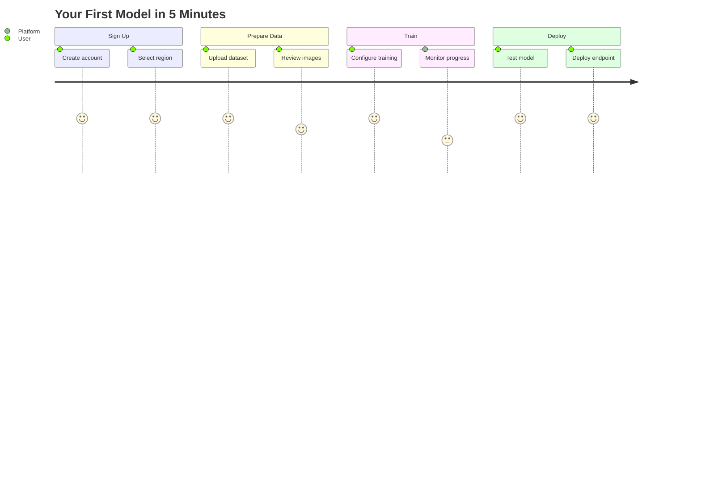

# Ultralytics Platform Quickstart

[Ultralytics Platform](https://platform.ultralytics.com) is designed to be user-friendly and intuitive, allowing users to quickly upload their datasets and train new YOLO models. It offers a range of pretrained models to choose from, making it easy for users to get started. Once a model is trained, it can be tested directly in the browser and deployed to production with a single click.

## Get Started

[Ultralytics Platform](https://platform.ultralytics.com) offers a variety of easy signup options. You can register and log in using your Google, Apple, or GitHub accounts, or simply with your email address.

<!-- Screenshot: platform-signup.avif -->

### Region Selection

During signup, you'll be asked to select your data region. This is an important choice as it determines where your data, models, and deployments will be stored.

<!-- Screenshot: platform-onboarding-region.avif -->

| Region | Location             | Best For                                |
| ------ | -------------------- | --------------------------------------- |
| **US** | Iowa, USA            | Americas users, fastest for Americas    |
| **EU** | Belgium, Europe      | European users, GDPR compliance         |
| **AP** | Taiwan, Asia-Pacific | Asia-Pacific users, lowest APAC latency |

!!! warning "Region is Permanent"

    Your region selection cannot be changed after account creation. Choose the region closest to you or your users for best performance.

### Free Credits

Every new account receives free credits for cloud GPU training:

| Email Type             | Sign-up Credits | How to Qualify                         |
| ---------------------- | --------------- | -------------------------------------- |
| **Work/Company Email** | **$25.00**      | Use your company domain (@company.com) |
| **Personal Email**     | **$5.00**       | Gmail, Yahoo, Outlook, etc.            |

!!! tip "Maximize Your Credits"

    Sign up with a work email to receive $25 in credits. If you signed up with a personal email, you can verify a work email later to unlock the additional $20 in credits.

### Complete Your Profile

After selecting your region, complete your profile with your information.

<!-- Screenshot: platform-onboarding-profile.avif -->

??? tip "Update Later"

    You can update your profile anytime from the Settings page, including your display name, username, bio, and social links.

## Home Dashboard

After signing in, you will be directed to the Home page of [Ultralytics Platform](https://platform.ultralytics.com), which provides a comprehensive overview, quick actions, and recent activity.

<!-- Screenshot: platform-dashboard.avif -->

The sidebar provides access to all Platform sections:

**Top Section:**

| Item        | Description                                      |
| ----------- | ------------------------------------------------ |
| **Search**  | Quick search across all your resources (Cmd+K)   |
| **Home**    | Dashboard with quick actions and recent activity |
| **Explore** | Discover public projects and datasets            |

**My Workspace:**

| Section      | Description                             |
| ------------ | --------------------------------------- |
| **Annotate** | Your datasets organized for annotation  |
| **Train**    | Your projects containing trained models |
| **Deploy**   | Your active deployments                 |

**Bottom Section:**

| Item         | Description                             |
| ------------ | --------------------------------------- |
| **Trash**    | Deleted items (recoverable for 30 days) |
| **Settings** | Account, billing, and preferences       |
| **Feedback** | Send feedback to Ultralytics            |

### Quick Actions

From the Home page, you can quickly:

- **Upload Dataset**: Start preparing your training data
- **Create Project**: Organize a new set of experiments
- **Train Model**: Launch cloud training on GPUs

## Upload Your First Dataset

Navigate to Datasets and click "Upload Dataset" to add your training data.

<!-- Screenshot: platform-quickstart-upload.avif -->

Ultralytics Platform supports multiple upload formats:

| Format          | Description                                    |
| --------------- | ---------------------------------------------- |
| **Images**      | JPG, PNG, WebP, TIFF, and other common formats |
| **ZIP Archive** | Compressed folder with images and labels       |
| **Video**       | MP4, AVI - frames extracted automatically      |
| **YOLO Format** | Standard YOLO dataset structure with labels    |

After upload, the Platform processes your data:

1. Images are normalized and thumbnails generated
2. Labels are parsed and validated
3. Statistics are computed automatically

Read more about [datasets](data/datasets.md) and supported formats.

## Create Your First Project

Projects help you organize related models and experiments. Navigate to Projects and click "Create Project".

<!-- Screenshot: platform-projects-create.avif -->

Enter a name and optional description for your project. Projects contain:

- **Models**: Trained checkpoints
- **Activity Log**: History of changes

Read more about [projects](train/projects.md).

## Train Your First Model

From your project, click "Train Model" to start cloud training.

<!-- Screenshot: platform-quickstart-train.avif -->

### Training Configuration

1. **Select Dataset**: Choose from your uploaded datasets
2. **Choose Model**: Select a base model (YOLO26n, YOLO26s, etc.)
3. **Set Epochs**: Number of training iterations
4. **Select GPU**: Choose compute resources

| Model   | Size        | Speed    | Accuracy |
| ------- | ----------- | -------- | -------- |
| YOLO26n | Nano        | Fastest  | Good     |
| YOLO26s | Small       | Fast     | Better   |
| YOLO26m | Medium      | Moderate | High     |
| YOLO26l | Large       | Slower   | Higher   |
| YOLO26x | Extra Large | Slowest  | Best     |

### Monitor Training

Once training starts, you can monitor progress in real-time:

- **Loss Curves**: Track training and validation loss
- **Metrics**: mAP, precision, recall updated each epoch
- **System Stats**: GPU utilization, memory usage

Read more about [cloud training](train/cloud-training.md).

## Test Your Model

After training completes, test your model directly in the browser:

1. Navigate to your model's **Test** tab
2. Upload an image or use example images
3. View inference results with bounding boxes

<!-- Screenshot: platform-test-tab.avif -->

Adjust inference parameters:

- **Confidence Threshold**: Filter low-confidence predictions
- **IoU Threshold**: Control overlap for NMS
- **Image Size**: Resize input for inference

Read more about [inference](deploy/inference.md).

## Deploy to Production

Deploy your model to a dedicated endpoint for production use:

1. Navigate to your model's **Deploy** tab
2. Select a region from the global map (43 available)
3. Click "Deploy" to create your endpoint

<!-- Screenshot: platform-deploy-tab.avif -->

Your endpoint will be ready in about a minute with:

- **Unique URL**: HTTPS endpoint for API calls
- **Auto-Scaling**: Scales with traffic automatically
- **Monitoring**: Request metrics and logs

Read more about [endpoints](deploy/endpoints.md).

## Feedback

We value your feedback! Use the feedback button to help us improve the platform.

??? info "Feedback Privacy"

    Your feedback is private and only visible to the Ultralytics team. We use it to prioritize features and fix issues.

## Need Help?

If you encounter any issues or have questions:

- **Documentation**: Browse these docs for detailed guides
- **Discord**: Join our [Discord community](https://discord.com/invite/ultralytics) for discussions
- **GitHub**: Report issues on [GitHub](https://github.com/ultralytics/ultralytics/issues)

!!! note

    When reporting a bug, please include your browser and operating system details to help us diagnose the issue.
