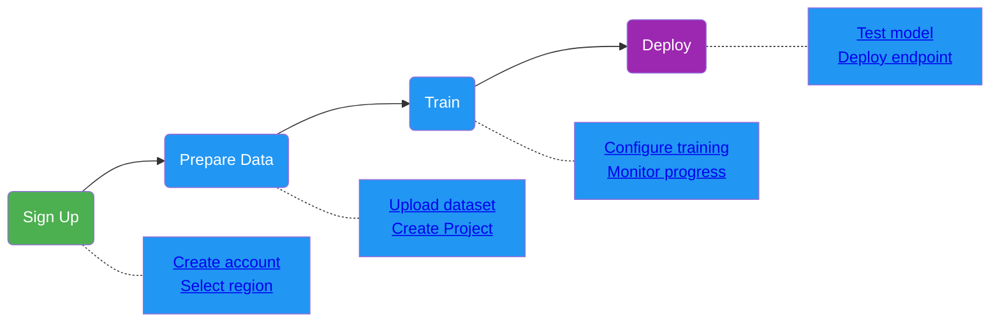
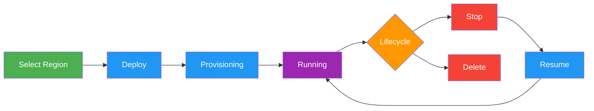

# Ultralytics Platform Quickstart

[Ultralytics Platform](https://platform.ultralytics.com) provides a guided workflow to upload datasets, train new YOLO models from pretrained weights, test completed models in the browser, and configure dedicated inference endpoints.

<p align="center">
  <br>
  <iframe loading="lazy" width="720" height="405" src="https://www.youtube.com/embed/VGa3HMUWQSM"
    title="YouTube video player" frameborder="0"
    allow="accelerometer; autoplay; clipboard-write; encrypted-media; gyroscope; picture-in-picture; web-share"
    allowfullscreen>
  </iframe>
  <br>
  <strong>Watch:</strong> Get Started with Ultralytics Platform - QuickStart
</p>

The following interactive diagram outlines the four primary stages of the Ultralytics Platform workflow. Click any stage or sub-step to access detailed instructions for that section.


```mermaid
graph LR
    A(Sign Up):::start --> B(Prepare Data):::proc --> C(Train):::proc --> D(Deploy):::out
    A -.- A1["<a href='#get-started'>Create account</a><br/><a href='#region-selection'>Select region</a>"]:::proc
    B -.- B1["<a href='#upload-your-first-dataset'>Upload dataset</a><br/><a href='#create-your-first-project'>Create Project</a>"]:::proc
    C -.- C1["<a href='#training-configuration'>Configure training</a><br/><a href='#monitor-training'>Monitor progress</a>"]:::proc
    D -.- D1["<a href='#test-your-model'>Test model</a><br/><a href='#deploy-to-production'>Deploy endpoint</a>"]:::proc

    click A "#get-started"
    click B "#upload-your-first-dataset"
    click C "#train-your-first-model"
    click D "#deploy-to-production"

    classDef start fill:#4CAF50,color:#fff
    classDef proc fill:#2196F3,color:#fff
    classDef out fill:#9C27B0,color:#fff
```

## Get Started

[Ultralytics Platform](https://platform.ultralytics.com) offers a variety of easy signup options. You can register and log in using your Google or GitHub accounts, or with your email address.

<!-- screenshot -->

### Region Selection

During onboarding, you'll be asked to select your data region. The Platform automatically measures latency to each
region and recommends the closest one. This choice determines where your datasets, models, and managed training data are
stored. Dedicated endpoint regions are selected separately when you deploy a model.

<!-- screenshot -->



!!! warning "Choose Your Region Carefully"

    Your data region is set during onboarding and cannot be changed yourself afterward, so choose the region closest to you or your users for best performance. If you need to move regions later, contact support to request a change.

### Free Credits

Every new account receives free credits for cloud GPU training:

| Email Type             | Sign-up Credits | How to Qualify                         |
| ---------------------- | --------------- | -------------------------------------- |
| **Work/Company Email** | **$25.00**      | Use your company domain (@company.com) |
| **Personal Email**     | **$5.00**       | Gmail, Yahoo, Outlook, etc.            |

!!! tip "Maximize Your Credits"

    Sign up with a work email to receive $25 in credits. If you signed up with a personal email, you can verify a work email later to unlock the additional $20 in credits.

### Complete Your Profile

The onboarding flow guides you through three steps:

1. **Profile** - Enter your display name, unique username (permanent, cannot be changed later), organization (optional), and primary use case
2. **Data Region** - Select US, EU, or AP with a visual world map showing latency
3. **Complete** - Review your selections, optionally apply a promo code, and finish signup to claim your welcome credits

<!-- screenshot -->
??? tip "Update Later"

    You can update your profile anytime from [Settings](account/settings.md), including your display name, bio, and social links. Your username cannot be changed after signup. The data region has no self-service change; contact support to request a move.

## Home Dashboard

After signing in, you will be directed to the Home page of [Ultralytics Platform](https://platform.ultralytics.com), which provides a welcome card with workspace stats, an overview video, quick access to datasets, projects, and storage, and a recent activity feed.

<!-- screenshot -->

### Sidebar Navigation

The sidebar provides access to all Platform sections:

| Section     | Item     | Description                                                        |
| ----------- | -------- | ------------------------------------------------------------------ |
| **Top**     | Search   | Quick search across all your resources (Cmd+K)                     |
|             | Home     | Dashboard with quick actions and recent activity                   |
|             | Explore  | Discover public projects and datasets                              |
| **Content** | Annotate | Your datasets, with a `+` shortcut to create one                   |
|             | Train    | Your projects containing trained models                            |
|             | Deploy   | Your active deployments; any entry opens the deployments dashboard |
| **Footer**  | Help     | Guides, community links, and the in-app feedback form              |
|             | Settings | Account, billing, teams, and preferences                           |
|             | Account  | Profile menu with workspace switcher, activity, and **Log out**    |

Each content section lists your five most recent items with a link to the rest. Hovering an item reveals a delete
action that moves it to [Trash](account/trash.md); Trash itself is reached from search (`Cmd+K`) or by opening
`platform.ultralytics.com/trash`.

!!! note "Browsing Signed Out"

    Without an account the same sidebar shows public **Datasets** and **Models** from `@ultralytics` instead of your
    own content, and the footer shows a sign-up card in place of the account menu.

### Welcome Card

The welcome card shows your profile, plan badge (which links to plan comparison), and workspace statistics at a glance.
Each stat links to the matching workspace view:

| Stat            | Description                      |
| --------------- | -------------------------------- |
| **Datasets**    | Number of datasets               |
| **Images**      | Total images across all datasets |
| **Annotations** | Total annotation count           |
| **Projects**    | Number of projects               |
| **Models**      | Total trained models             |
| **Exports**     | Number of model exports          |
| **Deployments** | Active deployment count          |

### Quick Actions

Below the welcome card, the dashboard shows three cards:

- **Datasets**: Create a new dataset or drop images, videos, or dataset files to upload. Shows your recent datasets.
- **Projects**: Create a new project or drop `.pt` model files to upload. Shows your recent projects.
- **Storage**: Overview of your storage usage (datasets, models, exports) with plan limits.

A **Recent Activity** table at the bottom shows your latest datasets, projects, and deployments with their status and
last update time.

### Global Search

Press `Cmd+K` (Mac) or `Ctrl+K` (Windows/Linux) to open the search bar. Search across pages, projects, datasets, and deployments instantly.

### AI Chat Assistant

A floating chat widget is available on every page. Click it to ask questions about YOLO training, annotation, deployment, or any Platform feature. The assistant provides context-aware help based on the current page.

### Onboarding Tours

The Platform includes guided tours that introduce key features as you explore different sections:

| Tour             | Trigger                              | What It Covers                                                                          |
| ---------------- | ------------------------------------ | --------------------------------------------------------------------------------------- |
| **Nav Tour**     | First visit to Home after onboarding | Home, Explore, Annotate, Train, Deploy, Settings, Your Account                          |
| **Project Tour** | First visit to a project page        | Models, Training Charts, Train a Model                                                  |
| **Dataset Tour** | First visit to a dataset page        | Images, Dataset Splits, Classes, Charts, Train a Model, Upload Images, Download Dataset |

!!! tip "Enterprise Users"

    Enterprise plan users see an enhanced Nav Tour with enterprise-specific guidance on the Train step.

#### Restart Tours

To replay any tour:

- **Redo Tour button** — Click your profile avatar (bottom-left of the sidebar) to open the account menu, then select **Redo Tour**. This resets all tours so they replay on your next visit to each section.
- **URL parameter** — Append `?tour=` with the tour ID to restart one directly: `?tour=nav` on the Home page,
  `?tour=project` on a project page, or `?tour=dataset` on a dataset page.

## Upload Your First Dataset

Open `Annotate` in the sidebar and click the `+` to create a new dataset. You can also drag and drop files directly onto the Datasets card on the Home dashboard.

<!-- screenshot -->
The **New Dataset** dialog offers four sources. This quickstart uses **Upload**; the others are covered in
[Datasets](data/datasets.md) and [Integrations](integrations/index.md):

| Source         | Availability  | Description                                                                        |
| -------------- | ------------- | ---------------------------------------------------------------------------------- |
| **Upload**     | All plans     | Drop images, videos, archives, or NDJSON from your machine                         |
| **URL**        | All plans     | Import from a direct HTTP or HTTPS link to a ZIP, TAR, TAR.GZ, TGZ, or NDJSON file |
| **Cloud**      | Pro and above | Connect an [S3, GCS, or Azure bucket](integrations/index.md)                       |
| **On Premise** | Enterprise    | Index data that stays on your own [connected host](integrations/on-premise.md)     |

Uploads support multiple formats (full details in [Datasets](data/datasets.md)):

| Format              | Max Size (Free / Pro / Enterprise) | Description                                                                |
| ------------------- | ---------------------------------- | -------------------------------------------------------------------------- |
| **Images**          | 50 MB                              | JPG, PNG, WebP, TIFF, and other common formats                             |
| **Dataset Archive** | 10 / 20 / 50 GB                    | ZIP or TAR archive (including `.tar.gz` and `.tgz`) with images and labels |
| **Video**           | 1 GB                               | MP4, WebM, MOV, MKV, M4V - frames extracted at 1 FPS (max 100 frames)      |
| **NDJSON**          | 10 / 20 / 50 GB                    | Ultralytics dataset export format for portable metadata                    |


```mermaid
graph LR
    A[Drop Files]:::start --> B[Auto-Package ZIP]:::proc
    B --> C[Upload to Storage]:::proc
    C --> D[Process Data]:::proc
    D --> E[Resize & Thumbnail]:::proc
    E --> F[Parse Labels]:::proc
    F --> G[Compute Statistics]:::proc
    G --> H[Dataset Ready]:::out

    classDef start fill:#4CAF50,color:#fff
    classDef proc fill:#2196F3,color:#fff
    classDef out fill:#9C27B0,color:#fff
```

After upload, the platform automatically processes your data:

1. Images larger than 4096px are resized (preserving aspect ratio)
2. 256px thumbnails are generated for fast browsing
3. YOLO, COCO, and Ultralytics NDJSON labels are parsed and validated
4. Statistics are computed (class distribution, heatmaps, dimensions)

!!! tip "YOLO Dataset Structure"

    For best results, upload a ZIP or TAR archive (including `.tar.gz` and `.tgz`) with the standard YOLO structure:

    ```text
    my-dataset.zip
    ├── data.yaml          # Class names and splits
    ├── train/
    │   ├── images/
    │   │   ├── img001.jpg
    │   │   └── img002.jpg
    │   └── labels/
    │       ├── img001.txt
    │       └── img002.txt
    └── val/
        ├── images/
        └── labels/
    ```

    For full syntax across tasks, see [detect](../datasets/detect/index.md#ultralytics-yolo-format), [segment](../datasets/segment/index.md#ultralytics-yolo-format), [pose](../datasets/pose/index.md#ultralytics-yolo-format), [OBB](../datasets/obb/index.md#yolo-obb-format), and [classify](../datasets/classify/index.md#dataset-structure-for-yolo-classification-tasks) dataset guides.

Read more about [datasets](data/datasets.md) and supported formats for [detect](../datasets/detect/index.md), [segment](../datasets/segment/index.md), [pose](../datasets/pose/index.md), [OBB](../datasets/obb/index.md), and [classify](../datasets/classify/index.md).

## Create Your First Project

Projects help you organize related models and experiments. Open `Train` in the sidebar and click the `+` to create a project. You can also drop `.pt` weights onto the Projects card on the Home dashboard to create a project and import them in one step.

<!-- screenshot -->
Enter a name and optional description. Projects organize model runs and imported or cloned model weights, with charts for comparing completed training results.

Read more about [projects](train/projects.md).

## Train Your First Model

From your project, click `New Model` to open the **Train New Model** dialog. You can also start from a dataset page, in which case the dataset is locked in and you pick the destination project instead.

<!-- screenshot -->

### Training Configuration

1. **Base Model**: Select official Ultralytics weights or one of your own trained models. The dialog warns if the model task and dataset task don't match.
2. **Dataset**: Choose a ready dataset with at least one train image, at least one validation or test image, and at least one labeled image
3. **Parameters**: Set **Epochs** (default 100), **Batch Size** (blank means auto), **Image Size** (default 640), and an optional run **Name**. Expand **Advanced Settings** to edit any other Ultralytics training argument in a YAML editor.
4. **Select GPU**: On the **Cloud Training** tab, choose compute based on your budget and model size. The default is **RTX PRO 6000** (96 GB Blackwell, $2.09/hr), which handles every YOLO26 variant. See the full [GPU pricing table](index.md#what-gpu-options-are-available-for-cloud-training) or the [Cloud Training GPU step](train/cloud-training.md#step-5-select-gpu-cloud-tab) for the complete list and tier gating.
5. **Start Training**: Review the estimated cost and duration next to your credit balance, then click `Start Training`.

!!! tip "Save Dataset Version"

    Tick **Save Dataset Version** before starting to snapshot a Platform-hosted dataset and link it to the run, so the
    exact training data can be reproduced later. See [Datasets](data/datasets.md).

!!! warning "Credit Balance Required"

    Cloud training requires a positive credit balance sufficient to cover the estimated job cost. Top up directly from the training dialog, or check your balance in [`Settings > Billing`](account/billing.md). New accounts receive free credits ($5 for personal email, $25 for work email).

### Monitor Training

Once training starts, open the model's `Train` tab to monitor progress in real time through three subtabs:

| Subtab      | Content                                                 |
| ----------- | ------------------------------------------------------- |
| **Charts**  | Training/validation loss curves, mAP, precision, recall |
| **Console** | Live training log output                                |
| **System**  | GPU utilization, memory usage, hardware metrics         |

<!-- screenshot -->
Metrics are streamed in real-time via SSE (Server-Sent Events). Once validation artifacts exist, the Charts subtab splits into **Training** and **Validation** views, with the confusion matrix, PR curves, and F1 curves under Validation.

!!! tip "Cancel Training"

    You can cancel a running training job at any time. You're only charged for the compute time used up to that point.

Read more about [cloud training](train/cloud-training.md).

## Test Your Model

After training completes, test your model directly in the browser:

1. Navigate to your model's `Predict` tab
2. Upload an image, drag and drop, capture one from your webcam, or click an example image (auto-inference on drop)
3. View task-appropriate prediction overlays, per-stage timings (preprocess, inference, postprocess, network), and the raw JSON response

<!-- screenshot -->
Adjust inference parameters:

| Parameter      | Default | Description                       |
| -------------- | ------- | --------------------------------- |
| **Confidence** | 0.25    | Filter low-confidence predictions |
| **IoU**        | 0.7     | Control overlap for NMS           |
| **Image Size** | 640     | Resize input for inference        |

Under **API Docs**, the `Predict` tab shows example code in Python, JavaScript, and cURL, pre-filled with the parameters you selected above. Deploy the model first, then replace the placeholder URL and key with the values from your endpoint:

=== "Python"

    ```python
    import requests

    url = "https://your-deployment-url.run.app/predict"
    api_key = "YOUR_API_KEY"
    args = {"conf": 0.25, "iou": 0.7, "imgsz": 640}

    with open("image.jpg", "rb") as f:
        response = requests.post(
            url,
            headers={"Authorization": f"Bearer {api_key}"},
            data=args,
            files={"file": f},
        )

    print(response.json())
    ```

=== "cURL"

    ```bash
    curl -X POST "https://your-deployment-url.run.app/predict" \
      -H "Authorization: Bearer YOUR_API_KEY" \
      -F "file=@image.jpg" \
      -F "conf=0.25" \
      -F "iou=0.7" \
      -F "imgsz=640"
    ```

!!! tip "Auto-Inference"

    The Predict tab runs inference automatically when you drop an image — no need to click a button — and re-runs it whenever you change confidence, IoU, or image size. Example images (bus.jpg, zidane.jpg) are preloaded for instant testing.

Read more about [inference](deploy/inference.md).

## Deploy to Production

Deploy your model to a dedicated endpoint for production use:

1. Navigate to your model's `Deploy` tab
2. The Platform measures latency to all 42 regions and plots them on a world map, colored on a green-to-red gradient (lower latency is greener, higher latency is redder)
3. In the **Region Latency** table below the map — sorted by latency from your location — find the region you want. Use `Rescan` to re-measure at any time.
4. Click `Deploy` on that row to create your endpoint

<!-- screenshot -->


```mermaid
graph LR
    A[Select Region]:::start --> B[Deploy]:::proc
    B --> C[Provisioning]:::proc
    C --> D[Running]:::out
    D --> E{Lifecycle}:::decide
    E --> F[Stop]:::error
    E --> G[Delete]:::error
    F --> H[Resume]:::proc
    H --> D

    classDef start fill:#4CAF50,color:#fff
    classDef proc fill:#2196F3,color:#fff
    classDef decide fill:#FF9800,color:#fff
    classDef out fill:#9C27B0,color:#fff
    classDef error fill:#F44336,color:#fff
```

Once provisioning completes, your endpoint provides:

- **Unique URL**: HTTPS endpoint for API calls
- **Scale-to-zero behavior**: Idle endpoints scale to zero (deployments currently run a single active instance)
- **Monitoring**: Request metrics and logs

!!! info "Deployment Lifecycle"

    Endpoints can be **started**, **stopped**, and **deleted**. Stopped endpoints retain their configuration and can be
    restarted with one click.

After deployment, you can manage all your endpoints from the `Deploy` section in the sidebar. The deployments dashboard shows a global map with your active deployments, 24-hour metrics (total requests, active deployments, error rate, and P95 latency), and a list of every endpoint.

Read more about [endpoints](deploy/endpoints.md).

## Remote Training (Optional)

If you prefer to train on your own hardware, you can use your API key to train anywhere and stream metrics to Ultralytics Platform.

The fastest route is the **Local Training** tab in the training dialog: it builds the full command for your selected model, dataset, and parameters, and fills in an API key (creating one if you don't have one yet). Copy it and run it in your terminal.

To assemble the command yourself:

1. Generate an API key in [`Settings > API Keys`](account/api-keys.md)
2. Set the environment variable and train with a `username/project` value for `project`:

```bash
export ULTRALYTICS_API_KEY="YOUR_API_KEY"

yolo train model=yolo26n.pt data=coco.yaml epochs=100 project=username/my-project name=exp1
```

!!! note "Requirements"

    Local training with metric streaming requires **ultralytics>=8.4.120**. API keys start with `ul_` followed by 40 hex characters (43 characters total) and are full-access tokens scoped to your workspace.

Read more about [API keys](account/api-keys.md), [dataset URIs](data/datasets.md#dataset-uri), and [remote training](train/cloud-training.md#remote-training).

## Feedback & Help

The **Help** page in the sidebar footer collects documentation links, video walkthroughs, and community resources, and includes an in-app feedback form. You can rate your experience from 1 to 5 stars, choose a feedback type (**Bug**, **Feature**, or **General**), and attach a screenshot.

If you need more help:

- **AI Chat**: Click the floating chat widget on any page for instant help
- **Documentation**: Browse these docs for detailed guides on [datasets](data/datasets.md), [annotation](data/annotation.md), [training](train/cloud-training.md), [deployment](deploy/endpoints.md), and [billing](account/billing.md)
- **Discord**: Join our [Discord community](https://discord.com/invite/ultralytics) for discussions
- **GitHub**: Report issues on [GitHub](https://github.com/ultralytics/ultralytics/issues)
- **REST API**: See the [API reference](api/index.md) or try the [interactive API docs](https://platform.ultralytics.com/api/docs) for programmatic access to all Platform features
