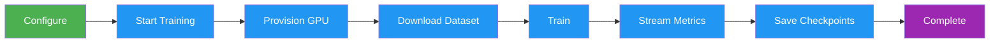
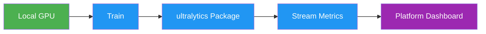
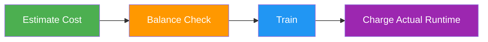

# Cloud Training

[Ultralytics Platform](https://platform.ultralytics.com) Cloud Training offers single-click training on cloud GPUs, making model training accessible without complex setup. Train YOLO models with real-time metrics streaming and automatic checkpoint saving.



## Training Dialog

Start training from the platform UI by clicking **New Model** on any project or dataset page. The training dialog has two tabs: **Cloud Training** and **Local Training**.

<!-- screenshot -->

### Step 1: Select Base Model

Choose an official Ultralytics model or one of your own completed models:

| Category        | Description                                                         |
| --------------- | ------------------------------------------------------------------- |
| **Official**    | YOLO26 (recommended), YOLO11, YOLOv8, and YOLOv5 project models     |
| **Your Models** | Your completed or uploaded models, organized by project, for tuning |

The selector filters official models to tasks compatible with the selected dataset. YOLO26 includes [Detect](../../tasks/detect.md), [Segment](../../tasks/segment.md), [Semantic](../../tasks/semantic.md), [Depth](../../tasks/depth.md), [Pose](../../tasks/pose.md), [OBB](../../tasks/obb.md), and [Classify](../../tasks/classify.md) variants in sizes from nano to xlarge.

### Step 2: Select Dataset

Choose a dataset to train on (see [Datasets](../data/datasets.md)):

| Option            | Description                       |
| ----------------- | --------------------------------- |
| **Official**      | Curated datasets from Ultralytics |
| **Your Datasets** | Datasets you've uploaded          |

!!! note "Dataset Requirements"

    Datasets must be in `ready` status with at least 1 image in the train split, 1 image in the validation or test split, and at least 1 labeled image.

!!! warning "Task Mismatch"

    A task mismatch warning appears when the selected model cannot train the dataset task, and **Start Training** remains disabled until you choose a compatible model. A segment dataset accepts segment or semantic models; other dataset tasks require the matching model task. See the [task guides](../../tasks/index.md).

### Step 3: Configure Parameters

Set core training parameters:

| Parameter      | Description                                                                                      | Default   |
| -------------- | ------------------------------------------------------------------------------------------------ | --------- |
| **Epochs**     | Number of training iterations                                                                    | 100       |
| **Batch Size** | Samples per iteration                                                                            | -1 (auto) |
| **Image Size** | Input resolution (320/416/512/640/1280 dropdown, any multiple of 32 from 32-4096 in YAML editor) | 640       |
| **Name**       | Optional name for the training run                                                               | auto      |

### Step 4: Advanced Settings (Optional)

Expand **Advanced Settings** to access the full YAML-based parameter editor with 40+ training parameters organized by group (see [configuration reference](../../usage/cfg.md)):

| Group                   | Parameters                                                                       |
| ----------------------- | -------------------------------------------------------------------------------- |
| **Learning Rate**       | lr0, lrf, momentum, weight_decay, warmup_epochs, warmup_momentum, warmup_bias_lr |
| **Optimizer**           | auto (default), SGD, MuSGD, Adam, AdamW, NAdam, RAdam, RMSProp, Adamax           |
| **Loss Weights**        | box, cls, dfl, pose, kobj, label_smoothing                                       |
| **Color Augmentation**  | hsv_h, hsv_s, hsv_v                                                              |
| **Geometric Augment.**  | degrees, translate, scale, shear, perspective                                    |
| **Flip & Mix Augment.** | flipud, fliplr, mosaic, mixup, copy_paste                                        |
| **Training Control**    | patience, seed, deterministic, amp, cos_lr, close_mosaic, save_period            |
| **Dataset**             | fraction, freeze, single_cls, rect, multi_scale, resume                          |

Parameters are task-aware (e.g., `copy_paste` only shows for segment tasks, `pose`/`kobj` only for pose tasks). A **Modified** badge appears when values differ from defaults, and you can reset all to defaults with the reset button.

??? example "Example: Tuning Augmentation for Small Datasets"

    For small datasets (<1000 images), increase augmentation to reduce overfitting:

    ```yaml
    mosaic: 1.0       # Keep mosaic on
    mixup: 0.3        # Add mixup blending
    copy_paste: 0.3   # Add copy-paste (segment only)
    fliplr: 0.5       # Horizontal flip
    degrees: 10.0     # Slight rotation
    scale: 0.9        # Aggressive scaling
    ```

### Save Dataset Version (Optional)

Enable **Save Dataset Version** to link the model to an immutable version of a Platform-hosted dataset. The Platform checks whether the dataset contents changed, reuses a matching version when they did not, and creates a new numbered version only when needed. Training then uses that exact NDJSON snapshot and records its version number and content hash on the model.

This preserves the data used for the run even if you later add or remove images, edit annotations, or change dataset splits. You can find the linked version in the dataset's **Models** and **Versions** tabs.

!!! note "Platform-Hosted Datasets Only"

    **Save Dataset Version** is unavailable for connected cloud storage and On Premise datasets. You can also create snapshots manually from the [Versions tab](../data/datasets.md#versions-tab).

### Step 5: Select GPU (Cloud Tab)

Choose your GPU from Ultralytics Cloud:

<!-- screenshot -->


!!! tip "GPU Selection"

    - **RTX PRO 6000**: 96 GB Blackwell, recommended default for most jobs
    - **A100 SXM**: 80 GB HBM2e — strong choice for large batch sizes or bigger models
    - **H100 PCIe / H100 SXM / H100 NVL**: 80–94 GB Hopper for time-sensitive training (available on all plans)
    - **H200 NVL / H200 SXM**: 141–143 GB Hopper for high-memory workloads (available on all plans)
    - **B200 / B300**: 180–288 GB NVIDIA Blackwell for cutting-edge workloads — requires [Pro or Enterprise](../account/billing.md#plans)

The dialog shows your current **balance** and a **Top Up** button. An estimated cost and duration are calculated based on your configuration (model size, dataset images, epochs, GPU speed).

### Step 6: Start Training

Click **Start Training** to launch your job. The Platform:

1. Resolves the immutable dataset version when **Save Dataset Version** is enabled
2. Provisions a GPU instance
3. Downloads your dataset
4. Begins training
5. Streams metrics in real-time

### Training Job Lifecycle

Training jobs progress through the following statuses:

| Status        | Description                                          |
| ------------- | ---------------------------------------------------- |
| **Pending**   | Job submitted, waiting for GPU allocation            |
| **Starting**  | GPU provisioned, downloading dataset and model       |
| **Running**   | Training in progress, metrics streaming in real-time |
| **Completed** | Training finished successfully                       |
| **Failed**    | Training failed (see console logs for details)       |
| **Cancelled** | Training was cancelled by the user                   |

To receive the completed and failed results without keeping this page open, connect [Slack alerts](../integrations/slack.md).

!!! success "Free Credits"

    New accounts receive signup credits — $5 for personal emails and $25 for company emails. [Check your balance](../account/billing.md) in Settings > Billing.

<!-- screenshot -->

## Monitor Training

View real-time training progress on the model page's **Train** tab:

### Charts Subtab

<!-- screenshot -->
| Metric | Description |
| ------------- | ---------------------------- |
| **Loss** | Training and validation loss |
| **mAP** | Mean Average Precision |
| **Precision** | Correct positive predictions |
| **Recall** | Detected ground truths |

### Console Subtab

Live console output with ANSI color support, progress bars, and error detection.

### System Subtab

Real-time GPU utilization, memory, temperature, CPU, and disk usage.

### Checkpoints

After training completes, the **best model** (`best.pt`, the highest-mAP checkpoint) is uploaded to the platform and made available for download, export, and deployment.

## Cancel Training

Click **Cancel Training** on the model page and confirm the action. For cloud training, the Platform stops the job,
releases its compute, and charges the elapsed GPU time used before cancellation. For local training, cancellation signals
the process to stop at the next epoch boundary and preserves partial results.

## Remote Training



Train on your own hardware while streaming metrics to the platform.

!!! warning "Package Version Requirement"

    Platform integration requires **ultralytics>=8.4.104**. Lower versions will not work with Platform.

    ```bash
    pip install -U ultralytics
    ```

### Setup API Key

1. Go to [`Settings > API Keys`](../account/api-keys.md)
2. Create a new key (or the platform auto-creates one when you open the Local Training tab)
3. Set the environment variable:

```bash
export ULTRALYTICS_API_KEY="YOUR_API_KEY"
```

### Train with Streaming

Use the `project` and `name` parameters to stream metrics:

=== "CLI"

    ```bash
    yolo train model=yolo26n.pt data=coco.yaml epochs=100 \
      project=username/my-project name=experiment-1
    ```

=== "Python"

    ```python
    from ultralytics import YOLO

    model = YOLO("yolo26n.pt")
    model.train(
        data="coco.yaml",
        epochs=100,
        project="username/my-project",
        name="experiment-1",
    )
    ```

The **Local Training** tab in the training dialog shows a pre-configured command with your API key, selected parameters, and advanced arguments included.

### Using Platform Datasets

Train with datasets stored on the platform using the [`ul://` URI format](../data/datasets.md#dataset-uri):

=== "CLI"

    ```bash
    yolo train model=yolo26n.pt data=ul://username/datasets/my-dataset epochs=100 \
      project=username/my-project name=exp1
    ```

=== "Python"

    ```python
    from ultralytics import YOLO

    model = YOLO("yolo26n.pt")
    model.train(
        data="ul://username/datasets/my-dataset",
        epochs=100,
        project="username/my-project",
        name="exp1",
    )
    ```

The `ul://` URI format automatically downloads and configures your dataset. The model is automatically linked to the dataset on the platform (see [Using Platform Datasets](../api/index.md#using-platform-datasets)).

## Billing

Training costs are based on GPU usage:

### Cost Estimation

Before training starts, the platform estimates total cost by:

1. **Estimating seconds per epoch** from dataset size, model complexity, image size, batch size, and GPU speed
2. **Calculating total training time** by multiplying seconds per epoch by the number of epochs, then adding startup overhead
3. **Computing the estimated cost** from total training hours multiplied by the GPU's hourly rate

**Factors affecting cost:**

| Factor               | Impact                                                                                                |
| -------------------- | ----------------------------------------------------------------------------------------------------- |
| **Dataset Size**     | More images = longer training time (compute scales roughly linearly with dataset size)                |
| **Model Size**       | Larger models (m, l, x) train slower than (n, s)                                                      |
| **Number of Epochs** | Direct multiplier on training time                                                                    |
| **Image Size**       | Larger imgsz increases computation: 320px=~0.3x, 640px=1.0x (baseline), 1280px=~3.5x                  |
| **Batch Size**       | Larger batches are more efficient (batch 32 = ~0.85x time, batch 8 = ~1.2x time vs batch 16 baseline) |
| **GPU Speed**        | Faster GPUs reduce training time (e.g., H100 SXM = ~3.4x faster than RTX 4090)                        |
| **Startup Overhead** | Up to 5 minutes for instance initialization, data download, and warmup (scales with dataset size)     |

### Cost Examples

!!! note "Estimates"

    Cost estimates are approximate and depend on many factors. The training dialog shows a real-time estimate before you start training.

| Scenario                         | GPU          | Estimated Cost |
| -------------------------------- | ------------ | -------------- |
| 500 images, YOLO26n, 50 epochs   | RTX 4090     | ~$0.03         |
| 1000 images, YOLO26n, 100 epochs | RTX PRO 6000 | ~$0.23         |
| 5000 images, YOLO26s, 100 epochs | H100 SXM     | ~$1.56         |

### Billing Flow



Cloud training billing flow:

1. **Estimate**: Cost calculated before training starts
2. **Balance Check**: Available credits are checked before launch
3. **Train**: Job runs on selected compute
4. **Charge**: Final cost is based on actual runtime

!!! success "Consumer Protection"

    Billing tracks actual GPU time, including partial runs that are cancelled or fail after a cloud GPU has started.

### Billing by Job Status

| Status        | Charged?                                                |
| ------------- | ------------------------------------------------------- |
| **Completed** | Yes — actual GPU time used                              |
| **Cancelled** | Yes — GPU time from start to cancellation               |
| **Failed**    | Yes, when cloud compute started — elapsed GPU time used |
| **Stuck**     | Yes — elapsed GPU time until automatic termination      |

!!! note "Failures Before Compute Starts"

    A validation or launch failure before a cloud GPU starts has no compute usage to charge. Once a GPU is running,
    completed, cancelled, failed, and automatically terminated jobs are settled from elapsed wall-clock GPU time.

### Payment Methods

Cloud training is paid from your Platform credit balance.

!!! note "Minimum Balance"

    Training start requires a positive available balance and enough credits for the estimated job cost.

### View Training Costs

Before starting a cloud job, the training dialog shows your current credit balance and estimates the job duration and cost from the selected model, dataset, epochs, image size, and GPU. The estimate is informational; actual usage is charged for the GPU time consumed. Afterward, review the resulting credit transaction in **Settings > Billing**.

<!-- screenshot -->

## Training Tips

### Choose the Right Model Size

| Model   | Parameters | Best For                |
| ------- | ---------- | ----------------------- |
| YOLO26n | 2.4M       | Real-time, edge devices |
| YOLO26s | 9.5M       | Balanced speed/accuracy |
| YOLO26m | 20.4M      | Higher accuracy         |
| YOLO26l | 24.8M      | Production accuracy     |
| YOLO26x | 55.7M      | Maximum accuracy        |

### Optimize Training Time

!!! tip "Cost-Saving Strategies"

    1. **Start small**: Test with 10-20 epochs on a budget GPU to verify your dataset and config work
    2. **Use appropriate GPU**: RTX PRO 6000 handles most workloads well
    3. **Validate dataset**: Fix labeling issues before spending on training
    4. **Monitor early**: Cancel training if loss plateaus — you only pay for compute time used

### Troubleshooting

| Issue                | Solution                             |
| -------------------- | ------------------------------------ |
| Training stuck at 0% | Check dataset format, retry          |
| Out of memory        | Reduce batch size or use larger GPU  |
| Poor accuracy        | Increase epochs, check data quality  |
| Training slow        | Consider faster GPU                  |
| Task mismatch error  | Ensure model and dataset tasks match |

## FAQ

### How long does training take?

Training time depends on:

- Dataset size
- Model size
- Number of epochs
- GPU selected

Typical times (1000 images, 100 epochs):

| Model   | RTX PRO 6000 | A100 SXM |
| ------- | ------------ | -------- |
| YOLO26n | ~6 min       | ~5 min   |
| YOLO26m | ~15 min      | ~12 min  |
| YOLO26x | ~30 min      | ~25 min  |

!!! note "Approximate Times"

    Training times are approximate and vary with dataset complexity, augmentation settings, and batch size. Use the training dialog's cost estimate for more accurate predictions.

### Can I train overnight?

Yes. Training can run unattended while it remains funded, and the Platform records a completion or failure event. If
metering drives the balance below zero, active paid cloud runs stop and settle the GPU time already used.

### What happens if I run out of credits?

Cloud usage is metered as training progresses. If a charge pushes your balance below zero, active paid cloud training
runs are stopped and settled for the GPU time already used. Add credits or enable auto top-up to keep long-running jobs
funded.

!!! note "Negative Balance"

    A zero or negative balance prevents new paid cloud training jobs. A negative metered balance also triggers shutdown
    of active paid cloud training runs.

### What happens if my training costs more than the estimate?

Cost estimates are approximate — actual training time may vary due to factors like data loading speed, GPU warmup, and
model convergence behavior. If actual usage exhausts the available balance, the Platform stops active paid cloud runs
after the balance goes negative.

To manage costs:

- Monitor training progress in real-time and cancel early if needed
- Enable [auto top-up](../account/billing.md#auto-top-up) to automatically replenish credits
- Start with shorter runs (fewer epochs) to calibrate expectations

### Can I use custom training arguments?

Yes, expand the **Advanced Settings** section in the training dialog to access a YAML editor with 40+ configurable parameters. Non-default values are included in both cloud and local training commands.

The YAML editor also supports **importing configurations from previous training runs**:

- **Copy from existing model**: On any completed model's page, the Training Configuration card has a **Copy as JSON** button. Copy the JSON and paste it directly into the YAML editor — it auto-detects JSON format and imports all parameters.
- **Paste YAML or JSON**: Paste any valid YAML or JSON training configuration into the editor. Parameters are validated automatically, with out-of-range values clamped and warnings displayed.
- **Drag and drop files**: Drag a `.yaml` or `.json` file directly into the editor to import its parameters.

<!-- screenshot -->
This makes it easy to reproduce or iterate on previous training configurations without manually re-entering each parameter.

### Can I train from a dataset page?

Yes, the **New Model** button on dataset pages opens the training dialog with the dataset preselected and locked. You then select a project and model to begin training.

## Training Parameters Reference

=== "Core"

    | Parameter      | Type | Default   | Range     | Description                                      |
    | -------------- | ---- | --------- | --------- | ------------------------------------------------ |
    | `epochs`       | int  | 100       | 1-10000   | Number of training epochs                        |
    | `batch`        | int  | -1 (auto) | -1 to 512 | Batch size (`-1` = auto-fit to available VRAM)   |
    | `imgsz`        | int  | 640       | 32-4096   | Input image size                                 |
    | `patience`     | int  | 100     | 1-1000   | Early stopping patience              |
    | `seed`         | int  | 0       | 0-2147483647 | Random seed for reproducibility  |
    | `deterministic`| bool | True    | -        | Deterministic training mode          |
    | `amp`          | bool | True    | -        | Automatic mixed precision            |
    | `close_mosaic` | int  | 10      | 0-50     | Disable mosaic in final N epochs     |
    | `save_period`  | int  | -1      | -1-100   | Save checkpoint every N epochs       |
    | `workers`      | int  | 8       | 0-64     | Dataloader workers                   |
    | `cache`        | select | false | ram/disk/false | Cache images                   |

=== "Learning Rate"

    | Parameter       | Type  | Default | Range     | Description           |
    | --------------- | ----- | ------- | --------- | --------------------- |
    | `lr0`           | float | 0.01    | 0.0001-0.1 | Initial learning rate |
    | `lrf`           | float | 0.01    | 0.01-1.0  | Final LR factor       |
    | `momentum`      | float | 0.937   | 0.6-0.98  | SGD momentum          |
    | `weight_decay`  | float | 0.0005  | 0.0-0.001 | L2 regularization     |
    | `warmup_epochs` | float | 3.0     | 0-5       | Warmup epochs         |
    | `warmup_momentum` | float | 0.8   | 0.5-0.95  | Warmup momentum       |
    | `warmup_bias_lr` | float | 0.1    | 0.0-0.2   | Warmup bias LR        |
    | `cos_lr`        | bool  | False   | -         | Cosine LR scheduler   |

=== "Augmentation"

    | Parameter    | Type  | Default | Range   | Description          |
    | ------------ | ----- | ------- | ------- | -------------------- |
    | `hsv_h`      | float | 0.015   | 0.0-0.1 | HSV hue augmentation |
    | `hsv_s`      | float | 0.7     | 0.0-1.0 | HSV saturation       |
    | `hsv_v`      | float | 0.4     | 0.0-1.0 | HSV value            |
    | `degrees`    | float | 0.0     | -45-45    | Rotation degrees     |
    | `translate`  | float | 0.1     | 0.0-1.0   | Translation fraction |
    | `scale`      | float | 0.5     | 0.0-1.0   | Scale factor         |
    | `shear`      | float | 0.0     | -10-10    | Shear degrees        |
    | `perspective`| float | 0.0     | 0.0-0.001 | Perspective transform|
    | `fliplr`     | float | 0.5     | 0.0-1.0   | Horizontal flip prob |
    | `flipud`     | float | 0.0     | 0.0-1.0 | Vertical flip prob   |
    | `mosaic`     | float | 1.0     | 0.0-1.0 | Mosaic augmentation  |
    | `mixup`      | float | 0.0     | 0.0-1.0 | Mixup augmentation   |
    | `copy_paste` | float | 0.0     | 0.0-1.0 | Copy-paste (segment) |

=== "Dataset"

    | Parameter     | Type  | Default | Range   | Description                          |
    | ------------- | ----- | ------- | ------- | ------------------------------------ |
    | `fraction`    | float | 1.0     | 0.1-1.0 | Fraction of dataset to use           |
    | `freeze`      | int   | null    | 0-100   | Number of layers to freeze           |
    | `single_cls`  | bool  | False   | -       | Treat all classes as one class       |
    | `rect`        | bool  | False   | -       | Rectangular training                 |
    | `multi_scale` | float | 0.0     | 0.0-0.9 | Multi-scale training range           |
    | `val`         | bool  | True    | -       | Run validation during training       |
    | `resume`      | bool  | False   | -       | Resume training from checkpoint      |

=== "Optimizer"

    | Value     | Description                   |
    | --------- | ----------------------------- |
    | `auto`    | Automatic selection (default) |
    | `SGD`     | Stochastic Gradient Descent   |
    | `MuSGD`   | Muon SGD optimizer            |
    | `Adam`    | Adam optimizer                |
    | `AdamW`   | Adam with weight decay        |
    | `NAdam`   | NAdam optimizer               |
    | `RAdam`   | RAdam optimizer               |
    | `RMSProp` | RMSProp optimizer             |
    | `Adamax`  | Adamax optimizer              |

=== "Loss Weights"

    | Parameter        | Type  | Default | Range     | Description                 |
    | ---------------- | ----- | ------- | --------- | --------------------------- |
    | `box`            | float | 7.5     | 1-50      | Box loss weight             |
    | `cls`            | float | 0.5     | 0.2-4     | Classification loss weight  |
    | `dfl`            | float | 1.5     | 0.4-6     | Distribution focal loss     |
    | `pose`           | float | 12.0    | 1-50      | Pose loss weight (pose only)|
    | `kobj`           | float | 1.0     | 0.5-10    | Keypoint objectness (pose)  |
    | `label_smoothing`| float | 0.0     | 0.0-0.1   | Label smoothing factor      |

!!! tip "Task-Specific Parameters"

    Some parameters only apply to specific tasks:

    - **Detection tasks only** (detect, segment, pose, OBB — not classify): `box`, `dfl`, `degrees`, `translate`, `shear`, `perspective`, `mosaic`, `mixup`, `close_mosaic`
    - **Segment only**: `copy_paste`
    - **Pose only**: `pose` (loss weight), `kobj` (keypoint objectness)
