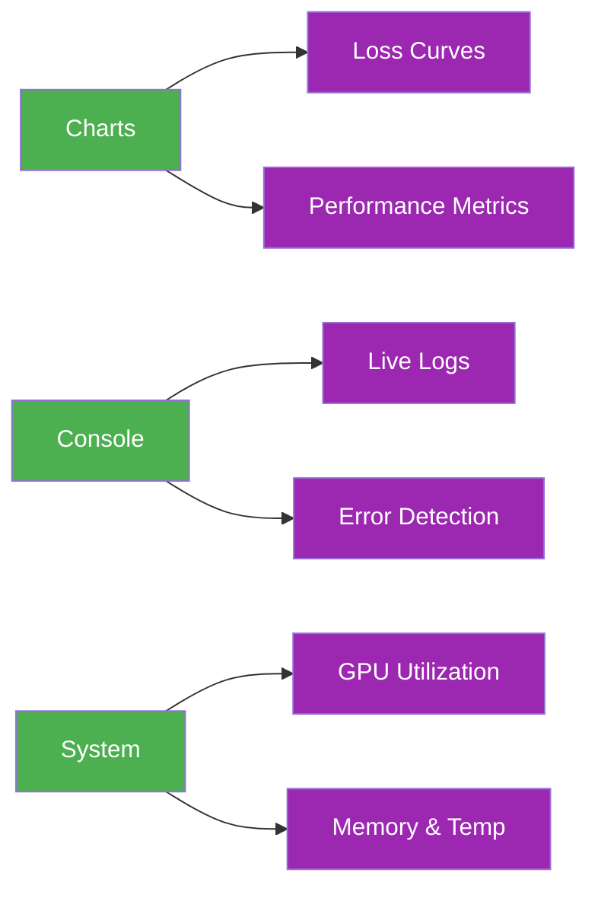

# Model Training

 {{ plan_badges(["Free", "Pro", "Enterprise"]) }}

[Ultralytics Platform](https://platform.ultralytics.com) provides comprehensive tools for training YOLO models, from organizing experiments to running cloud training jobs with real-time metrics streaming.

<p align="center">
  <br>
  <iframe loading="lazy" width="720" height="405" src="https://www.youtube.com/embed/bajkq0NrSN8"
    title="YouTube video player" frameborder="0"
    allow="accelerometer; autoplay; clipboard-write; encrypted-media; gyroscope; picture-in-picture; web-share"
    allowfullscreen>
  </iframe>
  <br>
  <strong>Watch:</strong> Get Started with Ultralytics Platform - Train
</p>

## Overview

The Training section helps you:

- **Organize** models into [projects](projects.md) for easier management
- **Train** on cloud GPUs with a single click
- **Monitor** real-time metrics during training
- **Compare** model performance across experiments
- **Export** to 19+ deployment formats (see [supported formats](models.md#supported-formats))


## Workflow


```mermaid
graph LR
    A[📁 Project]:::start --> B[⚙️ Configure]:::proc
    B --> C[🚀 Train]:::proc
    C --> D[📈 Monitor]:::proc
    D --> E[📦 Export]:::out

    classDef start fill:#4CAF50,color:#fff
    classDef proc fill:#2196F3,color:#fff
    classDef out fill:#9C27B0,color:#fff
```

| Stage         | Description                                                                |
| ------------- | -------------------------------------------------------------------------- |
| **Project**   | Create a workspace to organize related models                              |
| **Configure** | Select [dataset](../data/datasets.md), base model, and training parameters |
| **Train**     | Run on cloud GPUs or your local hardware                                   |
| **Monitor**   | View real-time loss curves and metrics                                     |
| **Export**    | Convert to 19+ deployment formats ([details](models.md#supported-formats)) |

## Training Options

Ultralytics Platform supports multiple training approaches:

| Method                                                  | Description                                   | Best For                   |
| ------------------------------------------------------- | --------------------------------------------- | -------------------------- |
| **[Cloud Training](cloud-training.md)**                 | Train on Ultralytics Cloud GPUs               | No local GPU, scalability  |
| **[Local Training](cloud-training.md#remote-training)** | Train locally, stream metrics to the platform | Existing hardware, privacy |
| **[Colab Training](cloud-training.md#remote-training)** | Use Google Colab with platform integration    | Free GPU access            |

## GPU Options

Available GPUs for cloud training on Ultralytics Cloud:



!!! info "GPU Tier Access"

    B200 and B300 GPUs require a [Pro or Enterprise plan](../account/billing.md#plans). All other GPUs are available on all plans including Free.

!!! tip "Signup Credits"

    New accounts receive signup credits for training. Check [Billing](../account/billing.md) for details.

## Real-Time Metrics

During training, view live metrics across three subtabs:


```mermaid
graph LR
    A[Charts]:::start --> B[Loss Curves]:::out
    A --> C[Performance Metrics]:::out
    D[Console]:::start --> E[Live Logs]:::out
    D --> F[Error Detection]:::out
    G[System]:::start --> H[GPU Utilization]:::out
    G --> I[Memory & Temp]:::out

    classDef start fill:#4CAF50,color:#fff
    classDef out fill:#9C27B0,color:#fff
```

| Subtab      | Metrics                                                |
| ----------- | ------------------------------------------------------ |
| **Charts**  | Box/class/DFL loss, mAP50, mAP50-95, precision, recall |
| **Console** | Live training logs with ANSI color and error detection |
| **System**  | GPU utilization, memory, temperature, CPU, disk        |

!!! info "Automatic Checkpoints"

    For cloud training, the **best model** (`best.pt`, the highest-mAP checkpoint) is saved automatically and made available for download, export, and deployment after training completes.

## Quick Start

Get started with cloud training in under a minute:

=== "Cloud (UI)"

    1. Create a project in the sidebar
    2. Click **New Model**
    3. Select a model, dataset, and GPU
    4. Click **Start Training**

=== "Remote (CLI)"

    ```bash
    export ULTRALYTICS_API_KEY="YOUR_API_KEY"
    yolo train model=yolo26n.pt data=ul://username/datasets/my-dataset \
      epochs=100 project=username/my-project name=exp1
    ```

=== "Remote (Python)"

    ```python
    from ultralytics import YOLO

    model = YOLO("yolo26n.pt")
    model.train(
        data="ul://username/datasets/my-dataset",
        epochs=100,
        project="username/my-project",
        name="exp1",
    )
    ```

## Quick Links

- [**Projects**](projects.md): Organize your models and experiments
- [**Models**](models.md): Manage trained checkpoints
- [**Cloud Training**](cloud-training.md): Train on cloud GPUs

## FAQ

### How long does training take?

Training time depends on:

- Dataset size (number of images)
- Model size (n, s, m, l, x)
- Number of epochs
- GPU type selected

A typical training run with 1000 images, YOLO26n, 100 epochs on RTX PRO 6000 takes about 5-10 minutes. Smaller runs (500 images, 50 epochs on RTX 4090) complete in under an hour. See [cost examples](cloud-training.md#cost-examples) for detailed estimates.

### Can I train multiple models simultaneously?

Yes. Concurrent cloud training limits depend on your plan: Free allows 3, Pro allows 10, and Enterprise is unlimited. For additional parallel training, use remote training from multiple machines.

### What happens if training fails?

If training fails:

1. The model is marked failed and the compute instance is terminated
2. You can start a new training run from the base model
3. Credits are only charged for completed compute time

### How do I choose the right GPU?

| Scenario                      | Recommended GPU  |
| ----------------------------- | ---------------- |
| Most training jobs            | RTX PRO 6000     |
| Large datasets or batch sizes | H100 SXM or H200 |
| Budget-conscious              | RTX 4090         |
