# Model Training

[Ultralytics Platform](https://platform.ultralytics.com) provides comprehensive tools for training YOLO models, from organizing experiments to running cloud training jobs with real-time metrics streaming.

## Overview

The Training section helps you:

- **Organize** models into projects for easier management
- **Train** on cloud GPUs with a single click
- **Monitor** real-time metrics during training
- **Compare** model performance across experiments

<!-- Screenshot: platform-train-overview.avif -->

## Workflow

```mermaid
graph LR
    A[📠Project] --> B[âš™ï¸ Configure]
    B --> C[🚀 Train]
    C --> D[📈 Monitor]
    D --> E[📦 Export]

    style A fill:#4CAF50,color:#fff
    style B fill:#2196F3,color:#fff
    style C fill:#FF9800,color:#fff
    style D fill:#9C27B0,color:#fff
    style E fill:#00BCD4,color:#fff
```

| Stage         | Description                                         |
| ------------- | --------------------------------------------------- |
| **Project**   | Create a workspace to organize related models       |
| **Configure** | Select dataset, base model, and training parameters |
| **Train**     | Run on cloud GPUs or your local hardware            |
| **Monitor**   | View real-time loss curves and metrics              |
| **Export**    | Convert to 17 deployment formats                    |

## Training Options

Ultralytics Platform supports multiple training approaches:

| Method              | Description                                | Best For                   |
| ------------------- | ------------------------------------------ | -------------------------- |
| **Cloud Training**  | Train on Platform cloud GPUs               | No local GPU, scalability  |
| **Remote Training** | Train locally, stream metrics to Platform  | Existing hardware, privacy |
| **Colab Training**  | Use Google Colab with Platform integration | Free GPU access            |

## GPU Options

Available GPUs for cloud training:

| GPU       | VRAM | Performance | Cost     |
| --------- | ---- | ----------- | -------- |
| RTX 3090  | 24GB | Good        | $0.44/hr |
| RTX 4090  | 24GB | Excellent   | $0.74/hr |
| L40S      | 48GB | Very Good   | $1.14/hr |
| A100 40GB | 40GB | Excellent   | $1.29/hr |
| A100 80GB | 80GB | Excellent   | $1.99/hr |
| H100 80GB | 80GB | Best        | $3.99/hr |

!!! tip "Free Training"

    New accounts receive credits for training. Check [Billing](../account/billing.md) for details.

## Real-Time Metrics

During training, view live metrics:

- **Loss Curves**: Box, class, and DFL loss
- **Performance**: mAP50, mAP50-95, precision, recall
- **System Stats**: GPU utilization, memory usage
- **Checkpoints**: Automatic saving of best weights

## Quick Links

- [**Projects**](projects.md): Organize your models and experiments
- [**Models**](models.md): Manage trained checkpoints
- [**Cloud Training**](cloud-training.md): Train on cloud GPUs

## FAQ

### How long does training take?

Training time depends on:

- Dataset size (number of images)
- Model size (n, s, m, l, x)
- Number of epochs
- GPU type selected

A typical training run with 1000 images, YOLO11n, 100 epochs on RTX 4090 takes about 30-60 minutes.

### Can I train multiple models simultaneously?

Cloud training currently supports one concurrent training job per account. For parallel training, use remote training from multiple machines.

### What happens if training fails?

If training fails:

1. Checkpoints are saved at each epoch
2. You can resume from the last checkpoint
3. Credits are only charged for completed compute time

### How do I choose the right GPU?

| Scenario                            | Recommended GPU   |
| ----------------------------------- | ----------------- |
| Small datasets (<5000 images)       | RTX 4090          |
| Medium datasets (5000-50000 images) | A100 40GB         |
| Large datasets or batch sizes       | A100 80GB or H100 |
| Budget-conscious                    | RTX 3090          |
