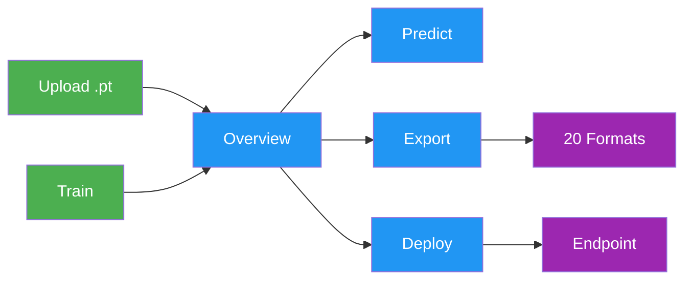
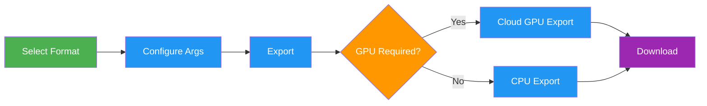

# Models

[Ultralytics Platform](https://platform.ultralytics.com) provides comprehensive model management for training, analyzing, and deploying YOLO models. Upload pretrained models or train new ones directly on the platform.

<!-- screenshot -->

## Upload Model

Upload existing model weights to the platform:

1. Navigate to your project
2. **Drag and drop** `.pt` files onto the project page or models sidebar, or click the **Upload models** icon
3. Model metadata is parsed automatically from the file

Multiple files can be uploaded simultaneously (up to 3 concurrent).

<!-- screenshot -->
Supported model formats:

| Format  | Extension | Description               |
| ------- | --------- | ------------------------- |
| PyTorch | `.pt`     | Native Ultralytics format |

After upload, the platform parses model metadata:

- Task type ([detect](../../tasks/detect.md), [segment](../../tasks/segment.md), [semantic](../../tasks/semantic.md), [depth](../../tasks/depth.md), [classify](../../tasks/classify.md), [pose](../../tasks/pose.md), [OBB](../../tasks/obb.md))
- Architecture (YOLO26n, YOLO26s, etc.)
- Class names and count
- Input size and parameters
- Training results and metrics (if present in checkpoint)

## Train Model

Train a new model directly on the platform:

1. Navigate to your project
2. Click **New Model**
3. Select base model and dataset
4. Configure training parameters
5. Choose cloud or local training
6. Start training

See [Cloud Training](cloud-training.md) for detailed instructions.

## Model Lifecycle



## Model Page Tabs

Each model page has the following tabs:

| Tab          | Content                                       |
| ------------ | --------------------------------------------- |
| **Overview** | Model metadata, key metrics, dataset link     |
| **Train**    | Training charts, console output, system stats |
| **Predict**  | Interactive browser inference                 |
| **Export**   | Format conversion with GPU selection          |
| **Deploy**   | Endpoint creation and management              |

### Model Header

Above the tabs, the header shows the model color (editable), the name (click to rename), the task badge, the checkpoint's `ultralytics` version, and a [license](projects.md#create-project) selector. Its actions are **Clone Model** (on completed models with weights that you don't already own), **Download**, **Star**, **Share** (public models), and a **More actions** menu holding **Information**, **Refresh**, and **Delete Model**.

Directly below, one card per task metric shows the final value over a sparkline of its training progression — click any card to jump to the charts — alongside a card linking the dataset the model was trained on.

| Task                | Summary metrics                                     |
| ------------------- | --------------------------------------------------- |
| **Detect**, **OBB** | mAP50, mAP50-95, precision, recall                  |
| **Segment**         | The same four metrics, mask (M) variants            |
| **Pose**            | The same four metrics, keypoint (P) variants        |
| **Classify**        | Top-1 accuracy, Top-5 accuracy                      |
| **Semantic**        | mIoU, pixel accuracy                                |
| **Depth**           | δ1, AbsRel ↓, RMSE ↓, SILog ↓ (↓ = lower is better) |

### Overview Tab

The **Run Information** card records how the run executed: status, start time, runtime, compute cost with the GPU and hourly rate, the `ultralytics` version, host details (hostname, environment, OS, Python, CPU, GPU), the parent model, the pinned dataset version, Git repository, branch and commit when the run reported them, and a reproducible `yolo train` command you can copy.

While a run is active the card shows live progress — epoch counter, progress bar, elapsed time, ETA, accruing cost — and a **Cancel** button. If a run fails, an error banner replaces it with the captured error and **View full console logs** and **Retry Training** actions.

Below it, **Training Configuration** lists every hyperparameter used and **Performance Metrics** lists the final evaluation results. Both tables are searchable and have an **Export data** menu (Copy JSON, Download CSV, Download JSON).

<!-- screenshot -->

### Train Tab

The Train tab has three subtabs:

#### Charts Subtab

Interactive metric charts over epochs, split into **Training** and **Validation** views when the run produced validation artifacts. The chart groups follow the metrics the run reported:

| Chart Group       | Charts                                                                           |
| ----------------- | -------------------------------------------------------------------------------- |
| **Metrics**       | The task metrics listed under [Model Header](#model-header)                      |
| **Loss**          | One chart per loss component (box, cls, …), training solid and validation dashed |
| **Learning Rate** | lr/pg0, lr/pg1, lr/pg2                                                           |

Each group collapses, its menu hides or shows individual charts (and, for losses, the train or validation series), and charts can be dragged and resized into a layout that persists across sessions.

<!-- screenshot -->

#### Console Subtab

Live console output from the training process:

- Real-time log streaming during training, retaining the last 2000 lines
- Epoch progress bars and validation results
- Fatal-error detection that ends the run and surfaces the message in a banner
- ANSI color support, an optional timestamp column, and one-click copy as plain text

<!-- screenshot -->

#### System Subtab

A host card summarizing the training instance (hostname, CPU, GPU, RAM and disk totals, and when it was last seen), followed by per-epoch charts:

| Chart                        | Description                            |
| ---------------------------- | -------------------------------------- |
| **CPU & RAM Usage**          | CPU and system memory utilization      |
| **GPU Utilization & Memory** | GPU compute and GPU memory utilization |
| **GPU Temperature**          | Average temperature across GPUs        |
| **Network I/O**              | Download and upload throughput         |
| **Disk I/O**                 | Read and write throughput              |

GPU, network, and disk charts appear only when the run reported those counters.

<!-- screenshot -->

### Predict Tab

Run interactive inference directly in the browser:

- Upload an image, use example images, or use webcam
- Results display with bounding boxes, masks, semantic class maps, or keypoints
- Auto-inference when an image is provided
- Supports all task types ([detect](../../tasks/detect.md), [segment](../../tasks/segment.md), [semantic](../../tasks/semantic.md), [depth](../../tasks/depth.md), [classify](../../tasks/classify.md), [pose](../../tasks/pose.md), [OBB](../../tasks/obb.md))

!!! tip "Quick Testing"

    The Predict tab runs inference on Ultralytics Cloud, so you don't need a local GPU. Results are displayed with interactive overlays matching the model's task type.

### Export Tab

Export your model to 20 deployment formats. See [Export Model](#export-model) below and the core [Export mode guide](../../modes/export.md) for full details.

### Deploy Tab

Create and manage dedicated inference endpoints. See [Deployments](../deploy/index.md) for details.

## Validation Plots

After training completes, the **Validation** view inside the Charts subtab shows a detailed analysis of the final epoch.

### Confusion Matrix

Interactive heatmap showing prediction accuracy per class:

<!-- screenshot -->

### PR/F1 Curves

When the training run provides them, the **Validation** view also displays performance curves at different confidence thresholds. Available validation plots depend on the artifacts produced by the run.

<!-- screenshot -->

| Curve                    | Description                              |
| ------------------------ | ---------------------------------------- |
| **Precision-Recall**     | Trade-off between precision and recall   |
| **F1-Confidence**        | F1 score at different confidence levels  |
| **Precision-Confidence** | Precision at different confidence levels |
| **Recall-Confidence**    | Recall at different confidence levels    |

### Per-Image Diagnostics

Detection models trained with a [saved dataset version](cloud-training.md#save-dataset-version-optional) also get per-image validation analysis, which points at the data behind a disappointing score:

- **Worst- and best-performing images**, ranked by per-image F1 and drawn with their ground-truth boxes
- **Characteristic explorer**, correlating F1 against image width, height, pixel count, aspect ratio, and instance count, with the strongest relationship selected by default
- **Classes associated with failures**, ranking which classes appear most often in the weakest images

!!! note "Requirements"

    Per-image diagnostics need a signed-in viewer, a completed [detection](../../tasks/detect.md) run, and a linked
    dataset version — the immutable snapshot is what makes each image's ground truth recoverable. Runs that did not
    record per-image metrics show a short notice instead.

## Export Model



Export your model to 20 deployment formats:

1. Navigate to the **Export** tab
2. Select target format
3. Configure export arguments (image size, half precision, dynamic, etc.)
4. For GPU-required formats (TensorRT), select a GPU type
5. Click **Start Export**
6. Download when complete

Connect [Slack alerts](../integrations/slack.md) to receive a message when an export is ready or fails.

<!-- screenshot -->

### Supported Formats

The Platform supports export to [20 deployment formats](../../modes/export.md#export-formats): ONNX, TorchScript, OpenVINO, TensorRT, CoreML, TF SavedModel, TF GraphDef, LiteRT, TF Edge TPU, PaddlePaddle, NCNN, MNN, RKNN, Qualcomm (QNN), IMX500, Axelera, ExecuTorch, DeepX, Hailo, and Huawei Ascend.

### Format Selection Guide

| Target             | Recommended Format  | Notes                                                          |
| ------------------ | ------------------- | -------------------------------------------------------------- |
| **NVIDIA GPUs**    | TensorRT            | Select the same GPU family as the deployment device            |
| **NVIDIA Jetson**  | TensorRT            | Select the intended target and check its validation status     |
| **Intel Hardware** | OpenVINO            | CPUs, GPUs, and VPUs                                           |
| **Apple Devices**  | CoreML or LiteRT    | iOS, macOS, Apple Silicon                                      |
| **Android**        | LiteRT or NCNN      | LiteRT (Google's on-device runtime) or NCNN for ARM            |
| **Web Browsers**   | LiteRT.js or ONNX   | LiteRT.js or ONNX via ONNX Runtime Web                         |
| **Edge Devices**   | TF Edge TPU or RKNN | Coral and Rockchip (see [supported chips](#rknn-chip-support)) |
| **General**        | ONNX                | Works with most runtimes                                       |

<!-- screenshot -->

### NVIDIA Jetson TensorRT Targets

Ultralytics Platform offers the following Jetson target selections for TensorRT `.engine` exports. As of July 2026, Jetson TensorRT exports are built with JetPack 7.2 / L4T r39.2, Python 3.12.3, NVIDIA PyTorch 2.12.0a0 (26.04 build), CUDA 13.2, and TensorRT 10.16.1.11.

| Target selection           | API `gpuType`          | Memory | GPU architecture   | Python | CUDA | TensorRT   | Measured YOLO26n FP16 export | Physical build/load validation                |
| -------------------------- | ---------------------- | -----: | ------------------ | ------ | ---- | ---------- | ---------------------------: | --------------------------------------------- |
| Jetson Thor T5000          | `jetson-thor-t5000`    | 128 GB | Blackwell, CC 11.0 | 3.12.3 | 13.2 | 10.16.1.11 |                      ~1m 46s | Thor in NVIDIA T4000 profile; T5000 candidate |
| Jetson Thor T4000          | `jetson-thor-t4000`    |  64 GB | Blackwell, CC 11.0 | 3.12.3 | 13.2 | 10.16.1.11 |                      ~1m 46s | Thor in NVIDIA T4000 profile                  |
| Jetson AGX Orin 64GB       | `jetson-agx-orin-64gb` |  64 GB | Ampere, CC 8.7     | 3.12.3 | 13.2 | 10.16.1.11 |                       7m 15s | Built, loaded, and inferred on AGX Orin 64GB  |
| Jetson AGX Orin 32GB       | `jetson-agx-orin-32gb` |  32 GB | Ampere, CC 8.7     | 3.12.3 | 13.2 | 10.16.1.11 |                       5m 34s | AGX Orin 64GB build/load; 32GB SKU pending    |
| Jetson Orin NX 16GB        | `jetson-orin-nx-16gb`  |  16 GB | Ampere, CC 8.7     | 3.12.3 | 13.2 | 10.16.1.11 |                       5m 09s | AGX Orin 64GB build/load; NX SKU pending      |
| Jetson Orin NX 8GB         | `jetson-orin-nx-8gb`   |   8 GB | Ampere, CC 8.7     | 3.12.3 | 13.2 | 10.16.1.11 |                       5m 01s | AGX Orin 64GB build/load; NX SKU pending      |
| Jetson Orin Nano 8GB Super | `jetson-orin-nano-8gb` |   8 GB | Ampere, CC 8.7     | 3.12.3 | 13.2 | 10.16.1.11 |                       4m 59s | AGX Orin 64GB build/load; Nano SKU pending    |
| Jetson Orin Nano 4GB       | `jetson-orin-nano-4gb` |   4 GB | Ampere, CC 8.7     | 3.12.3 | 13.2 | 10.16.1.11 |                       5m 01s | AGX Orin 64GB build/load; Nano SKU pending    |

The timings are single observed end-to-end production routing tests from July 2026, rounded to the nearest second; they are reference measurements, not an SLA or per-SKU performance benchmark. Both Thor selections are built on a T5000 Developer Kit in NVIDIA's T4000 compatibility profile. The six Orin routes are built on an AGX Orin 64GB, where every resulting engine was loaded and run.

!!! warning "Match the TensorRT engine build environment"

    Downloaded engines are tied to their build platform, GPU family, TensorRT version, and a compatible CUDA runtime. For Jetson targets, the software versions are shown in the table above. Validate each engine and its memory fit on the deployment device, and perform INT8 calibration there for best results. If the environments do not match, export the engine locally instead. See the [NVIDIA Jetson guide](../../guides/nvidia-jetson.md) and [TensorRT integration guide](../../integrations/tensorrt.md) for local deployment details.

### RKNN Chip Support

When exporting to RKNN format, select your target Rockchip device:

| Chip    | Description          |
| ------- | -------------------- |
| RK3588  | High-end edge SoC    |
| RK3576  | Mid-range edge SoC   |
| RK3566  | Mid-range edge SoC   |
| RK3568  | Mid-range edge SoC   |
| RK3562  | Entry-level edge SoC |
| RV1103  | Vision processor     |
| RV1106  | Vision processor     |
| RV1103B | Vision processor     |
| RV1106B | Vision processor     |
| RK2118  | AI processor         |
| RV1126B | Vision processor     |

### Export Job Lifecycle

Export jobs progress through the following statuses:

| Status        | Description                          |
| ------------- | ------------------------------------ |
| **Queued**    | Export job is waiting to start       |
| **Starting**  | Export job is initializing           |
| **Running**   | Export is in progress                |
| **Completed** | Export finished — download available |
| **Failed**    | Export failed (see error message)    |
| **Cancelled** | Export was cancelled by the user     |

!!! tip "Export Time"

    Export time varies by format and build host. TensorRT exports may take several minutes because TensorRT profiles and tunes the engine on the physical GPU shown in the [Jetson validation table](#nvidia-jetson-tensorrt-targets) or the selected cloud GPU.

### Bulk Export Actions

- **Export All**: Click `Export All` to start export jobs for all CPU-based formats with default settings. Formats that need a GPU selection, are unavailable for this model, or already have an export are skipped and listed for you.
- **Delete All Exports**: Click `Delete All` to remove all exports for the model.

### Format Restrictions

Some export formats have architecture or task restrictions:

| Format       | Restriction                                                                                                                                                                            |
| ------------ | -------------------------------------------------------------------------------------------------------------------------------------------------------------------------------------- |
| **IMX500**   | Available only for `YOLOv8n` and `YOLO11n`; INT8 or W8A16                                                                                                                              |
| **Axelera**  | Detect models only; INT8 only                                                                                                                                                          |
| **DeepX**    | INT8 only                                                                                                                                                                              |
| **Hailo**    | INT8 HEF output; select Hailo-8, Hailo-8L, Hailo-10H, Hailo-15H, or Hailo-15L. YOLOv8, YOLO11, and YOLO26 only; for YOLO26, detect, semantic, depth, and classify                      |
| **Huawei**   | FP16 .om output; Ascend310P1, Ascend310P3, Ascend310B1, and Ascend310B4 targets                                                                                                        |
| **Qualcomm** | Fixed W8A16 quantization; select a [supported HTP target](../../integrations/qnn.md#supported-htp-targets). Dragonwing IQ-8275 is supported with `name=iq-8275`; IQ-615 is unsupported |

!!! note "Additional Export Rules"

    - Classification, semantic segmentation, and depth exports do not include NMS, and MNN embeds NMS only for detect and pose.
    - CoreML exports with batch sizes greater than `1` use `dynamic=true`.
    - Unsupported format/model combinations are disabled in the export dialog before you launch.
    - Only one export per format can run at a time for a given model.

## Clone Model

Clone a model to a different project:

1. Open the model page
2. Click **Clone Model**
3. Select the destination project, or choose **New Project** to create one inline
4. Optionally give the clone a different name
5. Click **Clone Model**

The model and its weights are copied to the target project. **Clone Model** appears on completed models with weights that you do not already own.

## Download Model

Download your model weights:

1. Navigate to the model's **Overview** tab
2. Click the **Download** button
3. The model's primary `.pt` checkpoint downloads automatically

Exported formats can be downloaded from the **Export** tab after export completes.

## Dataset Linking

Models can be linked to their source dataset:

- View which dataset was used for training
- Click the dataset card on the Overview tab to navigate to it
- Track data lineage

When training with Platform datasets using the [`ul://` URI format](../data/datasets.md#dataset-uri), linking is automatic.

!!! example "Dataset URI Format"

    ```bash
    # Train with a Platform dataset — linking is automatic
    yolo train model=yolo26n.pt data=ul://username/datasets/my-dataset epochs=100
    ```

    The `ul://` scheme resolves to your Platform dataset. The trained model's Overview tab will show a link back to this dataset (see [Using Platform Datasets](../api/index.md#using-platform-datasets)).

## Custom Metadata

Open **More actions** and select **Information** to review two sections:

- **Ultralytics Metadata**: Read-only Platform details such as the model ID, project, source dataset, task, status, and timestamps
- **Custom Metadata**: Your own JSON object for evaluation context, release tracking, governance, or other model-specific data

Custom metadata is separate from training-owned model information, environment details, and training arguments. Workspace viewers can inspect it, while members with edit access can replace the object. The serialized metadata object is limited to 500,000 characters, and each top-level key is limited to 128 characters. Save an empty object (`{}`) to clear custom metadata.

## Visibility Settings

Control who can see your model:

| Setting     | Description                               |
| ----------- | ----------------------------------------- |
| **Private** | Only you and workspace members can access |
| **Public**  | Anyone can view on Explore page           |

Visibility is set at the project level, so it controls every model in the project. To change it, click the visibility badge (`private` or `public`) beside the project name in the breadcrumb at the top of the page. Switching to private takes effect immediately. Switching to public shows a confirmation dialog before applying.

## Delete Model

Remove a model you no longer need:

1. Open the **More actions** menu in the model header and select **Delete Model**
2. Confirm deletion

!!! note "Trash and Restore"

    Deleted models go to Trash for 30 days. Restore from [Settings > Trash](../account/trash.md).

## See Also

- [**Inference**](../deploy/inference.md): Test models in the browser with the Predict tab
- [**Endpoints**](../deploy/endpoints.md): Deploy models to production with dedicated endpoints
- [**Cloud Training**](cloud-training.md): Configure and run training jobs on cloud GPUs
- [**Export Formats**](../../modes/export.md): Full guide to all 20 export formats

## FAQ

### What model architectures are supported?

Ultralytics Platform fully supports all YOLO architectures with dedicated projects:

- [**YOLO26**](../../models/yolo26.md): n, s, m, l, x variants (latest, recommended) — [platform.ultralytics.com/ultralytics/yolo26](https://platform.ultralytics.com/ultralytics/yolo26)
- [**YOLO11**](../../models/yolo11.md): n, s, m, l, x variants — [platform.ultralytics.com/ultralytics/yolo11](https://platform.ultralytics.com/ultralytics/yolo11)
- [**YOLOv8**](../../models/yolov8.md): n, s, m, l, x variants — [platform.ultralytics.com/ultralytics/yolov8](https://platform.ultralytics.com/ultralytics/yolov8)
- [**YOLOv5**](../../models/yolov5.md): n, s, m, l, x variants — [platform.ultralytics.com/ultralytics/yolov5](https://platform.ultralytics.com/ultralytics/yolov5)

YOLO26 supports 7 task types: [detect](../../tasks/detect.md), [segment](../../tasks/segment.md), [semantic](../../tasks/semantic.md), [depth](../../tasks/depth.md), [classify](../../tasks/classify.md), [pose](../../tasks/pose.md), and [OBB](../../tasks/obb.md). YOLO11 and YOLOv8 support the same set except semantic segmentation and depth, while YOLOv5 supports detect only.

### Can I download my trained model?

Yes, download your model weights from the model page:

1. Click the download icon on the Overview tab
2. The model's primary `.pt` checkpoint downloads automatically
3. Exported formats can be downloaded from the Export tab

### How do I compare models across projects?

Currently, model comparison is within projects. To compare across projects:

1. Clone models to a single project, or
2. Export metrics and compare externally

### What's the maximum model size?

Uploaded `.pt` model files are limited to 1 GB, and models near that limit may take longer to upload and process.

### Can I fine-tune pretrained models?

Yes. Choose a compatible model from the official YOLO26, YOLO11, YOLOv8, or YOLOv5 projects, or select one of
your own completed or uploaded checkpoints from **My Models** in the training dialog.
