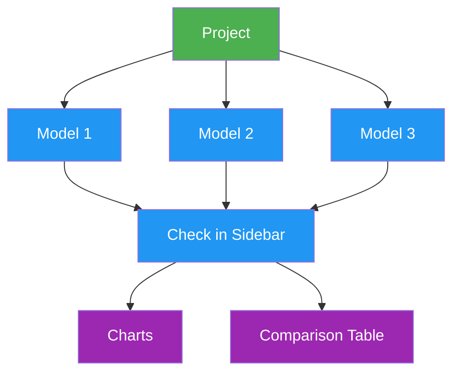

# Projects

[Ultralytics Platform](https://platform.ultralytics.com) projects provide an effective solution for organizing and managing your models. Group related models together to facilitate easier management, comparison, and development.

## Create Project

Navigate to **Projects** in the sidebar and click **New Project**.

<!-- screenshot -->
??? tip "Quick Create"

    You can also create a project from the Home page quick actions.

Enter your project details:

- **Name**: A descriptive name for your project (a random name is auto-generated)
- **URL**: The project slug, generated from the name and editable before creation
- **Description**: Optional notes about the project purpose
- **Visibility**: Public (anyone can view) or Private (only you and your team members can access). New projects default to Public; Enterprise workspaces default new projects to Private with the Ultralytics-Enterprise license.
- **License**: Optional license for your project (None, Apache-2.0, MIT, BSD-3-Clause, AGPL-3.0, GPL-3.0, LGPL-3.0, MPL-2.0, EUPL-1.1, Unlicense, CC0-1.0, Ultralytics-Enterprise, or Other). The **Ultralytics-Enterprise** license is for commercial use without AGPL requirements and is available with an Enterprise plan — see [Ultralytics Licensing](https://www.ultralytics.com/license). Enterprise workspaces preselect it for new projects.

<!-- screenshot -->
Click **Create Project** to finalize. Your new project appears in the Projects list and sidebar.

## Project Page

The project page has two main areas:

| Area               | Description                                                                      |
| ------------------ | -------------------------------------------------------------------------------- |
| **Models Sidebar** | Resizable list of all models in the project, with checkboxes for chart selection |
| **Main Panel**     | Charts dashboard or comparison table (toggle between views)                      |

A controls row above both areas holds the model search box, the **Diff** toggle (table view only, badged with how many columns differ), the view-options dropdown, and the view-mode toggle.

<!-- screenshot -->

### Project Header

The header displays:

- **Project icon** (customizable color, letter, or uploaded image)
- **Editable name** (click to rename; slug auto-updates)
- **License selector** (click to change; copyleft licenses inherited from a clone are locked)
- **Model count**, completed/training/failed counts, total size
- **Clone count** and **last updated** timestamp
- **Description** (click to edit)

Action buttons in the header:

| Button            | Description                                                                |
| ----------------- | -------------------------------------------------------------------------- |
| **New Model**     | Open the [training dialog](cloud-training.md) for editable projects        |
| **Upload models** | Select one or more `.pt` checkpoints for an editable project               |
| **Clone Project** | Clone a public project and its completed models into your workspace        |
| **Star**          | Star or unstar the project                                                 |
| **Share**         | Share or embed a public project                                            |
| **More actions**  | **Information** (metadata), **Refresh**, and **Delete Project** for owners |

The project's visibility badge sits beside its name in the breadcrumb at the top of the page; click it to switch between public and private.

### View Modes

Toggle between three view modes using the view controls. The selected mode is remembered per project.

- **Cards**: Full-size model cards in the sidebar with the Charts dashboard on the right — loss curves and metric comparisons for checked models.
- **Compact**: Condensed models sidebar with the Charts dashboard on the right — more vertical room for models in projects with many experiments.
- **Table**: Comparison table showing training arguments and final metrics side-by-side. Enable **Diff** to show only the columns where values differ across models.

<!-- screenshot -->

### Filter and Sort

The controls row above the models list provides:

- **Search** to filter models by name
- **Status filter**: All, Completed, Untrained, Running, Starting, or Failed
- **Group by**: None or Task — grouping applies in Compact and Table modes
- **Sort by**: Created, Name, or Size, each ascending or descending

### Models Sidebar

The resizable sidebar lists all models in the project:

- **Checkboxes** to select which models appear in charts and the comparison table
- **Drag and drop** `.pt` files directly onto the sidebar to upload models ([model upload details](models.md#upload-model))
- **Training progress** shown for running models (epoch count and progress bar)
- **Model color** picker, used consistently across every chart

Click any model to open its [model page](models.md).

## Project Icon

Customize your project icon:

1. Click the icon next to the project name
2. Choose a **color** and **letter**, or upload a custom **image**
3. Changes save automatically

## Visibility Settings

Control who can see your project:

| Setting     | Description                                      |
| ----------- | ------------------------------------------------ |
| **Public**  | Anyone can view on [Explore](../explore.md) page |
| **Private** | Only you and your team members                   |

## Share a Project

There is no per-project collaborator invite. To share a project with others, use either of these mechanisms:

- **Public** visibility lets anyone view a project on [Explore](../explore.md).
- **[Teams](../account/teams.md)** create a shared workspace where all resources (projects, datasets, models, deployments) are accessible to team members with role-based permissions. Use Teams for ongoing collaboration.

## Clone Project

Clone a public project to your own account:

1. Visit the public project page
2. Click **Clone Project**
3. The project and its completed models are copied to your workspace; you choose the clone's visibility in the clone dialog

!!! info "Clone Behavior"

    Cloned projects inherit the source project's visibility by default (so cloning a public project creates a public clone), and you can choose Public or Private in the clone dialog before confirming. Enterprise workspaces default new clones to private. The clone count is displayed on the original project. If the original has a copyleft license (e.g., AGPL-3.0), the clone inherits and locks that license.

## Compare Models

### Charts Dashboard

Compare model performance using the charts dashboard:

1. Select models in the sidebar using checkboxes
2. View overlaid metric curves grouped by type (metrics, loss, learning rate)
3. Drag charts to rearrange, resize by dragging edges
4. Hover to see exact values, click legend items to hide/show models, click a model line to navigate to that model

Available chart groups:

| Group             | Charts                                                                                |
| ----------------- | ------------------------------------------------------------------------------------- |
| **Metrics**       | Task metrics, such as mAP50, mAP50-95, precision, and recall for detection            |
| **Loss**          | One chart per loss component (box, cls, dfl, …), training solid and validation dashed |
| **Learning Rate** | lr/pg0, lr/pg1, lr/pg2                                                                |

Comparing models trained for different tasks works, but each model only draws on the charts for metrics it actually reported.

!!! tip "Interactive Charts"

    - Hover to see exact values
    - Click legend items to hide/show models
    - Drag to zoom into specific regions
    - Click a model line to navigate to that model's page
    - Collapse a group, or use its menu to hide individual charts and the train or validation loss series
    - Rearrange and resize charts; layout persists across sessions

### Comparison Table

Switch to table view for side-by-side comparison of training arguments and final metrics:

1. Click the **Table** view mode toggle
2. See all selected models as rows with training args and metrics as columns
3. Use the **Diff** button to show only the columns where values differ across models

## Upload Models

Upload existing `.pt` model files:

1. **Drag and drop** files onto the project page or models sidebar
2. Multiple files can be uploaded simultaneously (up to 3 concurrent uploads)
3. Model metadata (task, architecture, class names, training results) is parsed automatically from the `.pt` file
4. Charts update instantly from locally parsed data while the upload completes in the background

!!! example "Supported Files"

    Only PyTorch `.pt` files from Ultralytics YOLO training are supported. The Platform parses embedded metadata including training results, arguments, task type, and class names. See [Models](models.md) for format details.

## Edit Project

Update project name, description, or settings:

1. Click the project name to edit it inline
2. Click the description to edit it inline
3. Click the icon to customize it
4. Click the license badge to change the license

<!-- screenshot -->

### Custom Metadata

Open **More actions** and select **Information** to review two sections:

- **Ultralytics Metadata**: Read-only Platform details such as the project ID, owner, visibility, license, tags, and timestamps
- **Custom Metadata**: Your own JSON object for department, program, cost center, governance, or other organizational context

Workspace viewers can inspect metadata, while members with edit access can replace the custom metadata object. The serialized metadata object is limited to 500,000 characters, and each top-level key is limited to 128 characters. Save an empty object (`{}`) to clear custom metadata.

## Delete Project

Remove a project you no longer need:

1. Open the **More actions** menu in the header and select **Delete Project**
2. Confirm deletion

!!! warning "Cascading Delete"

    Deleting a project also deletes all models inside it. This action moves items to [Trash](../account/trash.md) where they can be restored within 30 days.

## FAQ

### How many models can a project contain?

There is no separate per-project model limit. The workspace-wide plan limit applies across all projects: Free supports
100 models, Pro supports 500, and Enterprise is unlimited. For clearer comparisons:

- Group related experiments (same dataset/task)
- Delete obsolete runs to Trash when you no longer need them
- Use meaningful project names

### Can I restore a deleted project?

Yes, deleted projects go to Trash and can be restored within 30 days:

1. Go to [Settings > Trash](../account/trash.md)
2. Find the project
3. Click **Restore**

### Can I transfer models between projects?

Yes, you can clone a model to a different project using the clone model dialog from the [model page](models.md#clone-model).
