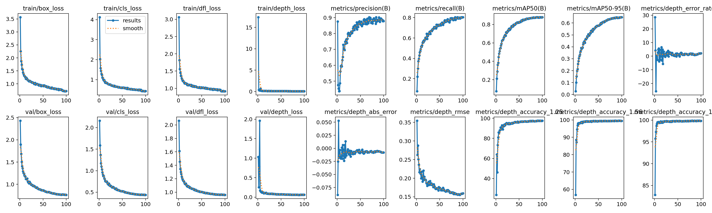

# Monocular Depth Estimation (MDE)

Monocular Depth Estimation (MDE) is a task that involves predicting the distance of objects from the camera using a single image. Unlike traditional depth estimation methods that require stereo cameras or LiDAR sensors, MDE estimates depth from monocular (single) images, making it more accessible and cost-effective.

The YOLO11-MDE model extends standard object detection by simultaneously predicting:

- **Bounding boxes** that localize objects in the image
- **Class labels** that identify what each object is
- **Depth values** that estimate how far each object is from the camera

This combined approach enables applications that require both object detection and spatial understanding, such as autonomous driving, robotics, augmented reality, and advanced driver assistance systems (ADAS).

!!! tip

    YOLO11-MDE models use the `-mde` suffix, i.e. `yolo11n-mde.pt` and can be trained on datasets like [KITTI](https://www.cvlibs.net/datasets/kitti/) that include depth annotations.

## [Models](https://github.com/ultralytics/ultralytics/tree/main/ultralytics/cfg/models/11)

YOLO11 pretrained MDE models are shown here. These models extend the standard YOLO11 detection models with an additional depth estimation head. MDE models are pretrained on the [KITTI](https://www.cvlibs.net/datasets/kitti/) dataset, which is widely used for autonomous driving research.

[Models](https://github.com/ultralytics/ultralytics/tree/main/ultralytics/cfg/models) download automatically from the latest Ultralytics [release](https://github.com/ultralytics/assets/releases) on first use.

| Model       | size<br><sup>(pixels) | mAP<sup>val</sup><br>50-95 | params<br><sup>(M) | FLOPs<br><sup>(B) |
| ----------- | --------------------- | -------------------------- | ------------------ | ----------------- |
| YOLO11n-mde | 640                   | 51.9                       | 2.6                | 6.6               |
| YOLO11s-mde | 640                   | 62.6                       | 9.5                | 21.7              |
| YOLO11m-mde | 640                   | 64.9                       | 20.1               | 68.5              |
| YOLO11l-mde | 640                   | 53.1                       | 25.4               | 87.6              |
| YOLO11x-mde | 640                   | 63.6                       | 57.0               | 196.0             |

- **mAP<sup>val</sup>** values are for single-model single-scale on [KITTI](https://www.cvlibs.net/datasets/kitti/) validation set. <br>Reproduce by `yolo mde val data=kitti_mde.yaml device=0`

## Train

Train YOLO11n-mde on the KITTI dataset for 100 [epochs](https://www.ultralytics.com/glossary/epoch) at image size 640. For a full list of available arguments see the [Configuration](../usage/cfg.md) page.

!!! example

    === "Python"

        ```python
        from ultralytics import YOLO

        # Build and train a new YOLO11n-mde model from scratch
        model = YOLO("yolo11-mde.yaml")  # automatically uses 'n' scale
        results = model.train(data="kitti_mde.yaml", epochs=100, imgsz=640)
        ```

    === "CLI"

        ```bash
        # Build a new model from YAML and start training from scratch
        yolo mde train data=kitti_mde.yaml model=yolo11-mde.yaml epochs=100 imgsz=640
        ```

### Dataset format

MDE dataset format extends the YOLO detection format by adding a depth value for each object. The format for each annotation line is:

```
class_id x_center y_center width height depth
```

Where:

- `class_id`: Object class index (integer, starting from 0)
- `x_center, y_center`: Normalized center coordinates of the bounding box (0-1)
- `width, height`: Normalized width and height of the bounding box (0-1)
- `depth`: Normalized depth value (0-1), calculated as `actual_depth / depth_max`

To convert actual depth in meters back: `depth_meters = depth * depth_max`

**Example annotation:**

```
0 0.5 0.5 0.2 0.3 0.155
```

This represents a Car (class 0) at the center of the image with normalized width 0.2, height 0.3, and depth 0.155 (which equals 15.5m if depth_max=100).

**Dataset YAML configuration:**

```yaml
# kitti_mde.yaml
path: /path/to/kitti_yolo_depth
train: train/images
val: val/images

nc: 5
names:
    0: Car
    1: Pedestrian
    2: Cyclist
    3: Van
    4: Truck

depth_max: 100.0 # Maximum depth for normalization (meters)
```

For more details on preparing depth estimation datasets, refer to the MDE dataset preparation guide.

## Val

Validate trained YOLO11n-mde model [accuracy](https://www.ultralytics.com/glossary/accuracy) on the KITTI dataset. No arguments are needed as the `model` retains its training `data` and arguments as model attributes.

!!! example

    === "Python"

        ```python
        from ultralytics import YOLO

        # Load a trained model
        model = YOLO("runs/mde/train/weights/best.pt")  # load your trained model

        # Validate the model
        metrics = model.val()  # no arguments needed, dataset and settings remembered
        ```

    === "CLI"

        ```bash
        yolo mde val model=runs/mde/train/weights/best.pt
        ```

### Validation Metrics

MDE models provide both standard object detection metrics and specialized depth estimation metrics:

**Detection Metrics:**

- Precision (P)
- Recall (R)
- mAP50 (mean Average Precision at IoU=0.5)
- mAP50-95 (mean Average Precision at IoU=0.5:0.95)

**Depth Metrics:**

- **Depth Error Rate**: Percentage error in depth predictions
- **Depth MAE**: Mean Absolute Error of depth in meters
- **Depth RMSE**: Root Mean Square Error of depth in meters
- **Depth Accuracy (δ<1.25)**: Percentage of predictions where `max(pred/gt, gt/pred) < 1.25`

### Training Results

Here are the actual training results from YOLO11-MDE models trained on the KITTI dataset for 100 epochs:

| Model       | Precision | Recall | mAP50 | mAP50-95 | Depth Accuracy (δ<1.25) |
| ----------- | --------- | ------ | ----- | -------- | ----------------------- |
| YOLO11n-mde | 82.1%     | 66.3%  | 76.6% | 51.9%    | 95.5%                   |
| YOLO11s-mde | 87.6%     | 77.7%  | 86.3% | 62.6%    | 97.2%                   |
| YOLO11m-mde | 87.9%     | 80.4%  | 87.9% | 64.9%    | 97.5%                   |
| YOLO11l-mde | 83.5%     | 66.1%  | 76.4% | 53.1%    | 94.5%                   |
| YOLO11x-mde | 89.9%     | 77.5%  | 87.0% | 63.6%    | 97.1%                   |

**Example Prediction Results:**


The image above shows validation predictions from YOLO11m-mde model, displaying both bounding boxes and estimated depth values for detected objects.

**Training Progress:**



The training curves show the progression of detection and depth estimation metrics over 100 epochs, demonstrating stable convergence and high accuracy on the KITTI validation set.

## Predict

Use a trained YOLO11n-mde model to run predictions on images.

!!! example

    === "Python"

        ```python
        from ultralytics import YOLO

        # Load your trained model
        model = YOLO("runs/mde/train/weights/best.pt")

        # Predict with the model
        results = model("https://ultralytics.com/images/bus.jpg")  # predict on an image

        # Access the results
        for result in results:
            boxes = result.boxes  # Boxes object for bounding box outputs

            # Access bounding box coordinates
            xyxy = boxes.xyxy  # boxes in xyxy format
            xywh = boxes.xywh  # boxes in xywh format

            # Access class predictions
            classes = boxes.cls  # class labels
            names = [result.names[int(c)] for c in classes]  # class names

            # Access confidence scores
            conf = boxes.conf  # confidence scores

            # Access depth predictions (last column in boxes.data)
            depths = boxes.data[:, -1]  # depth values for each detection

            # Convert normalized depth to meters
            depth_max = 100.0  # your dataset's depth_max value
            depths_meters = depths * depth_max

            # Print results
            for i, (name, depth_m) in enumerate(zip(names, depths_meters)):
                print(f"{name} at {depth_m:.2f}m distance")
        ```

    === "CLI"

        ```bash
        yolo mde predict model=runs/mde/train/weights/best.pt source='https://ultralytics.com/images/bus.jpg'
        ```

See full `predict` mode details in the [Predict](../modes/predict.md) page.

## FAQ

### What is Monocular Depth Estimation and how does it work in YOLO11?

Monocular Depth Estimation (MDE) is the task of predicting the distance of objects from a camera using only a single image. YOLO11-MDE extends the standard YOLO detection framework by adding a depth estimation head that predicts depth values for each detected object. The model uses a log-sigmoid activation function to normalize depth predictions, making it suitable for real-world applications like autonomous driving and robotics.

The key innovation is combining object detection and depth estimation in a single forward pass, making it efficient for real-time applications while maintaining high accuracy for both tasks.

### How do I train a YOLO11-MDE model on a custom dataset?

Training a YOLO11-MDE model on a custom dataset requires:

1. **Prepare your dataset** in MDE format (YOLO format + depth value)
2. **Create a dataset YAML** file with your dataset configuration
3. **Train the model** using Python or CLI

!!! example

    === "Python"

        ```python
        from ultralytics import YOLO

        # Build a new model from YAML
        model = YOLO("yolo11-mde.yaml")

        # Train on your custom dataset
        results = model.train(data="your_dataset.yaml", epochs=100, imgsz=640, batch=16)
        ```

    === "CLI"

        ```bash
        yolo mde train data=your_dataset.yaml model=yolo11-mde.yaml epochs=100 imgsz=640
        ```

Make sure your dataset YAML includes the `depth_max` parameter for proper depth normalization.

### What datasets can I use for training MDE models?

YOLO11-MDE models are compatible with datasets that provide both object detection annotations and depth information. The most commonly used dataset is:

- **[KITTI](https://www.cvlibs.net/datasets/kitti/)**: A popular autonomous driving dataset with 7,481 training images containing object annotations and depth values from LiDAR sensors.

You can also create custom MDE datasets by:

1. Using stereo cameras or depth sensors to capture depth information
2. Converting existing detection datasets using depth estimation models
3. Manually annotating depth values for objects in your images

The dataset must follow the MDE annotation format with 6 values per line: `class x_center y_center width height depth`.

### How accurate is YOLO11-MDE for depth estimation?

YOLO11-MDE provides competitive accuracy for depth estimation while maintaining real-time performance. The accuracy depends on several factors:

- **Model size**: Larger models (YOLO11x-mde) provide better accuracy than smaller ones (YOLO11n-mde)
- **Dataset quality**: High-quality depth annotations lead to better predictions
- **Scene complexity**: Simple scenes typically yield better results than complex ones

The model outputs several depth metrics during validation:

- **Depth Error Rate**: 2-3% on KITTI dataset (YOLO11n-mde: 2.8%, YOLO11s-mde: 2.3%, YOLO11m-mde: 2.1%)
- **Depth MAE**: Mean absolute error in normalized depth units (typically 0.003-0.009)
- **Depth RMSE**: Root mean square error for depth predictions (typically 0.16-0.18)
- **Depth Accuracy (δ<1.25)**: Percentage of predictions within 1.25x ratio of ground truth (95-98% on KITTI)

### Can I use YOLO11-MDE for real-time applications?

Yes! YOLO11-MDE is designed for real-time applications. The model architecture is optimized to perform both object detection and depth estimation in a single forward pass, making it significantly faster than running separate models for each task.

The smaller models (YOLO11n-mde, YOLO11s-mde) are ideal for edge devices and real-time applications, while larger models (YOLO11m-mde, YOLO11l-mde, YOLO11x-mde) provide higher accuracy for more demanding applications.

MDE models are suitable for:

- Autonomous vehicles requiring real-time scene understanding
- Robotics applications with onboard processing
- Augmented reality systems
- Advanced driver assistance systems (ADAS)

For optimal performance, run your model on GPU-enabled hardware.

### What are the main applications of Monocular Depth Estimation?

Monocular Depth Estimation with YOLO11-MDE enables numerous practical applications:

1. **Autonomous Driving**: Understanding object distances for safe navigation and collision avoidance
2. **Robotics**: Path planning, obstacle avoidance, and manipulation tasks requiring spatial awareness
3. **Augmented Reality**: Placing virtual objects at correct depths in real-world scenes
4. **Advanced Driver Assistance Systems (ADAS)**: Warning systems for distance to obstacles
5. **3D Scene Reconstruction**: Creating 3D models from single images
6. **Industrial Automation**: Quality control and measurement tasks
7. **Surveillance**: Tracking objects in 3D space from monocular cameras

The advantage of monocular depth estimation over traditional methods (stereo cameras, LiDAR) is the reduced hardware cost and simpler setup, making it accessible for a wider range of applications.
