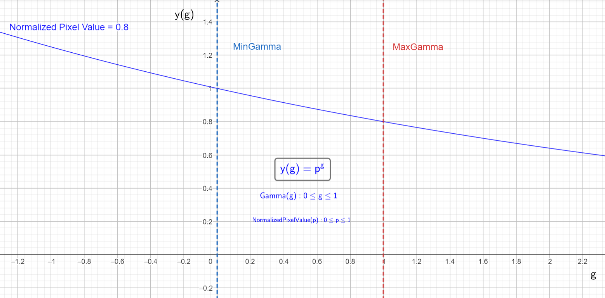
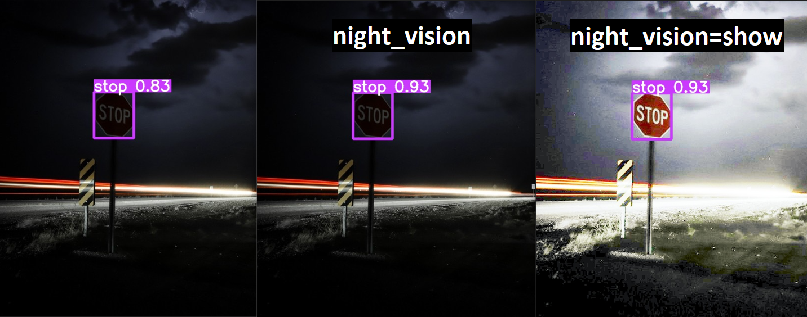
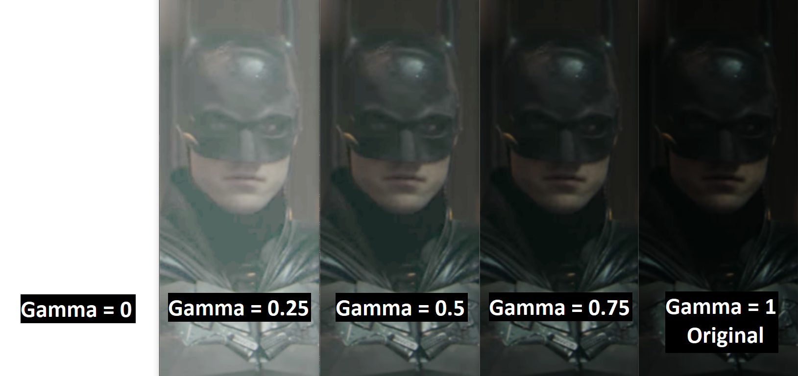

Object detection is a task that involves identifying the location and class of objects in an image or video stream.


The output of an object detector is a set of bounding boxes that enclose the objects in the image, along with class
labels
and confidence scores for each box. Object detection is a good choice when you need to identify objects of interest in a
scene, but don't need to know exactly where the object is or its exact shape.

!!! tip "Tip"

    YOLOv8 Detect models are the default YOLOv8 models, i.e. `yolov8n.pt` and are pretrained on [COCO](https://github.com/ultralytics/ultralytics/blob/main/ultralytics/datasets/coco.yaml).

## [Models](https://github.com/ultralytics/ultralytics/tree/main/ultralytics/models/v8)

YOLOv8 pretrained Detect models are shown here. Detect, Segment and Pose models are pretrained on
the [COCO](https://github.com/ultralytics/ultralytics/blob/main/ultralytics/datasets/coco.yaml) dataset, while Classify
models are pretrained on
the [ImageNet](https://github.com/ultralytics/ultralytics/blob/main/ultralytics/datasets/ImageNet.yaml) dataset.

[Models](https://github.com/ultralytics/ultralytics/tree/main/ultralytics/models) download automatically from the latest
Ultralytics [release](https://github.com/ultralytics/assets/releases) on first use.

| Model                                                                                | size<br><sup>(pixels) | mAP<sup>val<br>50-95 | Speed<br><sup>CPU ONNX<br>(ms) | Speed<br><sup>A100 TensorRT<br>(ms) | params<br><sup>(M) | FLOPs<br><sup>(B) |
|--------------------------------------------------------------------------------------|-----------------------|----------------------|--------------------------------|-------------------------------------|--------------------|-------------------|
| [YOLOv8n](https://github.com/ultralytics/assets/releases/download/v0.0.0/yolov8n.pt) | 640                   | 37.3                 | 80.4                           | 0.99                                | 3.2                | 8.7               |
| [YOLOv8s](https://github.com/ultralytics/assets/releases/download/v0.0.0/yolov8s.pt) | 640                   | 44.9                 | 128.4                          | 1.20                                | 11.2               | 28.6              |
| [YOLOv8m](https://github.com/ultralytics/assets/releases/download/v0.0.0/yolov8m.pt) | 640                   | 50.2                 | 234.7                          | 1.83                                | 25.9               | 78.9              |
| [YOLOv8l](https://github.com/ultralytics/assets/releases/download/v0.0.0/yolov8l.pt) | 640                   | 52.9                 | 375.2                          | 2.39                                | 43.7               | 165.2             |
| [YOLOv8x](https://github.com/ultralytics/assets/releases/download/v0.0.0/yolov8x.pt) | 640                   | 53.9                 | 479.1                          | 3.53                                | 68.2               | 257.8             |

- **mAP<sup>val</sup>** values are for single-model single-scale on [COCO val2017](http://cocodataset.org) dataset.
  <br>Reproduce by `yolo val detect data=coco.yaml device=0`
- **Speed** averaged over COCO val images using an [Amazon EC2 P4d](https://aws.amazon.com/ec2/instance-types/p4/)
  instance.
  <br>Reproduce by `yolo val detect data=coco128.yaml batch=1 device=0|cpu`

---
## Night Vision Feature 🌚
> Note:\
&nbsp;&nbsp;&nbsp;&nbsp; This feature is available for `detect` mode.\
&nbsp;&nbsp;&nbsp;&nbsp; and `val` mode, only with `device=cpu`.
<details>
<summary>How does it work ⚙?</summary>

Gamma correction is pretty simple, it's just a non-linear transformation of the input image.\
It is used to adjust the overall brightness of the image.\
The formula for gamma correction is as follows:


where `Image_out` is the output normalized image, `Image_in` is the input normalized image, and `Gamma` is the gamma value (power).
> Note:\
&nbsp;&nbsp;&nbsp;&nbsp; 1- The value of `gamma` is between 0 and 1 (closer to 0 brighter, closer to 1 darker).\
&nbsp;&nbsp;&nbsp;&nbsp; 2- The value of both `Image_out` and `Image_in` pixels are between 0 and 1.

To make it more clear, let's take a look at the following example:

Let's assume we have an image with only one pixel, and its value is 0.8 (normalized value).\
Now, let's apply gamma correction as follows:

`Image_out = Image_in ^ gamma`

> when `gamma = 0`, then `Image_out = 1`\
when `gamma = 0.25`, then `Image_out = 0.94`\
when `gamma = 0.5`, then `Image_out = 0.89`\
when `gamma = 0.75`, then `Image_out = 0.84`\
when `gamma = 1`, then `Image_out = 0.8`

let's plot the results:



> Note:\
&nbsp;&nbsp;&nbsp;&nbsp; Decreasing the value of `gamma` will make the image brighter.

</details>

<details>
<summary>How to use it 🚄?</summary>

There are some arguments added for Night Vision Feature :
1. [night_vision](#🔵-night_vision-parameter)
2. [image_gamma (Optional)](#🔵-image_gamma-parameter)
    - if integer or float number :
        * No need to pass any other parameters.

    - if 'auto', then you can pass the following parameters (all of them have values between 0 and 1):
        * 🟢 min_normalized_intensity (Optional)
        * 🟢 min_gamma (Optional)
        * 🟢 max_gamma (Optional)

these parameters are described as below:

### 🔵 **night_vision** parameter :
(default value is `False`)

If you use camera in a dark environment, then you may get poor results.\
We have made a preprocess feature to enhance image brightness, it actually may help you get better results in dark environments.

You can use Night Vision mode by adding parameter `night_vision` as follows:

Using CLI:
```bash
yolo detect predict model=path/to/best.pt source='https://ultralytics.com/images/bus.jpg' night_vision
```
and it has 3 modes:

1- Default mode:
> By not passing parameter `night_vision`, it will use the original image as it is.

2- Night Vision mode (Only apply on input image):
```bash
night_vision
```
Or
```bash
night_vision=true
```
> It will apply night vision on input image, pass it to the model and get the result based on night-processed image, But the shown/saved image will be the original image without night filter.

3- Night Vision mode (Apply on both input image and shown/saved image):
```bash
night_vision=show
```
> It will apply night vision on input image, pass it to the model and get the result based on night-processed image, The shown/saved image will be also night-processed image with night filter applied.

An example to differentiate between Night Vision modes and their (Saved/Shown) results:



### 🔵 **image_gamma** parameter :
(default value is `auto`)

image_gamma parameter has 2 modes:

1- Fixed gamma value:

> If you want to use fixed gamma value (from 0 to 1), you can pass `image_gamma` parameter as follows:\
&nbsp;&nbsp;&nbsp;&nbsp; Note 1: 1 means no change in image brightness, 0 means white image.\
&nbsp;&nbsp;&nbsp;&nbsp; Note 2: Lower gamma value means more lightening applied to image (brighter image).

Using CLI:
```bash
yolo detect predict model=path/to/best.pt source='https://ultralytics.com/images/bus.jpg' night_vision=show image_gamma=0.8
```
> It will use fixed gamma value of 0.8

2- Auto gamma value:
> If you want to use auto gamma value, you can pass `image_gamma` parameter as follows:

Using CLI:
```bash
yolo detect predict model=path/to/best.pt source='https://ultralytics.com/images/bus.jpg' night_vision=show image_gamma=auto
```

It will test normalized image intensity (its value from 0 to 1), and its value describe image brightness (closer to 0 means dark image, closer to 1 means bright image).

> if it is less than `min_normalized_intensity` (default value is 0.25) meaning that image is dark, then it will use scaled gamma value (from `min_gamma` to `max_gamma`) - based on image intensity - to enhance image brightness.\
&nbsp;&nbsp;&nbsp;&nbsp; Note: `min_gamma` and `max_gamma` have default values of 0.6 and 1.0 respectively.

> if it is greater than `min_normalized_intensity` (default value is 0.25) meaning that image is bright, then it will use fixed gamma value of 1 (no change in image brightness).

For full customized gamma value, you can pass `min_normalized_intensity`, `min_gamma` and `max_gamma` as follows:

Using CLI:
```bash
yolo detect predict model=path/to/best.pt source='https://ultralytics.com/images/bus.jpg' night_vision=show image_gamma=auto min_normalized_intensity=0.5 min_gamma=0.8 max_gamma=1.0
```

An example to show effect of gamma (`image_gamma`) on image brightness  :



</details>

---

## Train

Train YOLOv8n on the COCO128 dataset for 100 epochs at image size 640. For a full list of available arguments see
the [Configuration](../usage/cfg.md) page.

!!! example ""

    === "Python"
    
        ```python
        from ultralytics import YOLO
        
        # Load a model
        model = YOLO('yolov8n.yaml')  # build a new model from YAML
        model = YOLO('yolov8n.pt')  # load a pretrained model (recommended for training)
        model = YOLO('yolov8n.yaml').load('yolov8n.pt')  # build from YAML and transfer weights
        
        # Train the model
        model.train(data='coco128.yaml', epochs=100, imgsz=640)
        ```
    === "CLI"
    
        ```bash
        # Build a new model from YAML and start training from scratch
        yolo detect train data=coco128.yaml model=yolov8n.yaml epochs=100 imgsz=640

        # Start training from a pretrained *.pt model
        yolo detect train data=coco128.yaml model=yolov8n.pt epochs=100 imgsz=640

        # Build a new model from YAML, transfer pretrained weights to it and start training
        yolo detect train data=coco128.yaml model=yolov8n.yaml pretrained=yolov8n.pt epochs=100 imgsz=640
        ```

## Val

Validate trained YOLOv8n model accuracy on the COCO128 dataset. No argument need to passed as the `model` retains it's
training `data` and arguments as model attributes.

!!! example ""

    === "Python"
    
        ```python
        from ultralytics import YOLO
        
        # Load a model
        model = YOLO('yolov8n.pt')  # load an official model
        model = YOLO('path/to/best.pt')  # load a custom model
        
        # Validate the model
        metrics = model.val()  # no arguments needed, dataset and settings remembered
        metrics.box.map    # map50-95
        metrics.box.map50  # map50
        metrics.box.map75  # map75
        metrics.box.maps   # a list contains map50-95 of each category
        ```
    === "CLI"
    
        ```bash
        yolo detect val model=yolov8n.pt  # val official model
        yolo detect val model=path/to/best.pt  # val custom model
        ```

## Predict

Use a trained YOLOv8n model to run predictions on images.

!!! example ""

    === "Python"
    
        ```python
        from ultralytics import YOLO
        
        # Load a model
        model = YOLO('yolov8n.pt')  # load an official model
        model = YOLO('path/to/best.pt')  # load a custom model
        
        # Predict with the model
        results = model('https://ultralytics.com/images/bus.jpg')  # predict on an image
        ```
    === "CLI"
    
        ```bash
        yolo detect predict model=yolov8n.pt source='https://ultralytics.com/images/bus.jpg'  # predict with official model
        yolo detect predict model=path/to/best.pt source='https://ultralytics.com/images/bus.jpg'  # predict with custom model
        ```

See full `predict` mode details in the [Predict](https://docs.ultralytics.com/modes/predict/) page.

## Export

Export a YOLOv8n model to a different format like ONNX, CoreML, etc.

!!! example ""

    === "Python"
    
        ```python
        from ultralytics import YOLO
        
        # Load a model
        model = YOLO('yolov8n.pt')  # load an official model
        model = YOLO('path/to/best.pt')  # load a custom trained
        
        # Export the model
        model.export(format='onnx')
        ```
    === "CLI"
    
        ```bash
        yolo export model=yolov8n.pt format=onnx  # export official model
        yolo export model=path/to/best.pt format=onnx  # export custom trained model
        ```

Available YOLOv8 export formats are in the table below. You can predict or validate directly on exported models,
i.e. `yolo predict model=yolov8n.onnx`. Usage examples are shown for your model after export completes.

| Format                                                             | `format` Argument | Model                     | Metadata |
|--------------------------------------------------------------------|-------------------|---------------------------|----------|
| [PyTorch](https://pytorch.org/)                                    | -                 | `yolov8n.pt`              | ✅        |
| [TorchScript](https://pytorch.org/docs/stable/jit.html)            | `torchscript`     | `yolov8n.torchscript`     | ✅        |
| [ONNX](https://onnx.ai/)                                           | `onnx`            | `yolov8n.onnx`            | ✅        |
| [OpenVINO](https://docs.openvino.ai/latest/index.html)             | `openvino`        | `yolov8n_openvino_model/` | ✅        |
| [TensorRT](https://developer.nvidia.com/tensorrt)                  | `engine`          | `yolov8n.engine`          | ✅        |
| [CoreML](https://github.com/apple/coremltools)                     | `coreml`          | `yolov8n.mlmodel`         | ✅        |
| [TF SavedModel](https://www.tensorflow.org/guide/saved_model)      | `saved_model`     | `yolov8n_saved_model/`    | ✅        |
| [TF GraphDef](https://www.tensorflow.org/api_docs/python/tf/Graph) | `pb`              | `yolov8n.pb`              | ❌        |
| [TF Lite](https://www.tensorflow.org/lite)                         | `tflite`          | `yolov8n.tflite`          | ✅        |
| [TF Edge TPU](https://coral.ai/docs/edgetpu/models-intro/)         | `edgetpu`         | `yolov8n_edgetpu.tflite`  | ✅        |
| [TF.js](https://www.tensorflow.org/js)                             | `tfjs`            | `yolov8n_web_model/`      | ✅        |
| [PaddlePaddle](https://github.com/PaddlePaddle)                    | `paddle`          | `yolov8n_paddle_model/`   | ✅        |

See full `export` details in the [Export](https://docs.ultralytics.com/modes/export/) page.
