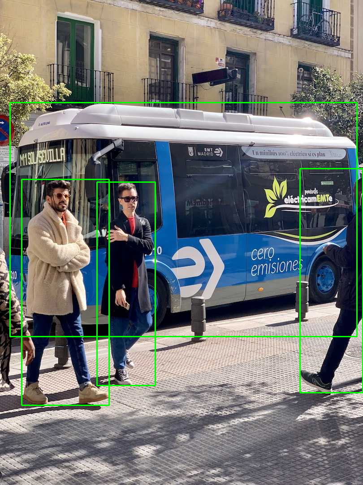

# YOLOv8 MNN Inference in C++

Welcome to the [Ultralytics YOLOv8](https://docs.ultralytics.com/models/yolov8/) OpenVINO Inference example in C++! This guide will help you get started with leveraging the powerful YOLOv8 models using the [Alibaba MNN](https://mnn-docs.readthedocs.io/en/latest/) in your C++ projects. Whether you're looking to enhance performance on CPU hardware or add flexibility to your applications, this example provides a solid foundation. Learn more about optimizing models on the [Ultralytics blog](https://www.ultralytics.com/blog).

## 🌟 Features

- 🚀 **Model Format Support**: MNN
- ⚡ **Precision Options**: Run models in **FP32**, **FP16** ([half-precision](https://www.ultralytics.com/glossary/half-precision)), and **INT8** ([quantization](https://www.ultralytics.com/glossary/model-quantization)) precisions for optimized performance.
- 🔄 **Dynamic Shape Loading**: Easily handle models with dynamic input shapes, common in many [computer vision](https://www.ultralytics.com/glossary/computer-vision-cv) tasks.

## 📋 Dependencies

To ensure smooth execution, please make sure you have the following dependencies installed:

| Dependency                                            | Version  |
| ----------------------------------------------------- | -------- |
| [MNN](https://mnn-docs.readthedocs.io/en/latest/)     | >=2.0.0  |
| [C++](https://en.cppreference.com/w/)                 | >=14     |
| [CMake](https://cmake.org/documentation/)             | >=3.12.0 |

## ⚙️ Build Instructions

Follow these steps to build the project:

1.  Clone the Ultralytics repository:

    ```bash
    git clone https://github.com/ultralytics/ultralytics.git
    cd ultralytics/examples/YOLOv8-MNN-CPP
    ```

2. Clone MNN repository:
    ```bash
    git clone https://github.com/alibaba/MNN.git
    cd MNN
    ```

3. Build MNN library:
    ```bash
    mkdir build && cd build
    cmake -DMNN_BUILD_OPENCV=ON -DBUILD_SHARED_LIBS=OFF -DMNN_IMGCODECS=ON ..
    make -j4
    ```
    Note: If you encounter any issues during the build process, refer to the [MNN documentation](https://mnn-docs.readthedocs.io/en/latest/) for troubleshooting.

4. Copy the MNN library to the project directory:
    ```bash
    cd ../..
    mkdir -p lib
    cp MNN/build/libMNN.dylib \
    MNN/build/express/libMNN_Express.dylib \
    MNN/build/ tools/cv/libMNNOpenCV.dylib libs

    cp -r MNN/include .
    cp -r MNN/tools/cv/include .
    ```
    Note: The library paths may vary based on your system configuration. Make sure to update the paths accordingly.

5.  Create a build directory and compile the project using CMake:
    ```bash
    mkdir build && cd build
    cmake ..
    make
    ```

## 🔄 Exporting YOLOv8 Models

To use your Ultralytics YOLOv8 model with this C++ example, you first need to export it to the MNN format. Use the `yolo export` command available in the Ultralytics Python package. Find detailed instructions in the [Export mode documentation](https://docs.ultralytics.com/modes/export/).

```bash
# Export to MNN format
yolo export model=yolov8s.pt imgsz=640 format=mnn
```

or

```bash
./MNNConvert -f MNN --modelFile yolov8s.pt --MNNModel yolov8s.mnn --bizCode biz
```

For more details on exporting and optimizing models for MNN, refer to the [MNN documentation](https://mnn-docs.readthedocs.io/en/latest/).

## 🛠️ Usage
```bash
yolo predict model='yolov8n.mnn' source='assets/bus.jpg'
```

Output:
```
ultralytics/examples/YOLOv8-MNN-CPP/assets/bus.jpg: 640x640 4 persons, 1 bus, 84.6ms
Speed: 20.1ms preprocess, 84.6ms inference, 28.4ms postprocess per image at shape (1, 3, 640, 640)
Results saved to runs/detect/predict
```

```bash
./build/main yolov8n.mnn assets/bus.jpg
```

Output:
```
The device supports: i8sdot:0, fp16:0, i8mm: 0, sve2: 0, sme2: 0
Prediction: 0 person 0.86
Prediction: 1 bus 0.86
Prediction: 2 person 0.85
Prediction: 3 person 0.81
Result image written to `mnn_yolov8_cpp.jpg`.
Speed: 27.9ms preprocess, 70.4ms inference, 62.9ms postprocess per image at shape (1, 3, 640, 640)
```

## 📸 Screenshots



## ❤️ Contributions

We hope this example helps you integrate YOLOv8 with OpenVINO and OpenCV into your C++ projects effortlessly. Contributions to improve this example or add new features are welcome! Please see the [Ultralytics contribution guidelines](https://docs.ultralytics.com/help/contributing/) for more information. Visit the main [Ultralytics documentation](https://docs.ultralytics.com/) for further guides and resources. Happy coding! 🚀
