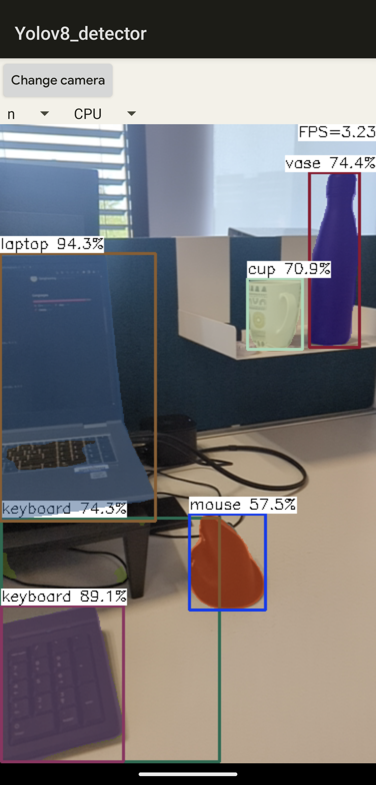

<h1 align="center">Yolov8seg-NCNN-Android-inference</h1>

<p align="center">
  
  
  </img>
</p>

This is a sample object segmentation project, it depends on yolov8, ncnn library and opencv

## Prerequisites

https://github.com/ultralytics/ultralytics

https://github.com/Tencent/ncnn

https://github.com/nihui/opencv-mobile

## How to build and run

### Step 1

https://github.com/ultralytics/ultralytics

Install ultralytics yolov8.

```bash
pip install ultralytics
```

Convert your model.

```bash
yolo export model=yolov8n-seg.pt format=ncnn
```

Copy **_yolov8n-seg.param_** and **_yolov8n-seg.bin_** to **app/src/main/jni/assets**

_For your own model :_ Change the name of the model in **_yolov8ncnn.cpp_** line 184. Change the classes names in **_yolo.h_**

### Step 2

https://github.com/Tencent/ncnn/releases

- Download ncnn-YYYYMMDD-android-vulkan.zip or build ncnn for android yourself
- Extract ncnn-YYYYMMDD-android-vulkan.zip into **app/src/main/jni** and change the **ncnn_DIR** path to yours in **app/src/main/jni/CMakeLists.txt**

### Step 3

https://github.com/nihui/opencv-mobile

- Download opencv-mobile-XYZ-android.zip
- Extract opencv-mobile-XYZ-android.zip into **app/src/main/jni** and change the **OpenCV_DIR** path to yours in **app/src/main/jni/CMakeLists.txt**

### Step 4

- Open this project with Android Studio, build it and enjoy!

## Some notes

- Android ndk camera is used for best efficiency
- Crash may happen on very old devices for lacking HAL3 camera interface
- All models are manually modified to accept dynamic input shape
- Most small models run slower on GPU than on CPU, this is common
- FPS may be lower in dark environment because of longer camera exposure time

## Screenshot



## Reference：

https://github.com/nihui/ncnn-android-nanodet https://github.com/Tencent/ncnn https://github.com/ultralytics/ultralytics/pull/3529
