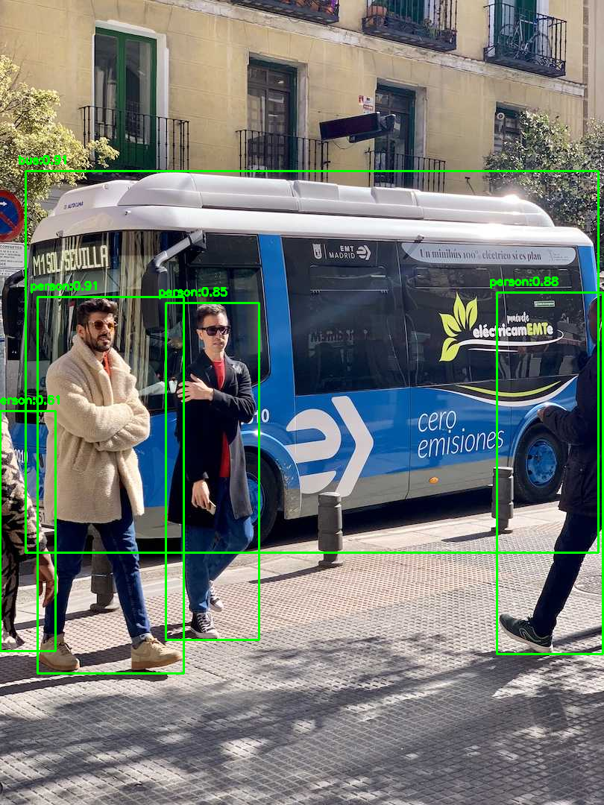
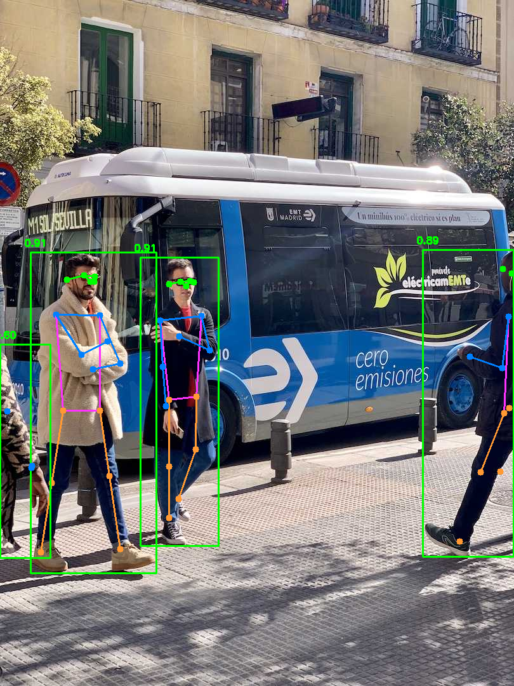
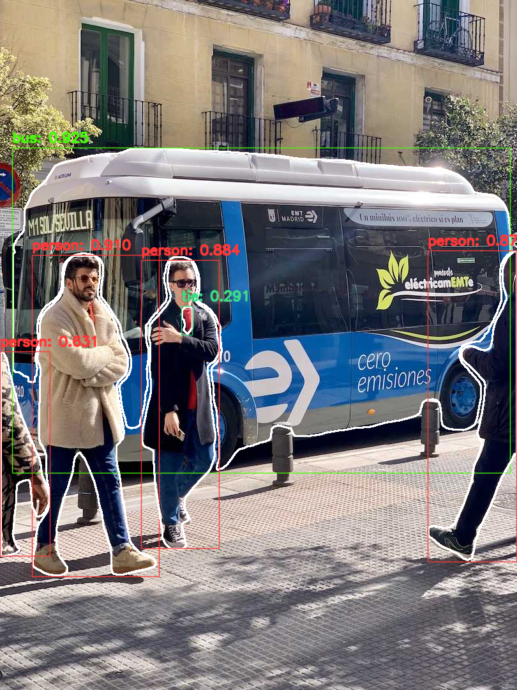
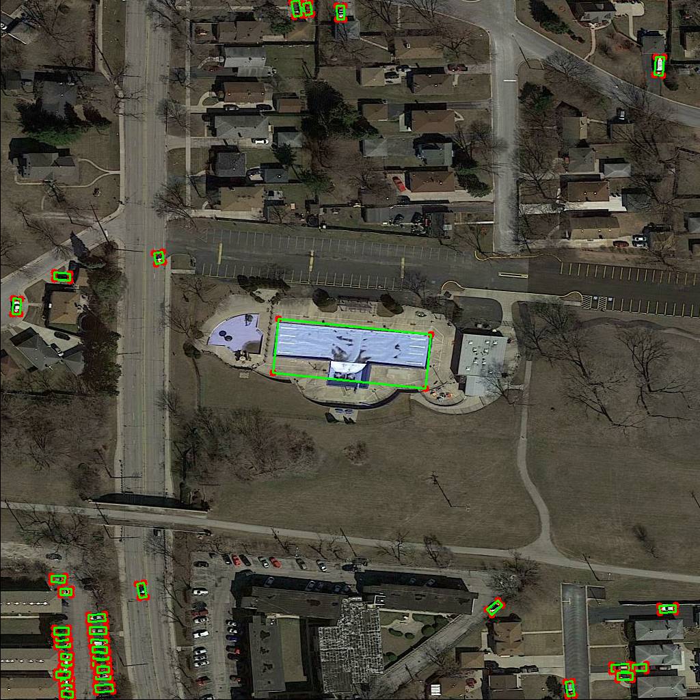

# 1. YOLOv8 NCNN interface

This repository provides a Python demonstration to perform object detection, semantic segmentation, image classification, pose estimation, and oriented bounding box object detection with YOLOv8 using NCNN.

# 2. Installation

Install the required packages using pip. You will need ultralytics for exporting YOLOv8-xxx NCNN model, ncnn for NCNN model inference, Numpy for data calculation and opencv-python for image processing.

## Dependencies

| Dependency | Version      | function             |
| :--------- | :----------- | :------------------- |
| OpenCV     | >=4.9.0      | read img             |
| Numpy      | >=1.26.3     | dada process         |
| ncnn       | 1.0.20240102 | ncnn model interface |
| yaml       | >=6.0.1      | load yaml file       |

# 3. Getting Started

## 3.1 Exporting YOLOv8 Models

To export YOLOv8 models, you need install ultralytics. ultralytics version 8.1.0.\
use the following Python script:

```python
from ultralytics import YOLO

model_det = YOLO("yolov8s.pt")
model_det.export(format='ncnn')

model_pose = YOLO("yolov8s-pose.pt")
model_pose.export(format='ncnn')

model_cls = YOLO("yolov8s-cls.pt")
model_cls.export(format='ncnn')

model_seg = YOLO("yolov8s-seg.pt")
model_seg.export(format='ncnn')

model_obb = YOLO("yolov8s-obb.pt")
model_obb.export(format='ncnn')
```

Alternatively, you can use the following command in the Command Line Interface (CLI) with a yolo command

```bash
yolo export model=yolov8s.pt format=ncnn
yolo export model=yolov8s-pose.pt format=ncnn
yolo export model=yolov8s-cls.pt format=ncnn
yolo export model=yolov8s-seg.pt format=ncnn
yolo export model=yolov8s-obb.pt format=ncnn
```

After you complete the above operations, you will get five folders:

- yolov8s_ncnn_model
- yolov8s-pose_ncnn_model
- yolov8s-cls_ncnn_model
- yolov8s-seg_ncnn_model
- yolov8s-obb_ncnn_model

The folders contain the exported ncnn model(model.ncnn.param and model.ncnn.bin), configuration files(metadata.yaml) and python examples(.py).

## 3.2 Download ultralytics datasets config yaml file(option)

yaml address: https://github.com/ultralytics/ultralytics/blob/main/ultralytics/cfg/datasets/ coco.yaml coco-pose.yaml ImageNet.yaml DOTAv1.yaml coco128-seg.yaml

In addition to this, you can also use the yaml file in the above folder.\
Note: update the yaml path in the code\
`CocoYamlPath CocoPoseYamlPath ImageNetYamlPath CocoSegYamlPath  DOTAv1YamlPath`

## 3.3 Run Inference

Perform inference with the exported NCNN model on your images.

` python main.py --model-path <MODEL_PATH> --source <IMAGE_PATH>`

## 3.4 Example Output

After running the command, you should see segmentation results similar to this: 







# 4. License

This project is licensed under the AGPL-3.0 License - see the LICENSE file for details.

# 5. Ref

1. The YOLOv8-Segmentation-ONNXRuntime-Python [demo](https://github.com/ultralytics/ultralytics/tree/main/examples/YOLOv8-Segmentation-ONNXRuntime-Python)
2. [NCNN example](https://github.com/Tencent/ncnn/tree/master/python/examples)
3. [ultralytics](https://github.com/ultralytics/ultralytics)
