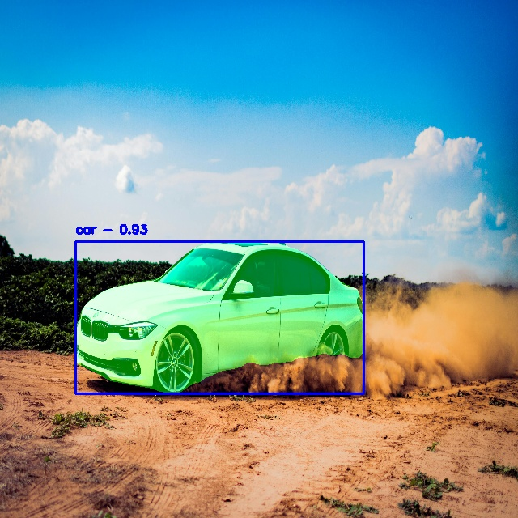

# YOLOv8-Segmentation-ONNXRuntime-Python Demo

This repository provides a Python demo for performing segmentation with YOLOv8 using ONNX Runtime, enabling efficient and framework-agnostic inference without the need for the full PyTorch stack.

## Features

- **Integrated Pre/Post-Processing**: The final ONNX model includes letterboxing, and NMS steps.
- **Flexible Inference**: Supports both image and real-time webcam/video inference.
- **Ease of Use**: Simple command-line interface for running conversions and inferences.

## Installation

1. **Install Dependencies:**

   ```bash
   pip install -r requirements.txt
   ```

   _Contents of `requirements.txt`:_

   ```
   ultralytics
   onnx
   onnxruntime
   onnxruntime-extensions
   opencv-python
   numpy
   Pillow
   ```

## Workflow

1. **Convert and Finalize the Model (`end2end.py`):**

   - **Using a Local `.pt` Model:**

     ```bash
     python end2end.py --yolo-version yolov8n
     ```

     This exports to ONNX, integrates pre/post-processing, and produces `yolov8n-seg_end2end.onnx`.

   - **Downloading and Converting:**
     If you don't have the `.pt` model locally, specify `--download-model` to download and convert:

     ```bash
     python end2end.py --yolo-version yolov8n --download-model
     ```

   - **Custom Final Model Name:**
     You can also specify a custom final model name with `--final-model`:
     ```bash
     python end2end.py --yolo-version yolov8n --final-model custom_end2end.onnx
     ```

2. **Image Inference (`image_inference.py`):**

   Run inference on a single image:

   ```bash
   python image_inference.py --final-model yolov8n-seg_end2end.onnx --input-image car.jpg --output-image output.jpg
   ```

   This applies bounding boxes, masks, and class labels, and saves the annotated image.

3. **Webcam/Video Inference (`webcam_inference.py`):**

   - **Webcam:**
     ```bash
     python webcam_inference.py --final-model yolov8n-seg_end2end.onnx
     ```
   - **Video File:**
     `bash
python webcam_inference.py --final-model yolov8n-seg_end2end.onnx --video path/to/video.mp4
`
     By default, it uses the webcam. Press `q` to quit.

## Example Output

After running inference, you will see annotated images or real-time video frames with bounding boxes, masks, and labels overlaid.



## License

This project is licensed under the AGPL-3.0 License - see the [LICENSE](LICENSE) file for details.

## Acknowledgments

- The YOLOv8-Segmentation-ONNXRuntime-End2End-Python demo is contributed by GitHub user [namas191297](https://github.com/namas191297).
- You can visit the repository for more advanced functionalities and detailed documentation - [Here](https://github.com/namas191297/yolov8-segmentation-end2end-onnxruntime)
