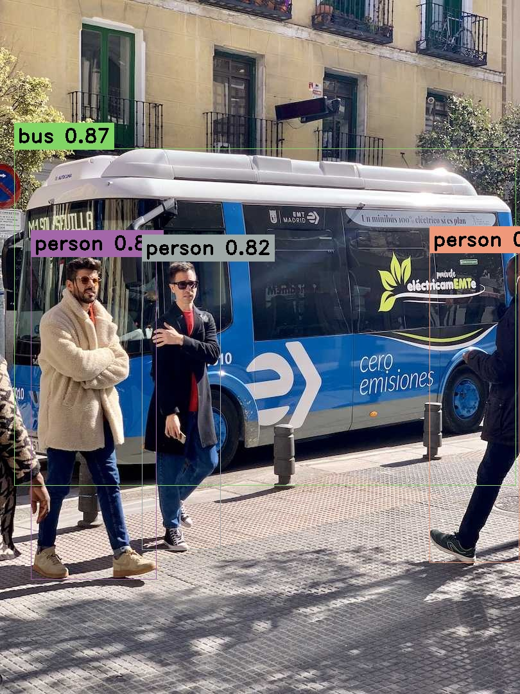

### Environment

- TensorRT 10.0.1.6
- OpenCV 4.5.5
- Cuda 11.8

After installing the above dependencies, please modify the following fields in the CMakeLists.txt file

```cmake
set(TensorRT_DIR "E:/lib/Tensorrt/TensorRT-10.0.1.6")
set(CUDA_DIR "E:/lib/cudalib-11.8/development")
```

to TensorRT and Cuda path,so that add dependencies.

### Build

```bash
cmake -S . -B build
cmake --build build --config release
```

#### YOLOv8

To export the Yolov8 onnx model files

```bash
yolo export model=yolov8n.pt imgsz=640,480 format=onnx opset=16
```

Then,convert the onnx file to engine file like

```bash
trtexec \
--onnx=./pretrain/yolov8n.onnx \
--saveEngine=./pretrain/yolov8n.engine
```

run command

```bash
./build/Release/example.exe ./yolov8n.engine ../../assets/bug.jpg 640 480
```

- ./yolov8n.engine the path of yolov8 model
- ../../assets/bug.jpg the path of input image
- 640 the height of input image
- 480 the width of input image

and the result image

