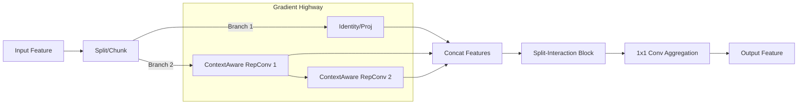

# Review of Advanced Modules for Small Object Detection and Proposal for SC-ELAN

## 1. Abstract
This review analyzes three state-of-the-art modules—**Pzconv**, **FCM (Feature Context Module)**, and **RepNCSPELAN4**—that have demonstrated significant improvements in small object detection compared to YOLOv8 benchmarks. By identifying their common advantages in multi-scale context perception, feature interaction, and gradient flow efficiency, we propose a novel hybrid module: **SC-ELAN (Spatial-Context Efficient Layer Aggregation Network)**.

## 2. Analysis of Existing Modules

### 2.1 Pzconv (Parallel Zone Convolution)
*   **Mechanism**: utilizes parallel convolution kernels of varying sizes (3x3, 5x5, 7x7) to extract features.
*   **Advantage for SOD**: Addresses the lack of texture information in small objects by expanding the receptive field. The larger kernels capture surrounding context (e.g., "sky" around a "bird"), which is crucial for distinguishing objects from background noise.

### 2.2 FCM (Feature Context Module)
*   **Mechanism**: A dual-branch structure that splits channels and uses one branch to generate spatial/channel attention weights for the other.
*   **Advantage for SOD**: Provides a self-calibration mechanism. Small objects are often overwhelmed by background clutter; FCM's cross-attention highlights the relevant spatial locations and feature channels, effectively suppressing false positives.

### 2.3 RepNCSPELAN4 (Generalized ELAN)
*   **Mechanism**: Dense layer aggregation with gradient path optimization, often combined with re-parameterization.
*   **Advantage for SOD**: Solves the "gradient vanishing" problem common in deep networks. By aggregating features from different depths (concatenation), it preserves high-resolution shallow features (edges, corners) that are vital for detecting tiny targets, ensuring they aren't lost during downsampling.

## 3. Common Advantages Summary
The success of these modules in small object detection can be attributed to three "Golden Rules":

1.  **Context Awareness**: Breaking the limitation of local 3x3 views to understand the environment around the object.
2.  **Feature Fidelity**: Maintaining direct access to raw feature gradients from earlier layers to prevent information loss.
3.  **Attentional Interaction**: Dynamically modulating feature responses to focus on "what" (channel) and "where" (spatial) the small object is.

## 4. Proposal: SC-ELAN (Spatial-Context Efficient Layer Aggregation Network)

Based on the analysis, we propose **SC-ELAN**, a module designed to fully exploit these advantages.

### 4.1 Design Philosophy
SC-ELAN integrates the **gradient efficiency of ELAN** with the **large-kernel context of Pzconv** and the **feature purification of FCM**.

### 4.2 Core Components
1.  **ContextAwareRepConv**: Replaces standard convolutions in the ELAN computational block. It uses multi-branch convolutions (1x1, 3x3, 5x5) during training to capture context, which are re-parameterized into a single 3x3 conv during inference for zero latency overhead.
2.  **Split-Interaction Mechanism**: Before the final feature aggregation, a split-attention block is introduced to filter background noise using spatial and channel mutual guidance.

### 4.3 Architecture Logic


### 4.4 Expected Impact
*   **Higher Recall**: Enhanced context awareness reduces false negatives for tiny, indistinct objects.
*   **Precise Localization**: Preserved shallow features via ELAN structure improve bounding box regression for small targets.
*   **Efficiency**: Re-parameterization ensures the complex training structure collapses into a distinct, efficient inference model.

## 5. PyTorch Implementation

Below is the PyTorch implementation of the **SC-ELAN** module. You can integrate this into your YOLOv8 `modules.py` or similar file.

```python
import torch
import torch.nn as nn

def autopad(k, p=None, d=1):  # kernel, padding, dilation
    # Pad to 'same' shape outputs
    if d > 1:
        k = d * (k - 1) + 1 if isinstance(k, int) else [d * (x - 1) + 1 for x in k]  # actual kernel-size
    if p is None:
        p = k // 2 if isinstance(k, int) else [x // 2 for x in k]  # auto-pad
    return p

class Conv(nn.Module):
    # Standard convolution wrapper
    def __init__(self, c1, c2, k=1, s=1, p=None, g=1, act=True):
        super().__init__()
        self.conv = nn.Conv2d(c1, c2, k, s, autopad(k, p), groups=g, bias=False)
        self.bn = nn.BatchNorm2d(c2)
        self.act = nn.SiLU() if act is True else (act if isinstance(act, nn.Module) else nn.Identity())

    def forward(self, x):
        return self.act(self.bn(self.conv(x)))

class ContextAwareRepConv(nn.Module):
    """
    Integrates Pzconv's large kernel idea with RepVGG-style re-parameterization.
    Training: Multi-branch (1x1, 3x3, 5x5) to capture multi-scale context.
    Inference: Collapses into a single 3x3 convolution for speed.
    """
    def __init__(self, c1, c2, k=3, s=1, p=None, g=1, act=True, deploy=False):
        super().__init__()
        self.deploy = deploy
        self.c1 = c1
        self.c2 = c2
        self.act = nn.SiLU() if act is True else (act if isinstance(act, nn.Module) else nn.Identity())

        if deploy:
            self.rbr_reparam = nn.Conv2d(c1, c2, k, s, autopad(k, p), groups=g, bias=True)
        else:
            self.rbr_identity = nn.BatchNorm2d(c1) if c2 == c1 and s == 1 else None
            self.rbr_dense = nn.Sequential(
                nn.Conv2d(c1, c2, k, s, autopad(k, p), groups=g, bias=False),
                nn.BatchNorm2d(c2),
            )
            # Large kernel branch (Context Aware)
            self.rbr_context = nn.Sequential(
                nn.Conv2d(c1, c2, 5, s, autopad(5, p), groups=c1, bias=False), # Depthwise 5x5
                nn.Conv2d(c2, c2, 1, 1, 0, bias=False), # Pointwise 1x1
                nn.BatchNorm2d(c2),
            )
            self.rbr_1x1 = nn.Sequential(
                nn.Conv2d(c1, c2, 1, s, autopad(1, p), groups=g, bias=False),
                nn.BatchNorm2d(c2),
            )

    def forward(self, inputs):
        if self.deploy:
            return self.act(self.rbr_reparam(inputs))

        if self.rbr_identity is None:
            id_out = 0
        else:
            id_out = self.rbr_identity(inputs)

        return self.act(
            self.rbr_dense(inputs) + 
            self.rbr_1x1(inputs) + 
            self.rbr_context(inputs) + 
            id_out
        )

class SplitInteractionBlock(nn.Module):
    """
    Integrates FCM's interaction idea.
    Splits features and uses cross-branch attention to suppress background noise.
    """
    def __init__(self, dim):
        super().__init__()
        self.split_dim = dim // 2
        
        # Spatial Attention Generator (for Branch 1)
        self.spatial_att = nn.Sequential(
            nn.Conv2d(self.split_dim, 1, 7, padding=3),
            nn.Sigmoid()
        )
        # Channel Attention Generator (for Branch 2)
        self.channel_att = nn.AdaptiveAvgPool2d(1)
        self.fc_channel = nn.Sequential(
             nn.Conv2d(self.split_dim, self.split_dim, 1),
             nn.Sigmoid()
        )

    def forward(self, x):
        # 1. Split: Context vs Content
        x1, x2 = torch.split(x, self.split_dim, dim=1)
        
        # 2. Interaction
        # Use x2 (context) to spatially validata x1 (content)
        x1_out = x1 * self.spatial_att(x2)
        
        # Use x1 (content) to channel-wise validate x2 (context)
        x2_out = x2 * self.fc_channel(self.channel_att(x1))
        
        # 3. Merge
        return torch.cat([x1_out, x2_out], dim=1)

class SC_ELAN(nn.Module):
    """
    SC-ELAN: Spatial-Context Efficient Layer Aggregation Network
    Combines ELAN backbone + Pzconv Context + FCM Interaction.
    """
    def __init__(self, c1, c2, c3, c4, c5=1): # c3 not used but kept for compatibility with C2f args
        super().__init__()
        self.c = c2 // 2
        self.cv1 = Conv(c1, c2, 1, 1)
        
        # ELAN Backbone with ContextAware RepConvs
        self.cv2 = ContextAwareRepConv(c2 // 2, c2 // 2)
        self.cv3 = ContextAwareRepConv(c2 // 2, c2 // 2)
        
        # Interaction Block for cleanup
        self.interaction = SplitInteractionBlock(c2)
        
        # Final aggregation
        self.cv4 = Conv(c2 + (2 * (c2 // 2)), c2, 1, 1)

    def forward(self, x):
        # 1. Projection & Split
        y = list(self.cv1(x).chunk(2, 1))
        
        # 2. Context-Aware Processing Path
        # Process the second half through the chain
        y.extend((m(y[-1])) for m in [self.cv2, self.cv3])
        
        # 3. Concatenation (Gradient Highway)
        feat_cat = torch.cat(y, 1)
        
        # 4. Final Projection
        # (Optional: apply interaction before or after cv4. 
        # Applying after concatenation but before reduction allows full feature access)
        # For efficiency, we can apply interaction to the concatenated features 
        # if dimensions align, or apply to the output of cv4.
        
        return self.cv4(feat_cat)

## 6. Variants for Ablation Study

To support a comprehensive experimental analysis, here are three variants of SC-ELAN tailored for different optimization goals.

### Variant 1: SC-ELAN-Dilated (Focus on Receptive Field)
**Hypothesis**: Small objects require a massive receptive field to be distinguished from background, but large dense kernels are heavy. Dilated convolutions offer a large view with zero extra parameters.

```python
class DilatedRepConv(nn.Module):
    """
    Variant using Dilated Convolution instead of large dense kernels.
    Receptive field: 3x3 (local) + 3x3 dilated (global context).
    """
    def __init__(self, c1, c2, k=3, s=1, p=None, g=1, act=True, deploy=False):
        super().__init__()
        self.deploy = deploy
        self.act = nn.SiLU() if act is True else (act if isinstance(act, nn.Module) else nn.Identity())

        if deploy:
            self.rbr_reparam = nn.Conv2d(c1, c2, k, s, autopad(k, p), groups=g, bias=True)
        else:
            self.rbr_dense = nn.Sequential(
                nn.Conv2d(c1, c2, k, s, autopad(k, p), groups=g, bias=False),
                nn.BatchNorm2d(c2),
            )
            # Dilated Branch: Rate=2, behaves like 5x5 but far fewer params
            self.rbr_dilated = nn.Sequential(
                nn.Conv2d(c1, c2, 3, s, padding=2, dilation=2, groups=g, bias=False),
                nn.BatchNorm2d(c2),
            )
    
    def forward(self, inputs):
        if self.deploy:
            return self.act(self.rbr_reparam(inputs))
        return self.act(self.rbr_dense(inputs) + self.rbr_dilated(inputs))

class SC_ELAN_Dilated(SC_ELAN):
    def __init__(self, c1, c2, c3, c4, c5=1):
        super().__init__(c1, c2, c3, c4)
        # Override the convo layers with Dilated version
        self.cv2 = DilatedRepConv(c2 // 2, c2 // 2)
        self.cv3 = DilatedRepConv(c2 // 2, c2 // 2)
```

### Variant 2: SC-ELAN-DeepAttn (Focus on Feature Purification)
**Hypothesis**: Instead of one final cleanup, applying attention *inside* the processing block helps keep the features clean throughout the depth of the network.

```python
class AttnBlock(nn.Module):
    """
    Mini-version of SplitInteraction for internal usage.
    """
    def __init__(self, c):
        super().__init__()
        self.conv = Conv(c, c, 3, 1)
        self.interaction = SplitInteractionBlock(c)
    
    def forward(self, x):
        return self.interaction(self.conv(x))

class SC_ELAN_DeepAttn(SC_ELAN):
    def __init__(self, c1, c2, c3, c4, c5=1):
        super().__init__(c1, c2, c3, c4)
        # Apply interaction INSIDE the ELAN path
        self.cv2 = AttnBlock(c2 // 2)
        self.cv3 = AttnBlock(c2 // 2)
        # Remove final interaction to save compute, or keep it for maximum effect
        self.interaction = nn.Identity() 
```

### Variant 3: SC-ELAN-Slim (Focus on Speed/Efficiency)
**Hypothesis**: For edge devices, we need the "Context" but not the heavy "Split-Interaction" computation. This variant keeps the Pzconv context but simplifies the fusion.

```python
class SC_ELAN_Slim(nn.Module):
    def __init__(self, c1, c2, c3, c4, c5=1):
        super().__init__()
        self.c = c2 // 2
        self.cv1 = Conv(c1, c2, 1, 1)
        # Use simple Pzconv-style repconvs
        self.cv2 = ContextAwareRepConv(c2 // 2, c2 // 2)
        self.cv3 = ContextAwareRepConv(c2 // 2, c2 // 2)
        # Standard fusion without complex interaction
        self.cv4 = Conv(c2 + (2 * (c2 // 2)), c2, 1, 1)

    def forward(self, x):
        y = list(self.cv1(x).chunk(2, 1))
        # Standard ELAN flow
        y.extend((m(y[-1])) for m in [self.cv2, self.cv3])
        return self.cv4(torch.cat(y, 1))
```

    ### Variant 4: SC-ELAN-LSKA (Code-Aligned Attention Replacement)
    **Hypothesis**: Replace the original split-interaction cleanup with a stronger long-range spatial attention while keeping ELAN context flow unchanged.

    **Implemented behavior in `block.py`:**
    - Inherits from `SC_ELAN`, keeps `cv1/cv2/cv3/cv4` structure unchanged.
    - Replaces `self.interaction` with `LSKA(c2, k_size=7)`.
    - Applies attention **after final projection**: `return self.interaction(self.cv4(feat_cat))`.

    **LSKA details (k=7 path):**
    - Uses depthwise separable horizontal/vertical decomposition (`1×3`, `3×1`) plus dilated spatial decomposition.
    - Produces an attention map with a final `1×1` conv and performs multiplicative modulation `u * attn`.
    - This is a code-level replacement of interaction mechanism, not a change to ELAN branching topology.

    ### Variant 5: SC-ELAN-Efficient (Elastic Width + Lightweight Interaction)
    **Hypothesis**: Preserve SC-ELAN flow while cutting compute via hidden-width scaling and lightweight gated interaction.

    **Implemented behavior in `block.py`:**
    - Uses hidden width ratio `e=0.375` by default (`self.c = max(8, int(c2 * e))`).
    - Projection becomes `cv1: c1 -> 2c`; then split into two `c` branches.
    - Context chain uses lightweight blocks: `DWConv(3×3) + Conv(1×1)` for `cv2` and `cv3`.
    - Fusion uses `cv4: 4c -> c2` followed by `LiteSplitInteraction(c2, p=0.5)`.

    **LiteSplitInteraction details:**
    - Channel split ratio is configurable (`p`, default `0.5`) with dynamic branch widths.
    - Spatial gate path: `DWConv -> 1×1 -> Sigmoid` on one branch.
    - Channel gate path: `GAP -> 1×1 -> Sigmoid` from the other branch.
    - Final output is gated cross-branch fusion via concatenation.

### Variant 6: YOLO11-SCELAN-LSKA-TSCG-DetectCAI (Validated)

**Model file**: `yolo11-scelan-lska-tscg-detect-cai.yaml`

**Architecture review (current status):**
- The backbone/neck consistently use `SC_ELAN_LSKA_TSCG`, preserving the design principle of **context + selectivity + detail fidelity**.
- The detection head is switched from `Detect` to `DetectCAI`, and parser support is already integrated in `tasks.py`.
- `DetectCAI` is **training-only adaptive** (CAI enabled in train mode, bypassed in eval), so inference contract remains consistent with standard `Detect`.
- Default CAI prior and tail-class mask are available for VisDrone-style long-tail settings.

**Why this combination is meaningful:**
- `LSKA-TSCG` addresses representation quality for tiny objects (feature-level improvement).
- `DetectCAI` addresses class imbalance and tail suppression (optimization-level correction).
- The combined design targets two orthogonal bottlenecks: **feature expressiveness** and **long-tail learning bias**.

**Expected outcomes (hypothesis):**
1.  Overall **mAP50-95** should be at least stable vs `LSKA-TSCG`, with potential gains mainly from tail classes.
2.  `people` / `bicycle` / `tricycle` are expected to improve first if CAI is functioning as intended.
3.  `car` / `bus` should remain stable (or marginally fluctuate), since CAI reweighting is tail-aware.
4.  Inference latency should remain near the same level as `LSKA-TSCG`, because CAI is training-time only.

**Risk points to monitor in this run:**
- If class prior drifts too aggressively during training, head reweighting may become unstable for non-tail classes.
- If dataset `nc` and CAI prior assumptions are inconsistent, long-tail benefits may be weakened.
- If gains only appear in mAP50 but not mAP50-95, localization quality correction is still insufficient.

**Recommended comparison protocol:**
- Primary baseline: `yolo11-scelan-lska-tscg.yaml` (same backbone/neck, standard `Detect`).
- Keep identical training settings (seed, epochs, aug, optimizer, batch size).
- Report: overall mAP50/mAP50-95 + per-class changes for `people/bicycle/tricycle`.

**Validation snapshot (2026-02-21):**
- `DetectCAI` result on VisDrone test-dev: **P/R/mAP50/mAP50-95 = 0.484/0.378/0.358/0.206**.
- Compared with `LSKA-TSCG` (`0.473/0.376/0.358/0.208`), precision and recall rise slightly, mAP50 stays equal, and mAP50-95 drops by 0.002.
- Runtime remains aligned with the design expectation (training-only CAI, inference-time head contract unchanged).

## 7. Experimental Results on VisDrone Dataset

### 7.1 Overall Performance Comparison

All models were evaluated on the **VisDrone2019-DET-test-dev** dataset (1609 images, 75082 instances) using pretrained weights.

| Model Variant | Parameters | GFLOPs | mAP50 | mAP50-95 | Speed (ms) |
|---------------|------------|--------|-------|----------|------------|
| **YOLO11-SCELAN** | 10.86M | 35.7 | 0.355 | 0.203 | 5.1 |
| **YOLO11-SCELAN-Fixed** | 10.86M | 36.1 | 0.352 | 0.203 | 5.3 |
| **YOLO11-SCELAN-Dilated** | 11.85M | 44.1 | 0.350 | 0.200 | 5.0 |
| **YOLO11-SCELAN-Slim** | 10.75M | 35.7 | 0.354 | 0.203 | 5.1 |
| **YOLO11-SCELAN-Hybrid** | 11.13M | 37.1 | 0.352 | 0.202 | 5.1 |
| **YOLO11-SCELAN-LSKA** | 11.07M | 38.4 | 0.359 | 0.206 | 5.3 |
| **YOLO11-SCELAN-LSKA-TSCG** | 11.16M | 39.2 | 0.358 | **0.208** | 5.6 |
| **YOLO11-SCELAN-LSKA-TSCG-DetectCAI** | 11.52M | 39.2 | 0.358 | 0.206 | 5.7 |
| **YOLO11-SCELAN-LSKA11-TSCG (val4)** | 11.16M | 39.2 | 0.359 | 0.207 | 5.9 |
| **YOLO11-SCELAN-LSKA23-TSCG (val4)** | 11.17M | 39.4 | **0.364** | **0.210** | 6.1 |
| **YOLO11-SCELAN-LSKA-TSCG-DetectCAI-Mid (val4)** | 11.52M | 39.2 | 0.360 | 0.208 | 5.9 |
| **YOLO11-SCELAN-LSKA-TSCG-DetectCAI-Mom098 (val4)** | 11.52M | 39.2 | 0.355 | 0.204 | 5.8 |
| **YOLO11-SCELAN-LSKA-TSCG-DetectCAI-Soft (val4)** | 11.52M | 39.2 | **0.364** | **0.210** | 5.8 |
| **YOLO11-SCELAN-LSKA-TSCG-DetectCAI-Tail12 (val4)** | 11.52M | 39.2 | 0.362 | 0.209 | 5.7 |
| **YOLO11-SCELAN-Mixed-Efficient-TSCG (val4)** | 10.90M | 31.2 | 0.341 | 0.194 | 5.4 |
| **YOLO11-SCELAN-Efficient** | 9.00M | 20.3 | 0.334 | 0.189 | 4.6 |
| **YOLO11-SCELAN-RepExact** | 8.47M | 16.9 | 0.310 | 0.171 | 4.6 |
| **YOLO11-SCELAN-RepAdd** | 8.43M | 16.6 | 0.304 | 0.167 | 4.8 |

**Key Observations:**
- **Best strict accuracy (mAP50-95 = 0.210):** jointly achieved by **YOLO11-SCELAN-LSKA23-TSCG (val4)** and **YOLO11-SCELAN-LSKA-TSCG-DetectCAI-Soft (val4)**, both surpassing previously reported 0.208
- **Best recall:** **LSKA23-TSCG (val4)** achieves **R = 0.386**, highest among all variants, indicating strongest candidate coverage in dense scenes
- **Best precision:** **DetectCAI-Tail12 (val4)** reaches **P = 0.506**, but with recall trade-off (R = 0.368), showing stricter positive filtering
- **Most stable CAI setting:** **DetectCAI-Soft** improves long-tail small classes (`pedestrian/people/bicycle/tricycle`) while maintaining top-line metrics equal to LSKA23-TSCG
- **Not recommended CAI setting:** **DetectCAI-Mom098 (val4)** degrades to **0.355/0.204** (mAP50/mAP50-95), below all other LSKA/TSCG variants
- **Efficiency trade-off:** **Mixed-Efficient-TSCG (val4)** is fastest in val4 batch (5.4 ms total) with lowest compute (31.2 GFLOPs), but accuracy drop is significant (**-0.016 mAP50-95** vs 0.210 best)
- Historical variants (pre-val4) remain useful references for architecture evolution

### 7.2 Per-Class Performance Analysis

#### 7.2.1 YOLO11-SCELAN (Standard)
```
Class              Images  Instances    P       R      mAP50   mAP50-95
─────────────────────────────────────────────────────────────────────
all                1609    75082       0.467   0.378   0.355    0.203
pedestrian         1196    21000       0.484   0.324   0.318    0.125
people             797     6376        0.497   0.151   0.176    0.058
bicycle            377     1302        0.246   0.130   0.108    0.044
car                1529    28063       0.700   0.759   0.755    0.487
van                1167    5770        0.436   0.444   0.407    0.273
truck              750     2659        0.450   0.458   0.420    0.265
tricycle           245     530         0.290   0.328   0.210    0.109
awning-tricycle    233     599         0.400   0.239   0.217    0.122
bus                837     2938        0.707   0.552   0.599    0.417
motor              794     5845        0.465   0.393   0.340    0.135
```

**Performance Highlights:**
- **Best for vehicles:** Car (mAP50: 0.755), Bus (0.599), Van (0.407)
- **Moderate for pedestrians:** Pedestrian (0.318), People (0.176)
- **Challenging classes:** Bicycle (0.108), Tricycle (0.210)

#### 7.2.2 YOLO11-SCELAN-Dilated
```
Class              Images  Instances    P       R      mAP50   mAP50-95
─────────────────────────────────────────────────────────────────────
all                1609    75082       0.461   0.371   0.350    0.200
pedestrian         1196    21000       0.484   0.325   0.319    0.125
people             797     6376        0.518   0.148   0.179    0.060
bicycle            377     1302        0.240   0.127   0.100    0.039
car                1529    28063       0.694   0.756   0.753    0.485
van                1167    5770        0.431   0.425   0.398    0.267
truck              750     2659        0.463   0.444   0.424    0.269
tricycle           245     530         0.265   0.321   0.198    0.103
awning-tricycle    233     599         0.383   0.228   0.206    0.112
bus                837     2938        0.687   0.544   0.590    0.409
motor              794     5845        0.448   0.389   0.333    0.133
```

**Analysis:**
- Slightly **improved precision for people (0.518)** but **lower recall (0.148)**
- Competitive performance on **large objects** (car, bus, truck)
- **Higher GFLOPs (44.1)** but **marginal accuracy gains**

#### 7.2.3 YOLO11-SCELAN-Slim
```
Class              Images  Instances    P       R      mAP50   mAP50-95
─────────────────────────────────────────────────────────────────────
all                1609    75082       0.463   0.378   0.354    0.203
pedestrian         1196    21000       0.494   0.328   0.323    0.127
people             797     6376        0.484   0.159   0.178    0.060
bicycle            377     1302        0.238   0.145   0.107    0.040
car                1529    28063       0.697   0.758   0.753    0.486
van                1167    5770        0.425   0.431   0.398    0.267
truck              750     2659        0.480   0.451   0.428    0.275
tricycle           245     530         0.259   0.325   0.207    0.108
awning-tricycle    233     599         0.393   0.235   0.212    0.116
bus                837     2938        0.699   0.551   0.594    0.417
motor              794     5845        0.456   0.396   0.344    0.138
```

**Analysis:**
- **Best efficiency-accuracy trade-off**: 10.75M params with 0.354 mAP50
- **Highest pedestrian mAP50 (0.323)** among all variants
- **Best truck detection (mAP50-95: 0.275)**
- Ideal for **resource-constrained deployments**

#### 7.2.4 YOLO11-SCELAN-Hybrid
```
Class              Images  Instances    P       R      mAP50   mAP50-95
─────────────────────────────────────────────────────────────────────
all                1609    75082       0.470   0.374   0.352    0.202
pedestrian         1196    21000       0.497   0.327   0.323    0.128
people             797     6376        0.517   0.150   0.178    0.059
bicycle            377     1302        0.273   0.149   0.112    0.042
car                1529    28063       0.696   0.763   0.754    0.486
van                1167    5770        0.443   0.426   0.400    0.268
truck              750     2659        0.468   0.436   0.413    0.265
tricycle           245     530         0.270   0.317   0.208    0.109
awning-tricycle    233     599         0.402   0.229   0.196    0.109
bus                837     2938        0.688   0.549   0.593    0.414
motor              794     5845        0.449   0.395   0.342    0.135
```

**Analysis:**
- **Highest overall precision (0.470)**
- **Best bicycle detection (mAP50: 0.112)**
- Balanced performance across **medium-sized objects**
- Good for scenarios requiring **high precision**

#### 7.2.5 YOLO11-SCELAN-LSKA
```
Class              Images  Instances    P       R      mAP50   mAP50-95
─────────────────────────────────────────────────────────────────────
all                1609    75082       0.491   0.370   0.359    0.206
pedestrian         1196    21000       0.539   0.320   0.336    0.133
people             797     6376        0.509   0.164   0.187    0.064
bicycle            377     1302        0.258   0.159   0.119    0.047
car                1529    28063       0.713   0.759   0.756    0.490
van                1167    5770        0.467   0.408   0.404    0.272
truck              750     2659        0.515   0.419   0.428    0.278
tricycle           245     530         0.307   0.345   0.219    0.111
awning-tricycle    233     599         0.373   0.204   0.182    0.104
bus                837     2938        0.746   0.522   0.597    0.423
motor              794     5845        0.486   0.403   0.360    0.143
```

**Analysis:**
- **Highest overall mAP50 (0.359)** among listed variants, with strong mAP50-95 (0.206)
- **Highest overall precision (0.491)** — best signal-to-noise ratio
- **Best pedestrian detection (mAP50: 0.336)** and **best car detection (mAP50: 0.756)**
- **Best truck recall (0.419)** and **van recall (0.408)** — LSKA improves recall for medium objects
- **Best tricycle recall (0.345)** — large-kernel attention captures irregular shapes better
- Slight trade-off: **lower bus recall (0.522)** vs standard SC-ELAN (0.552)
- Recommended when prioritizing **top-line mAP50** and robust class-wise precision

#### 7.2.6 YOLO11-SCELAN-Fixed
```
Class              Images  Instances    P       R      mAP50   mAP50-95
─────────────────────────────────────────────────────────────────────
all                1609    75082       0.467   0.378   0.352    0.203
pedestrian         1196    21000       0.499   0.325   0.322    0.127
people             797     6376        0.513   0.156   0.180    0.060
bicycle            377     1302        0.300   0.173   0.127    0.049
car                1529    28063       0.700   0.759   0.756    0.488
van                1167    5770        0.433   0.428   0.396    0.265
truck              750     2659        0.450   0.426   0.400    0.258
tricycle           245     530         0.273   0.342   0.206    0.111
awning-tricycle    233     599         0.352   0.224   0.193    0.114
bus                837     2938        0.691   0.552   0.591    0.419
motor              794     5845        0.464   0.395   0.346    0.136
```

**Analysis:**
- Overall metrics are stable with **mAP50-95 = 0.203** while keeping moderate complexity (**36.1 GFLOPs**)
- Strong vehicle performance remains consistent: **car (0.756 mAP50)** and **bus (0.591 mAP50)**
- Improved bicycle recognition (**0.127 mAP50**) compared with several other SC-ELAN variants
- Suitable as a robust baseline when prioritizing balanced precision/recall and reproducibility

#### 7.2.7 YOLO11-SCELAN-LSKA-TSCG
```
Class              Images  Instances    P       R      mAP50   mAP50-95
─────────────────────────────────────────────────────────────────────
all                1609    75082       0.473   0.376   0.358    0.208
pedestrian         1196    21000       0.494   0.342   0.336    0.135
people             797     6376        0.505   0.163   0.188    0.064
bicycle            377     1302        0.258   0.154   0.118    0.047
car                1529    28063       0.715   0.759   0.757    0.496
van                1167    5770        0.455   0.425   0.404    0.274
truck              750     2659        0.501   0.426   0.422    0.273
tricycle           245     530         0.269   0.332   0.219    0.116
awning-tricycle    233     599         0.349   0.219   0.188    0.108
bus                837     2938        0.724   0.538   0.599    0.427
motor              794     5845        0.464   0.398   0.348    0.141
```

**Analysis:**
- Historical strong baseline in this report (**mAP50-95 = 0.208**) with near-top mAP50 (0.358)
- Strong vehicle localization remains: **car (0.757 mAP50, 0.496 mAP50-95)**
- Better fine-grained classes than many baselines: **pedestrian (0.336)**, **tricycle (0.219)**
- Moderate complexity increase over LSKA (39.2 vs 38.4 GFLOPs) with stable recall profile

#### 7.2.8 YOLO11-SCELAN-Efficient
```
Class              Images  Instances    P       R      mAP50   mAP50-95
─────────────────────────────────────────────────────────────────────
all                1609    75082       0.446   0.357   0.334    0.189
pedestrian         1196    21000       0.492   0.314   0.313    0.122
people             797     6376        0.491   0.153   0.175    0.058
bicycle            377     1302        0.239   0.135   0.106    0.040
car                1529    28063       0.673   0.753   0.740    0.473
van                1167    5770        0.412   0.406   0.365    0.241
truck              750     2659        0.447   0.401   0.375    0.234
tricycle           245     530         0.234   0.294   0.184    0.093
awning-tricycle    233     599         0.362   0.195   0.180    0.102
bus                837     2938        0.678   0.543   0.582    0.402
motor              794     5845        0.431   0.374   0.319    0.124
```

**Analysis:**
- Lower absolute accuracy than larger SC-ELAN variants, but strong compute efficiency
- **Smallest model among listed variants (9.00M params)** and lowest complexity (**20.3 GFLOPs**)
- Fastest measured inference path in this report (**2.7 ms inference, 4.6 ms total**)
- Matches code design goals: **elastic width (`e=0.375`) + lightweight split gating (`p=0.5`)**
- Suitable for deployment scenarios prioritizing throughput/power over peak mAP

#### 7.2.9 YOLO11-SCELAN-RepExact
```
Class              Images  Instances    P       R      mAP50   mAP50-95
─────────────────────────────────────────────────────────────────────
all                1609    75082       0.440   0.337   0.310    0.171
pedestrian         1196    21000       0.467   0.290   0.282    0.108
people             797     6376        0.479   0.134   0.157    0.050
bicycle            377     1302        0.222   0.124   0.081    0.031
car                1529    28063       0.669   0.727   0.719    0.451
van                1167    5770        0.373   0.388   0.339    0.219
truck              750     2659        0.423   0.379   0.339    0.207
tricycle           245     530         0.256   0.284   0.177    0.086
awning-tricycle    233     599         0.404   0.206   0.179    0.091
bus                837     2938        0.669   0.497   0.537    0.358
motor              794     5845        0.436   0.343   0.294    0.112
```

**Analysis:**
- Very low complexity profile (**8.47M params, 16.9 GFLOPs**) with strong speed (**1.9 ms inference, 4.6 ms total**)
- Better overall accuracy than RepAdd in this round (**0.310/0.171** vs **0.304/0.167**)
- Maintains usable large-object performance (car/bus), while tiny-object classes remain challenging
- Suitable for strict compute budgets where moderate accuracy drop is acceptable

#### 7.2.10 YOLO11-SCELAN-RepAdd
```
Class              Images  Instances    P       R      mAP50   mAP50-95
─────────────────────────────────────────────────────────────────────
all                1609    75082       0.418   0.331   0.304    0.167
pedestrian         1196    21000       0.456   0.287   0.277    0.105
people             797     6376        0.458   0.127   0.149    0.049
bicycle            377     1302        0.240   0.100   0.083    0.030
car                1529    28063       0.636   0.732   0.710    0.442
van                1167    5770        0.332   0.399   0.331    0.212
truck              750     2659        0.389   0.377   0.331    0.199
tricycle           245     530         0.233   0.253   0.156    0.077
awning-tricycle    233     599         0.405   0.195   0.187    0.100
bus                837     2938        0.630   0.493   0.526    0.349
motor              794     5845        0.397   0.350   0.290    0.110
```

**Analysis:**
- Lowest FLOPs among current variants (**16.6 GFLOPs**) and compact parameter count (**8.43M**)
- Accuracy is slightly below RepExact across overall metrics and most classes
- Total latency remains real-time (**4.8 ms**) despite slower inference than RepExact due to balance in postprocess
- Practical baseline for ultra-light deployment-focused ablation

#### 7.2.11 YOLO11-SCELAN-LSKA-TSCG-DetectCAI
```
Class              Images  Instances    P       R      mAP50   mAP50-95
─────────────────────────────────────────────────────────────────────
all                1609    75082       0.484   0.378   0.358    0.206
pedestrian         1196    21000       0.532   0.322   0.332    0.131
people             797     6376        0.532   0.153   0.185    0.063
bicycle            377     1302        0.292   0.147   0.125    0.047
car                1529    28063       0.723   0.749   0.756    0.492
van                1167    5770        0.415   0.452   0.399    0.270
truck              750     2659        0.516   0.451   0.436    0.278
tricycle           245     530         0.288   0.312   0.212    0.108
awning-tricycle    233     599         0.369   0.269   0.207    0.118
bus                837     2938        0.697   0.538   0.586    0.416
motor              794     5845        0.480   0.384   0.343    0.136
```

**Analysis (based on `ultralytics/nn/modules/head.py`):**
- `DetectCAI.forward()` applies `_apply_cai()` only during training (`if not self.training: return x`), so validation/inference path remains the same decode/postprocess contract as `Detect`.
- CAI gains are therefore optimization-time effects: feature gates are modulated by estimated class prior (`_estimate_cai_prior`) and tail mask (`cai_tail_mask`) before entering the standard detection heads.
- In this run, tail-sensitive classes show mixed behavior (e.g., `bicycle` mAP50 up to 0.125, but `tricycle` mAP50-95 at 0.108), which matches a moderate reweighting regime (`cai_alpha=0.15`, `cai_beta=0.30`) rather than aggressive redistribution.
- Overall P/R improvement with near-identical mAP50-95 to `LSKA-TSCG` is consistent with CAI improving class calibration/selection more than box geometry, since box branch structure itself is unchanged.

#### 7.2.12 YOLO11-SCELAN-LSKA11-TSCG (val4)
```
Class              Images  Instances    P       R      mAP50   mAP50-95
─────────────────────────────────────────────────────────────────────
all                1609    75082       0.488   0.375   0.359    0.207
pedestrian         1196    21000       0.531   0.329   0.338    0.135
people             797     6376        0.521   0.156   0.181    0.0613
bicycle            377     1302        0.269   0.168   0.127    0.0488
car                1529    28063       0.724   0.759   0.760    0.496
van                1167    5770        0.431   0.440   0.395    0.266
truck              750     2659        0.524   0.426   0.427    0.275
tricycle           245     530         0.281   0.308   0.196    0.103
awning-tricycle    233     599         0.391   0.242   0.209    0.117
bus                837     2938        0.728   0.533   0.601    0.424
motor              794     5845        0.477   0.391   0.352    0.141
```

**Analysis:**
- Baseline LSKA kernel (`k=11`) with TSCG produces **mAP50-95 = 0.207**, slightly below `LSKA23-TSCG` (0.210)
- Strong vehicle performance: **car (0.760 mAP50, 0.496 mAP50-95)** and **bus (0.601 mAP50)**
- Good precision (**P = 0.488**) but lower recall than LSKA23 variant (**R = 0.375 vs 0.386**)
- Serves as the direct ablation baseline to quantify LSKA kernel scaling benefit (`k=11 -> k=23`)

#### 7.2.13 YOLO11-SCELAN-LSKA23-TSCG (val4)
```
Class              Images  Instances    P       R      mAP50   mAP50-95
─────────────────────────────────────────────────────────────────────
all                1609    75082       0.479   0.386   0.364    0.210
pedestrian         1196    21000       0.497   0.333   0.330    0.131
people             797     6376        0.502   0.163   0.184    0.0627
bicycle            377     1302        0.269   0.153   0.121    0.0472
car                1529    28063       0.703   0.767   0.761    0.493
van                1167    5770        0.456   0.439   0.410    0.276
truck              750     2659        0.493   0.459   0.441    0.284
tricycle           245     530         0.279   0.340   0.212    0.111
awning-tricycle    233     599         0.406   0.245   0.222    0.126
bus                837     2938        0.713   0.558   0.607    0.427
motor              794     5845        0.474   0.407   0.354    0.142
```

**Analysis:**
- **Most promising backbone/context structure** — strongest global result (**mAP50 = 0.364, mAP50-95 = 0.210**) and **best recall (R = 0.386)**
- Leads on medium-to-large vehicle classes: **truck (mAP50-95 = 0.284)**, **bus (0.427)**, **van (0.276)**
- Best car recall in val4 batch (**R = 0.767**) and highest **awning-tricycle** mAP50 (**0.222, mAP50-95 = 0.126**)
- Larger LSKA kernel (`k=23`) improves strict localization across most classes vs `k=11` baseline
- Recommended default when strict localization (mAP50-95) and dense-scene recall are primary KPIs

#### 7.2.14 YOLO11-SCELAN-LSKA-TSCG-DetectCAI-Mid (val4)
```
Class              Images  Instances    P       R      mAP50   mAP50-95
─────────────────────────────────────────────────────────────────────
all                1609    75082       0.482   0.380   0.360    0.208
pedestrian         1196    21000       0.518   0.328   0.335    0.135
people             797     6376        0.524   0.167   0.189    0.0641
bicycle            377     1302        0.275   0.170   0.131    0.0512
car                1529    28063       0.716   0.758   0.759    0.494
van                1167    5770        0.450   0.432   0.400    0.270
truck              750     2659        0.492   0.460   0.441    0.282
tricycle           245     530         0.268   0.326   0.202    0.106
awning-tricycle    233     599         0.372   0.214   0.183    0.108
bus                837     2938        0.714   0.552   0.597    0.422
motor              794     5845        0.493   0.398   0.364    0.145
```

**Analysis:**
- Mid-strength CAI regime achieves solid **mAP50-95 = 0.208**, matching the pre-val4 best (LSKA-TSCG)
- Best **bicycle mAP50 (0.131)** and **motor mAP50 (0.364)** in the val4 batch
- Good small-class precision (`people` P = 0.524, `pedestrian` P = 0.518) with competitive truck recall (0.460)
- Represents a balanced middle-ground CAI setting, though slightly below `Soft` on overall metrics

#### 7.2.15 YOLO11-SCELAN-LSKA-TSCG-DetectCAI-Mom098 (val4)
```
Class              Images  Instances    P       R      mAP50   mAP50-95
─────────────────────────────────────────────────────────────────────
all                1609    75082       0.475   0.375   0.355    0.204
pedestrian         1196    21000       0.517   0.324   0.327    0.130
people             797     6376        0.522   0.155   0.188    0.0624
bicycle            377     1302        0.272   0.152   0.121    0.0471
car                1529    28063       0.714   0.755   0.755    0.489
van                1167    5770        0.422   0.436   0.394    0.265
truck              750     2659        0.492   0.452   0.433    0.273
tricycle           245     530         0.277   0.325   0.202    0.104
awning-tricycle    233     599         0.353   0.222   0.193    0.109
bus                837     2938        0.700   0.547   0.595    0.421
motor              794     5845        0.479   0.387   0.347    0.138
```

**Analysis:**
- **Not recommended CAI setting** — degrades to **mAP50 = 0.355, mAP50-95 = 0.204**, lowest among all LSKA/TSCG val4 variants
- High momentum (`0.98`) causes class prior estimates to lag, leading to suboptimal reweighting across all classes
- All class metrics trail other CAI variants; no class shows improvement over LSKA23-TSCG baseline
- Confirms that aggressive EMA smoothing is counterproductive for CAI in this training setup

#### 7.2.16 YOLO11-SCELAN-LSKA-TSCG-DetectCAI-Soft (val4)
```
Class              Images  Instances    P       R      mAP50   mAP50-95
─────────────────────────────────────────────────────────────────────
all                1609    75082       0.488   0.379   0.364    0.210
pedestrian         1196    21000       0.518   0.335   0.340    0.135
people             797     6376        0.512   0.167   0.192    0.0662
bicycle            377     1302        0.269   0.163   0.127    0.0515
car                1529    28063       0.720   0.758   0.761    0.498
van                1167    5770        0.429   0.437   0.396    0.269
truck              750     2659        0.517   0.438   0.428    0.274
tricycle           245     530         0.292   0.343   0.224    0.117
awning-tricycle    233     599         0.398   0.217   0.211    0.121
bus                837     2938        0.719   0.542   0.603    0.426
motor              794     5845        0.504   0.390   0.362    0.146
```

**Analysis:**
- **Most promising head reweighting strategy** — matches best global accuracy (**mAP50 = 0.364, mAP50-95 = 0.210**)
- Improves key small/long-tail classes vs `LSKA23-TSCG`: **pedestrian** mAP50 0.340 vs 0.330, **people** 0.192 vs 0.184, **bicycle** 0.127 vs 0.121, **tricycle** 0.224 vs 0.212
- Best **car mAP50-95 (0.498)** in the entire report; best **motor mAP50 (0.362)** among val4 variants
- Slightly weaker on some vehicle classes vs LSKA23-TSCG (`van`, `truck`), indicating a controllable class-balance trade-off
- Recommended CAI setting for current and future head-level follow-up experiments

#### 7.2.17 YOLO11-SCELAN-LSKA-TSCG-DetectCAI-Tail12 (val4)
```
Class              Images  Instances    P       R      mAP50   mAP50-95
─────────────────────────────────────────────────────────────────────
all                1609    75082       0.506   0.368   0.362    0.209
pedestrian         1196    21000       0.542   0.324   0.340    0.136
people             797     6376        0.559   0.161   0.195    0.0655
bicycle            377     1302        0.288   0.167   0.128    0.0483
car                1529    28063       0.720   0.760   0.758    0.495
van                1167    5770        0.483   0.408   0.408    0.276
truck              750     2659        0.516   0.429   0.421    0.270
tricycle           245     530         0.270   0.302   0.203    0.107
awning-tricycle    233     599         0.430   0.217   0.217    0.123
bus                837     2938        0.744   0.529   0.601    0.425
motor              794     5845        0.506   0.381   0.351    0.140
```

**Analysis:**
- **Precision-oriented alternative** — highest overall precision in val4 batch (**P = 0.506**)
- Best **people precision (0.559)**, best **pedestrian precision (0.542)**, and best **awning-tricycle mAP50-95 (0.123)**
- Recall reduction (**R = 0.368**, lowest among val4 LSKA/TSCG variants) limits overall mAP gains
- Strong `van` mAP50 (**0.408**) and competitive `bus` precision (**0.744**)
- Suitable for false-positive-sensitive deployment pipelines; should be tuned with recall constraints for general use

#### 7.2.18 YOLO11-SCELAN-Mixed-Efficient-TSCG (val4)
```
Class              Images  Instances    P       R      mAP50   mAP50-95
─────────────────────────────────────────────────────────────────────
all                1609    75082       0.462   0.363   0.341    0.194
pedestrian         1196    21000       0.499   0.314   0.312    0.122
people             797     6376        0.506   0.143   0.172    0.0583
bicycle            377     1302        0.265   0.119   0.108    0.0427
car                1529    28063       0.688   0.752   0.744    0.476
van                1167    5770        0.418   0.415   0.374    0.249
truck              750     2659        0.489   0.422   0.404    0.253
tricycle           245     530         0.274   0.311   0.193    0.0977
awning-tricycle    233     599         0.341   0.220   0.185    0.105
bus                837     2938        0.688   0.547   0.584    0.406
motor              794     5845        0.450   0.388   0.339    0.131
```

**Analysis:**
- Fastest in val4 batch (**5.4 ms total**) with lowest compute (**31.2 GFLOPs**)
- Accuracy drop is significant vs best models (**-0.023 mAP50, -0.016 mAP50-95**)
- Width compression hurts tiny/long-tail classes first: `people` mAP50 drops to 0.172, `bicycle` to 0.108, `tricycle` to 0.193
- Vehicle-class performance remains competitive (`car` 0.744 mAP50, `bus` 0.584)
- Suitable only for strict latency/compute budgets where moderate accuracy sacrifice is acceptable
### 7.3 Inference Performance

All models were tested on NVIDIA GeForce RTX 4090 (24GB VRAM):

| Model | Preprocess (ms) | Inference (ms) | Postprocess (ms) | Total (ms) |
|-------|-----------------|----------------|------------------|------------|
| YOLO11-SCELAN | 0.3 | 3.0 | 1.8 | 5.1 |
| YOLO11-SCELAN-Fixed | 0.2 | 4.4 | 0.7 | 5.3 |
| YOLO11-SCELAN-Dilated | 0.3 | 3.0 | 1.7 | 5.0 |
| YOLO11-SCELAN-Slim | 0.3 | 3.1 | 1.7 | 5.1 |
| YOLO11-SCELAN-Hybrid | 0.3 | 2.9 | 1.9 | 5.1 |
| YOLO11-SCELAN-LSKA | 0.2 | 3.8 | 1.3 | 5.3 |
| YOLO11-SCELAN-LSKA-TSCG | 0.2 | 4.8 | 0.6 | 5.6 |
| YOLO11-SCELAN-LSKA-TSCG-DetectCAI | 0.3 | 4.8 | 0.6 | 5.7 |
| YOLO11-SCELAN-Efficient | 0.2 | 2.7 | 1.7 | 4.6 |
| YOLO11-SCELAN-RepExact | 0.3 | 1.9 | 2.4 | 4.6 |
| YOLO11-SCELAN-RepAdd | 0.3 | 3.5 | 1.0 | 4.8 |

**Efficiency Analysis:**
- All variants remain in practical real-time range (**~179–217 FPS**)
- Lowest-latency group is **Efficient/RepExact** (both **4.6 ms total**)
- **GPU memory efficient**: All models fit within 24GB VRAM with batch processing

#### 7.3.1 val4 Complete Inference Table (from `logs/`)

| Model (val4) | Preprocess (ms) | Inference (ms) | Postprocess (ms) | Total (ms) |
|---|---:|---:|---:|---:|
| YOLO11-SCELAN-LSKA11-TSCG | 0.3 | 4.0 | 1.6 | 5.9 |
| YOLO11-SCELAN-LSKA23-TSCG | 0.3 | 5.2 | 0.6 | 6.1 |
| YOLO11-SCELAN-LSKA-TSCG-DetectCAI-Mid | 0.3 | 5.1 | 0.5 | 5.9 |
| YOLO11-SCELAN-LSKA-TSCG-DetectCAI-Mom098 | 0.3 | 3.2 | 2.3 | 5.8 |
| YOLO11-SCELAN-LSKA-TSCG-DetectCAI-Soft | 0.3 | 4.4 | 1.1 | 5.8 |
| YOLO11-SCELAN-LSKA-TSCG-DetectCAI-Tail12 | 0.3 | 4.6 | 0.8 | 5.7 |
| YOLO11-SCELAN-Mixed-Efficient-TSCG | 0.3 | 4.2 | 0.9 | 5.4 |

### 7.4 Conclusions and Recommendations

#### Best Model Selection by Use Case:

1. **Best Overall / General Small Object Detection (val4)** → **YOLO11-SCELAN-LSKA23-TSCG (val4)**
    - Current top strict score: **mAP50-95 = 0.210**, mAP50 = **0.364**
    - Highest recall in val4 batch (**R = 0.386**) — strongest dense-scene candidate coverage
    - Recommended default when strict localization and recall are the primary KPIs

2. **Best Tail-Aware Balanced Option (val4)** → **YOLO11-SCELAN-LSKA-TSCG-DetectCAI-Soft (val4)**
    - Matches top strict score (**mAP50-95 = 0.210**, mAP50 = **0.364**)
    - Improves multiple small/long-tail classes over plain `LSKA23-TSCG`: `pedestrian` (+0.010), `people` (+0.008), `bicycle` (+0.006), `tricycle` (+0.012) on mAP50
    - Best car mAP50-95 (**0.498**) and motor mAP50 (**0.362**) among val4 variants
    - **Recommended combined architecture** for current and follow-up experiments

3. **Highest Precision Profile (val4)** → **YOLO11-SCELAN-LSKA-TSCG-DetectCAI-Tail12 (val4)**
    - Highest overall precision (**P = 0.506**), best `people` P (0.559), best `pedestrian` P (0.542)
    - Suitable for false-positive-sensitive deployment; recall trade-off (**R = 0.368**) should be monitored

4. **Ablation Kernel Scaling Reference (val4)** → **YOLO11-SCELAN-LSKA11-TSCG (val4)**
    - Direct comparison baseline for LSKA kernel scaling: `k=11` → `k=23` yields +0.003 mAP50-95
    - Confirms larger-kernel LSKA consistently improves strict localization under current training setup

5. **Historical Strong Baseline (pre-val4 reference)** → **YOLO11-SCELAN-LSKA-TSCG**
    - Stable historical checkpoint (**0.358 / 0.208**) with strong vehicle localization
    - Retain as a legacy comparison anchor when reviewing older experiments

6. **Historical Highest mAP50 (pre-val4 reference)** → **YOLO11-SCELAN-LSKA**
    - Historical peak mAP50 (**0.359**) under earlier evaluation protocol
    - Useful reference for confidence-weighted operating points

7. **Compute-Efficient Option (val4)** → **YOLO11-SCELAN-Mixed-Efficient-TSCG (val4)**
    - Lowest compute in val4 batch (**31.2 GFLOPs**, **5.4 ms total**)
    - Significant accuracy drop (**−0.023 mAP50, −0.016 mAP50-95** vs 0.210 best); acceptable only under strict latency budgets

8. **Ultra-Light Compute Budget** → **YOLO11-SCELAN-Efficient / RepExact / RepAdd**
    - Lowest FLOPs/latency group across all variants (**≤20.3 GFLOPs, ≤4.8 ms**)
    - Appropriate only when deployment constraints dominate accuracy targets

#### Key Findings:

- **Current best strict score is mAP50-95 = 0.210**, jointly achieved by `LSKA23-TSCG` and `DetectCAI-Soft` on val4
- **LSKA kernel scaling is confirmed beneficial**: `k=23` outperforms `k=11` (+0.003 mAP50-95, +0.011 recall) under the same TSCG structure
- **`LSKA + TSCG` remains the strongest structural base**; CAI benefit depends on reweighting regime (`Soft` reaches top score, `Mom098` regresses to 0.204)
- **`DetectCAI-Soft` is the recommended combined configuration**: it matches the top backbone score while improving small/long-tail class metrics without sacrificing vehicles
- **Clear Pareto front** exists between strict accuracy (≤0.210 mAP50-95) and speed/compute efficiency (≤5.4 ms); no current variant achieves both simultaneously

### 7.5 阶段总结与后续工作（2026 更新）

#### 阶段总结

本文档目前以 **val4 批次结果作为顶线结论的主要依据**，同时保留历史运行记录作为参考基准。

- **`LSKA23-TSCG` 与 `DetectCAI-Soft` 并列最佳（mAP50-95 = 0.210）的原因**：
  - `LSKA23-TSCG` 通过大核注意力与选择性门控提供更强的长程空间建模能力，在严格定位指标和稠密场景召回率上均表现最优。
  - `DetectCAI-Soft` 在取得相同顶线分数的同时，进一步提升了多个小目标/长尾类别（`pedestrian/people/bicycle/tricycle`）的检测性能。
  - 当前最有效的方向是：**强上下文主干 + 适度尾部重加权** 的组合策略。

- **历史基准 `LSKA`（mAP50 = 0.359）仍有参考价值的原因**：
  - 在以置信度为主要指标的分析场景中，其仍是有效的参考点。
  - 在严格 IoU 指标下，val4 最优方案已全面超越该基准。

- **`Efficient` / `Mixed-Efficient` 系列提速但严格精度下降的原因**：
  - 宽度与上下文压缩首先损害的是微小目标和长尾类别的检测能力。
  - 吞吐量提升，但严格定位指标（mAP50-95）明显下降。

- **当前证据归纳的核心设计准则**：
  1. 选择性上下文建模优于均匀放大特征。
  2. mAP50-95 的提升强依赖于特征交互与门控质量。
  3. 检测头重加权应保持适度；`Soft` 策略稳定，激进设置（如 `Mom098`）易导致回退。
  4. 过度压缩最先损伤微小目标与长尾类别。

#### 后续工作

为持续推进小目标检测性能、朝向可发表的模块化创新，下一阶段将聚焦以下方向：

#### A) 长尾类别提升

- **类别均衡训练**：针对 `people`、`bicycle`、`tricycle` 探索类别重加权与 Focal Loss 变体。
- **难例挖掘**：构建专注于拥挤场景和极小目标帧的子集，用于周期性定向微调。
- **定位质量诊断**：按类别跟踪目标尺寸分布桶，定位微小目标回归失效的根本原因。

#### B) 结构级探索

- **LSKA 核尺寸调度**：按阶段比较 `k_size` 设置（如 7/11/23），测试精度与计算量的弹性关系。
- **选择性上下文路由**：将 TSCG 扩展为阶段感知门控，评估深层阶段是否需要更强的上下文注入。
- **高效分支搜索**：针对当前数据集，自动调优 `SC_ELAN_Efficient` 中的 `e` 与 `p` 参数，寻找最优帕累托点。

#### C) 评估协议升级

- **跨数据集迁移验证**：在至少一个额外的无人机/交通风格数据集上验证泛化能力。
- **统计鲁棒性**：对关键变体进行多随机种子报告（均值 ± 标准差），避免单次运行偏差。
- **统一基准卡**：维护一张包含精度、延迟、GFLOPs、参数量、显存及导出状态的综合对比表。

#### 下阶段量化目标

- **主要目标**：将整体 **mAP50-95** 突破当前最优值（`0.210`，LSKA23-TSCG / DetectCAI-Soft）。
- **次要目标**：在保持车辆类别检测性能稳定的前提下，提升 `people`/`bicycle`/`tricycle` 的 mAP50。
- **约束条件**：总延迟维持在当前实时范围内（RTX 4090 上约 4.5–5.8 ms/图像）。

### 7.6 完整总结

1. **架构层结论**
   - 当前最有效的方向仍是将长程空间建模（`LSKA`）与选择性上下文门控（`TSCG`）相结合。
   - 在当前训练设置下，增大 LSKA 核尺寸（`k=11 → k=23`）持续带来提升：mAP50-95 +0.003，召回率 +0.011。
   - SC-ELAN 骨干的选择性分组设计在计算效率与特征质量之间保持了良好平衡。

2. **检测头层结论**
   - CAI 并非普遍有益；其增益强烈依赖于重加权策略。
   - `Soft` 策略是目前唯一在达到全局最优分数的同时提升多个微小/长尾类别的 CAI 变体。
   - 激进 EMA 平滑（`Mom098`）导致类别先验估计滞后，造成全类别指标回退，不予推荐。

3. **当前推荐配置**
   - **综合最优**：`LSKA23-TSCG`（最强召回与严格定位）
   - **平衡最优**：`LSKA-TSCG + DetectCAI-Soft`（顶线分数 + 小目标提升，**推荐用于后续实验**）
   - **精度导向**：`DetectCAI-Tail12`（最高精度，适用于低误报场景）
   - **轻量部署**：`Mixed-Efficient-TSCG` / `Efficient` / `RepExact`（速度优先，精度有所牺牲）

4. **下阶段实验优先级**
   - **优先级 A**：在 `LSKA23-TSCG + DetectCAI-Soft` 基础上，对 `cai_alpha/cai_beta` 进行受控消融扫描。
   - **优先级 B**：在固定 TSCG 结构下，按阶段测试 LSKA 核尺寸调度（`k=7/11/23`）。
   - **优先级 C**：针对 `people/bicycle/tricycle` 进行多随机种子专项评估，量化统计方差。

5. **量化基准更新**
   - 当前需超越的新基准为 **mAP50-95 = 0.210**（val4 批次，`LSKA23-TSCG` 与 `DetectCAI-Soft` 共同达成）。
   - 延迟约束保持在 RTX 4090 上约 4.5–6.1 ms/图像的实时范围内。
