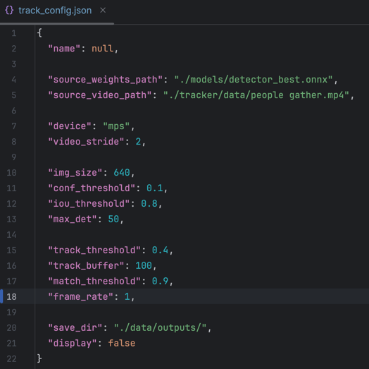

# 📘 Easy Guide to Run Tracker 🚀

Welcome to the easy step-by-step guide for running the Tracker 📹! This guide will help you set up a Docker image, export your model to ONNX format, and track objects in video data efficiently.

## 🐳 Setting Up the Docker Image
### 🧰 Prerequisites 
Before we begin, ensure you have:
- Docker installed on your machine 🐋
- Your preferred code editor open and ready 📝

### 🚀 Instructions
#### Step 1: Prepare Your Data
Create a data directory to store your video files by running:
  ```bash
  mkdir data
  ```
Then, adjust the settings in track_config.json within the tracker directory to specify your video file and any parameters you wish to modify.


#### Step 2: Build the Docker Image
Construct your Docker image with this command:
  ```bash
  docker build -t tracker_onnx -f Dockerfile.tracker . --platform linux/amd64
  ```
This will create an image with all the necessary configurations and packages using the specified Dockerfile.

### Step 3: Run Your Docker Image
Execute your Docker image with bound volumes:

  ```bash
  sudo docker run -it -v /absolute_path/inference_tools/models:/app/models -v /absolute_path/tracker/data:/app/data tracker_onnx
  ```
🔁 Replace /absolute_path/ with the actual path to your models and data. This setup allows your code to access the model directory, convert models from the .pth format (PyTorch) to ONNX, and process the specified video file. You'll receive the exported model in your model directory and the processed video with annotations, bounding boxes, and trajectory information in your data directory.


That's it! You're ready to track objects in your video data with your Docker image! 🎉


## 💻 In Local Environment
To run the Tracker in your local environment, follow these steps:

Follow the steps below to build and run the Docker image:
### 👨🏽‍💻 Prerequisites 
- PyCharm or VsCode.
- Python3.8
### Download Video for Testing Tracker
To download the video for testing the tracker, you can use the following command:


Install the library:
```python
pip install -q gdown 
```
Execute this code into your terminal
```bash
gdown -O "./tracker/data/traffic_analysis.mov" "https://drive.google.com/uc?id=1qadBd7lgpediafCpL_yedGjQPk-FLK-W"
```

## 💻 Bytetrack Parameters

- ***frame_rate***: The frame rate refers to the number of frames processed per second in the video or stream being analyzed. It is crucial for calculating the time window in which an object can be considered lost.

- ***track_buffer***: This parameter is used to calculate the `max_time_lost`. A higher `track_buffer` value allows an object to be considered 'lost' for a longer period before being removed from tracking. It essentially determines the duration for which an object can remain undetected before being declared lost.

- ***track_thresh***: This threshold is used to filter detections for tracking. Only detections with a confidence score higher than this threshold are considered for tracking. It helps in distinguishing between potential tracking objects and false positives.

- ***match_thresh***: The matching threshold is used during the data association step. It determines how closely a detection needs to match an existing track to be considered the same object. A lower threshold means stricter criteria for matching detections to existing tracks.

The `max_time_lost` is calculated based on the `frame_rate` and `track_buffer` using the following formula:
```math
Max_time_lost = frame_rate * track_buffer / 30
 ```
